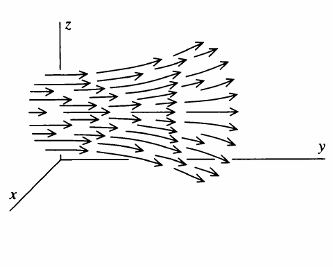
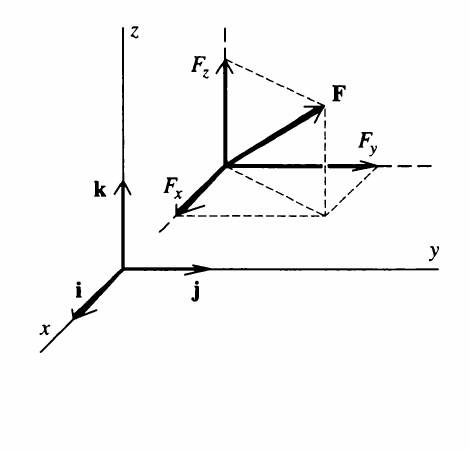
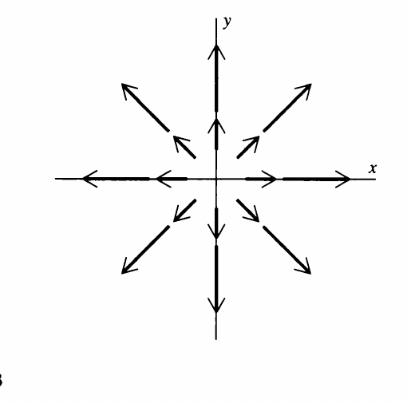
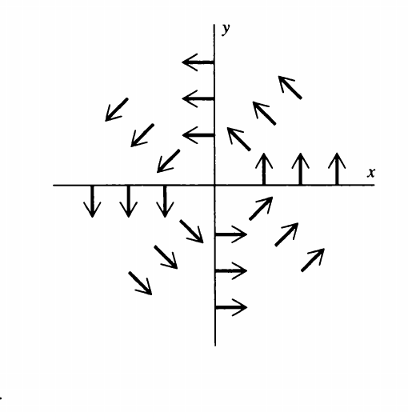
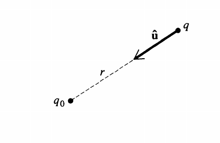
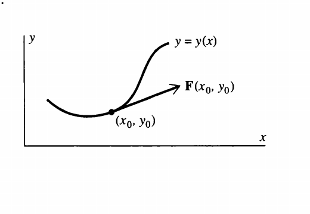

# Chapter 1

## Introduction, Vector Functions, and Electrostatics

> One lesson, Nature, let me learn of thee.  
> Matthew Arnold

## Introduction

In this text the subject of vector calculus is presented in the context of simple electrostatics. We follow this procedure for two reasons. First, much of vector calculus was invented for use in electromagnetic theory and is ideally suited to it. This presentation will therefore show what vector calculus is and at the same time give you an idea of what it's for. Second, we have a deep-seated conviction that mathematics, in any case some mathematics, is best discussed in a context that is not exclusively mathematical. Thus, we will soft-pedal mathematical rigor, which we think is an obstacle to learning this subject on a first exposure to it, and appeal as much as possible to physical and geometric intuition.

Now, if you want to learn vector calculus but know little or nothing about electrostatics, you needn't be put off by our approach; no very great knowledge of physics is required to read and understand this text. Only the simplest features of electrostatics are involved, and these are presented in a few pages near the beginning. It should not be an impediment to anyone. In fact, the entire discussion is based on a search for a convenient method of finding the electrostatic field given the distribution of electric charges which produce it. This is the thread that runs through, and unifies, our presentation, so that as a bare minimum all you really need do is take our word for the fact that the electric field is an important enough quantity to warrant spending some time and effort in setting up a general method for calculating it. In the process, we hope you will learn the elements of vector calculus.

Having said what you do *not* need to know, we must now say what you *do* need to know. To begin with, you should, of course, be fluent in elementary calculus. Beyond that you should know how to work with functions of several variables, partial derivatives, and multiple (double and triple) integrals.[^1] Finally, you must know something about vectors. This, however, is a subject of which too many writers and teachers have made heavy weather. What you should know about it can be listed quickly: definition of vector, addition and subtraction of vectors, multiplication of vectors by scalars, dot and cross products, and finally, resolution of vectors into components. An hour's time with any reasonable text on the subject should provide you with all you need to know of it to follow this text.

## Vector Functions

One of the most important quantities we deal with in the study of electricity is the electric field, and much of our presentation will make use of this quantity. Since the electric field is an example of what we call a vector function, we begin our discussion with a brief resume of the function concept.

A function of one variable, generally written $y = f(x)$, is a rule which tells us how to associate two numbers $x$ and $y$; given $x$, the function tells us how to determine the associated value of $y$. Thus, for example, if $y = f(x) = x^2 - 2$, then we calculate $y$ by squaring $x$ and then subtracting 2. So, if $x = 3$,

$$
y = 3^2 - 2 = 7.
$$

Functions of more than one variable are also rules for associating sets of numbers. For example, a function of three variables designated $w = F(x, y, z)$ tells how to assign a value to $w$ given $x$, $y$, and $z$. It is helpful to view this concept geometrically; taking $(x, y, z)$ to be the Cartesian coordinates of a point in space, the function $F(x, y, z)$ tells us how to associate a number with each point. As an illustration, a function $T(x, y, z)$ might give the temperature at any point $(x, y, z)$ in a room.

The functions so far discussed are *scalar* functions; the result of "plugging" $x$ in $f(x)$ is the scalar $y = f(x)$. The result of "plugging" the three numbers $x$, $y$, and $z$ in $T(x, y, z)$ is the temperature, a scalar. The generalization to vector functions is straightforward. A vector function (in three dimensions) is a rule which tells us how to associate a vector with each point $(x, y, z)$. An example is the velocity of a fluid. Designating this function $\mathbf{v}(x, y, z)$, it specifies the *speed* of the fluid as well as the *direction* of flow at the point $(x, y, z)$. In general, a vector function $\mathbf{F}(x, y, z)$ specifies a *magnitude* and a *direction* at every point $(x, y, z)$ in some region of space. We can picture a vector function as a collection of arrows (Figure I-1), one for each point $(x, y, z)$.

*Figure I-1*

Description: A three-dimensional vector field drawn on $x$, $y$, and $z$ axes, with arrows that spread outward and change direction across the field.

The direction of the arrow at any point is the direction specified by the vector function, and its length is proportional to the magnitude of the function.

A vector function, like any vector, can be resolved into components, as in Figure I-2. Letting $\mathbf{i}$, $\mathbf{j}$, and $\mathbf{k}$ be unit vectors along the $x$-, $y$-, and $z$-axes, respectively, we write

$$
\mathbf{F}(x, y, z) = \mathbf{i} F_x(x, y, z) + \mathbf{j} F_y(x, y, z) + \mathbf{k} F_z(x, y, z).
$$

*Figure I-2*

Description: A vector $\mathbf{F}$ in three dimensions resolved into its Cartesian components $F_x$, $F_y$, and $F_z$ along the unit directions $\mathbf{i}$, $\mathbf{j}$, and $\mathbf{k}$.

The three quantities $F_x$, $F_y$, and $F_z$, which are themselves scalar functions of $x$, $y$, and $z$, are the three Cartesian components of the vector function $\mathbf{F}(x, y, z)$ in some coordinate system.[^2]

An example of a vector function (in two dimensions for simplicity) is provided by

$$
\mathbf{F}(x, y) = \mathbf{i} x + \mathbf{j} y,
$$

which is illustrated in Figure I-3. You probably recognize this function as the position vector $\mathbf{r}$. Each arrow in the figure is in the radial direction (that is, directed along a line emanating from the origin) and has a length equal to its distance from the origin.[^3] A second example,

$$
\mathbf{G}(x, y) = \frac{-\mathbf{i} y + \mathbf{j} x}{\sqrt{x^2 + y^2}},
$$

is shown in Figure I-4. You should verify for yourself that for this vector function all the arrows are in the tangential direction (that is, each is tangent to a circle centered at the origin) and all have the same length.

*Figure I-3*

Description: A two-dimensional radial vector field on the $x$-$y$ plane, with arrows pointing away from the origin in all directions and increasing with distance.

*Figure I-4*

Description: A two-dimensional tangential vector field on the $x$-$y$ plane, with arrows tangent to circles centered at the origin and circulating around it.

## Electrostatics

We shall base our discussion of electrostatics on three experimental facts. The first of these facts is the existence of electric charge itself. There are two kinds of charge, positive and negative, and every material body contains electric charge,[^4] although often the positive and negative charges are present in equal amounts so that there is zero *net* charge.

The second fact is called Coulomb's law, after the French physicist who discovered it. This law states that the electrostatic force between two charged particles (a) is proportional to the product of their charges, (b) is inversely proportional to the square of the distance between them, and (c) acts along the line joining them. Thus, if $q_0$ and $q$ are the charges of two particles a distance $r$ apart (Figure I-5), then the force on $q_0$ due to $q$ is

$$
\mathbf{F} = K \frac{q q_0}{r^2} \hat{\mathbf{u}},
$$

where $\hat{\mathbf{u}}$ is a unit vector (that is, a vector of length 1) pointing from $q$ to $q_0$, and $K$ is a constant of proportionality. In this text we'll use rationalized MKS units. In that system length, mass, and time are measured in meters, kilograms, and seconds, respectively, and electric charge in coulombs. With this choice of units $K = 1 / (4 \pi \epsilon_0)$, where the constant $\epsilon_0$, called the permittivity of free space, has the value $8.854 \times 10^{-12}$ coulombs$^2$ per newton-meters$^2$, and Coulomb's law reads

$$
\mathbf{F} = \frac{1}{4 \pi \epsilon_0} \frac{q q_0}{r^2} \hat{\mathbf{u}}. \tag{I-1}
$$

*Figure I-5*

Description: Two point charges $q_0$ and $q$ separated by a dashed line segment labeled $r$, with a unit vector $\hat{\mathbf{u}}$ pointing from $q$ toward $q_0$.

You should convince yourself that the familiar rule "like charges repel, unlike charges attract" is built into this formula.

The third and last fact is called the principle of superposition. If $\mathbf{F}_1$ is the force exerted on $q_0$ by $q_1$ when there are no other charges nearby, and $\mathbf{F}_2$ is the force exerted on $q_0$ by $q_2$ when there are no other charges nearby, then the principle of superposition says that the net force exerted on $q_0$ by $q_1$ and $q_2$ when they are both present is the vector sum $\mathbf{F}_1 + \mathbf{F}_2$. This is a deeper statement than it appears at first glance. It says not merely that electrostatic forces add vectorially (*all* forces add vectorially), but that the force between two charged particles is not modified by the presence of other charged particles.

We now introduce a vector function of position, which will play a leading role in our discussion. It is the electrostatic field, denoted $\mathbf{E}(\mathbf{r})$ and defined by the equation $\mathbf{E}(\mathbf{r}) = \mathbf{F}(\mathbf{r}) / q_0$, or $\mathbf{F}(\mathbf{r}) = q_0 \mathbf{E}(\mathbf{r})$. That is, the electrostatic field is the force per unit charge. From Equation (I-1) we have

$$
\mathbf{E}(\mathbf{r}) = \frac{\mathbf{F}(\mathbf{r})}{q_0} = \frac{1}{4 \pi \epsilon_0} \frac{q}{r^2} \hat{\mathbf{u}}. \tag{I-2}
$$

This is the electrostatic field at $\mathbf{r}$ due to the charge $q$.

A natural extension of these ideas is the following. Suppose we have a group of $N$ charges with $q_1$ situated at $\mathbf{r}_1$, $q_2$ at $\mathbf{r}_2$, $\ldots$, $q_N$ at $\mathbf{r}_N$. Then the electrostatic force these charges exert on a charge $q_0$ situated at $\mathbf{r}$ is

$$
\mathbf{F}(\mathbf{r}) = \frac{1}{4 \pi \epsilon_0} \sum_{l=1}^{N} \frac{q_0 q_l}{\lvert \mathbf{r} - \mathbf{r}_l \rvert^2} \hat{\mathbf{u}}_l, \tag{I-3}
$$

where $\hat{\mathbf{u}}_l$ is the unit vector pointing from $\mathbf{r}_l$ to $\mathbf{r}$. From Equation (I-3) we have

$$
\mathbf{E}(\mathbf{r}) = \frac{1}{4 \pi \epsilon_0} \sum_{l=1}^{N} \frac{q_l}{\lvert \mathbf{r} - \mathbf{r}_l \rvert^2} \hat{\mathbf{u}}_l. \tag{I-4}
$$

This is the electrostatic field at $\mathbf{r} = \mathbf{i} x + \mathbf{j} y + \mathbf{k} z$ produced by the charges $q_l$ at $\mathbf{r}_l$ $(l = 1, 2, \ldots, N)$. Equation (I-4) says that the field due to a group of charges is the vector sum of the fields each produces alone. That is, superposition holds for fields as well as forces. You may think of the region of space in the vicinity of a charge or group of charges as "pervaded" by an electrostatic field; the net electrostatic force exerted by those charges on a charge $q$ at a point $\mathbf{r}$ is then $q \mathbf{E}(\mathbf{r})$.

You may be a bit mystified about our bothering to introduce a new vector function, the electrostatic field, which differs in an apparently trivial way from the electrostatic force. There are two major reasons for doing this. First, in electrostatics we are interested in the effect that a given set of charges produces on another set. This problem can be conveniently divided into two parts by introducing the electrostatic field, for then we can (a) calculate the field due to a given distribution of charges without worrying about the effect these charges have on *other* charges in the vicinity and (b) calculate the effect a given field has on charges placed in it without worrying about the distribution of charges that produced the field. In this book we will be concerned with the first of these.

The second reason for introducing the electrostatic field is more basic. It turns out that all classical electromagnetic theory can be codified in terms of four equations, called Maxwell's equations, which relate fields (electric and magnetic) to each other and to the charges and currents which produce them. Thus, electromagnetism is a *field theory* and the electric field ultimately plays a role and assumes an importance which far transcends its simple elementary definition as "force per unit charge."

Very often it is convenient to treat a distribution of electric charge as if it were continuous. To do this, we proceed as follows. Suppose in some region of space of volume $\Delta V$ the total electric charge is $\Delta Q$. We define the *average charge density* in $\Delta V$ as

$$
\bar{\rho}_{\Delta V} \equiv \frac{\Delta Q}{\Delta V}. \tag{I-5}
$$

Using this, we can define the charge density at the point $(x, y, z)$, denoted $\rho(x, y, z)$, by taking the limit of $\bar{\rho}_{\Delta V}$ as $\Delta V$ shrinks down about the point $(x, y, z)$:

$$
\rho(x, y, z) \equiv \lim_{\Delta V \to 0 \, \text{about } (x, y, z)} \frac{\Delta Q}{\Delta V} = \lim_{\Delta V \to 0 \, \text{about } (x, y, z)} \bar{\rho}_{\Delta V}. \tag{I-6}
$$

The electric charge in some region of volume $V$ can then be expressed as the triple integral of $\rho(x, y, z)$ over the volume $V$; that is,

$$
Q = \iiint_V \rho(x, y, z) \, dV.
$$

In much the same way it follows that for a continuous distribution of charges, Equation (I-4) is replaced by

$$
\mathbf{E}(\mathbf{r}) = \frac{1}{4 \pi \epsilon_0} \iiint_V \frac{\rho(\mathbf{r}') \hat{\mathbf{u}}(\mathbf{r}')}{\lvert \mathbf{r} - \mathbf{r}' \rvert^2} \, dV'. \tag{I-7}
$$

## Problems

### I-1

Using arrows of the proper magnitude and direction, sketch each of the following vector functions:

(a) $\mathbf{i} y + \mathbf{j} x$.  
(b) $(\mathbf{i} + \mathbf{j}) / \sqrt{2}$.  
(c) $\mathbf{i} x - \mathbf{j} y$.  
(d) $\mathbf{i} y$.  
(e) $\mathbf{j} x$.  
(f) $(\mathbf{i} y + \mathbf{j} x) / \sqrt{x^2 + y^2}$, $(x, y) \neq (0, 0)$.  
(g) $\mathbf{i} y + \mathbf{j} x y$.  
(h) $\mathbf{i} + \mathbf{j} y$.

### I-2

Using arrows, sketch the electric field of a unit positive charge situated at the origin. [*Note:* You may simplify the problem by confining your sketch to one of the coordinate planes. Does it matter which plane you choose?]

### I-3

(a) Write a formula for a vector function in two dimensions which is in the positive radial direction and whose magnitude is 1.  
(b) Write a formula for a vector function in two dimensions whose direction makes an angle of $45^{\circ}$ with the $x$-axis and whose magnitude at any point $(x, y)$ is $(x + y)^2$.  
(c) Write a formula for a vector function in two dimensions whose direction is tangential (in the sense of the example on page 5) and whose magnitude at any point $(x, y)$ is equal to its distance from the origin.  
(d) Write a formula for a vector function in three dimensions which is in the positive radial direction and whose magnitude is 1.

### I-4

An object moves in the $xy$-plane in such a way that its position vector $\mathbf{r}$ is given as a function of time $t$ by

$$
\mathbf{r} = \mathbf{i} a \cos \omega t + \mathbf{j} b \sin \omega t,
$$

where $a$, $b$, and $\omega$ are constants.

(a) How far is the object from the origin at any time $t$?  
(b) Find the object's velocity and acceleration as functions of time.  
(c) Show that the object moves on the elliptical path

$$
\left(\frac{x}{a}\right)^2 + \left(\frac{y}{b}\right)^2 = 1.
$$

### I-5

A charge $+1$ is situated at the point $(1, 0, 0)$ and a charge $-1$ is situated at the point $(-1, 0, 0)$. Find the electric field of these two charges at an arbitrary point $(0, y, 0)$ on the $y$-axis.

### I-6

Instead of using arrows to represent vector functions (as in Problems I-1 and I-2), we sometimes use families of curves called *field lines*. A curve $y = y(x)$ is a field line of the vector function $\mathbf{F}(x, y)$ if at each point $(x_0, y_0)$ on the curve, $\mathbf{F}(x_0, y_0)$ is tangent to the curve (see the figure).

Description: A curve labeled $y = y(x)$ in the $x$-$y$ plane with a marked point $(x_0, y_0)$ where the vector $\mathbf{F}(x_0, y_0)$ is tangent to the curve.

(a) Show that the field lines $y = y(x)$ of a vector function

$$
\mathbf{F}(x, y) = \mathbf{i} F_x(x, y) + \mathbf{j} F_y(x, y)
$$

are solutions of the differential equation

$$
\frac{dy}{dx} = \frac{F_y(x, y)}{F_x(x, y)}.
$$

(b) Determine the field lines of each of the functions of Problem I-1. Draw the field lines and compare with the arrow diagrams of Problem I-1.

[^1]: Differential equations are used in one section of this text. The section is not essential and may be omitted if the mathematics is too frightening.
[^2]: Some writers use subscripts to indicate the partial derivative; for example, $F_x = \partial F / \partial x$. We shall not adopt such notation here; our subscripts will always denote the vector component.
[^3]: Note that by convention an arrow is drawn with its tail, not its head, at the point where the vector function is evaluated.
[^4]: Purists will point out that neutrons, neutral pi mesons, neutrinos, and the like, do not contain charge.
