# Chapter 2

## Surface Integrals and the Divergence

> Oh, could I flow like thee, and make  
> thy stream  
> My great example. . . .  
> Sir John Denham

## Gauss' Law

Since the electrostatic field is so important a quantity in electrostatics, it follows that we need some convenient way to find it, given a set of charges. At first glance it might appear that we solved this problem before we even stated it, for, after all, do not Equations (I-4) and (I-7) provide us with a means of finding $\mathbf{E}$? The answer is, in general, no. Unless there are very few charges in the system and/or they are arranged simply or very symmetrically, the sum in Equation (I-4) and the integral in Equation (I-7) are usually prohibitively difficult and frequently impossible to perform. Thus, these two equations provide what is usually only a "formal" solution[^1] to the problem, not a practical one, and we must cast about for some other way to calculate the field $\mathbf{E}$.

In the course of this casting about, we come inevitably to that remarkable relation known as Gauss' law. We say "inevitably" because it is hard to think of any other expression in elementary electricity and magnetism containing the electric field [apart, of course, from Equations (I-4) and (I-7), which we have already rejected]. Gauss' law is

$$
\iint_S \mathbf{E} \cdot \hat{\mathbf{n}} \, dS = \frac{q}{\epsilon_0}. \tag{II-1}
$$

If you don't understand this equation, don't panic. The left-hand side of this equation is an example of what is called a surface integral, an important concept in vector calculus and one that is probably new to you. The integrand of this integral is the dot product of the electric field and the quantity $\hat{\mathbf{n}}$, which is called a "unit normal vector" and is probably also unfamiliar. We are about to discuss both surface integrals and unit normal vectors in excruciating detail, and one of our main reasons for quoting Gauss' law at this point in our narrative is to motivate this discussion.

We won't stop here to derive Gauss' law, since the derivation wouldn't mean much to you until you have read the next few sections. Then you can consult almost any text on electricity and magnetism for the gory details. And if you can contain yourself, wait until we've discussed the divergence theorem (pages 45-52), after which you will be able to derive Gauss' law easily (see Problem II-27).

## The Unit Normal Vector

One of the factors in the integrand in Gauss' law [Equation (II-1)] is a quantity designated $\hat{\mathbf{n}}$ and called the unit normal vector. This quantity is part of the integrand in most if not all of the surface integrals we'll encounter; furthermore, as we'll see, it plays an important role in the evaluation of surface integrals even when it does not appear explicitly. Thus, before discussing surface integrals themselves, we'll dispose of the questions of how this vector function is defined and calculated.

The word "normal" in the present context means, loosely speaking, "perpendicular." Thus, a vector $\mathbf{N}$ normal to the $xy$-plane is clearly one parallel to the $z$-axis (Figure II-1), while a vector normal to a spherical surface must be in the radial direction (Figure II-2). To give a precise definition of a vector normal to a surface, consider an arbitrary surface $S$, as shown in Figure II-3. Construct two noncollinear vectors $\mathbf{u}$ and $\mathbf{v}$ tangent to $S$ at some point $P$. A vector $\mathbf{N}$ which is perpendicular to both $\mathbf{u}$ and $\mathbf{v}$ at $P$ is, by definition, normal to $S$ at $P$. Now, as we know, the vector product of $\mathbf{u}$ and $\mathbf{v}$ has precisely this property; it is perpendicular to both $\mathbf{u}$ and $\mathbf{v}$. Thus, we may write $\mathbf{N} = \mathbf{u} \times \mathbf{v}$. To make this a *unit* vector (that is, one whose length is 1) is simple: we just divide $\mathbf{N}$ by its magnitude $N$. Thus,

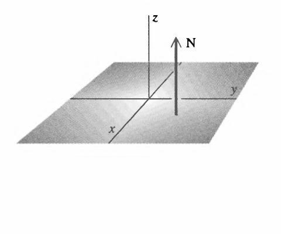

*Figure II-1*

Description: The $xy$-plane is shown in three dimensions with a normal vector $\mathbf{N}$ pointing upward along the $z$-direction.

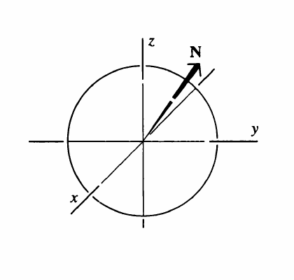

*Figure II-2*

Description: A circular cross-section of a sphere with a normal vector $\mathbf{N}$ pointing radially outward from the center.

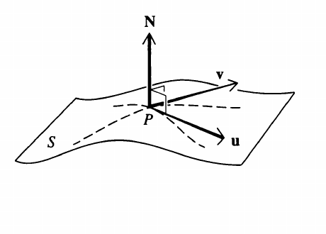

*Figure II-3*

Description: A curved surface $S$ with tangent vectors $\mathbf{u}$ and $\mathbf{v}$ at a point $P$, and a perpendicular normal vector $\mathbf{N}$ drawn upward from that point.

$$
\hat{\mathbf{n}} = \frac{\mathbf{N}}{N} = \frac{\mathbf{u} \times \mathbf{v}}{\lvert \mathbf{u} \times \mathbf{v} \rvert}
$$

is a unit vector normal to $S$ at $P$.

To find an expression for $\hat{\mathbf{n}}$, we consider some surface $S$ given by the equation $z = f(x, y)$; see Figure II-4. Following the procedure suggested by the preceding discussion, we'll find two vectors $\mathbf{u}$ and $\mathbf{v}$ whose cross product will yield the required normal vector $\hat{\mathbf{n}}$. For this purpose let's construct a plane through a point $P$ on $S$ and parallel to the $xz$-plane, as shown in Figure II-4. This plane intersects the surface $S$ in a curve $C$. We construct the vector $\mathbf{u}$ tangent to $C$ at $P$ and having an $x$-component of arbitrary length $u_x$. The $z$-component of $\mathbf{u}$ is $(\partial f / \partial x) u_x$; in this expression we use the fact that the slope of $\mathbf{u}$ is, by construction, the same as that of the surface $S$ in the $x$-direction (see Figure II-5). Thus,

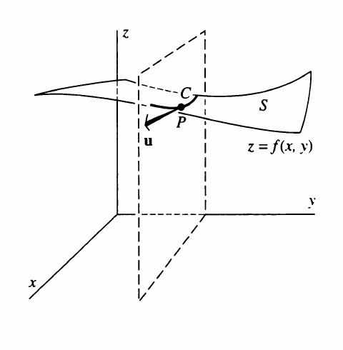

*Figure II-4*

Description: A surface $z = f(x, y)$ is intersected by a vertical plane through a point $P$, producing a curve $C$ and a tangent vector $\mathbf{u}$ lying in that plane.

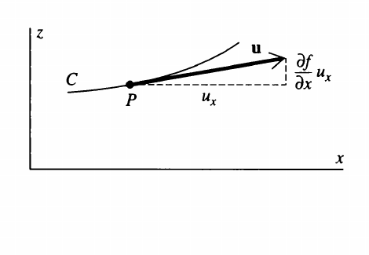

*Figure II-5*

Description: In the $xz$-plane, a curve $C$ passes through $P$ and a tangent vector $\mathbf{u}$ is resolved into a horizontal component $u_x$ and a vertical component $(\partial f / \partial x) u_x$.

$$
\mathbf{u} = \mathbf{i} u_x + \mathbf{k} \left(\frac{\partial f}{\partial x}\right) u_x = \left[\mathbf{i} + \mathbf{k} \left(\frac{\partial f}{\partial x}\right)\right] u_x. \tag{II-2}
$$

To find $\mathbf{v}$, the second of our two vectors, we pass another plane through the point $P$ on $S$, but in this case parallel to the $yz$-plane (Figure II-6). It intersects $S$ in a curve $C'$, and the vector $\mathbf{v}$ can now be constructed tangent to $C'$ at $P$ with a $y$-component of arbitrary length $v_y$. Arguing as above, we have

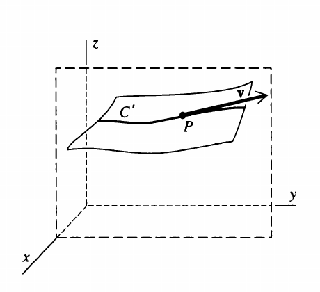

*Figure II-6*

Description: A vertical plane parallel to the $yz$-plane intersects the surface in a curve $C'$, and a tangent vector $\mathbf{v}$ is drawn at the point $P$.

$$
\mathbf{v} = \mathbf{j} v_y + \mathbf{k} \left(\frac{\partial f}{\partial y}\right) v_y = \left[\mathbf{j} + \mathbf{k} \left(\frac{\partial f}{\partial y}\right)\right] v_y. \tag{II-3}
$$

Using the two vectors $\mathbf{u}$ and $\mathbf{v}$ as given in Equations (II-2) and (II-3), we now construct their cross product. The result,

$$
\mathbf{u} \times \mathbf{v} = \left[-\mathbf{i} \left(\frac{\partial f}{\partial x}\right) - \mathbf{j} \left(\frac{\partial f}{\partial y}\right) + \mathbf{k}\right] u_x v_y,
$$

is a vector, which as we stated above, is normal to $S$ at $P$. To make a *unit* vector of this, we divide it by its magnitude to get

$$
\hat{\mathbf{n}}(x, y, z) = \frac{\mathbf{u} \times \mathbf{v}}{\lvert \mathbf{u} \times \mathbf{v} \rvert} = \frac{-\mathbf{i} \, \partial f / \partial x - \mathbf{j} \, \partial f / \partial y + \mathbf{k}}{\sqrt{1 + \left(\frac{\partial f}{\partial x}\right)^2 + \left(\frac{\partial f}{\partial y}\right)^2}}. \tag{II-4}
$$

This, then, is the unit vector normal to the surface $z = f(x, y)$ at the point $(x, y, z)$ on the surface.[^2] Note that it is independent of the two arbitrary quantities $u_x$ and $v_y$.

A couple of examples may be in order here. First a trivial one: What is the unit vector normal to the $xy$-plane? The answer, of course, is $\mathbf{k}$ (see Figure II-1). Let's see how Equation (II-4) provides us with this answer. The equation of the $xy$-plane is

$$
z = f(x, y) = 0,
$$

whence we have the profound observations

$$
\partial f / \partial x = 0 \qquad \text{and} \qquad \partial f / \partial y = 0.
$$

Substituting these in Equation (II-4), we get $\hat{\mathbf{n}} = \mathbf{k} / \sqrt{1} = \mathbf{k}$, as advertised.

As a second example, consider the sphere of radius 1 centered at the origin (Figure II-2). Its upper hemisphere is given by

$$
z = f(x, y) = (1 - x^2 - y^2)^{1/2},
$$

whence

$$
\frac{\partial f}{\partial x} = -\frac{x}{z} \qquad \text{and} \qquad \frac{\partial f}{\partial y} = -\frac{y}{z}.
$$

Using these in Equation (II-4) leads to

$$
\hat{\mathbf{n}} = \frac{\mathbf{i} x / z + \mathbf{j} y / z + \mathbf{k}}{\sqrt{x^2 / z^2 + y^2 / z^2 + 1}} = \frac{\mathbf{i} x + \mathbf{j} y + \mathbf{k} z}{\sqrt{x^2 + y^2 + z^2}} = \mathbf{i} x + \mathbf{j} y + \mathbf{k} z,
$$

where we have used the equation of the unit sphere $x^2 + y^2 + z^2 = 1$. This is, as expected, a vector in the radial direction (see Figure II-2). To show that its length is 1, we observe that $\hat{\mathbf{n}} \cdot \hat{\mathbf{n}} = x^2 + y^2 + z^2 = 1$.

With the matter of the unit normal vector now disposed of, we turn to our next task, a discussion of surface integrals.

## Definition of Surface Integrals

We now define the surface integral of the normal component of a vector function $\mathbf{F}(x, y, z)$. This quantity is denoted by

$$
\iint_S \mathbf{F} \cdot \hat{\mathbf{n}} \, dS, \tag{II-5}
$$

and as you can see, Gauss' law [Equation (II-1)] is expressed in terms of just such an integral. Let $z = f(x, y)$ be the equation of some surface. We'll consider a limited portion of this surface, which we designate $S$ (see Figure II-7). Our first step in formulating the definition of the surface integral (II-5) is to approximate $S$ by a polyhedron consisting of $N$ plane faces each of which is tangent to $S$ at some point. Figure II-8 shows how this approximating polyhedron might look for an octant of a spherical shell. We concentrate our attention on one of these plane faces, say the $l$th one (Figure II-9). Let its area be denoted $\Delta S_l$, and let $(x_l, y_l, z_l)$ be the coordinates of the point at which the face is tangent to the surface $S$. We evaluate the function $\mathbf{F}$ at this point and then form its dot product with $\hat{\mathbf{n}}_l$, the unit vector normal to the $l$th face. The resulting quantity, $\mathbf{F}(x_l, y_l, z_l) \cdot \hat{\mathbf{n}}_l$, is then multiplied by the area $\Delta S_l$ of the face to give

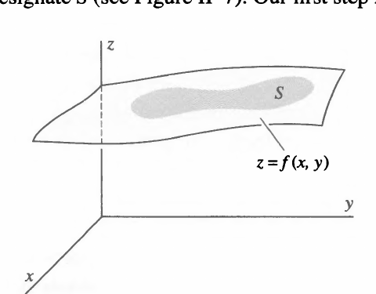

*Figure II-7*

Description: A patch $S$ on a surface given by $z = f(x, y)$ is shown above the coordinate plane, indicating the portion of the surface over which the integral will be taken.

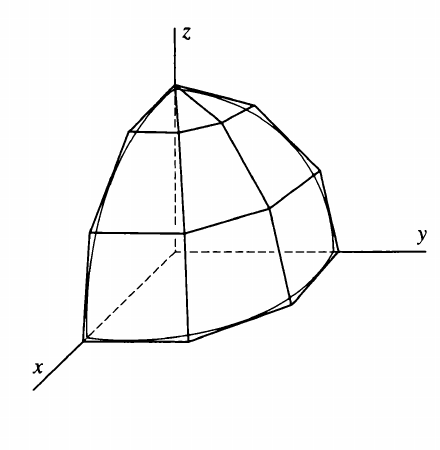

*Figure II-8*

Description: A curved octant-like surface is approximated by a polyhedron made of flat planar faces.

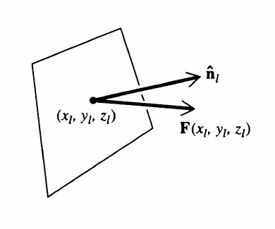

*Figure II-9*

Description: A single tangent face is shown with the point $(x_l, y_l, z_l)$ and the vectors $\mathbf{F}(x_l, y_l, z_l)$ and $\hat{\mathbf{n}}_l$ drawn from that point.

$$
\mathbf{F}(x_l, y_l, z_l) \cdot \hat{\mathbf{n}}_l \, \Delta S_l.
$$

We carry out this same process for each of the $N$ faces of the approximating polyhedron and then form the sum over all $N$ faces:

$$
\sum_{l=1}^{N} \mathbf{F}(x_l, y_l, z_l) \cdot \hat{\mathbf{n}}_l \, \Delta S_l.
$$

The surface integral (II-5) is defined as the *limit* of this sum as the number of faces, $N$, approaches infinity and the area of *each* face approaches zero.[^3] Thus,

$$
\iint_S \mathbf{F} \cdot \hat{\mathbf{n}} \, dS = \lim_{N \to \infty \\ \text{each } \Delta S_l \to 0} \sum_{l=1}^{N} \mathbf{F}(x_l, y_l, z_l) \cdot \hat{\mathbf{n}}_l \, \Delta S_l. \tag{II-6}
$$

If we want to cross all the $t$'s and dot all the $i$'s, this integral, strictly speaking, should be written

$$
\iint_S \mathbf{F}(x, y, z) \cdot \hat{\mathbf{n}}(x, y, z) \, dS
$$

since both $\mathbf{F}$ and $\hat{\mathbf{n}}$ are, in general, functions of position. We prefer, and where possible will use, the less cluttered notation

$$
\iint_S \mathbf{F} \cdot \hat{\mathbf{n}} \, dS
$$

with the arguments of the functions understood.

The surface $S$ over which we integrate a surface integral can be one of two kinds: closed or open. A closed surface, such as a spherical shell, divides space into two parts, an inside and an outside, and to get from inside to outside, you must go *through* the surface. An open surface, such as a flat piece of paper, does not have this property; it is possible to get from one side of the sheet to the other without going through it. The definition of surface integrals given in Equation (II-6) applies equally well to both closed and open surfaces. However, the surface integral is not well defined until we specify which of the two possible directions of the normal we are to use (see Figure II-10). In the case of an open surface, the direction must be given as part of the statement of the problem. In the case of a closed surface, there is a gentlemen's agreement which specifies the direction once and for all: the normal is chosen so that it points *outward* from the volume enclosed by the surface.

The integral in Gauss' law [Equation (II-1)] is taken over a closed surface. Gauss' law, in fact, says that the surface integral of the normal component of the electric field over a closed surface is equal to the total (net) charge enclosed by the surface, divided by $\epsilon_0$. Below (pages 33-37 and Problems II-11, II-12, and II-13) we'll see how, when the charges are arranged neatly and symmetrically, Gauss' law can be used to determine the electric field. But the thrust of our whole discussion will be to subject Gauss' law to a series of harrowing adventures which eventually transform it into an expression useful for finding $\mathbf{E}$ even when we don't have symmetry to help us.

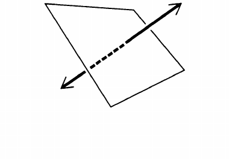

*Figure II-10*

Description: A flat open surface is shown with two opposite normal directions, illustrating the two possible choices of orientation.

Sometimes we encounter surface integrals which are a little simpler than the kind we've just defined, although basically they are almost the same. These are surface integrals of the form

$$
\iint_S G(x, y, z) \, dS, \tag{II-7}
$$

where the integrand $G(x, y, z)$ is a *given* scalar function rather than the dot product of two vector functions as in (II-5) and (II-6). We go about defining this kind of surface integral much as we did above: we approximate $S$ by a polyhedron, form the product $G(x_l, y_l, z_l) \Delta S_l$, sum over all faces, and then take the limit:

$$
\iint_S G(x, y, z) \, dS = \lim_{N \to \infty \\ \text{each } \Delta S_l \to 0} \sum_{l=1}^{N} G(x_l, y_l, z_l) \Delta S_l. \tag{II-8}
$$

As an example of this kind of surface integral, suppose we have a surface of negligible thickness with surface density (that is, mass per unit area) $\sigma(x, y, z)$, and we wish to determine its total mass. Approximating this surface by a polyhedron as above, we recognize that $\sigma(x_l, y_l, z_l) \Delta S_l$ is approximately the mass of the $l$th face of the polyhedron and that

$$
\sum_{l=1}^{N} \sigma(x_l, y_l, z_l) \Delta S_l
$$

is approximately the mass of the entire surface. Taking the limit

$$
\lim_{N \to \infty \\ \text{each } \Delta S_l \to 0} \sum_{l=1}^{N} \sigma(x_l, y_l, z_l) \Delta S_l = \iint_S \sigma(x, y, z) \, dS,
$$

we get the total mass of the surface.

An example of an even simpler surface integral of this kind is

$$
\iint_S dS.
$$

This integral is taken as the definition of the surface area of $S$.

## Evaluating Surface Integrals

Now that we have defined surface integrals, we must develop methods to evaluate them, and that will be our task here. For simplicity we'll deal with surface integrals of the form (II-7), where the integrand is a given scalar function, rather than the slightly more complicated form (II-5). There will be no loss of generality in doing this for all our results can be made to apply to integrals of the form (II-5) just by replacing $G(x, y, z)$ everywhere by $\mathbf{F}(x, y, z) \cdot \hat{\mathbf{n}}$.

To evaluate the integral

$$
\iint_S G(x, y, z) \, dS
$$

over a portion $S$ of the surface $z = f(x, y)$ (see Figure II-11), we go back to the definition of the surface integral [Equation (II-8)]. Our strategy will be to relate $\Delta S_l$ to the area $\Delta R_l$ of its projection on the $xy$-plane, as shown in Figure II-12. Doing so, as we'll see, will enable us to express the surface integral over $S$ in terms of an ordinary double integral over $R$, which is the projection of $S$ on the $xy$-plane, as shown in Figure II-11.

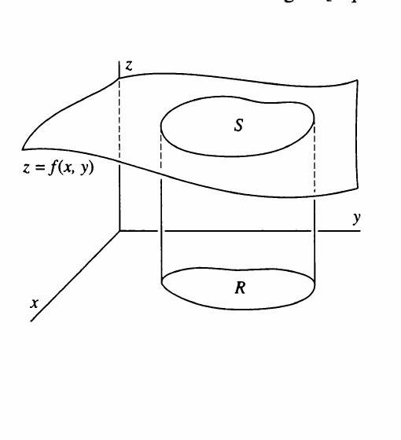

*Figure II-11*

Description: A curved surface labeled $z = f(x, y)$ carries a highlighted patch $S$, and dashed vertical lines project that patch down onto a base region $R$ in the $xy$-plane.

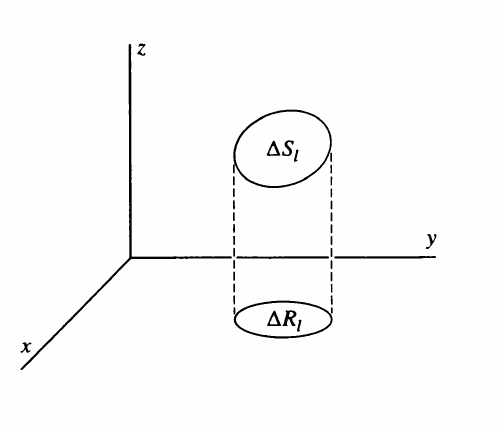

*Figure II-12*

Description: A small surface element $\Delta S_l$ is shown above its projected area $\Delta R_l$ on the $xy$-plane, with dashed vertical lines connecting the two.

Relating $\Delta S_l$ to $\Delta R_l$ is not difficult if we recall that $\Delta S_l$ (like the area of any plane surface) can be approximated to any desired degree of accuracy by a set of rectangles as shown in Figure II-13. For this reason we need only find the relation between the area of a rectangle and its projection on the $xy$-plane. Thus, consider a rectangle so oriented that one pair of its sides is parallel to the $xy$-plane (Figure II-14). If we call the lengths of these sides $a$, it's clear that their projections on the $xy$-plane also have length $a$. But the other pair of sides, of length $b$, have projections of length $b'$, and in general, $b$ and $b'$ are not equal. Thus, to relate the area of the rectangle $ab$ to the area of its projection $ab'$, we must express $b$ in terms of $b'$. This is easy to do, for if $\theta$ is the angle shown in Figure II-14, we have $b = b'/\cos \theta$, and so

$$
ab = \frac{ab'}{\cos \theta}.
$$

If we let $\hat{\mathbf{n}}$ denote the unit vector normal to our rectangle, then we can readily convince ourselves that $\cos \theta = \hat{\mathbf{n}} \cdot \mathbf{k}$ where $\mathbf{k}$, as always, is the unit vector in the positive $z$-direction. Thus,

$$
ab = \frac{ab'}{\hat{\mathbf{n}} \cdot \mathbf{k}}.
$$

Since the area $\Delta S_l$ can be approximated with arbitrary accuracy by such rectangles, it follows that

$$
\Delta S_l = \frac{\Delta R_l}{\hat{\mathbf{n}}_l \cdot \mathbf{k}},
$$

where, of course, $\hat{\mathbf{n}}_l$ is the unit vector normal to the $l$th plane surface. We can now rewrite the definition of the surface integral [Equation (II-8)] as

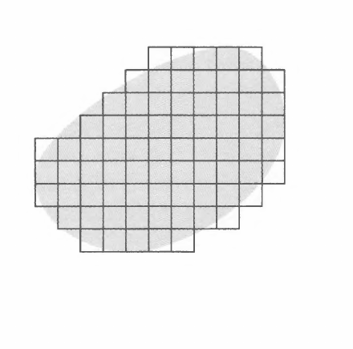

*Figure II-13*

Description: An irregular projected region is covered by a mesh of small rectangles, illustrating approximation of the area by finer and finer planar patches.

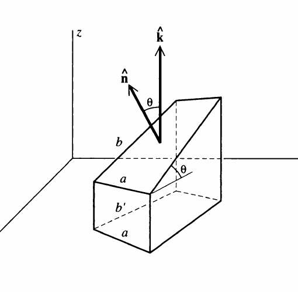

*Figure II-14*

Description: A tilted rectangle with side lengths $a$ and $b$ is shown with its projected side length $b'$ on the coordinate plane, together with the normal vector $\hat{\mathbf{n}}$, the $z$-direction unit vector $\mathbf{k}$, and the angle $\theta$ between them.

$$
\iint_S G(x, y, z) \, dS = \lim_{N \to \infty \\ \text{each } \Delta R_l \to 0} \sum_{l=1}^{N} G(x_l, y_l, z_l) \frac{\Delta R_l}{\hat{\mathbf{n}}_l \cdot \mathbf{k}}, \tag{II-9}
$$

where the statement "each $\Delta S_l \to 0$" has been replaced by the equivalent but now more appropriate "each $\Delta R_l \to 0." We are now obviously well on the road to rewriting the surface integral over $S$ as a double integral over $R$. In fact,

$$
\lim_{N \to \infty \\ \text{each } \Delta R_l \to 0} \sum_{l=1}^{N} \frac{G(x_l, y_l, z_l)}{\hat{\mathbf{n}}_l \cdot \mathbf{k}} \Delta R_l = \iint_R \frac{G(x, y, z)}{\hat{\mathbf{n}}(x, y, z) \cdot \mathbf{k}} \, dx \, dy, \tag{II-10}
$$

where $\hat{\mathbf{n}}(x, y, z)$ is the unit vector normal to the surface $S$ at the point $(x, y, z)$. This is a double integral over $R$ even though it does not quite look like one. What appears to spoil it is that nasty $z$ in $G$ and $\hat{\mathbf{n}}$; a double integral over a region in the $xy$-plane clearly has no business containing any $z$'s. But the $z$-dependence is spurious because $(x, y, z)$ are the coordinates of a point on $S$, and so $z = f(x, y)$. Hence, at the expense of making the integral look even fiercer than it already does in Equation (II-10), we can eliminate the apparent $z$-dependence of the integrand and write

$$
\iint_R \frac{G[x, y, f(x, y)]}{\hat{\mathbf{n}}[x, y, f(x, y)] \cdot \mathbf{k}} \, dx \, dy. \tag{II-11}
$$

The faint of heart can take courage; in most cases this integrand reduces quickly to something much simpler and pleasanter looking, a fact we will demonstrate by example below. At this point we introduce the expression for the unit normal vector [Equation (II-4)]. We find

$$
\hat{\mathbf{n}} \cdot \mathbf{k} = \frac{1}{\sqrt{1 + (\partial f / \partial x)^2 + (\partial f / \partial y)^2}},
$$

and so Equation (II-11) becomes

$$
\iint_S G(x, y, z) \, dS = \iint_R G[x, y, f(x, y)] \sqrt{1 + \left(\frac{\partial f}{\partial x}\right)^2 + \left(\frac{\partial f}{\partial y}\right)^2} \, dx \, dy. \tag{II-12}
$$

Thus, the surface integral of $G(x, y, z)$ over the surface $S$ has been expressed as a double integral of a messy-looking function over the region $R$, the projection of $S$ in the $xy$-plane. As we remarked above, in practice the integral is usually much less ghastly than it appears written out in Equations (II-11) or (II-12). You will see this in the examples we now give.

Let's first compute the surface integral

$$
\iint_S (x + z) \, dS
$$

where $S$ is the portion of the plane $x + y + z = 1$ in the first octant shown in Figure II-15(a). The projection of $S$ on the $xy$-plane is the triangle $R$ shown in the figure. The equation of $S$ can be written

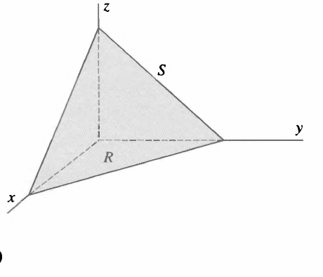

*Figure II-15(a)*

Description: A triangular planar patch $S$ in the first octant is shown together with its dashed projection onto the triangular region $R$ in the $xy$-plane.

$$
z = f(x, y) = 1 - x - y
$$

from which we get

$$
\frac{\partial f}{\partial x} = \frac{\partial f}{\partial y} = -1,
$$

so that

$$
\sqrt{1 + \left(\frac{\partial f}{\partial x}\right)^2 + \left(\frac{\partial f}{\partial y}\right)^2} = \sqrt{3}.
$$

Hence

$$
\iint_S (x + z) \, dS = \sqrt{3} \iint_R (x + z) \, dx \, dy = \sqrt{3} \iint_R (x + 1 - x - y) \, dx \, dy = \sqrt{3} \iint_R (1 - y) \, dx \, dy,
$$

where we have used $z = 1 - x - y$. This is a simple double integral with value $1 / \sqrt{3}$, as you should be able to verify.

As a second example let's compute the surface integral

$$
\iint_S z^2 \, dS,
$$

where $S$ is the octant of the sphere of radius 1 centered at the origin as shown in Figure II-15(b). The projection of $S$ on the $xy$-plane (that is, $R$) is the area enclosed by the quarter circle. The equation of $S$ is $x^2 + y^2 + z^2 = 1$, or

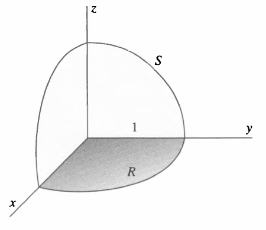

*Figure II-15(b)*

Description: An octant of the unit sphere is drawn above the shaded quarter-disk region $R$ in the $xy$-plane, showing the projection of the spherical surface patch $S$ onto the coordinate plane.

$$
z = f(x, y) = +\sqrt{1 - x^2 - y^2}.
$$

It follows then that

$$
\frac{\partial f}{\partial x} = -\frac{x}{z} \qquad \text{and} \qquad \frac{\partial f}{\partial y} = -\frac{y}{z},
$$

so that

$$
\sqrt{1 + \left(\frac{\partial f}{\partial x}\right)^2 + \left(\frac{\partial f}{\partial y}\right)^2} = \sqrt{1 + \frac{x^2}{z^2} + \frac{y^2}{z^2}} = \frac{1}{z},
$$

where we have used $x^2 + y^2 + z^2 = 1$. Hence,

$$
\iint_S z^2 \, dS = \iint_R z^2 \frac{1}{z} \, dx \, dy = \iint_R z \, dx \, dy.
$$

Substituting for $z$ in terms of $x$ and $y$, we get

$$
\iint_S z^2 \, dS = \iint_R \sqrt{1 - x^2 - y^2} \, dx \, dy.
$$

This is an ordinary double integral, and you should verify that its value is $\pi / 6$. [*Suggestion:* Convert to polar coordinates: $x = r \cos \theta$, and $y = r \sin \theta$. The integration is then trivial.]

It should be emphasized that the foregoing discussion was based on the assumption that the surface $S$ is described by an equation of the form $z = f(x, y)$; in such a situation a surface integral is converted into a double integral over a region in the $xy$-plane. But it may happen that a given surface is more conveniently described by an equation of the form $y = g(x, z)$ as in Figure II-16(a). If this is so, then

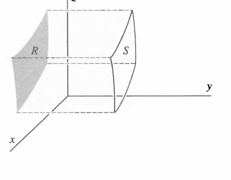

*Figure II-16(a)*

Description: A surface patch $S$ is projected sideways onto a shaded region $R$ in the $xz$-plane, illustrating the case where the surface is represented by $y = g(x, z)$.

$$
\iint_S G(x, y, z) \, dS = \iint_R G[x, g(x, z), z] \sqrt{1 + \left(\frac{\partial g}{\partial x}\right)^2 + \left(\frac{\partial g}{\partial z}\right)^2} \, dx \, dz,
$$

where $R$ is a region in the $xz$-plane. Similarly, if we have a surface described by $x = h(y, z)$, as in Figure II-16(b), then we use

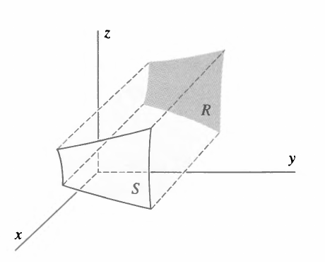

*Figure II-16(b)*

Description: A surface patch $S$ is shown projecting onto a shaded region $R$ in the $yz$-plane, illustrating the case where the surface is represented by $x = h(y, z)$.

$$
\iint_S G(x, y, z) \, dS = \iint_R G[h(y, z), y, z] \sqrt{1 + \left(\frac{\partial h}{\partial y}\right)^2 + \left(\frac{\partial h}{\partial z}\right)^2} \, dy \, dz,
$$

where $R$ in this case is a region in the $yz$-plane. Finally, a surface may have several parts, and it may then be convenient to project different parts on different coordinate planes.

To evaluate surface integrals of the form (II-5), that is,

$$
\iint_S \mathbf{F} \cdot \hat{\mathbf{n}} \, dS,
$$

we merely replace $G$ by $\mathbf{F} \cdot \hat{\mathbf{n}}$ in Equation (II-12) to get

$$
\iint_S \mathbf{F} \cdot \hat{\mathbf{n}} \, dS = \iint_R \mathbf{F} \cdot \hat{\mathbf{n}} \sqrt{1 + \left(\frac{\partial f}{\partial x}\right)^2 + \left(\frac{\partial f}{\partial y}\right)^2} \, dx \, dy.
$$

If we now use Equation (II-4) to write this out in detail, we find that the square root factor cancels and we get

$$
\iint_S \mathbf{F} \cdot \hat{\mathbf{n}} \, dS = \iint_R \left\{-F_x[x, y, f(x, y)] \frac{\partial f}{\partial x} - F_y[x, y, f(x, y)] \frac{\partial f}{\partial y} + F_z[x, y, f(x, y)]\right\} dx \, dy. \tag{II-13}
$$

We leave it to the reader to write down the analogous formulas when the surface $S$ is given by $y = g(x, z)$ or $x = h(y, z)$, which must be projected onto regions in the $xz$- and $yz$-planes, respectively.

This last equation [Equation (II-13)] is enough to make strong men weep, but, as before, in most calculations it quickly reduces to something quite tame. For example, suppose we wish to calculate $\iint_S \mathbf{F} \cdot \hat{\mathbf{n}} \, dS$, where $\mathbf{F}(x, y, z) = \mathbf{i} z - \mathbf{j} y + \mathbf{k} x$ and $S$ is the portion of the plane

$$
x + 2y + 2z = 2
$$

bounded by the coordinate planes, that is, the triangle reclining gracefully in Figure II-17(a). The normal vector $\hat{\mathbf{n}}$ is chosen so that it points away from the origin as shown in Figure II-17(a), and we'll project $S$ onto the $xy$-plane. We have

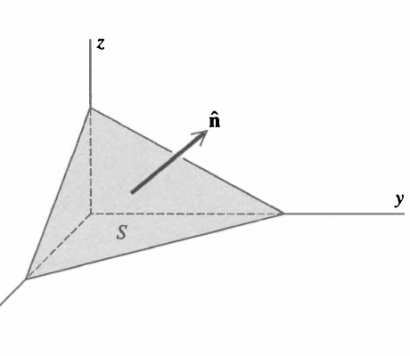

*Figure II-17(a)*

Description: A triangular plane patch bounded by the coordinate planes is shown in three dimensions, with the chosen outward normal vector $\hat{\mathbf{n}}$ pointing away from the origin.

$$
z = f(x, y) = 1 - \frac{x}{2} - y,
$$

and so

$$
\frac{\partial f}{\partial x} = -\frac{1}{2}, \qquad \frac{\partial f}{\partial y} = -1.
$$

We also have

$$
F_x = z = 1 - \frac{x}{2} - y, \qquad F_y = -y, \qquad F_z = x.
$$

Hence

$$
\iint_S \mathbf{F} \cdot \hat{\mathbf{n}} \, dS = \iint_R \left\{-\left(1 - \frac{x}{2} - y\right)\left(-\frac{1}{2}\right) + y(-1) + x\right\} dx \, dy = \iint_R \left(\frac{3x}{4} - \frac{3y}{2} + \frac{1}{2}\right) dx \, dy,
$$

The region $R$ over which the integral must be taken is shown in Figure II-17(b). The problem has thus been reduced to the computation of a rather simple double integral, and you should carry out the integration yourself (the answer is $\frac{1}{2}$).

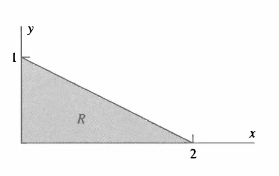

*Figure II-17(b)*

Description: The projection region $R$ for the triangular plane example is a right triangle in the $xy$-plane with intercepts at $y = 1$ and $x = 2$.

As a second example, suppose

$$
\mathbf{F}(x, y, z) = \mathbf{i} x z + \mathbf{k} z^2
$$

For $S$ let's take the octant of the spherical surface shown in Figure II-15. Then $z = f(x, y) = \sqrt{1 - x^2 - y^2}$, and we have already shown (see page 25) that

$$
\frac{\partial f}{\partial x} = -\frac{x}{z} \qquad \text{and} \qquad \frac{\partial f}{\partial y} = -\frac{y}{z}.
$$

Thus

$$
\iint_S \mathbf{F} \cdot \hat{\mathbf{n}} \, dS = \iint_R \left[-xz\left(-\frac{x}{z}\right) + z^2\right] dx \, dy = \iint_R (x^2 + 1 - x^2 - y^2) dx \, dy = \iint_R (1 - y^2) dx \, dy,
$$

where $R$, we recall, is the quarter-circle shown in Figure II-15. The first integral in the last equality above is just the area of the quarter-circle of radius 1, and is therefore equal to $\pi/4$. The second integral can be done by introducing polar coordinates. We get

$$
\iint_R y^2 \, dx \, dy = \int_0^{\pi/2} \int_0^1 r^2 \sin^2 \theta \, r \, dr \, d\theta = \int_0^{\pi/2} \sin^2 \theta \, d\theta \int_0^1 r^3 \, dr.
$$

Both the $r$ and $\theta$ integrals here are elementary, and you should have no trouble showing that this expression is equal to $\pi/16$. Thus

$$
\iint_S \mathbf{F} \cdot \hat{\mathbf{n}} \, dS = \pi/4 - \pi/16 = 3\pi/16.
$$

## Flux

An integral of the type

$$
\iint_S \mathbf{F}(x, y, z) \cdot \hat{\mathbf{n}} \, dS \tag{II-14}
$$

is sometimes called the "flux of $\mathbf{F}$." Thus Gauss' law [Equation (II-1)] states that the flux of the electrostatic field over some closed surface is the enclosed charge divided by $\epsilon_0$.

It is useful in obtaining a geometrical feeling for some aspects of vector calculus to understand the significance of the word *flux* (Latin for "flow") used in this context. For this purpose let us consider a fluid of density $\rho$ moving with velocity $\mathbf{v}$. We ask for the total mass of fluid that crosses an area $\Delta S$ perpendicular to the direction of flow in a time $\Delta t$. Clearly, all the fluid in the cylinder of length $v \Delta t$ with the patch $\Delta S$ as base will cross $\Delta S$ in the interval $\Delta t$ (Figure II-18). The volume of this cylinder is $v \Delta t \, \Delta S$, and it contains a total mass $\rho v \Delta t \, \Delta S$. Dividing out the $\Delta t$ will give the rate of flow. Thus,

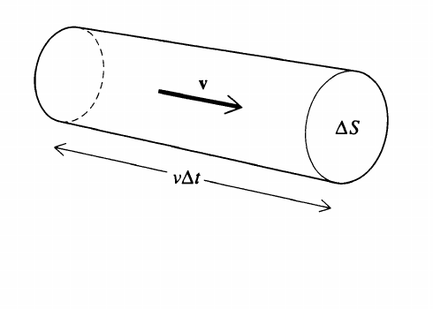

*Figure II-18*

Description: A cylindrical slug of fluid with cross-sectional area $\Delta S$ and length $v \Delta t$ is shown moving in the direction of the velocity vector $\mathbf{v}$.

$$
\left(\text{Rate of flow through } \Delta S\right) = \rho v \, \Delta S.
$$

Now let us consider a somewhat more complicated case in which the area $\Delta S$ is not perpendicular to the direction of flow (Figure II-19). The volume containing the material that will flow through $\Delta S$ in time $\Delta t$ is now just the volume of the little skewed cylinder shown in the diagram. The volume is $v \Delta t \, \Delta S \cos \theta$, where $\theta$ is the angle between the velocity vector $\mathbf{v}$ and $\hat{\mathbf{n}}$, the unit vector normal to $\Delta S$ and pointing outward from the skewed cylinder. But $v \cos \theta = \mathbf{v} \cdot \hat{\mathbf{n}}$. So, multiplying by $\rho$ and dividing by $\Delta t$, we get

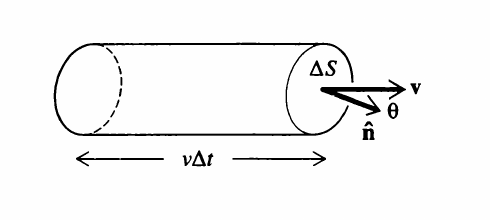

*Figure II-19*

Description: The flow cylinder is shown meeting a tilted area element $\Delta S$, with the velocity vector $\mathbf{v}$, the outward normal $\hat{\mathbf{n}}$, and the angle $\theta$ between them drawn at the face.

$$
\left(\text{Rate of flow through } \Delta S\right) = \rho \mathbf{v} \cdot \hat{\mathbf{n}} \, \Delta S.
$$

Finally, consider a surface $S$ in some region of space containing flowing matter (Figure II-20). Approximate the surface by a polyhedron. By the above argument, the rate at which matter flows through the $l$th face of this polyhedron is approximately

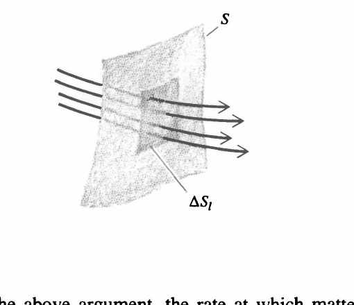

*Figure II-20*

Description: A curved surface $S$ carrying a small planar element $\Delta S_l$ is shown with several flow lines passing through it, illustrating local flow through one face of a polyhedral approximation.

$$
\rho(x_l, y_l, z_l) \mathbf{v}(x_l, y_l, z_l) \cdot \hat{\mathbf{n}}_l \, \Delta S_l.
$$

Here, of course, $(x_l, y_l, z_l)$ are the coordinates of the point on the $l$th face at which it is tangent to $S$, and $\hat{\mathbf{n}}_l$ is the unit vector normal to the $l$th face. Summing over all the faces and taking the limit, we get

$$
\left(\text{Rate of flow through } S\right) = \iint_S \rho(x, y, z) \mathbf{v}(x, y, z) \cdot \hat{\mathbf{n}} \, dS.
$$

If $S$ happens to be a closed surface and there is a net rate of flow *out* of the volume it encloses, then you can convince yourself that this integral will be positive, and if there is a net rate of flow *in*, the integral will be negative.

If in this last equation we put

$$
\mathbf{F}(x, y, z) = \rho(x, y, z) \mathbf{v}(x, y, z),
$$

the integral is seen to be formally identical with that in Equation (II-14). For this reason any integral of the form (II-14) is called "the flux of $\mathbf{F}$ over the surface $S$," even when the function $\mathbf{F}$ is *not* the product of a density and a velocity! The reason for stressing this point about flux is that, misnomer though it may be, it nonetheless gives a good geometric or physical picture of Gauss' law: The electric field "flows" out of a surface enclosing charge, and the "amount" of this "flow" is proportional to the net charge enclosed. *Warning:* This is not to be taken literally; the electric field is not flowing in the sense in which fluid flows. It is merely picturesque language intended to aid us in understanding the physics in Gauss' law.

## Using Gauss' Law to Find the Field

Having rejected the two expressions for $\mathbf{E}$ [Equations (I-4) and (I-7)], we find that the only candidate left for providing us with a good general method for calculating the field is Gauss' law. At first glance it does not appear to be a very likely candidate because, unlike Equations (I-4) and (I-7), it is not an *explicit* expression for $\mathbf{E}$. That is, it does not say "$\mathbf{E}$ equals something." Rather, it says "The flux of $\mathbf{E}$ (the surface integral of the normal component of $\mathbf{E}$) equals something." Thus, to use Gauss' law, we must "disentangle" $\mathbf{E}$ from its surroundings. Despite this, there are situations in which Gauss' law can be used to find the field, as an example will now show.

Consider a point charge $q$ placed at the origin of a coordinate system. Symmetry considerations tell us two things about its electric field: (1) It must be in the radial direction (that is, it must point directly toward, or directly away from, the origin), and (2) it must have the same magnitude at all points on the surface of a sphere centered at the origin. Stating this in symbols, we have

$$
\mathbf{E} = \hat{\mathbf{e}}_r E(r),
$$

where $\hat{\mathbf{e}}_r = \mathbf{r}/r$ is a unit vector in the radial direction. Thus, Gauss' law becomes

$$
\iint_S E(r) \, \hat{\mathbf{e}}_r \cdot \hat{\mathbf{n}} \, dS = q/\epsilon_0.
$$

If, for the surface $S$, we now choose a spherical shell of radius $r$ centered at the origin, a little thought will convince you that $\hat{\mathbf{n}} = \hat{\mathbf{e}}_r$, so that $\hat{\mathbf{n}} \cdot \hat{\mathbf{e}}_r = 1$ and we get

$$
\iint_S E(r) \, dS = q/\epsilon_0.
$$

This integral is trivial to perform if we recognize that $r$ is a constant over the spherical surface $S$. This means that $E(r)$ is also a constant on $S$ and we get[^4]

$$
\iint_S E(r) \, dS = E(r) \iint_S dS = 4\pi r^2 E(r) = q/\epsilon_0,
$$

whence

$$
E(r) = \frac{1}{4\pi\epsilon_0}\frac{q}{r^2}
$$

and

$$
\mathbf{E}(r) = \hat{\mathbf{e}}_r E(r) = \hat{\mathbf{e}}_r \frac{q}{4\pi\epsilon_0 \, r^2},
$$

in agreement with Equation (I-2).

We can see from this example how heavily we depend on symmetry when using Gauss' law to obtain the field. In fact, to use Gauss' law in the form given in Equation (II-1) requires even more symmetry and simplicity than Equations (I-4) and (I-7). The blunt truth is that this form of the law yields the electric field in a grand total of three situations (and combinations thereof): (1) a spherically symmetric distribution of charge (of which the point charge considered above is a special case), (2) an infinitely long cylindrically symmetric distribution (including the case of an infinitely long uniformly distributed line of charge), and (3) an infinite slab of charge (including as a special case an infinite uniformly charged plane).[^5] The real value of Equation (II-1) is that it can be twisted and beaten into a more useful form.

What is it about Equation (II-1) that makes it difficult to find $\mathbf{E}$? To answer this question, suppose we are doing a numerical calculation on a computer and wish to evaluate $\iint_S \mathbf{E} \cdot \hat{\mathbf{n}} \, dS$. The standard procedure for dealing with integrals numerically is to approximate them as sums, a rather obvious thing to do since an integral, after all, is the *limit* of a sum. Thus, suppose we divide the surface $S$ into, say, 10 patches. We then have as an approximation to Equation (II-1)

$$
\sum_{i=1}^{10} \mathbf{E}_i \cdot \hat{\mathbf{n}}_i \, \Delta S_i \simeq q/\epsilon_0,
$$

where $\mathbf{E}_i$ is the value of $\mathbf{E}$, and $\hat{\mathbf{n}}_i$ is the unit normal, somewhere on the $i$th patch. There is little or no hope of finding $\mathbf{E}$ from this: it is one equation in the 10 unknowns $\mathbf{E}_1$, $\mathbf{E}_2, \ldots, \mathbf{E}_{10}$. Furthermore, it is probably not very accurate. To improve the accuracy, we might make 100 subdivisions rather than just 10 to get

$$
\sum_{i=1}^{100} \mathbf{E}_i \cdot \hat{\mathbf{n}}_i \, \Delta S_i \simeq q/\epsilon_0.
$$

Much more accurate! And much more hopeless too, because this is one equation in 100 unknowns. Even more accurate (and more hopeless) is

$$
\iint_S \mathbf{E} \cdot \hat{\mathbf{n}} \, dS = q/\epsilon_0,
$$

which is one equation in *infinitely* many unknowns. These unknowns are, of course, the values of $\mathbf{E} \cdot \hat{\mathbf{n}}$ at every one of the infinitely many points of the surface $S$.[^6]

We have now isolated the trouble with Equation (II-1): it involves an entire surface and therefore the value of $\mathbf{E} \cdot \hat{\mathbf{n}}$ at infinitely many points. If, somehow, we could deal with the "flux at a single point" (whatever *that* may mean!) rather than the flux through a surface, perhaps then Gauss' law might yield something tractable. How might we arrange this? For simplicity let us surround some point $P$ by a set of concentric spherical shells $S_1$, $S_2$, $S_3$, and so on (Figure II-21), and calculate the flux $\Phi_1$, $\Phi_2$, $\Phi_3$, and so on, through each shell. We might then attempt to define the "flux at the point $P$" as the limiting value approached by the sequence of fluxes calculated this way over smaller and smaller shells centered at $P$.

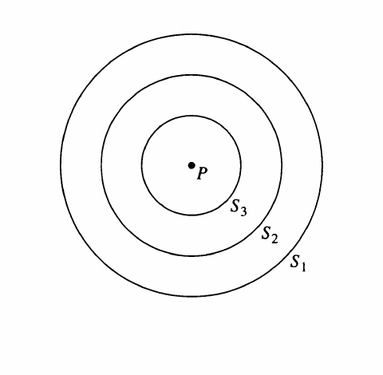

*Figure II-21*

Description: Three concentric spherical shells labeled $S_1$, $S_2$, and $S_3$ surround a central point $P$, illustrating a sequence of shrinking closed surfaces about that point.

This sounds good; it has a heartening "mathematical" ring to it. Unfortunately, it does not work because (assuming the charge density is finite everywhere) the sequence of fluxes, calculated as described above, approaches zero for any point $P$. This is fairly obvious since it is merely the statement that the flux through a surface tends to zero as the surface shrinks to a point. Since our objective was to find a way to determine the flux at a point, and thereby learn something about the field at that point, and since we get zero at *any* point no matter what the field there may be, we have obviously not obtained what we want.

It is useful to give a physicist's rough-and-ready proof of the fact that the flux goes to zero as the surface shrinks down to a point, for even though this fact may be obvious, the proof will suggest how to pull this chestnut out of the fire. For this purpose we note that if $\bar{\rho}_{\Delta V}$ denotes the average density of electric charge [Equation I-5] in some region of volume $\Delta V$, then the total charge in $\Delta V$ is $\bar{\rho}_{\Delta V} \, \Delta V$. Thus Gauss' law [Equation (II-1)] may be written

$$
\iint_S \mathbf{E} \cdot \hat{\mathbf{n}} \, dS = \bar{\rho}_{\Delta V} \, \Delta V/\epsilon_0, \tag{II-15}
$$

where, as indicated in Figure II-22, the surface integral is taken over the surface $S$ that encloses the volume $\Delta V$. From this expression [Equation (II-15)] we can see the validity of our assertion: As $S \to 0$, the enclosed volume $\Delta V$ must, of course, also approach zero. Thus, the flux also tends to zero and the assertion is proved.[^7] Not only have we given a proof, but (and this is the point) we can now isolate a quantity that does *not* vanish as $S \to 0$. Dividing Equation (II-15) by $\Delta V$, we get

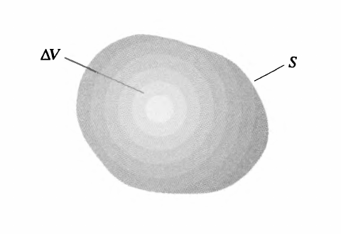

*Figure II-22*

Description: A small volume element $\Delta V$ is shown enclosed by an irregular surrounding surface $S$, illustrating the closed surface used in the shrinking-volume argument.

$$
\frac{1}{\Delta V} \iint_S \mathbf{E} \cdot \hat{\mathbf{n}} \, dS = \bar{\rho}_{\Delta V}/\epsilon_0.
$$

This expression, awkward and unappealing though it may be, is nonetheless close to what we are after, even though it still involves an integral of $\mathbf{E}$ over an entire surface. For if we now take the limit as $S$ shrinks to zero about some point in $\Delta V$ whose coordinates are $(x, y, z)$, then, as we see from Equation (I-6), the average density $\bar{\rho}_{\Delta V}$ approaches $\rho(x, y, z)$, the density at $(x, y, z)$, and we get

$$
\lim_{\Delta V \to 0 \\ \text{about } (x, y, z)} \frac{1}{\Delta V} \iint_S \mathbf{E} \cdot \hat{\mathbf{n}} \, dS = \rho(x, y, z)/\epsilon_0. \tag{II-16}
$$

This expression is admittedly downright hideous, and whether it will be of any practical use whatever depends on our being able to pound the left-hand side into a form that looks and acts at least half-civilized. We turn to this task now.

## The Divergence

Let us consider the surface integral of some arbitrary vector function $\mathbf{F}(x, y, z)$:

$$
\iint_S \mathbf{F} \cdot \hat{\mathbf{n}} \, dS.
$$

We shall be interested in the ratio of this integral to the volume enclosed by the surface $S$ as the volume shrinks to zero about some point, for that is exactly the type of quantity that appears in Equation (II-16). This limit is important enough to warrant a special name and notation. It is called the *divergence* of $\mathbf{F}$ and is designated $\operatorname{div} \mathbf{F}$. Thus,

$$
\operatorname{div} \mathbf{F} = \lim_{\Delta V \to 0 \\ \text{about } (x, y, z)} \frac{1}{\Delta V} \iint_S \mathbf{F} \cdot \hat{\mathbf{n}} \, dS. \tag{II-17}
$$

This quantity is clearly a scalar. Furthermore, it will, in general, have different values at different points $(x, y, z)$. Thus the divergence of a vector function is a *scalar function* of position.

Equation (II-16) can now be written

$$
\operatorname{div} \mathbf{E} = \rho/\epsilon_0. \tag{II-18}
$$

At this stage, however, our fancy new notation has only a cosmetic value, helping to beautify an ugly equation. Whether it has any practical value as well is the matter taken up in the following discussion in which we actually calculate the limit of the ratio of flux to enclosed volume and find that it can be expressed reasonably simply in terms of certain partial derivatives. Before turning to this calculation, however, it's worth mentioning that if we take our new terminology literally, we can interpret Equation (II-18) to mean that the field "diverges" from a point, and how much it diverges, so to speak, depends on how much charge there is at that point as represented by the density there.

Our next order of business is to find the reasonably simple expression for the divergence of a vector function promised above. Thus, consider a small rectangular parallelepiped[^8] with edges of length $\Delta x$, $\Delta y$, and $\Delta z$ parallel to the coordinate axes (Figure II-23). Let the point at the center of the little cuboid have coordinates $(x, y, z)$. We calculate the surface integral of $\mathbf{F}$ over the surface of the cuboid by regarding the integral as a sum of six terms, one for each cuboid face. We begin by considering the face marked $S_1$ in the figure. We want

$$
\iint_{S_1} \mathbf{F} \cdot \hat{\mathbf{n}} \, dS.
$$

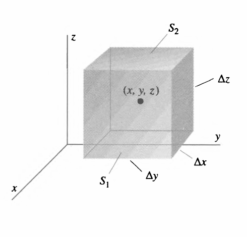

*Figure II-23*

Description: A small rectangular volume centered at $(x, y, z)$ is shown with edge lengths $\Delta x$, $\Delta y$, and $\Delta z$, and with opposite faces labeled $S_1$ and $S_2$ for the divergence calculation.

Now it is clear the unit vector normal to this face and pointing outward from the enclosed volume is $\mathbf{i}$. Thus, since $\mathbf{F} \cdot \mathbf{i} = F_x$, the preceding integral is

$$
\iint_{S_1} F_x(x, y, z) \, dS.
$$

By assumption the cuboid is small (eventually we shall take the limit as it shrinks to zero). We can therefore calculate this integral approximately as $F_x$ evaluated at the center of the face $S_1$ multiplied by the area of the face.[^9] The coordinates of the center of $S_1$ are $(x + \Delta x/2, y, z)$. Thus,

$$
\iint_{S_1} F_x(x, y, z) \, dS \simeq F_x\left(x + \frac{\Delta x}{2}, y, z\right) \Delta y \, \Delta z. \tag{II-19}
$$

The same kind of reasoning applied to the opposite face $S_2$ [whose outward normal is $-\mathbf{i}$ and whose center is at $(x - \Delta x/2, y, z)$] leads to

$$
\iint_{S_2} \mathbf{F} \cdot \hat{\mathbf{n}} \, dS = -\iint_{S_2} F_x \, dS \simeq -F_x\left(x - \frac{\Delta x}{2}, y, z\right) \Delta y \, \Delta z. \tag{II-20}
$$

Adding together the contributions of these two faces [Equations (II-19) and (II-20)], we get

$$
\iint_{S_1 + S_2} \mathbf{F} \cdot \hat{\mathbf{n}} \, dS \simeq \left[F_x\left(x + \frac{\Delta x}{2}, y, z\right) - F_x\left(x - \frac{\Delta x}{2}, y, z\right)\right] \Delta y \, \Delta z
$$

or

$$
\iint_{S_1 + S_2} \mathbf{F} \cdot \hat{\mathbf{n}} \, dS \simeq \frac{F_x\left(x + \frac{\Delta x}{2}, y, z\right) - F_x\left(x - \frac{\Delta x}{2}, y, z\right)}{\Delta x} \Delta x \, \Delta y \, \Delta z.
$$

Recognizing that $\Delta x \, \Delta y \, \Delta z = \Delta V$, the volume of the cuboid, we have

$$
\frac{1}{\Delta V} \iint_{S_1 + S_2} \mathbf{F} \cdot \hat{\mathbf{n}} \, dS \simeq \frac{F_x\left(x + \frac{\Delta x}{2}, y, z\right) - F_x\left(x - \frac{\Delta x}{2}, y, z\right)}{\Delta x}. \tag{II-21}
$$

We now must take the limit of this as $\Delta V$ approaches zero.[^10] But, of course, as $\Delta V$ goes to zero, so do each of the sides of the cuboid. Thus, on the right-hand side of Equation (II-21) we can write $\lim_{\Delta x \to 0}$ in place of $\lim_{\Delta V \to 0}$, and we find

$$
\lim_{\Delta V \to 0} \frac{1}{\Delta V} \iint_{S_1 + S_2} \mathbf{F} \cdot \hat{\mathbf{n}} \, dS = \lim_{\Delta x \to 0} \frac{F_x\left(x + \frac{\Delta x}{2}, y, z\right) - F_x\left(x - \frac{\Delta x}{2}, y, z\right)}{\Delta x} = \frac{\partial F_x}{\partial x}
$$

evaluated at $(x, y, z)$. This last equality follows from the definition of the partial derivative. It should come as no surprise that the other two pairs of faces of the cuboid contribute $\partial F_y/\partial y$ and $\partial F_z/\partial z$. Thus,

$$
\lim_{\Delta V \to 0} \frac{1}{\Delta V} \iint_S \mathbf{F} \cdot \hat{\mathbf{n}} \, dS = \frac{\partial F_x}{\partial x} + \frac{\partial F_y}{\partial y} + \frac{\partial F_z}{\partial z}.
$$

The limit on the left-hand side of this last equation, as we have already remarked, is the divergence of $\mathbf{F}$ [Equation (II-17)]. Thus we have just demonstrated that

$$
\operatorname{div} \mathbf{F} = \frac{\partial F_x}{\partial x} + \frac{\partial F_y}{\partial y} + \frac{\partial F_z}{\partial z}. \tag{II-22}
$$

It can be shown that this result is independent of the shape of the volume used to obtain it (see Problem II-17).

Using Equation (II-22) to find the divergence of a vector function is a straightforward matter, but we'll give an example just for the record. Consider the function

$$
\mathbf{F}(x, y, z) = \mathbf{i} x^2 + \mathbf{j} x y + \mathbf{k} y z.
$$

We have

$$
\frac{\partial F_x}{\partial x} = 2x, \qquad \frac{\partial F_y}{\partial y} = x, \qquad \text{and} \qquad \frac{\partial F_z}{\partial z} = y.
$$

Thus,

$$
\operatorname{div} \mathbf{F} = 2x + x + y = 3x + y.
$$

Returning now to the electrostatic field, we combine Equations (II-18) and (II-22) to get

$$
\frac{\partial E_x}{\partial x} + \frac{\partial E_y}{\partial y} + \frac{\partial E_z}{\partial z} = \rho/\epsilon_0. \tag{II-23}
$$

This equation, which is much more general than our derivation of it suggests, is one of Maxwell's equations and is completely equivalent to Gauss' law [Equation (II-1)]. It is sometimes called the "differential form" of Gauss' law.

We have now arrived at our goal (almost!), for we have related a property of the electrostatic field at a point (that is, its divergence) to a known quantity (the charge density) at that point. In all fairness it should be said that Equation (II-23) can in a sense be regarded as a single (differential) equation in *three* unknowns ($E_x$, $E_y$, $E_z$) and for this reason is not often used in this form to find the field. It turns out, however, that the three components of $\mathbf{E}$ can be related to each other very elegantly; when we develop that relationship, we shall return to this question of finding a convenient means of calculating $\mathbf{E}$.

## The Divergence in Cylindrical and Spherical Coordinates

One often sees Equation (II-22) given as the definition of the divergence of the vector function $\mathbf{F}$. While this is certainly acceptable, we much prefer to define the divergence as the limit of flux to volume as stated in Equation (II-16). Equation (II-22) is then merely the form the divergence takes in Cartesian coordinates. In other coordinate systems it looks quite different. For example, in cylindrical coordinates the function $\mathbf{F}$ has three components, which you will not be shocked to learn are designated $F_r$, $F_{\theta}$, and $F_z$ [see Figure II-24(a)]. To obtain the divergence of $\mathbf{F}$ in cylindrical coordinates, we consider the "cylindrical cuboid" shown in Figure II-24(b) with volume $\Delta V = r \, \Delta r \, \Delta \theta \, \Delta z$ and center at the point $(r, \theta, z)$. [^11] The flux of $\mathbf{F}$ through the face marked 1 is

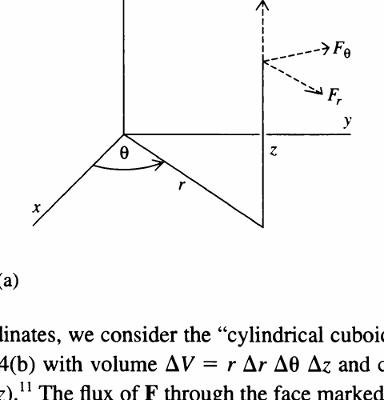

*Figure II-24(a)*

Description: Cylindrical coordinates are drawn with the radial direction $r$, azimuthal angle $\theta$, and vertical axis $z$, together with the three cylindrical vector components $F_r$, $F_{\theta}$, and $F_z$ shown at a point.

$$
\iint_{S_1} \mathbf{F} \cdot \hat{\mathbf{n}} \, dS = \iint_{S_1} F_r \, dS
$$

$$
\approx F_r\left(r + \frac{\Delta r}{2}, \theta, z\right) \left(r + \frac{\Delta r}{2}\right) \Delta \theta \, \Delta z,
$$

while through the face marked 2 it is

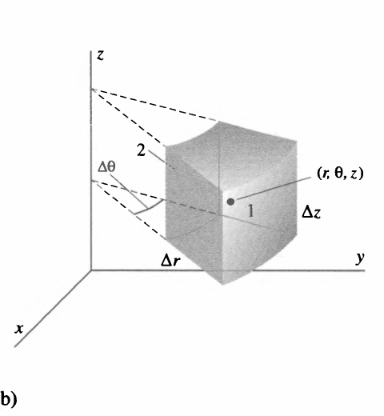

*Figure II-24(b)*

Description: A small cylindrical-coordinate volume element is shown with curved and flat faces, labeled dimensions $\Delta r$, $\Delta \theta$, and $\Delta z$, and the point $(r, \theta, z)$ marked near its center.

$$
\iint_{S_2} \mathbf{F} \cdot \hat{\mathbf{n}} \, dS = -\iint_{S_2} F_r \, dS
$$

$$
\approx -F_r\left(r - \frac{\Delta r}{2}, \theta, z\right) \left(r - \frac{\Delta r}{2}\right) \Delta \theta \, \Delta z.
$$

Adding these two results and dividing by the volume $\Delta V$ of the cuboid, we find

$$
\frac{1}{\Delta V} \iint_{S_1 + S_2} \mathbf{F} \cdot \hat{\mathbf{n}} \, dS
$$

$$
\approx \frac{1}{r \, \Delta r} \left[\left(r + \frac{\Delta r}{2}\right) F_r\left(r + \frac{\Delta r}{2}, \theta, z\right) - \left(r - \frac{\Delta r}{2}\right) F_r\left(r - \frac{\Delta r}{2}, \theta, z\right)\right],
$$

which in the limit as $\Delta r$ (and therefore $\Delta V$) approaches zero becomes

$$
\frac{1}{r} \frac{\partial}{\partial r}(r F_r).
$$

Arguing in an analogous way for the other four faces (see Problem II-18), we arrive finally at the expression for the divergence in cylindrical coordinates:

$$
\operatorname{div} \mathbf{F} = \frac{1}{r} \frac{\partial}{\partial r}(r F_r) + \frac{1}{r} \frac{\partial F_{\theta}}{\partial \theta} + \frac{\partial F_z}{\partial z}. \tag{II-24}
$$

In spherical coordinates where the components of $\mathbf{F}$ are $F_r$, $F_{\theta}$, and $F_{\phi}$ (see Figure II-25), similar reasoning (see Problem II-21) leads to the expression

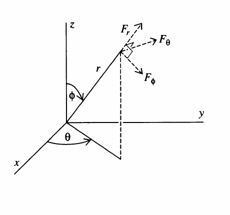

*Figure II-25*

Description: Spherical coordinates are drawn with the radius vector $r$, azimuthal angle $\theta$, polar angle $\phi$, and the three spherical vector components $F_r$, $F_{\theta}$, and $F_{\phi}$ indicated at a point.

$$
\operatorname{div} \mathbf{F} = \frac{1}{r^2} \frac{\partial}{\partial r}(r^2 F_r) + \frac{1}{r \sin \phi} \frac{\partial}{\partial \phi}(\sin \phi \, F_{\phi}) + \frac{1}{r \sin \phi} \frac{\partial F_{\theta}}{\partial \theta}. \tag{II-25}
$$

## The Del Notation

There is a special notation in terms of which the divergence may be written. There would be little or no reason for introducing it if it served only to provide another way of writing "div," but as we shall soon see, it has considerable usefulness in vector calculus.

Let us define a quantity designated $\nabla$ (read "del") by the following rather peculiar-looking equation:

$$
\nabla = \mathbf{i} \, \frac{\partial}{\partial x} + \mathbf{j} \, \frac{\partial}{\partial y} + \mathbf{k} \, \frac{\partial}{\partial z}.
$$

If we take the dot product of $\nabla$ and some vector function $\mathbf{F} = \mathbf{i} F_x + \mathbf{j} F_y + \mathbf{k} F_z$, we get

$$
\nabla \cdot \mathbf{F} = \left(\mathbf{i} \, \frac{\partial}{\partial x} + \mathbf{j} \, \frac{\partial}{\partial y} + \mathbf{k} \, \frac{\partial}{\partial z}\right) \cdot (\mathbf{i} F_x + \mathbf{j} F_y + \mathbf{k} F_z)
$$

$$
= \frac{\partial}{\partial x} F_x + \frac{\partial}{\partial y} F_y + \frac{\partial}{\partial z} F_z.
$$

Now we interpret the "product" of $\partial/\partial x$ and $F_x$ as a partial derivative; that is,

$$
\frac{\partial}{\partial x} F_x \equiv \frac{\partial F_x}{\partial x}.
$$

There are similar equations for the two other "products" $(\partial/\partial y) F_y$ and $(\partial/\partial z) F_z$. With this convention we recognize $\nabla \cdot \mathbf{F}$ ("del dot F") as the same as $\operatorname{div} \mathbf{F}$, and henceforth, to conform with modern notational practice, we shall always use $\nabla \cdot \mathbf{F}$ to indicate the divergence. Thus, Equations (II-18) and (II-23) will be written

$$
\nabla \cdot \mathbf{E} = \rho/\epsilon_0.
$$

Mathematicians call a symbol like $\nabla$ an operator. When we "operate" with $\nabla$ by dotting it into a vector function, we get the divergence of that function, as we have just seen. In subsequent discussions we shall introduce three other quantities (gradient, curl, and Laplacian), all of which are operators and all of which can be written in terms of $\nabla$.

## The Divergence Theorem

For the remainder of this chapter we digress from the mainstream of our narrative to discuss a famous theorem that asserts a remarkable connection between surface integrals and volume integrals. Although this relation may be suggested by the work we have done in electrostatics, the theorem is a mathematical statement holding under quite general circumstances. It is independent of any physics and is applicable in many different places. It is called the divergence theorem and sometimes Gauss' theorem (not to be confused with Gauss' law).

We shall not give a mathematically rigorous proof of the divergence theorem; such a proof is given in many texts in advanced calculus. Instead we present here another physicist's rough-and-ready proof. Thus, consider a closed surface $S$. Subdivide the volume $V$ enclosed by $S$ arbitrarily into $N$ subvolumes, one of which is shown in Figure II-26 (drawn as a cube for convenience). We begin our proof by asserting that the flux of an arbitrary vector function $\mathbf{F}(x, y, z)$ through the surface $S$ equals the sum of the fluxes through the surfaces of each of the subvolumes:

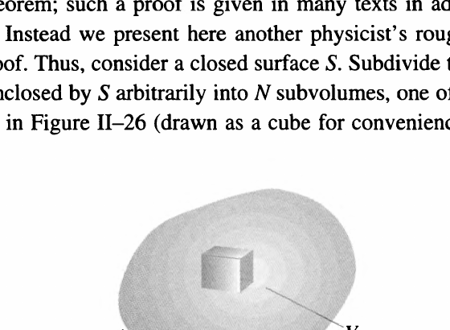

*Figure II-26*

Description: A closed surface $S$ enclosing a volume $V$ is shown with a small cubical subvolume sketched inside to represent one element of a subdivision of the whole volume.

$$
\iint_S \mathbf{F} \cdot \hat{\mathbf{n}} \, dS = \sum_{l=1}^{N} \iint_{S_l} \mathbf{F} \cdot \hat{\mathbf{n}} \, dS. \tag{II-26}
$$

Here $S_l$ is the surface that encloses the subvolume $\Delta V_l$. To establish Equation (II-26), consider two adjacent subvolumes (Figure II-27). Let their common face be denoted $S_0$. The flux through the subvolume marked 1 in Figure II-27 includes, of course, a contribution from $S_0$, which is

$$
\iint_{S_0} \mathbf{F} \cdot \hat{\mathbf{n}}_1 \, dS.
$$

Here $\hat{\mathbf{n}}_1$ is a unit vector normal to the face $S_0$, and by our usual convention, it points outward from subvolume 1. The flux through the subvolume marked 2 also includes a contribution from $S_0$:

$$
\iint_{S_0} \mathbf{F} \cdot \hat{\mathbf{n}}_2 \, dS.
$$

The vector $\hat{\mathbf{n}}_2$ is a unit normal that points outward from subvolume 2. Clearly $\hat{\mathbf{n}}_1 = -\hat{\mathbf{n}}_2$. Thus, in forming the sum in Equation (II-26), we shall include, among other things, the pair of terms

$$
\iint_{S_0} \mathbf{F} \cdot \hat{\mathbf{n}}_1 \, dS + \iint_{S_0} \mathbf{F} \cdot \hat{\mathbf{n}}_2 \, dS = \iint_{S_0} \mathbf{F} \cdot \hat{\mathbf{n}}_1 \, dS - \iint_{S_0} \mathbf{F} \cdot \hat{\mathbf{n}}_1 \, dS = 0.
$$

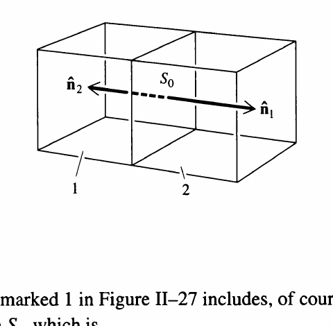

*Figure II-27*

Description: Two adjacent rectangular subvolumes share a common face $S_0$; opposite unit normals $\hat{\mathbf{n}}_1$ and $\hat{\mathbf{n}}_2$ are drawn on that common face to show cancellation of internal flux.

We see that these terms cancel each other and there is no net contribution to the sum in Equation (II-26) due to the face $S_0$. In fact, this sort of cancellation will obviously occur for any subvolume surface that is common to two adjacent subvolumes. But all subvolume surfaces are common to two adjacent subvolumes except those that are part of the original ("outer") surface $S$. Hence the only terms in the sum in Equation (II-26) that survive come from those subvolume surfaces that, taken together, constitute the surface $S$. This establishes the validity of Equation (II-26).

We now rewrite Equation (II-26) in the following curious fashion:

$$
\iint_S \mathbf{F} \cdot \hat{\mathbf{n}} \, dS = \sum_{l=1}^{N} \left[\frac{1}{\Delta V_l} \iint_{S_l} \mathbf{F} \cdot \hat{\mathbf{n}} \, dS\right] \Delta V_l. \tag{II-27}
$$

This clearly alters nothing since we have just multiplied and divided each term of the sum by $\Delta V_l$, the subvolume enclosed by the surface $S_l$. We can now imagine partitioning the original volume $V$ into an ever larger number of smaller and smaller subvolumes. In other words, we take the limit of the sum in Equation (II-27) as the number of subdivisions tends to infinity and each $\Delta V_l$ tends to zero. We recognize that the limit of the quantity in square brackets in Equation (II-27) is, by definition, $(\nabla \cdot \mathbf{F})_l$, that is, the divergence of $\mathbf{F}$ evaluated at the point about which $\Delta V_l$ is shrinking. Thus, for each $\Delta V_l$ very small, Equation (II-27) becomes

$$
\iint_S \mathbf{F} \cdot \hat{\mathbf{n}} \, dS \approx \sum_{l=1}^{N} (\nabla \cdot \mathbf{F})_l \, \Delta V_l. \tag{II-28}
$$

Further, in the limit, this sum is, again by definition, the triple integral of $\nabla \cdot \mathbf{F}$ over the volume enclosed by $S$:

$$
\lim_{N \to \infty \\ \text{each } \Delta V_l \to 0} \sum_{l=1}^{N} (\nabla \cdot \mathbf{F})_l \, \Delta V_l = \iiint_V \nabla \cdot \mathbf{F} \, dV. \tag{II-29}
$$

Putting together Equations (II-26) through (II-29), we arrive at our result:

$$
\iint_S \mathbf{F} \cdot \hat{\mathbf{n}} \, dS = \iiint_V \nabla \cdot \mathbf{F} \, dV. \tag{II-30}
$$

This is the divergence theorem. In words, it says that the flux of a vector function through some closed surface equals the triple integral of the divergence of that function over the volume enclosed by the surface.

The major reason the proof given above is not rigorous is that a triple integral is defined as the limit of a sum of the form

$$
\sum_l g(x_l, y_l, z_l) \, \Delta V_l,
$$

where the function $g$ is well defined. In Equation (II-27), however, the quantity multiplying the volume element $\Delta V_l$ in each term of the sum is not a well-defined function in this sense. That is, as $\Delta V_l$ tends to zero the quantity in the square brackets changes; it can be identified as the divergence of $\mathbf{F}$ only in the limit. A careful, rigorous treatment would show that Equation (II-30) is valid if $\mathbf{F}$ (that is, $F_x$, $F_y$, and $F_z$) is continuous and differentiable, and its first derivatives are continuous in $V$ and on $S$.

Now let's illustrate the divergence theorem. Since endless pages of hideous integrals will not serve our purpose, we'll use a simple example. Let

$$
\mathbf{F}(x, y, z) = \mathbf{i} x + \mathbf{j} y + \mathbf{k} z
$$

and choose for $S$ the surface shown in Figure II-28, consisting of the hemispherical shell of radius 1 and the region $R$ of the $xy$-plane enclosed by the unit circle. On the hemisphere we have $\hat{\mathbf{n}} = \mathbf{i} x + \mathbf{j} y + \mathbf{k} z$, so that $\hat{\mathbf{n}} \cdot \mathbf{F} = x^2 + y^2 + z^2 = 1$. Thus, on the hemisphere,

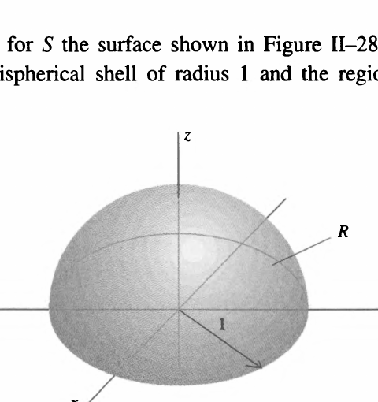

*Figure II-28*

Description: A closed surface made from the upper hemispherical shell of radius 1 together with the circular base region $R$ in the $xy$-plane is shown, illustrating the surface used in the divergence-theorem example.

$$
\iint \mathbf{F} \cdot \hat{\mathbf{n}} \, dS = \iint dS = 2\pi,
$$

where the last equality follows from the fact that the integral is merely the surface area of the unit hemisphere. On the region $R$ we have $\hat{\mathbf{n}} = -\mathbf{k}$ so that $\hat{\mathbf{n}} \cdot \mathbf{F} = -z$. Hence, on $R$,

$$
\iint \mathbf{F} \cdot \hat{\mathbf{n}} \, dS = -\iint z \, dx \, dy = 0
$$

because $z = 0$ everywhere on $R$. Thus, there is no contribution to the surface integral from the circular region $R$ and

$$
\iint_S \mathbf{F} \cdot \hat{\mathbf{n}} \, dS = 2\pi.
$$

Next we find by a trivial calculation that $\nabla \cdot \mathbf{F} = 3$. It follows then that

$$
\iiint_V \nabla \cdot \mathbf{F} \, dV = 3 \iiint_V dV = 3 \frac{2\pi}{3} = 2\pi,
$$

where we use the fact that the volume of the unit hemisphere is $2\pi/3$. Since the surface and volume integrals are equal, this illustrates Equation (II-30).

## Two Simple Applications of the Divergence Theorem

As one example of the use of the divergence theorem we give an alternative derivation of Equation (II-18), the analysis of which led us to the divergence theorem itself. In other words, this is how easy it would have been if we had known the divergence theorem to begin with!

We start with Gauss' law in the form

$$
\iint_S \mathbf{E} \cdot \hat{\mathbf{n}} \, dS = \frac{1}{\epsilon_0} \iiint_V \rho \, dV. \tag{II-31}
$$

Next we apply the divergence theorem to the surface integral in the above equation to get

$$
\iint_S \mathbf{E} \cdot \hat{\mathbf{n}} \, dS = \iiint_V \nabla \cdot \mathbf{E} \, dV. \tag{II-32}
$$

Thus, combining Equations (II-31) and (II-32), we find

$$
\iiint_V \nabla \cdot \mathbf{E} \, dV = \frac{1}{\epsilon_0} \iiint_V \rho \, dV.
$$

In general, if two volume integrals are equal, it is not necessarily true that their integrands are equal. It might be that the integrals are equal only over the particular volume of integration $V$, and by integrating over a different volume, we would wreck the equality. In the present case, however, this is not true because Gauss' law holds for any arbitrary volume $V$, and we cannot upset the equality by changing the volume. But this can be so only if the integrands are equal. Hence,

$$
\nabla \cdot \mathbf{E} = \rho/\epsilon_0,
$$

which should look familiar!

Another example of the use of the divergence theorem is the following. Suppose that in some region of space "stuff" (matter, electric charge, anything) is moving (Figure II-29). Let the density of this stuff at any point $(x, y, z)$ and any time $t$ be $\rho(x, y, z, t)$ and let its velocity be $\mathbf{v}(x, y, z, t)$. Further, suppose this stuff is *conserved*; that is, it is neither created nor destroyed. Concentrating on some arbitrary volume $V$ in space, we ask: What is the rate at which the amount of stuff in this volume is changing? At any time $t$ the amount of stuff in $V$ is

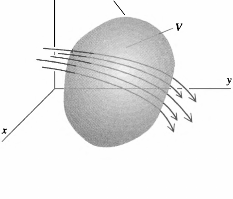

*Figure II-29*

Description: A closed surface $S$ enclosing a volume $V$ is drawn with several streamlines passing through it, illustrating material flowing into and out of the region.

$$
\iiint_V \rho(x, y, z, t) \, dV
$$

and the rate at which it is changing is

$$
\frac{d}{dt} \iiint_V \rho(x, y, z, t) \, dV = \iiint_V \frac{\partial \rho}{\partial t} \, dV.
$$

(To be able to move the derivative under the integral sign this way requires that $\partial \rho/\partial t$ be continuous.)

Next we recall from an earlier discussion that the rate at which stuff flows through a surface $S$ is

$$
\iint_S \rho \mathbf{v} \cdot \hat{\mathbf{n}} \, dS.
$$

We then assert that the rate at which the amount of stuff in $V$ is changing is equal to the rate at which it is flowing through the enclosing surface $S$; in equation form this statement reads

$$
\iiint_V \frac{\partial \rho}{\partial t} \, dV = -\iint_S \rho \mathbf{v} \cdot \hat{\mathbf{n}} \, dS.
$$

There are two features about this equation that require discussion:

1. The negative sign must be included because the surface integral as defined is positive for a net flow *out* of the volume, but a net flow out means the amount of stuff in the volume is decreasing.
2. This equation states that the amount of stuff in $V$ can change only as a result of stuff flowing across the boundary $S$. If stuff were being created or destroyed in $V$, terms would have to be included in the equation to reflect that fact. The absence of any such terms is thus an expression of the conservation of the stuff.

Now, finally, let us apply the divergence theorem. We find

$$
\iint_S \rho \mathbf{v} \cdot \hat{\mathbf{n}} \, dS = \iiint_V \nabla \cdot (\rho \mathbf{v}) \, dV.
$$

Hence,

$$
\iiint_V \frac{\partial \rho}{\partial t} \, dV = -\iiint_V \nabla \cdot (\rho \mathbf{v}) \, dV.
$$

Arguing as we did above that $V$ is an arbitrary volume, we can then say

$$
\frac{\partial \rho}{\partial t} = -\nabla \cdot (\rho \mathbf{v}). \tag{II-33}
$$

Usually we define the current density $\mathbf{J} = \rho \mathbf{v}$ and write Equation (II-33) as

$$
\frac{\partial \rho}{\partial t} + \nabla \cdot \mathbf{J} = 0.
$$

An equation of this type is referred to as a *continuity equation* and is, as we have seen, an expression of a conservation law (see Problems III-20, III-21, and IV-21). Besides playing an important role in electromagnetic theory, it is a basic equation both in hydrodynamics and diffusion theory. Finally, considerations similar to those that led to the continuity equation are involved in the analysis of heat flow.

## Problems

### II-1

Find a unit vector $\hat{\mathbf{n}}$ normal to each of the following surfaces.

(a) $z = 2 - x - y$.  
(b) $z = (x^2 + y^2)^{1/2}$.  
(c) $z = (1 - x^2)^{1/2}$.  
(d) $z = x^2 + y^2$.  
(e) $z = (1 - x^2/a^2 - y^2/a^2)^{1/2}$.

### II-2

(a) Show that the unit vector normal to the plane

$$
ax + by + cz = d
$$

is given by

$$
\hat{\mathbf{n}} = \pm (\mathbf{i} a + \mathbf{j} b + \mathbf{k} c)/(a^2 + b^2 + c^2)^{1/2}.
$$

(b) Explain in geometric terms why this expression for $\hat{\mathbf{n}}$ is independent of the constant $d$.

### II-3

Derive expressions for the unit normal vector for surfaces given by $y = g(x, z)$ and by $x = h(y, z)$. Use each to rederive the expression for the normal to the plane given in Problem II-2.

### II-4

In each of the following use Equation II-12 to evaluate the surface integral $\iint_S G(x, y, z) \, dS$.

(a) $G(x, y, z) = z$, where $S$ is the portion of the plane $x + y + z = 1$ in the first octant.  
(b) $G(x, y, z) = \dfrac{1}{1 + 4(x^2 + y^2)}$, where $S$ is the portion of the paraboloid $z = x^2 + y^2$ between $z = 0$ and $z = 1$.  
(c) $G(x, y, z) = (1 - x^2 - y^2)^{3/2}$, where $S$ is the hemisphere $z = (1 - x^2 - y^2)^{1/2}$.

### II-5

In each of the following use Equation II-13 to evaluate the surface integral $\iint_S \mathbf{F} \cdot \hat{\mathbf{n}} \, dS$.

(a) $\mathbf{F}(x, y, z) = \mathbf{i} x - \mathbf{k} z$, where $S$ is the portion of the plane $x + y + 2z = 2$ in the first octant.  
(b) $\mathbf{F}(x, y, z) = \mathbf{i} x + \mathbf{j} y + \mathbf{k} z$, where $S$ is the hemisphere $z = \sqrt{a^2 - x^2 - y^2}$.  
(c) $\mathbf{F}(x, y, z) = \mathbf{j} y + \mathbf{k}$, where $S$ is the portion of the paraboloid $z = 1 - x^2 - y^2$ above the $xy$-plane.

### II-6

The distribution of mass on the hemispherical shell

$$
z = (R^2 - x^2 - y^2)^{1/2}
$$

is given by

$$
\sigma(x, y, z) = (\sigma_0/R^2)(x^2 + y^2)
$$

where $\sigma_0$ is a constant. Find an expression in terms of $\sigma_0$ and $R$ for the total mass of the shell.

### II-7

Find the moment of inertia about the $z$-axis of the hemispherical shell of Problem II-6.

### II-8

An electrostatic field is given by

$$
\mathbf{E} = \lambda(\mathbf{i} y z + \mathbf{j} z x + \mathbf{k} x y),
$$

where $\lambda$ is a constant. Use Gauss' law to find the total charge enclosed by the surface shown in the figure consisting of $S_1$, the hemisphere

$$
z = (R^2 - x^2 - y^2)^{1/2},
$$

and $S_2$, its circular base in the $xy$-plane.

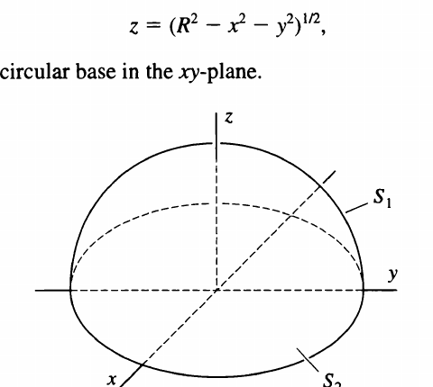

Description: A hemisphere $S_1$ above the $xy$-plane together with its circular base $S_2$ is shown, with the coordinate axes drawn through the center.

### II-9

An electrostatic field is given by $\mathbf{E} = \lambda(\mathbf{i} x + \mathbf{j} y)$, where $\lambda$ is a constant. Use Gauss' law to find the total charge enclosed by the surface shown in the figure consisting of $S_1$, the curved portion of the half-cylinder $z = (r^2 - y^2)^{1/2}$ of length $h$; $S_2$ and $S_3$, the two semicircular plane end pieces; and $S_4$, the rectangular portion of the $xy$-plane. Express your results in terms of $\lambda$, $r$, and $h$.

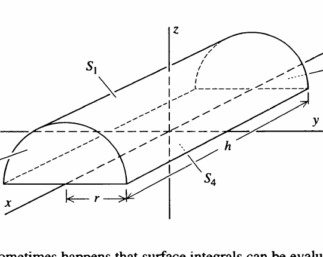

Description: A half-cylinder of radius $r$ and length $h$ is shown with its curved surface labeled $S_1$, semicircular end caps labeled $S_2$ and $S_3$, and the rectangular base in the $xy$-plane labeled $S_4$.

### II-10

It sometimes happens that surface integrals can be evaluated without using the long-winded procedures outlined in the text. Try evaluating $\iint_S \mathbf{F} \cdot \hat{\mathbf{n}} \, dS$ for each of the following; think a bit and avoid a lot of work!

(a) $\mathbf{F} = \mathbf{i} x + \mathbf{j} y + \mathbf{k} z$.  
$S$, the three squares each of side $b$ as shown in the figure.

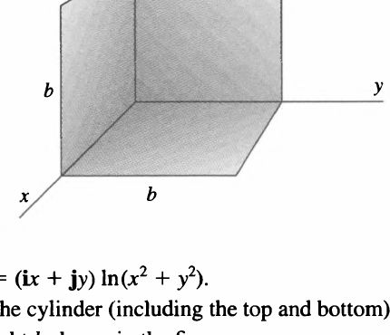

Description: Three mutually perpendicular square faces of side $b$ meet at a corner of the coordinate axes, forming an open corner of a cube.

(b) $\mathbf{F} = (\mathbf{i} x + \mathbf{j} y) \ln(x^2 + y^2)$.  
$S$, the cylinder (including the top and bottom) of radius $R$ and height $h$ shown in the figure.

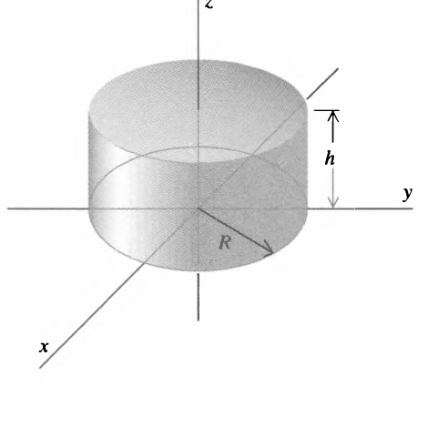

Description: A right circular cylinder of radius $R$ and height $h$ is shown with the coordinate axes through its center.

(c) $\mathbf{F} = (\mathbf{i} x + \mathbf{j} y + \mathbf{k} z)e^{-(x^2 + y^2 + z^2)}$.  
$S$, the surface of the sphere of radius $R$ centered at the origin as shown in the figure.

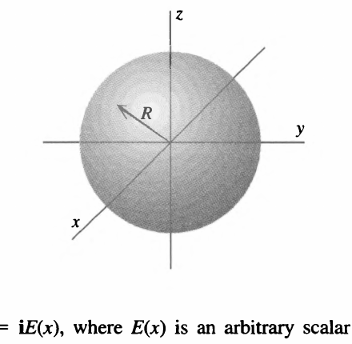

Description: A sphere of radius $R$ centered at the origin is shown with the three coordinate axes passing through its center.

(d) $\mathbf{F} = \mathbf{i} E(x)$, where $E(x)$ is an arbitrary scalar function of $x$.  
$S$, the surface of the cube of side $b$ shown in the figure.

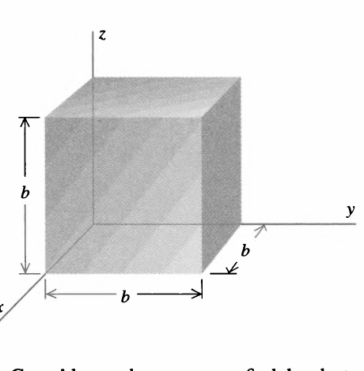

Description: A cube of side $b$ is shown aligned with the coordinate axes, with one corner at the origin.

### II-11

(a) Use Gauss' law and symmetry to find the electrostatic field as a function of position for an infinite uniform plane of charge. Let the charge lie in the $yz$-plane and denote the charge per unit area by $\sigma$.  
(b) Repeat part (a) for an infinite slab of charge parallel to the $yz$-plane, whose density is given by

$$
\rho(x) = \begin{cases}
\rho_0, & -b < x < b, \\
0, & |x| \ge b,
\end{cases}
$$

where $\rho_0$ and $b$ are constants.  
(c) Repeat part (b) with $\rho(x) = \rho_0 e^{-|x|/b}$.

### II-12

(a) Use Gauss' law and symmetry to find the electrostatic field as a function of position for an infinite uniform line of charge. Let the charge lie along the $z$-axis and denote the charge per unit length by $\lambda$.  
(b) Repeat part (a) for an infinite cylinder of charge whose axis coincides with the $z$-axis and whose density is given in cylindrical coordinates by

$$
\rho(r) = \begin{cases}
\rho_0, & r < b, \\
0, & r \ge b,
\end{cases}
$$

where $\rho_0$ and $b$ are constants.  
(c) Repeat part (b) with $\rho(r) = \rho_0 e^{-r/b}$.

### II-13

(a) Use Gauss' law and symmetry to find the electrostatic field as a function of position for the spherically symmetric charge distribution whose density is given in spherical coordinates by

$$
\rho(r) = \begin{cases}
\rho_0, & r < b, \\
0, & r \ge b,
\end{cases}
$$

where $\rho_0$ and $b$ are constants.  
(b) Repeat part (a) for $\rho(r) = \rho_0 e^{-r/b}$.  
(c) Repeat part (a) for

$$
\rho(r) = \begin{cases}
\rho_0, & r < b, \\
\rho_1, & b \le r < 2b, \\
0, & r \ge 2b.
\end{cases}
$$

How must $\rho_0$ and $\rho_1$ be related so that the field will be zero for $r > 2b$? What is the total charge of this distribution under these circumstances?

### II-14

Calculate the divergence of each of the following functions using Equation (II-22):

(a) $\mathbf{i} x^2 + \mathbf{j} y^2 + \mathbf{k} z^2$.  
(b) $\mathbf{i} y z + \mathbf{j} z x + \mathbf{k} x y$.  
(c) $\mathbf{i} e^{-x} + \mathbf{j} e^{-y} + \mathbf{k} e^{-z}$.  
(d) $\mathbf{i} - 3\mathbf{j} + \mathbf{k} z^2$.  
(e) $(-\mathbf{i} x y + \mathbf{j} x^2)/(x^2 + y^2)$, $(x, y) \ne (0, 0)$.  
(f) $\mathbf{k} \sqrt{x^2 + y^2}$.  
(g) $\mathbf{i} x + \mathbf{j} y + \mathbf{k} z$.  
(h) $(-\mathbf{i} y + \mathbf{j} x)/\sqrt{x^2 + y^2}$, $(x, y) \ne (0, 0)$.

### II-15

(a) Calculate $\iint_S \mathbf{F} \cdot \hat{\mathbf{n}} \, dS$ for the function in Problem II-14(a) over the surface of a cube of side $s$ whose center is at $(x_0, y_0, z_0)$ and whose faces are parallel to the coordinate planes.  
(b) Divide the above result by the volume of the cube and calculate the limit of the quotient as $s \to 0$. Compare your result with the divergence found in Problem II-14(a).  
(c) Repeat parts (a) and (b) for the function of Problem II-14(b) and (c).

### II-16

(a) Calculate the divergence of the function

$$
\mathbf{F}(x, y, z) = \mathbf{i} f(x) + \mathbf{j} f(y) + \mathbf{k} f(-2z)
$$

and show that it is zero at the point $(c, c, -c/2)$.  
(b) Calculate the divergence of

$$
\mathbf{G}(x, y, z) = \mathbf{i} f(y, z) + \mathbf{j} g(x, z) + \mathbf{k} h(x, y).
$$

### II-17

In the text we obtained the result

$$
\nabla \cdot \mathbf{F} = \frac{\partial F_x}{\partial x} + \frac{\partial F_y}{\partial y} + \frac{\partial F_z}{\partial z}
$$

by integrating over the surface of a small rectangular parallelepiped. As an example of the fact that this result is independent of the surface, rederive it using the wedge-shaped surface shown in the figure.

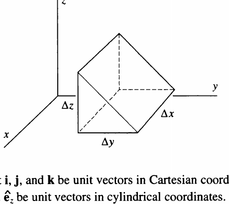

Description: A small wedge-shaped volume element is shown with dimensions $\Delta x$, $\Delta y$, and $\Delta z$ marked along its edges.

### II-18

(a) Let $\mathbf{i}$, $\mathbf{j}$, and $\mathbf{k}$ be unit vectors in Cartesian coordinates and $\hat{\mathbf{e}}_r$, $\hat{\mathbf{e}}_{\theta}$, and $\hat{\mathbf{e}}_z$ be unit vectors in cylindrical coordinates. Show that

$$
\mathbf{i} = \hat{\mathbf{e}}_r \cos \theta - \hat{\mathbf{e}}_{\theta} \sin \theta,
$$

$$
\mathbf{j} = \hat{\mathbf{e}}_r \sin \theta + \hat{\mathbf{e}}_{\theta} \cos \theta,
$$

$$
\mathbf{k} = \hat{\mathbf{e}}_z.
$$

(b) Rewrite the function in Problem II-14(e) in cylindrical coordinates and compute its divergence, using Equation (II-24). Convert your result back to Cartesian coordinates and compare with the answer obtained in Problem II-14(e).  
(c) Repeat part (b) for the function of Problem II-14(f).

### II-19

(a) Let $\mathbf{i}$, $\mathbf{j}$, and $\mathbf{k}$ be unit vectors in Cartesian coordinates and $\hat{\mathbf{e}}_r$, $\hat{\mathbf{e}}_{\theta}$, and $\hat{\mathbf{e}}_{\phi}$ be unit vectors in spherical coordinates. Show that

$$
\mathbf{i} = \hat{\mathbf{e}}_r \sin \phi \cos \theta + \hat{\mathbf{e}}_{\phi} \cos \phi \cos \theta - \hat{\mathbf{e}}_{\theta} \sin \theta,
$$

$$
\mathbf{j} = \hat{\mathbf{e}}_r \sin \phi \sin \theta + \hat{\mathbf{e}}_{\phi} \cos \phi \sin \theta + \hat{\mathbf{e}}_{\theta} \cos \theta,
$$

$$
\mathbf{k} = \hat{\mathbf{e}}_r \cos \phi - \hat{\mathbf{e}}_{\phi} \sin \phi.
$$

[*Hint:* It's easier to express $\hat{\mathbf{e}}_r$, $\hat{\mathbf{e}}_{\theta}$, and $\hat{\mathbf{e}}_{\phi}$ in terms of $\mathbf{i}$, $\mathbf{j}$, and $\mathbf{k}$ and then solve algebraically for $\mathbf{i}$, $\mathbf{j}$, and $\mathbf{k}$. To do this, first use the fact that $\hat{\mathbf{e}}_r = \mathbf{r}/r = (\mathbf{i} x + \mathbf{j} y + \mathbf{k} z)/r$. Next, reasoning geometrically, show that $\hat{\mathbf{e}}_{\theta} = -\mathbf{i} \sin \theta + \mathbf{j} \cos \theta$. Finally, calculate $\hat{\mathbf{e}}_{\phi} = \hat{\mathbf{e}}_{\theta} \times \hat{\mathbf{e}}_r$.]  
(b) Rewrite the function of Problem II-14(g) in spherical coordinates and compute its divergence using Equation (II-25). Convert your result back to Cartesian coordinates and compare with the answer obtained in Problem II-14(g).  
(c) Repeat part (b) for the function of Problem II-14(h).

### II-20

In cylindrical coordinates the divergence of $\mathbf{F}$ is given by

$$
\nabla \cdot \mathbf{F} = \frac{1}{r} \frac{\partial}{\partial r}(r F_r) + \frac{1}{r} \frac{\partial F_{\theta}}{\partial \theta} + \frac{\partial F_z}{\partial z}.
$$

In the text (pages 42-43) we derived the first term of this expression. Proceeding the same way, obtain the other two terms.

### II-21

Repeat Problem II-20 to obtain the divergence in spherical coordinates by carrying out the surface integral over the surface of the volume shown in the figure and thereby obtaining the expression

$$
\nabla \cdot \mathbf{F} = \frac{1}{r^2} \frac{\partial}{\partial r}(r^2 F_r) + \frac{1}{r \sin \phi} \frac{\partial}{\partial \phi}(\sin \phi \, F_{\phi}) + \frac{1}{r \sin \phi} \frac{\partial F_{\theta}}{\partial \theta}.
$$

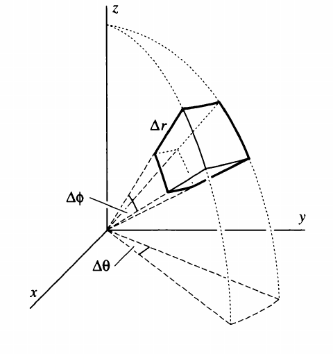

Description: A small spherical-coordinate volume element is shown within a wedge-shaped sector, with edge lengths labeled $\Delta r$, $\Delta \phi$, and $\Delta \theta$.

### II-22

Consider a vector function of the form

$$
\mathbf{F}(r) = \hat{\mathbf{e}}_r f(r),
$$

where $\hat{\mathbf{e}}_r = (\mathbf{i} x + \mathbf{j} y + \mathbf{k} z)/r$ is the unit vector in the radial direction, $r = (x^2 + y^2 + z^2)^{1/2}$, and $f(r)$ is a differentiable scalar function. Using the results of Problem II-21, determine $f(r)$ so that $\nabla \cdot \mathbf{F} = 0$. A vector function whose divergence is zero is said to be *solenoidal*.

### II-23

Verify the divergence theorem

$$
\iint_S \mathbf{F} \cdot \hat{\mathbf{n}} \, dS = \iiint_V \nabla \cdot \mathbf{F} \, dV
$$

in each of the following cases:

(a) $\mathbf{F} = \mathbf{i} x + \mathbf{j} y + \mathbf{k} z$.  
$S$, the surface of the cube of side $b$ shown in the figure.

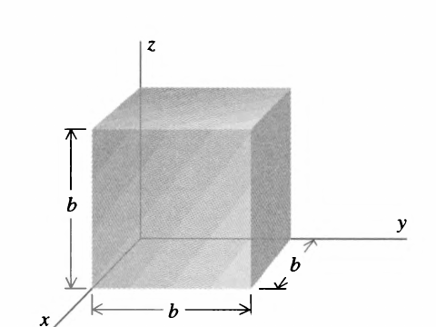

Description: A cube of side $b$ aligned with the coordinate axes is shown with one corner at the origin.

(b) $\mathbf{F} = \hat{\mathbf{e}}_r + \hat{\mathbf{e}}_z$,  
$\mathbf{r} = \mathbf{i} x + \mathbf{j} y$.  
$S$, the surface of the quarter cylinder (radius $R$, height $h$) shown in the figure.

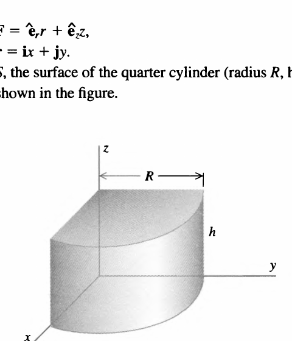

Description: A quarter-cylinder of radius $R$ and height $h$ is shown in the first quadrant, bounded by two coordinate planes and a curved cylindrical face.

(c) $\mathbf{F} = \hat{\mathbf{e}}_r \, r^2$,  
$\mathbf{r} = \mathbf{i} x + \mathbf{j} y + \mathbf{k} z$.  
$S$, the surface of the sphere of radius $R$ centered at the origin as shown in the figure.

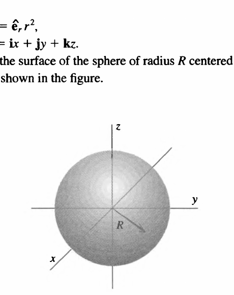

Description: A sphere of radius $R$ centered at the origin is shown with the coordinate axes passing through the center.

### II-24

(a) One of Maxwell's equations states that $\nabla \cdot \mathbf{B} = 0$, where $\mathbf{B}$ is any magnetic field. Show that

$$
\iint_S \hat{\mathbf{n}} \cdot \mathbf{B} \, dS = 0
$$

for any closed surface $S$.  
(b) Determine the flux of a uniform magnetic field $\mathbf{B}$ through the curved surface of a right circular cone (radius $R$, height $h$) oriented so that $\mathbf{B}$ is normal to the base of the cone as shown in the figure. (A uniform field is one that has the same magnitude and direction everywhere.)

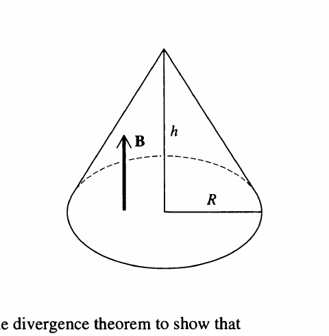

Description: A right circular cone with height $h$ and base radius $R$ is shown with a uniform magnetic field vector $\mathbf{B}$ drawn parallel to the cone axis and normal to the base.

### II-25

Use the divergence theorem to show that

$$
\iint_S \hat{\mathbf{n}} \, dS = 0,
$$

where $S$ is a closed surface and $\hat{\mathbf{n}}$ is the unit vector normal to the surface $S$.

### II-26

(a) Use the divergence theorem to show that

$$
\frac{1}{3} \iint_S \hat{\mathbf{n}} \cdot \mathbf{r} \, dS = V,
$$

where $S$ is a closed surface enclosing a region of volume $V$, $\hat{\mathbf{n}}$ is a unit vector normal to the surface $S$, and $\mathbf{r} = \mathbf{i} x + \mathbf{j} y + \mathbf{k} z$.  
(b) Use the expression given in (a) to find the volume of  
(i) a rectangular parallelepiped with sides $a$, $b$, $c$.  
(ii) a right circular cone with height $h$ and base radius $R$. [*Hint:* The calculation is very simple with the cone oriented as shown in the figure.]  
(iii) a sphere of radius $R$.

### II-27

(a) Consider a vector function with the property $\nabla \cdot \mathbf{F} = 0$ everywhere on two closed surfaces $S_1$ and $S_2$ and in the volume $V$ enclosed by them (see the figure). Show that the flux of $\mathbf{F}$ through $S_1$ equals the flux of $\mathbf{F}$ through $S_2$. In calculating the fluxes, choose the direction of the normals as indicated by the arrows in the figure.

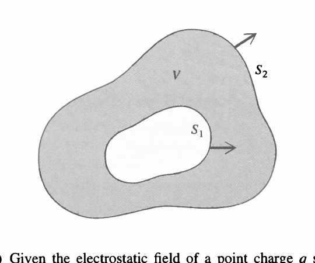

Description: Two nested closed surfaces $S_1$ and $S_2$ bound the shaded volume $V$ between them, with arrows showing the chosen normal directions on the inner and outer surfaces.

(b) Given the electrostatic field of a point charge $q$ situated at $r = 0$,

$$
\mathbf{E} = \frac{1}{4\pi \epsilon_0} \frac{q}{r^2} \hat{\mathbf{e}}_r,
$$

where $r^2 = x^2 + y^2 + z^2$, show by direct calculation that

$$
\nabla \cdot \mathbf{E} = 0, \qquad \text{for all } r \ne 0.
$$

(c) Prove Gauss' law for the field of a single point charge given in (b). [*Hint:* It is easy to calculate the flux of $\mathbf{E}$ over a sphere centered at $r = 0$.]  
(d) How would you extend this proof to cover the case of an arbitrary charge distribution?

### II-28

(a) Show by direct calculation that the divergence theorem does not hold for

$$
\mathbf{F}(r, \theta, \phi) = \frac{\hat{\mathbf{e}}_r}{r^2},
$$

with $S$ the surface of a sphere of radius $R$ centered at the origin, and $V$ the enclosed volume. Why does the theorem fail?  
(b) Verify by direct calculation that the divergence theorem does hold for the function $\mathbf{F}$ of part (a) when $S$ is the surface $S_1$ of a sphere of radius $R_1$, plus the surface $S_2$ of a sphere of radius $R_2$, both centered at the origin, and $V$ is the volume enclosed by $S_1$ and $S_2$.  
(c) In general, what restriction must be placed on a surface $S$ so that the divergence theorem will hold for the function of part (a)?

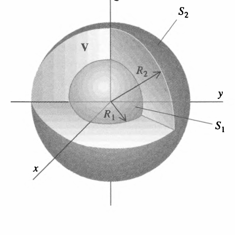

Description: A spherical shell bounded by an inner sphere $S_1$ of radius $R_1$ and an outer sphere $S_2$ of radius $R_2$ is shown, with the enclosed shell volume labeled $V$.

[^1]: The word "formal" in this context is a euphemism for "useless."
[^2]: The uniqueness of our result [Equation (II-4)] may be questioned on two counts. The first of these is a sign ambiguity: If $\hat{\mathbf{n}}$ is a unit normal vector, so is $-\hat{\mathbf{n}}$. The matter of which sign to use is discussed below. The second question arises from the fact that the two tangent vectors $\mathbf{u}$ and $\mathbf{v}$ used in determining $\hat{\mathbf{n}}$ are rather special, since each is parallel to one of the coordinate planes. Would we get the same result using two arbitrary tangent vectors? This issue is considered in Problem IV-26, where it is shown that $\hat{\mathbf{n}}$ as given by Equation (II-4), apart from sign, is indeed unique.
[^3]: The statement "each $\Delta S_l \to 0$" is not quite precise. The area of a rectangular patch, for example, might tend to zero because its width decreases while its length remains fixed. This would not be acceptable. Here and elsewhere we must interpret "each $\Delta S_l \to 0$" to mean that all linear dimensions of the $l$th patch tend to zero.
[^4]: Shortcuts like this often make it possible to evaluate surface integrals without using all the paraphernalia we discussed above. Further examples are given in Problem II-10.
[^5]: Examples of these are given in Problems II-11, II-12, and II-13.
[^6]: The reason Gauss' law yields the expression for the field of a point charge examined above is that symmetry in that case shows that the infinitely many unknowns are all equal. This turns Gauss' law into one equation in one unknown.
[^7]: This line of reasoning and the conclusion must be altered if the system contains point charges.
[^8]: Henceforth we'll refer to this as a "cuboid," a made-up term that takes less time and space than the sesquipedalian "rectangular parallelepiped."
[^9]: The rationale behind this is as follows: There is a mean value theorem, which tells us that the integral of $F_x$ over $S_1$ is equal to the area of $S_1$ multiplied by the function evaluated *somewhere* on $S_1$. Since $S_1$ is small, the point where we *should* evaluate $F_x$ and the point where we *do* evaluate it (that is, the center) must be close together, and $F_x$ must have nearly the same value at the two points. Hence what our procedure gives us is a good approximation to the value of the integral. Furthermore, as the cuboid shrinks to zero, the two points get closer and closer so that in the limit our result [Equation (II-22)] will be exact.
[^10]: Note that we have postponed calculating the contributions from the other four faces of the cuboid.
[^11]: Note that in the Cartesian case (Figure II-23) each face of the cuboid is given by an equation of the form $x = \text{constant}$, $y = \text{constant}$, or $z = \text{constant}$. In the same way each face of the surface in Figure II-24(b) is given by an equation of the form $r = \text{constant}$, $\theta = \text{constant}$, or $z = \text{constant}$.
