# Chapter 3

## Line Integrals and the Curl

> To err from the right path is common to Mankind.  
> Sophocles

## Work and Line Integrals

We remarked above that the differential form of Gauss' law, Equations (II-18) and (II-23), although it fulfills our goal of relating a property of the electric field (its divergence) at a point to a known quantity (the charge density) at the same point, nonetheless falls short of providing a convenient way to find $\mathbf{E}$. The reason is that $\nabla \cdot \mathbf{E} = \rho/\epsilon_0$ is (or seems to be) a single differential equation in three unknowns ($E_x$, $E_y$, $E_z$). But there is another feature of electrostatic fields that has not yet played an explicit role in our discussion and that will yield a relationship among the components of $\mathbf{E}$. It will thus provide us with the crucial last step in obtaining a useful way to calculate fields. In the process of examining this question, we shall encounter some of the most important topics in vector calculus.

The property of electrostatic fields that we shall now begin to discuss is intimately bound up with the question of work and energy. You no doubt recall the elementary definition of work as force times distance. Thus, in one dimension, if a force $F(x)$ acts from $x=a$ to $x=b$, the work done is, by definition,

$$
\int_a^b F(x) \, dx.
$$

To be able to handle more general situations, we must now introduce the concept of the line integral.

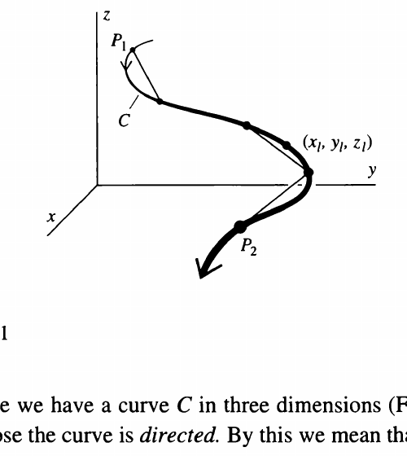

*Figure III-1*

Description: A directed space curve $C$ is drawn in three dimensions with points $P_1$ and $P_2$ marked on it, along with a sample subdivision point labeled $(x_l, y_l, z_l)$.

Suppose we have a curve $C$ in three dimensions (Figure III-1) and suppose the curve is directed. By this we mean that we put an arrow on the curve and say "This is the positive direction." Let $s$ be the arc length measured along the curve from some arbitrary point on it with $s=s_1$ at a point $P_1$ and $s=s_2$ at $P_2$. Suppose further that we have a function $f(x, y, z)$ defined everywhere on $C$. Now let us subdivide the portion of $C$ between $P_1$ and $P_2$ arbitrarily into $N$ sections. Figure III-1 shows an example of such a subdivision for $N=4$. Next, join successive subdivision points by chords, a typical one of which, say the $l$th, has length $\Delta s_l$. Now evaluate $f(x, y, z)$ at $(x_l, y_l, z_l)$, which is any point on the $l$th subdivision of the curve, and form the product $f(x_l, y_l, z_l)\Delta s_l$. Doing this for each of the $N$ segments of $C$, we form the sum

$$
\sum_{l=1}^{N} f(x_l, y_l, z_l) \, \Delta s_l.
$$

By definition, the line integral of $f(x, y, z)$ along the curve $C$ is the limit of this sum as the number of subdivisions $N$ approaches infinity and the length of each chord approaches zero:

$$
\int_C f(x, y, z) \, ds = \lim_{N \to \infty \\ \text{each } \Delta s_l \to 0} \sum_{l=1}^{N} f(x_l, y_l, z_l) \, \Delta s_l.
$$

To evaluate the line integral, we need to know the path $C$. Usually the most convenient way to specify this path is parametrically in terms of the arc length parameter $s$. Thus, we write $x=x(s)$, $y=y(s)$, and $z=z(s)$. In such a situation the line integral can be reduced to an ordinary definite integral:

$$
\int_C f(x, y, z) \, ds = \int_{s_1}^{s_2} f[x(s), y(s), z(s)] \, ds.
$$

An example of a line integral will be helpful here. For simplicity let us work in two dimensions and evaluate

$$
\int_C (x+y) \, ds,
$$

where $C$ is the straight line from the origin to the point whose coordinates are $(1,1)$ (Figure III-2).

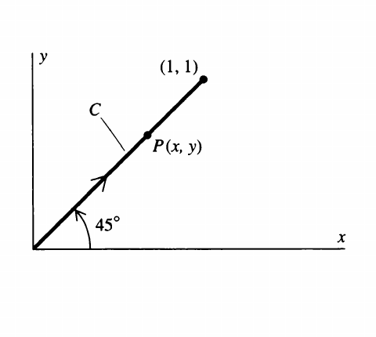

*Figure III-2*

Description: A straight line path $C$ runs from the origin to the point $(1,1)$ in the $xy$-plane, with the positive direction indicated and the angle $45^{\circ}$ marked at the origin.

If $(x,y)$ are the coordinates of any point $P$ on $C$ and if $s$ is the arc length measured from the origin, then $x=s/\sqrt{2}$ and $y=s/\sqrt{2}$. Hence, $x+y=2s/\sqrt{2}=\sqrt{2}s$. Thus,

$$
\int_C (x+y) \, ds = \sqrt{2} \int_0^{\sqrt{2}} s \, ds = \sqrt{2}.
$$

Let us integrate this same function $(x+y)$ from $(0,0)$ to $(1,1)$ along another path as shown in Figure III-3. Here we break the integration into two parts, one along $C_1$ and the second along $C_2$. On $C_1$ we have $x=s$ and $y=0$. Thus, on $C_1$, $x+y=s$, and so

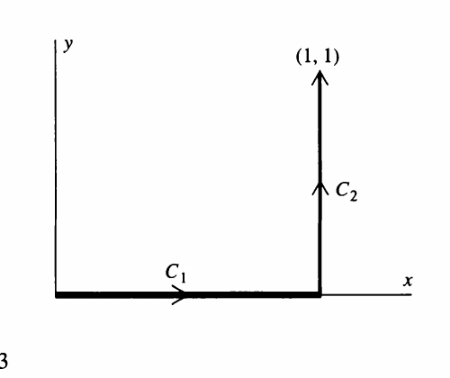

*Figure III-3*

Description: A piecewise path from $(0,0)$ to $(1,1)$ is shown as a horizontal segment $C_1$ from the origin to $(1,0)$ followed by a vertical segment $C_2$ up to $(1,1)$.

$$
\int_{C_1} (x+y) \, ds = \int_0^1 s \, ds = \frac{1}{2}.
$$

Along $C_2$, $x=1$ and $y=s$ [note that the arc length on this segment of the path is measured from the point $(1,0)$]. It follows then that

$$
\int_{C_2} (x+y) \, ds = \int_0^1 (1+s) \, ds = \frac{3}{2}.
$$

Adding the results for the two segments, we find

$$
\int_C (x+y) \, ds = \int_{C_1} (x+y) \, ds + \int_{C_2} (x+y) \, ds = \frac{1}{2} + \frac{3}{2} = 2.
$$

The lesson to be learned is this: the value of a line integral can (indeed, usually does) depend on the path of integration.

## Line Integrals Involving Vector Functions

Although the preceding discussion tells us what a line integral is, the kind of line integral we must deal with here has a feature not yet mentioned. You will recall that we introduced our discussion of line integrals with the concept of work. Work, in the most elementary sense, is force times displacement. That this needs elaboration becomes clear when we recognize that both force and displacement are vectors.

Thus, consider some path $C$ in three dimensions (Figure III-4). Let us suppose that under the action of a force an object moves on this path from $s_1$ to $s_2$. At any point $P$ on the curve let the force acting be designated $\mathbf{f}(x, y, z)$. The component of $\mathbf{f}$ that does work is, by definition, only that one which acts along the curve, that is, the tangential component. Let $\hat{\mathbf{t}}$ denote a unit vector that is tangent to the curve at $P$.[^1] Then the work done by the force in moving the object from $s_1$ to $s_2$ along the curve $C$ is

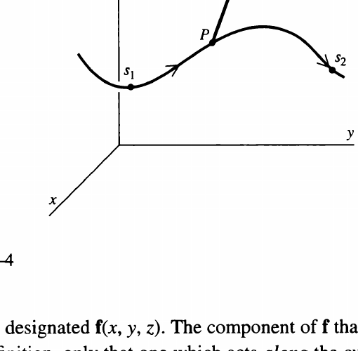

*Figure III-4*

Description: A force vector $\mathbf{f}(x,y,z)$ is drawn at a point $P$ on a space curve running from $s_1$ to $s_2$, illustrating motion along a three-dimensional path.

$$
W = \int_C \mathbf{f}(x, y, z) \cdot \hat{\mathbf{t}} \, ds,
$$

where it is understood, of course, that the integration begins at $s=s_1$ and ends at $s=s_2$. The new feature of this integral is that the integrand is the dot product of two vector functions. To be able to handle such a line integral, we must know how to find $\hat{\mathbf{t}}$, and it is to this problem that we now turn.

Consider an arbitrary curve $C$ (Figure III-5) parametrized by its arc length. At some point $s$ on the curve we have $x=x(s)$, $y=y(s)$, and $z=z(s)$. At another point $s+\Delta s$ we have $x+\Delta x=x(s+\Delta s)$, $y+\Delta y=y(s+\Delta s)$, and $z+\Delta z=z(s+\Delta s)$. Thus, the chord joining the two points on the curve directed from the first to the second is the vector $\Delta \mathbf{r}=\mathbf{i}\Delta x+\mathbf{j}\Delta y+\mathbf{k}\Delta z$, where

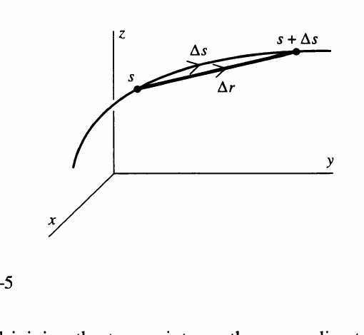

*Figure III-5*

Description: Two nearby points on a space curve are labeled $s$ and $s+\Delta s$, with the chord $\Delta \mathbf{r}$ connecting them and the arc segment between them marked $\Delta s$.

$$
\Delta x = x(s+\Delta s)-x(s),
$$

$$
\Delta y = y(s+\Delta s)-y(s),
$$

$$
\Delta z = z(s+\Delta s)-z(s).
$$

If we now divide this vector by $\Delta s$, we get

$$
\frac{\Delta \mathbf{r}}{\Delta s} = \mathbf{i} \frac{\Delta x}{\Delta s} + \mathbf{j} \frac{\Delta y}{\Delta s} + \mathbf{k} \frac{\Delta z}{\Delta s}.
$$

Taking the limit of this as $\Delta s$ approaches zero yields

$$
\mathbf{i} \frac{dx}{ds} + \mathbf{j} \frac{dy}{ds} + \mathbf{k} \frac{dz}{ds},
$$

and we assert that this is $\hat{\mathbf{t}}$. To begin with, it's clear that as $\Delta s \to 0$, the vector $\Delta \mathbf{r}$ becomes tangent to the curve at $s$. Further, in the limit $\Delta s \to 0$, we see that $|\Delta \mathbf{r}| \to \Delta s$. Hence, in the limit the magnitude of this quantity is 1. It follows then that we can make the identification

$$
\hat{\mathbf{t}}(s) = \mathbf{i} \frac{dx}{ds} + \mathbf{j} \frac{dy}{ds} + \mathbf{k} \frac{dz}{ds}.
$$

If we return now to the expression for work $W$ and use this formula for $\hat{\mathbf{t}}$, we find

$$
W = \int_C \mathbf{f}(x, y, z) \cdot \left[\mathbf{i} \frac{dx}{ds} + \mathbf{j} \frac{dy}{ds} + \mathbf{k} \frac{dz}{ds}\right] ds
$$

$$
= \int_C (f_x \, dx + f_y \, dy + f_z \, dz).
$$

This is a formal expression; often, to carry out the integration, it is useful to restore the $ds$ as the following example illustrates. Consider

$$
\mathbf{f}(x, y, z) = \mathbf{i}y - \mathbf{j}x
$$

and the path shown in Figure III-6(a). To calculate $\int_C (\mathbf{f}\cdot\hat{\mathbf{t}}) \, ds$ in this case, we break the path $C$ into three parts, $C_1$, $C_2$, and $C_3$ as shown. Since $f_z=0$, we have

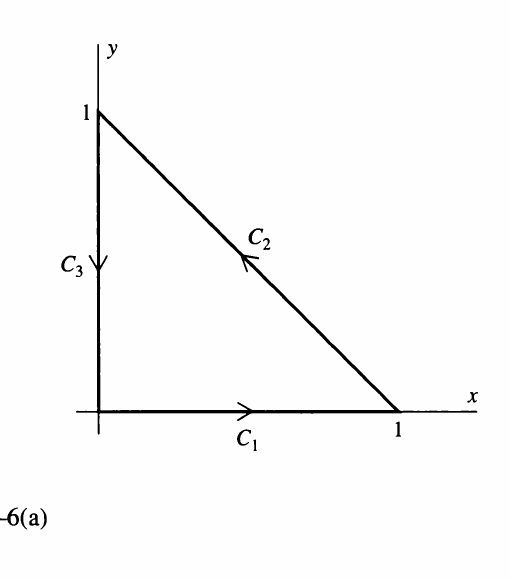

*Figure III-6(a)*

Description: A triangular path made of three directed segments $C_1$, $C_2$, and $C_3$ connects the points $(0,0)$, $(1,0)$, and $(0,1)$ in the plane.

$$
\int_C \mathbf{f}\cdot\hat{\mathbf{t}} \, ds = \int_C f_x \, dx + f_y \, dy = \int_C y \, dx - x \, dy.
$$

Now, on $C_1$, $y=0$ and $dy=0$, so there is no contribution to the integral. Similarly, on $C_3$ we have $x=0$ and $dx=0$, and again the result is zero. Thus, the only contribution to the integral over $C$ can come from $C_2$. Restoring the $ds$, we have

$$
\int_C \left(y\frac{dx}{ds} - x\frac{dy}{ds}\right) ds.
$$

But $(1-x)/s = \cos 45^{\circ}=1/\sqrt{2}$ and $y/s=\sin 45^{\circ}=1/\sqrt{2}$ [Figure III-6(b)]. Thus,

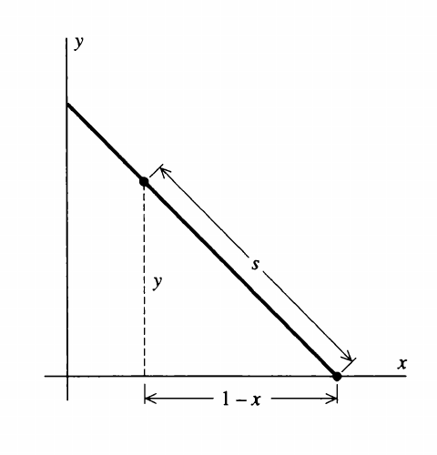

*Figure III-6(b)*

Description: The diagonal segment $C_2$ of the triangular path is shown separately, with the arc-length parameter $s$, the coordinates $x$ and $y$, and the geometric relation to the $45^{\circ}$ angle indicated.

$$
x = 1 - \frac{s}{\sqrt{2}} \Rightarrow \frac{dx}{ds} = -\frac{1}{\sqrt{2}},
$$

$$
y = \frac{s}{\sqrt{2}} \Rightarrow \frac{dy}{ds} = \frac{1}{\sqrt{2}}, \qquad 0 \le s \le \sqrt{2}.
$$

Hence, the integral is

$$
\int_0^{\sqrt{2}} \left[\frac{s}{\sqrt{2}}\left(-\frac{1}{\sqrt{2}}\right) - \left(1-\frac{s}{\sqrt{2}}\right)\frac{1}{\sqrt{2}}\right] ds = -\frac{1}{\sqrt{2}} \int_0^{\sqrt{2}} ds = -1.
$$

As a second example of a line integral involving a vector function, let

$$
\mathbf{f}(x, y, z) = \mathbf{i}x^2 - \mathbf{j}xy,
$$

and take $C$ to be the quarter circle of radius $R$ oriented as shown in Figure III-6(c). We then have

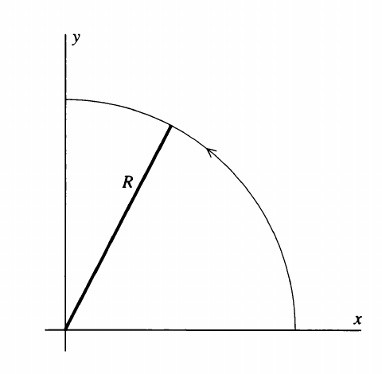

*Figure III-6(c)*

Description: A quarter-circle path of radius $R$ in the first quadrant is shown with the positive traversal direction indicated around the arc.

$$
\int_C \mathbf{f}\cdot\hat{\mathbf{t}} \, ds = \int_C x^2 \, dx - xy \, dy.
$$

Letting $x=R\cos\theta$, $y=R\sin\theta$, we find this integral becomes

$$
\int_0^{\pi/2} [R^2\cos^2\theta(-R\sin\theta)-R^2\sin\theta\cos\theta(R\cos\theta)] \, d\theta
$$

$$
= -2R^3 \int_0^{\pi/2} \cos^2\theta \sin\theta \, d\theta = -\frac{2R^3}{3}.
$$

## Path Independence

In a line integral the path of integration is one of the ingredients which determines the very function we integrate. It isn't remarkable, then, that the value of the integral can depend on the path of integration. What is remarkable is that, under some conditions, the value of the integral does not depend on the path!

We show how this path independence comes about in the case of the Coulomb force. Let a charge $q_0$ be fixed at the origin and let another charge $q$ be situated at $(x, y, z)$ (Figure III-7). The Coulomb force on $q$ is

$$
\mathbf{F} = \frac{1}{4\pi\epsilon_0} \frac{qq_0}{r^2} \hat{\mathbf{u}}, \tag{III-1}
$$

where $r=(x^2+y^2+z^2)^{1/2}$ is the distance between the two charges and $\hat{\mathbf{u}}$ is a unit vector pointing from $q_0$ to $q$. With this arrangement, $\hat{\mathbf{u}}$ is clearly in the radial direction.

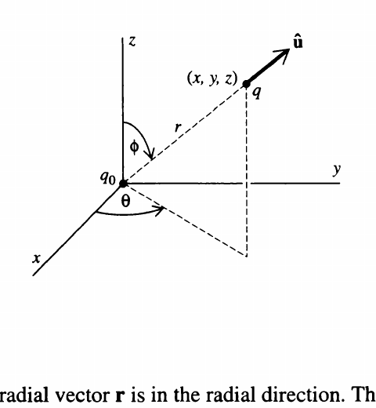

*Figure III-7*

Description: A point charge $q_0$ at the origin and a second charge $q$ at $(x,y,z)$ are joined by the radial vector $r$, with the unit vector $\hat{\mathbf{u}}$ and the spherical angles marked.

Even more clearly, the radial vector $\mathbf{r}$ is in the radial direction. Thus, we have $\hat{\mathbf{u}}=\mathbf{r}/r=(\mathbf{i}x+\mathbf{j}y+\mathbf{k}z)/r$, and so

$$
\mathbf{F} = \frac{qq_0}{4\pi\epsilon_0} \frac{\mathbf{i}x+\mathbf{j}y+\mathbf{k}z}{r^3}.
$$

Thus,

$$
\mathbf{F}\cdot\hat{\mathbf{t}} \, ds = F_x \, dx + F_y \, dy + F_z \, dz = \frac{qq_0}{4\pi\epsilon_0} \frac{x\,dx+y\,dy+z\,dz}{r^3}.
$$

The trick now is to use the relationship

$$
r^2 = x^2 + y^2 + z^2.
$$

Taking differentials in this equation and dividing by a factor of 2 yields

$$
x\,dx + y\,dy + z\,dz = r\,dr,
$$

so that

$$
\mathbf{F}\cdot\hat{\mathbf{t}} \, ds = \frac{qq_0}{4\pi\epsilon_0} \frac{r\,dr}{r^3} = \frac{qq_0}{4\pi\epsilon_0} \frac{dr}{r^2}.
$$

Suppose now that the charge $q$ moves from a point $P_1$ at a distance $r_1$ from the origin to a point $P_2$ at a distance $r_2$, over some path $C$ connecting the two points (Figure III-8). Then

$$
\int_C \mathbf{F}\cdot\hat{\mathbf{t}} \, ds = \frac{qq_0}{4\pi\epsilon_0} \int_{r_1}^{r_2} \frac{dr}{r^2} = \frac{qq_0}{4\pi\epsilon_0} \left(\frac{1}{r_1} - \frac{1}{r_2}\right).
$$

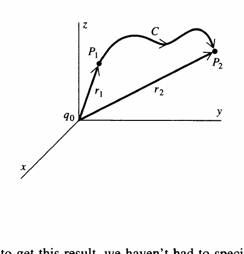

*Figure III-8*

Description: A curved path $C$ runs from a point $P_1$ at radius $r_1$ from the origin to a point $P_2$ at radius $r_2$, showing motion between two points in space.

Notice that to get this result, we haven't had to specify $C$ in any way whatever; we'd get the same answer for any path connecting $P_1$ and $P_2$. This, of course, proves that the line integral

$$
\int_C \mathbf{F}\cdot\hat{\mathbf{t}} \, ds
$$

with $\mathbf{F}$ given by Equation (III-1) is path-independent, but the result, so far, has been established only for the Coulomb force on $q$ due to a single charge $q_0$ [Equation (III-1)]. If there are many charges $q_1$, $q_2$, $\ldots$, $q_N$, then the total force on $q$ is $\mathbf{F}_1+\mathbf{F}_2+\cdots+\mathbf{F}_N$, where $\mathbf{F}_l$ is the Coulomb force on $q$ due to the $l$th charge $q_l$. Hence,

$$
\int_C \mathbf{F}\cdot\hat{\mathbf{t}} \, ds = \int_C \mathbf{F}_1\cdot\hat{\mathbf{t}} \, ds + \cdots + \int_C \mathbf{F}_N\cdot\hat{\mathbf{t}} \, ds.
$$

Now the discussion given above shows that each term of this sum is path independent; hence, so is the sum itself. (All this, of course, is merely an application of the superposition principle.) To phrase this result in terms of the field requires one last trivial step: Since $\mathbf{F}=q\mathbf{E}$, it follows that $q\int_C \mathbf{E}\cdot\hat{\mathbf{t}} \, ds$ is path independent, whence $\int_C \mathbf{E}\cdot\hat{\mathbf{t}} \, ds$ is also. Strange to say, it is this fact that will enable us eventually to convert $\nabla\cdot\mathbf{E}=\rho/\epsilon_0$ into a more useful equation.

If you examine the foregoing discussion carefully, you'll see that the fact that the Coulomb force varies inversely as the square of $r$ has nothing whatever to do with the path independence of the line integral. The path independence rests solely on two properties of the Coulomb force: (1) It depends only on the distance between the two particles, and (2) it acts along the line joining them. Any force $\mathbf{F}$ with these two properties is called a central force, and $\int_C \mathbf{F}\cdot\hat{\mathbf{t}} \, ds$ is independent of path for any central force.[^2]

One further step pertaining to path independence can be taken here. If

$$
\int_C \mathbf{F}\cdot\hat{\mathbf{t}} \, ds
$$

is independent of path, then

$$
\int_{C_1} \mathbf{F}\cdot\hat{\mathbf{t}} \, ds = \int_{C_2} \mathbf{F}\cdot\hat{\mathbf{t}} \, ds,
$$

where, as indicated in Figure III-9, $C_1$ and $C_2$ are two different arbitrary paths connecting the two points $P_1$ and $P_2$ and directed as shown in the figure. Now if instead of integrating along $C_1$ from $P_1$ to $P_2$, we go the other way, we simply change the sign of the line integral; that is,

$$
\int_{-C_1} \mathbf{F}\cdot\hat{\mathbf{t}} \, ds = -\int_{C_1} \mathbf{F}\cdot\hat{\mathbf{t}} \, ds,
$$

where $-C_1$ merely indicates that the integration is to be carried out along $C_1$ from $P_2$ to $P_1$. Thus,

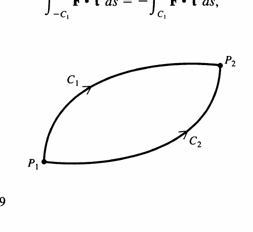

*Figure III-9*

Description: Two different directed paths $C_1$ and $C_2$ connect the same endpoints $P_1$ and $P_2$, illustrating path independence between the two routes.

$$
\int_{C_2} \mathbf{F}\cdot\hat{\mathbf{t}} \, ds = -\int_{-C_1} \mathbf{F}\cdot\hat{\mathbf{t}} \, ds,
$$

or

$$
\int_{-C_1+C_2} \mathbf{F}\cdot\hat{\mathbf{t}} \, ds = 0.
$$

But $-C_1+C_2$ is just the closed loop from $P_1$ to $P_2$ and back, as shown in Figure III-10. Thus, if $\int_C \mathbf{F}\cdot\hat{\mathbf{t}} \, ds$ is independent of path, then

$$
\oint \mathbf{F}\cdot\hat{\mathbf{t}} \, ds = 0,
$$

where $\oint$ is the standard notation for a line integral around a closed path. It follows that if $\mathbf{E}$ is an electrostatic field, we can write

$$
\oint \mathbf{E}\cdot\hat{\mathbf{t}} \, ds = 0. \tag{III-2}
$$

The term circulation is often given to the path integral around a closed curve of the tangential component of a vector function. Thus we have demonstrated that the circulation of the electrostatic field is zero. In what follows we'll call this the circulation law.

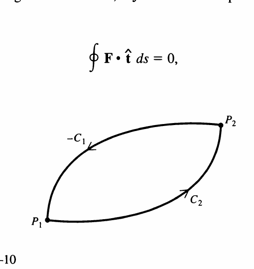

*Figure III-10*

Description: A closed loop formed by traversing one path from $P_1$ to $P_2$ and the other back again is shown to illustrate that the net circulation vanishes for a path-independent field.

## The Curl

If we are given some vector function $\mathbf{F}(x, y, z)$ and asked, "Could this be an electrostatic field?" we can, in principle, provide an answer. If

$$
\oint \mathbf{F}\cdot\hat{\mathbf{t}} \, ds \ne 0
$$

over even one path, then $\mathbf{F}$ cannot be an electrostatic field. If

$$
\oint \mathbf{F}\cdot\hat{\mathbf{t}} \, ds = 0
$$

over every closed path, then $\mathbf{F}$ can (but does not have to) be an electrostatic field.

Clearly, this criterion is not easy to apply since we must be sure the circulation of $\mathbf{F}$ is zero over all possible paths. To develop a more useful criterion, we proceed much as we did in dealing with Gauss' law, which, like the circulation law, is an expression involving an integral over the electric field. Gauss' law is more useful in the differential form [Equations (II-18) and (II-23)] obtained by considering the ratio of flux to volume for ever-decreasing surfaces. We now treat the circulation law in the same spirit and attempt to find the differential form of Equation (III-2). To stress the generality of our analysis and results, we deal with an arbitrary function $\mathbf{F}(x, y, z)$ and specialize to $\mathbf{E}(x, y, z)$ at a later stage in the development.

Let us consider the circulation of $\mathbf{F}$ over a small rectangle parallel to the $xy$-plane, with sides $\Delta x$ and $\Delta y$ and with the point $(x, y, z)$ at the center [Figure III-11(a)]. As shown in Figure III-11(b), we carry out the path integration in a counterclockwise direction looking down at the $xy$-plane. The line integral is broken up into four parts: $C_B$ (bottom), $C_R$ (right), $C_T$ (top), and $C_L$ (left). Since the rectangle is small (eventually we shall take the limit as it shrinks down to zero), we'll approximate the integral over each segment by $\mathbf{F}\cdot\hat{\mathbf{t}}$ evaluated at the center of the segment, multiplied by the length of the segment.[^3]

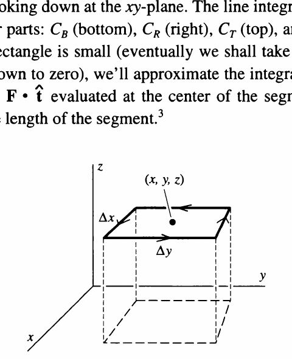

*Figure III-11(a)*

Description: A small rectangular loop parallel to the $xy$-plane is shown as one face of a thin box, with side lengths $\Delta x$ and $\Delta y$ and the center point $(x,y,z)$ marked.

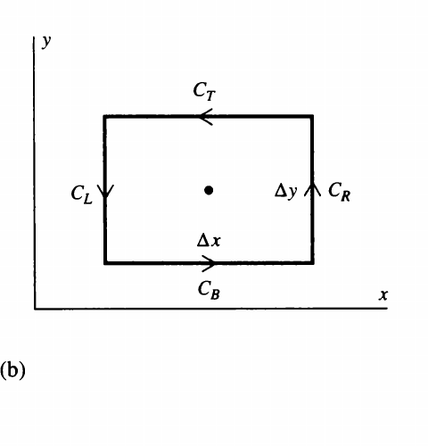

*Figure III-11(b)*

Description: The same rectangular loop is viewed from above in the $xy$-plane, with the four directed edges labeled $C_B$, $C_R$, $C_T$, and $C_L$.

Taking $C_B$ first, we have

$$
\int_{C_B} \mathbf{F}\cdot\hat{\mathbf{t}} \, ds = \int_{C_B} F_x \, dx \approx F_x\left(x, y-\frac{\Delta y}{2}, z\right) \Delta x. \tag{III-3a}
$$

Over $C_T$ we find

$$
\int_{C_T} \mathbf{F}\cdot\hat{\mathbf{t}} \, ds = \int_{C_T} F_x \, dx \approx -F_x\left(x, y+\frac{\Delta y}{2}, z\right) \Delta x. \tag{III-3b}
$$

The negative sign here is required by the fact that

$$
\int_{C_T} F_x \, dx = \int_{C_T} F_x \frac{dx}{ds} \, ds
$$

and $dx/ds=-1$ over $C_T$. Adding Equation (III-3a) and (III-3b), we find

$$
\int_{C_T+C_B} (\mathbf{F}\cdot\hat{\mathbf{t}}) \, ds \approx -\left[F_x\left(x, y+\frac{\Delta y}{2}, z\right)-F_x\left(x, y-\frac{\Delta y}{2}, z\right)\right] \Delta x
$$

$$
\approx -\frac{F_x\left(x, y+\frac{\Delta y}{2}, z\right)-F_x\left(x, y-\frac{\Delta y}{2}, z\right)}{\Delta y} \Delta x\Delta y.
$$

The factor $\Delta x\Delta y$ is clearly the area $\Delta S$ of the rectangle. Thus,

$$
\frac{1}{\Delta S} \int_{C_T+C_B} (\mathbf{F}\cdot\hat{\mathbf{t}}) \, ds \approx -\frac{F_x\left(x, y+\frac{\Delta y}{2}, z\right)-F_x\left(x, y-\frac{\Delta y}{2}, z\right)}{\Delta y}. \tag{III-4}
$$

Exactly the same sort of analysis applied to the left and right sides of the rectangle ($C_L$ and $C_R$) results in

$$
\frac{1}{\Delta S} \int_{C_L+C_R} (\mathbf{F}\cdot\hat{\mathbf{t}}) \, ds \approx \frac{F_y\left(x+\frac{\Delta x}{2}, y, z\right)-F_y\left(x-\frac{\Delta x}{2}, y, z\right)}{\Delta x}. \tag{III-5}
$$

Adding Equations (III-4) and (III-5) and taking the limit as $\Delta S$ shrinks down about a point $(x,y,z)$ (in which case $\Delta x$ and $\Delta y \to 0$ as well), we get

$$
\lim_{\Delta S \to 0 \\ \text{about } (x,y,z)} \frac{1}{\Delta S} \oint \mathbf{F}\cdot\hat{\mathbf{t}} \, ds = \frac{\partial F_y}{\partial x} - \frac{\partial F_x}{\partial y}, \tag{III-6}
$$

where $\oint$ is our semicomic notation meaning the circulation around the little rectangle.

You may wonder about the generality and uniqueness of this result since it is obtained using a path of integration that is special in two ways: first, it is a rectangle, and second, it is parallel to the $xy$-plane. If the path were not a rectangle, but a plane curve of arbitrary shape, it would not affect our result (see Problems III-2 and III-30). But our result definitely does depend on the special orientation of the path of integration. The choice of orientation made above clearly suggests two others, and they are shown in Figure III-12(a) and (b) along with the result of calculating

$$
\lim_{\Delta S \to 0 \\ \text{about } (x,y,z)} \frac{1}{\Delta S} \oint \mathbf{F}\cdot\hat{\mathbf{t}} \, ds
$$

for each.

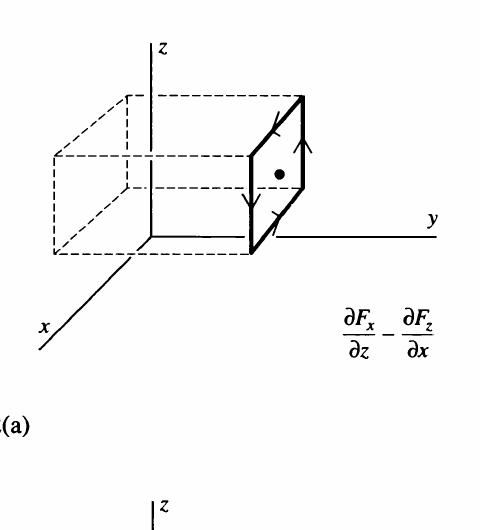

*Figure III-12(a)*

Description: A small loop in a plane parallel to the $yz$-plane is shown on the side of a box, indicating the circulation orientation associated with a normal in the $x$-direction.

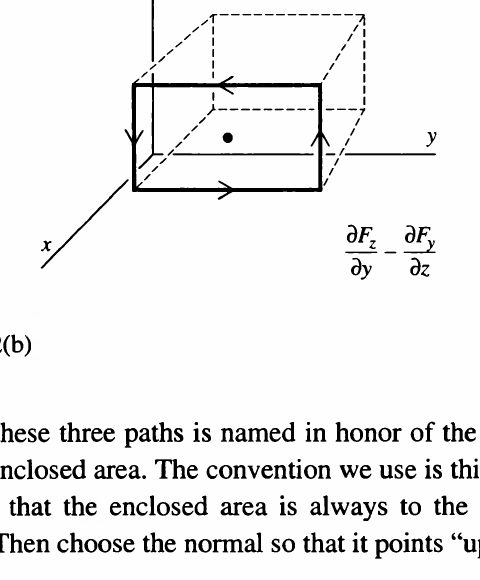

*Figure III-12(b)*

Description: A small loop in a plane parallel to the $xz$-plane is shown, indicating the circulation orientation associated with a normal in the $y$-direction.

Each of these three paths is named in honor of the vector normal to the enclosed area. The convention we use is this: Trace the curve $C$ so that the enclosed area is always to the left [Figure III-13(a)]. Then choose the normal so that it points "up" in the direction shown in the picture. This convention is sometimes called the right-hand rule, for if the right hand is oriented so that the fingers curl in the direction in which the curve is traced, the thumb, extended, points in the direction of the normal [Figure III-13(b)]. Using the right-hand rule, we have the following:

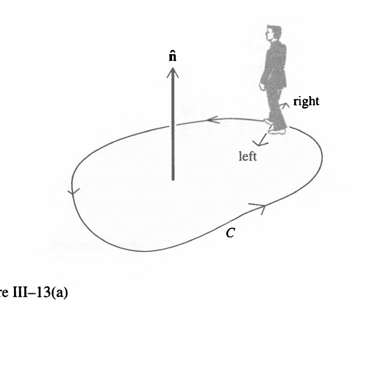

*Figure III-13(a)*

Description: A person stands on a closed curve $C$ with the enclosed area on the left, while the chosen normal vector $\hat{\mathbf{n}}$ points upward from the enclosed surface.

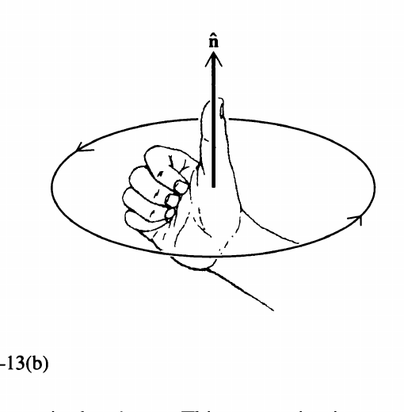

*Figure III-13(b)*

Description: A right hand is shown with the fingers curling in the direction of path traversal and the thumb pointing in the direction of the positive normal $\hat{\mathbf{n}}$.

Calculating $\lim_{\Delta S \to 0} \oint \mathbf{F}\cdot\hat{\mathbf{t}} \, ds/\Delta S$ for a path whose normal is $\mathbf{i}$, we get $\partial F_z/\partial y - \partial F_y/\partial z$; for a path whose normal is $\mathbf{j}$, we get $\partial F_x/\partial z - \partial F_z/\partial x$; for a path whose normal is $\mathbf{k}$, we get $\partial F_y/\partial x - \partial F_x/\partial y$. Thus,

$$
\begin{cases}
	ext{for a path whose normal is } \mathbf{i}, \text{ we get } \dfrac{\partial F_z}{\partial y} - \dfrac{\partial F_y}{\partial z}, \\
	ext{for a path whose normal is } \mathbf{j}, \text{ we get } \dfrac{\partial F_x}{\partial z} - \dfrac{\partial F_z}{\partial x}, \\
	ext{for a path whose normal is } \mathbf{k}, \text{ we get } \dfrac{\partial F_y}{\partial x} - \dfrac{\partial F_x}{\partial y}.
\end{cases} \tag{III-7a}
$$

It turns out that these three quantities are the Cartesian components of a vector. To this vector we give the name curl of $\mathbf{F}$, which we write $\operatorname{curl}\mathbf{F}$. Thus, we have

$$
\operatorname{curl}\mathbf{F} = \mathbf{i} \left(\frac{\partial F_z}{\partial y} - \frac{\partial F_y}{\partial z}\right) + \mathbf{j} \left(\frac{\partial F_x}{\partial z} - \frac{\partial F_z}{\partial x}\right) + \mathbf{k} \left(\frac{\partial F_y}{\partial x} - \frac{\partial F_x}{\partial y}\right). \tag{III-7b}
$$

This expression is often (indeed, usually) given as the definition of the curl, but we prefer to regard it as merely the form of the curl in Cartesian coordinates. We shall define the curl as the limit of circulation to area as the area tends to zero. To be precise, let $\oint_{C_n} \mathbf{F}\cdot\hat{\mathbf{t}} \, ds$ be the circulation of $\mathbf{F}$ about some path whose normal is $\hat{\mathbf{n}}$ as shown in Figure III-14. Then by definition

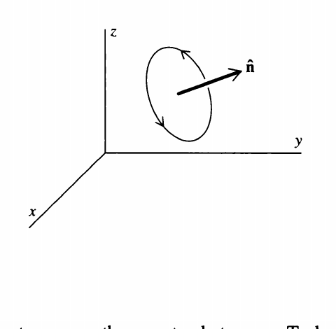

*Figure III-14*

Description: A small closed loop in space is shown with a chosen normal vector $\hat{\mathbf{n}}$ pointing away from the loop, illustrating the general geometric definition of curl.

$$
\hat{\mathbf{n}}\cdot\operatorname{curl}\mathbf{F} = \lim_{\Delta S \to 0 \\ \text{about } (x,y,z)} \frac{1}{\Delta S} \oint_{C_n} \mathbf{F}\cdot\hat{\mathbf{t}} \, ds. \tag{III-8}
$$

By taking $\hat{\mathbf{n}}$ successively equal to $\mathbf{i}$, $\mathbf{j}$, and $\mathbf{k}$, we get back the results given in Equation (III-7b). Since this limit will, in general, have different values for different points $(x,y,z)$, the curl of $\mathbf{F}$ is a vector function of position.[^4] Note incidentally that although in our work we always assumed that the area enclosed by the path of integration was a plane, this need not be the case. Since the curl is defined in terms of a limit in which the enclosed surface shrinks to zero about some point, in the final stages of this limiting process the enclosed surface is infinitesimally close to a plane, and all our considerations apply.

Since it is undoubtedly beyond the powers of a mere mortal to remember the expression given above for $\operatorname{curl}\mathbf{F}$ in Cartesian coordinates [Equation (III-7b)], it is fortunate that there is a mnemonic device to fall back on. If the three-by-three determinant

$$
\begin{vmatrix}
\mathbf{i} & \mathbf{j} & \mathbf{k} \\
\partial/\partial x & \partial/\partial y & \partial/\partial z \\
F_x & F_y & F_z
\end{vmatrix}
$$

is expanded (most conveniently in minors of the first row) and if certain "products" are interpreted as partial derivatives [for example, $(\partial/\partial x)F_y=\partial F_y/\partial x$], the result will be identical with the one given in Equation (III-7b). Thus, the anguish of remembering the form of curl $\mathbf{F}$ in Cartesian coordinates can be replaced by the pain of remembering how to expand a three-by-three determinant. Chacun a son gout.

As an example of calculating the curl, consider the vector function

$$
\mathbf{F}(x, y, z) = \mathbf{i}xz + \mathbf{j}yz - \mathbf{k}y^2.
$$

We have

$$
\operatorname{curl}\mathbf{F} = \begin{vmatrix}
\mathbf{i} & \mathbf{j} & \mathbf{k} \\
\partial/\partial x & \partial/\partial y & \partial/\partial z \\
xz & yz & -y^2
\end{vmatrix}
$$

$$
= \mathbf{i}(-2y-y) + \mathbf{j}(x-0) + \mathbf{k}(0-0)
$$

$$
= -3\mathbf{i}y + \mathbf{j}x.
$$

You may have noticed that the curl operator can be written in terms of the del notation we introduced earlier. You can verify for yourself that

$$
\operatorname{curl}\mathbf{F} = \nabla \times \mathbf{F},
$$

which is read "del cross $\mathbf{F}$." Henceforth, we shall always use $\nabla \times \mathbf{F}$ to indicate the curl.

## The Curl in Cylindrical and Spherical Coordinates

To obtain the form of $\nabla \times \mathbf{F}$ in other coordinate systems, we proceed as we did above in finding the Cartesian form, merely modifying the paths of integration appropriately. As an example, using the path shown in Figure III-15(a) will yield the $z$-component of $\nabla \times \mathbf{F}$ in cylindrical coordinates.[^6] Note that we trace the curve in accordance with the right-hand rule given in the previous section. Viewing the path from above [as we do in Figure III-15(b)], the line integral of $\mathbf{F}(r, \theta, z)\cdot\hat{\mathbf{t}}$ along the segment of path marked 1 is

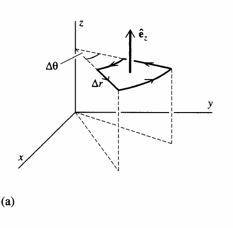

*Figure III-15(a)*

Description: A small loop on the top of a cylindrical-coordinate volume element is shown with normal $\hat{\mathbf{e}}_z$, indicating the contour used to compute the $z$-component of the curl in cylindrical coordinates.

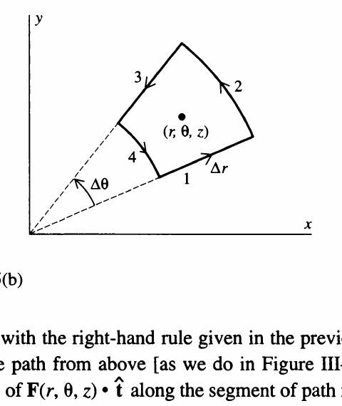

*Figure III-15(b)*

Description: The cylindrical-coordinate loop is viewed from above, with the four directed segments labeled 1 through 4 and the widths $\Delta r$ and $\Delta\theta$ marked around the point $(r,\theta,z)$.

$$
\int_{C_1} \mathbf{F}\cdot\hat{\mathbf{t}} \, ds \approx F_r\left(r, \theta-\frac{\Delta\theta}{2}, z\right) \Delta r,
$$

while along segment 3 it is

$$
\int_{C_3} \mathbf{F}\cdot\hat{\mathbf{t}} \, ds \approx -F_r\left(r, \theta+\frac{\Delta\theta}{2}, z\right) \Delta r.
$$

The area enclosed by the path is $r\Delta r\Delta\theta$, so

$$
\frac{1}{\Delta S}\int_{C_1+C_3} \mathbf{F}\cdot\hat{\mathbf{t}} \, ds \approx -\frac{\Delta r}{r\Delta r\Delta\theta} \left[F_r\left(r, \theta+\frac{\Delta\theta}{2}, z\right)-F_r\left(r, \theta-\frac{\Delta\theta}{2}, z\right)\right].
$$

In the limit as $\Delta r$ and $\Delta\theta$ tend to zero, this becomes

$$
-\frac{1}{r} \frac{\partial F_r}{\partial \theta}
$$

evaluated at the point $(r,\theta,z)$. Along segment 2 we find

$$
\int_{C_2} \mathbf{F}\cdot\hat{\mathbf{t}} \, ds \approx F_{\theta}\left(r+\frac{\Delta r}{2}, \theta, z\right) \left(r+\frac{\Delta r}{2}\right) \Delta\theta,
$$

and along segment 4

$$
\int_{C_4} \mathbf{F}\cdot\hat{\mathbf{t}} \, ds \approx -F_{\theta}\left(r-\frac{\Delta r}{2}, \theta, z\right) \left(r-\frac{\Delta r}{2}\right) \Delta\theta.
$$

Thus,

$$
\frac{1}{\Delta S}\int_{C_2+C_4} \mathbf{F}\cdot\hat{\mathbf{t}} \, ds \approx \frac{\Delta\theta}{r\Delta r\Delta\theta} \left[\left(r+\frac{\Delta r}{2}\right)F_{\theta}\left(r+\frac{\Delta r}{2}, \theta, z\right)-\left(r-\frac{\Delta r}{2}\right)F_{\theta}\left(r-\frac{\Delta r}{2}, \theta, z\right)\right].
$$

In the limit this becomes $(1/r)(\partial/\partial r)(rF_{\theta})$ evaluated at $(r,\theta,z)$. Hence,

$$
(\nabla \times \mathbf{F})_z \equiv \lim_{\Delta S \to 0} \frac{1}{\Delta S} \oint \mathbf{F}\cdot\hat{\mathbf{t}} \, ds = \frac{1}{r} \frac{\partial}{\partial r}(rF_{\theta}) - \frac{1}{r} \frac{\partial F_r}{\partial \theta}.
$$

Paths for finding the $r$- and $\theta$-components of $\nabla \times \mathbf{F}$ are shown in Figures III-15(c) and (d), respectively. You are asked to obtain these two components yourself in Problem III-8. For completeness we give all three components of $\nabla \times \mathbf{F}$ in cylindrical coordinates:

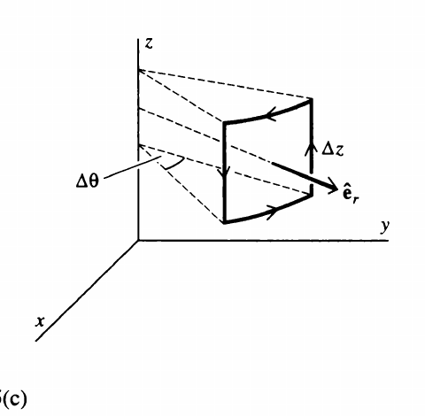

*Figure III-15(c)*

Description: A small loop on a surface of constant $r$ is shown with normal $\hat{\mathbf{e}}_r$, indicating the contour for the radial curl component in cylindrical coordinates.

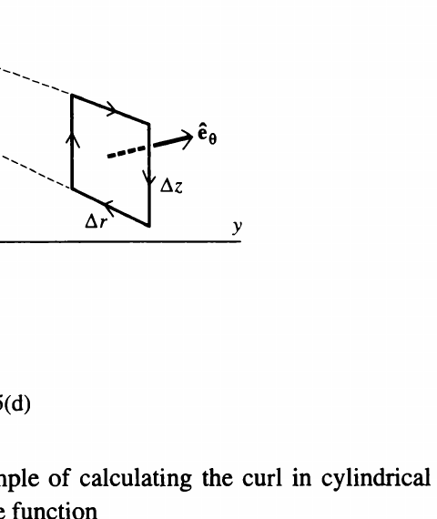

*Figure III-15(d)*

Description: A small loop on a surface of constant $\theta$ is shown with normal $\hat{\mathbf{e}}_{\theta}$, indicating the contour for the azimuthal curl component in cylindrical coordinates.

$$
(\nabla \times \mathbf{F})_r = \frac{1}{r} \frac{\partial F_z}{\partial \theta} - \frac{\partial F_{\theta}}{\partial z},
$$

$$
(\nabla \times \mathbf{F})_{\theta} = \frac{\partial F_r}{\partial z} - \frac{\partial F_z}{\partial r},
$$

$$
(\nabla \times \mathbf{F})_z = \frac{1}{r} \frac{\partial}{\partial r}(rF_{\theta}) - \frac{1}{r} \frac{\partial F_r}{\partial \theta}.
$$

As an example of calculating the curl in cylindrical coordinates consider the function

$$
\mathbf{F}(r, \theta, z) = \hat{\mathbf{e}}_r r^2 z + \hat{\mathbf{e}}_{\theta} rz^2 \cos\theta + \hat{\mathbf{e}}_z r^3.
$$

Then

$$
(\nabla \times \mathbf{F})_r = \frac{1}{r} \frac{\partial}{\partial \theta}(r^3) - \frac{\partial}{\partial z}(rz^2\cos\theta) = -2rz\cos\theta,
$$

$$
(\nabla \times \mathbf{F})_{\theta} = \frac{\partial}{\partial z}(r^2 z) - \frac{\partial}{\partial r}(r^3) = -2r^2,
$$

$$
(\nabla \times \mathbf{F})_z = \frac{1}{r} \frac{\partial}{\partial r}(r^2 z^2 \cos\theta) - \frac{1}{r} \frac{\partial}{\partial \theta}(r^2 z) = 2z^2 \cos\theta.
$$

Hence

$$
\nabla \times \mathbf{F} = -2\hat{\mathbf{e}}_r rz\cos\theta - 2\hat{\mathbf{e}}_{\theta} r^2 + 2\hat{\mathbf{e}}_z z^2\cos\theta.
$$

The three components of curl $\mathbf{F}$ in spherical coordinates (see Problem III-9) are as follows:

$$
(\nabla \times \mathbf{F})_r = \frac{1}{r\sin\phi} \frac{\partial}{\partial \phi}(\sin\phi\,F_{\theta}) - \frac{1}{r\sin\phi} \frac{\partial F_{\phi}}{\partial \theta},
$$

$$
(\nabla \times \mathbf{F})_{\phi} = \frac{1}{r\sin\phi} \frac{\partial F_r}{\partial \theta} - \frac{1}{r} \frac{\partial}{\partial r}(rF_{\theta}),
$$

$$
(\nabla \times \mathbf{F})_{\theta} = \frac{1}{r} \frac{\partial}{\partial r}(rF_{\phi}) - \frac{1}{r} \frac{\partial F_r}{\partial \phi}.
$$

As an example of calculating the curl in spherical coordinates, consider the function

$$
\mathbf{F}(r, \theta, \phi) = \frac{\hat{\mathbf{e}}_r}{r\theta} + \frac{\hat{\mathbf{e}}_{\phi}}{r} + \frac{\hat{\mathbf{e}}_{\theta}}{r\cos\phi}.
$$

Then

$$
(\nabla \times \mathbf{F})_r = \frac{1}{r\sin\phi} \frac{\partial}{\partial \phi}\left(\sin\phi\frac{1}{r\cos\phi}\right) - \frac{1}{r\sin\phi}\cdot 0 = \frac{\sec^2\phi}{r^2\sin\phi},
$$

$$
(\nabla \times \mathbf{F})_{\phi} = \frac{1}{r\sin\phi} \frac{\partial}{\partial \theta}\left(\frac{1}{r\theta}\right) - \frac{1}{r} \frac{\partial}{\partial r}(\cos\phi) = -\frac{1}{r^2\theta^2\sin\phi},
$$

$$
(\nabla \times \mathbf{F})_{\theta} = \frac{1}{r} \frac{\partial}{\partial r}(1) - \frac{1}{r} \frac{\partial}{\partial \phi}\left(\frac{1}{r\theta}\right) = 0.
$$

Hence

$$
\nabla \times \mathbf{F} = \frac{\sec^2\phi}{r^2\sin\phi}\hat{\mathbf{e}}_r - \frac{1}{r^2\theta^2\sin\phi}\hat{\mathbf{e}}_{\phi}.
$$

## The Meaning of the Curl

The preceding discussion may leave you with the feeling that knowing how to define and calculate the curl of some vector function is a far cry from knowing what it is. The fact that the curl has something to do with a line integral around a closed path (indeed, the word curl itself) may suggest to you that it somehow has to do with things rotating, swirling, or curling around. By means of a few examples taken from fluid motion, we'll try to make these vague impressions a little clearer.

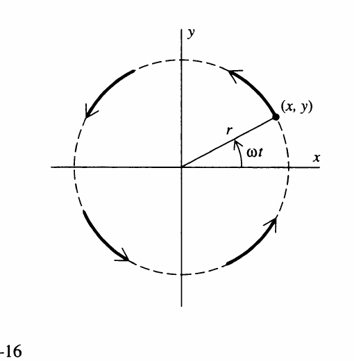

*Figure III-16*

Description: A point moving on a circle of radius $r$ is shown at polar angle $\omega t$, while arrows around the circle indicate circular flow in the plane.

Suppose water is flowing in circular paths, something like the water draining from a bathtub. A small volume of the water at a point $(x,y)$ at time $t$ has coordinates $x=r\cos\omega t$, $y=r\sin\omega t$, where $\omega$ is the constant angular velocity of the water (Figure III-16).[^7] Thus, its velocity at $(x,y)$ is

$$
\mathbf{v} = \mathbf{i}(dx/dt) + \mathbf{j}(dy/dt) = r\omega[-\mathbf{i}\sin\omega t + \mathbf{j}\cos\omega t]
$$

$$
= \omega(-\mathbf{i}y + \mathbf{j}x).
$$

This expression gives what is called the velocity field of the water; it tells us the velocity of the water at any point $(x,y)$. Your intuition probably tells you that, because the motion is circular, this velocity must have a nonzero curl. In fact, as you can show very easily,

$$
\nabla \times \mathbf{v} = 2\mathbf{k}\omega.
$$

This result should seem quite reasonable because it says that curl of the velocity is proportional to the angular velocity of the swirling water. We see that $\nabla \times \mathbf{v}$ is a vector perpendicular to the plane of motion and in the positive $z$-direction [Figure III-17(a)]. If the water were rotating around in the other direction, the curl of $\mathbf{v}$ would then be in the negative $z$-direction [Figure III-17(b)]. Note that this is consistent with the right-hand rule (see pages 79-80). If we were to put a small paddle wheel in the water, it would commence spinning because the impinging water would exert a net torque on the paddles (Figure III-18). Furthermore, the paddle wheel would rotate with its axis pointing in the direction of the curl.

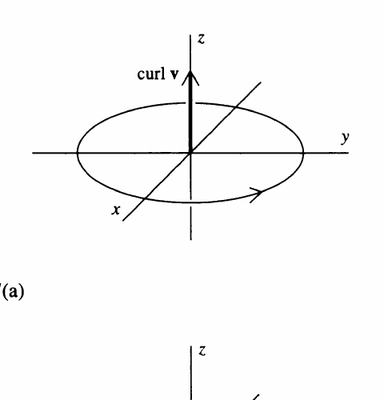

*Figure III-17(a)*

Description: A circular flow pattern in the plane is shown with the curl vector pointing upward along the positive $z$-axis for one sense of rotation.

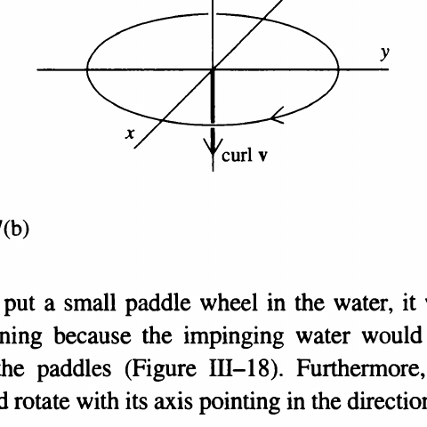

*Figure III-17(b)*

Description: The same circular flow pattern is shown with the direction of motion reversed, so the curl vector points downward along the negative $z$-axis.

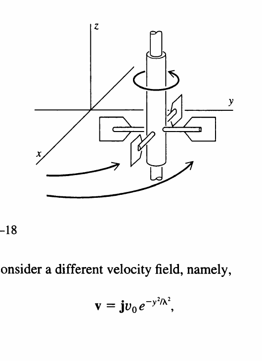

*Figure III-18*

Description: A small paddle wheel placed in a circulating flow is shown spinning about a vertical axis, illustrating how nonzero curl produces a torque on the wheel.

Now consider a different velocity field, namely,

$$
\mathbf{v} = \mathbf{j}v_0 e^{-y^2/\lambda^2},
$$

where $v_0$ and $\lambda$ are constants. Water with such a velocity field would have a flow pattern as indicated in Figure III-19. The velocity at all points is in the positive $y$-direction, and its magnitude (indicated by the length of the arrows) varies with $y$. Since you see only straight-line flow here without any rotational motion, you would probably guess that $\nabla \times \mathbf{v}=0$ in this case, and you would be right, as a simple calculation shows. There would be no net torque on a paddle wheel placed anywhere in this flow pattern, and as a consequence, it would not spin.[^8]

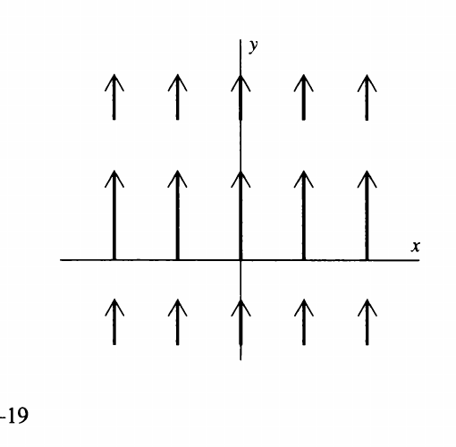

*Figure III-19*

Description: A family of vertical arrows all pointing in the positive $y$-direction is shown, with arrow length varying symmetrically with $y$ but no visible rotational pattern.

Our last example is trickier than the two given previously and shows that intuition can lead you astray if you're not careful. Let a velocity field be given by

$$
\mathbf{v} = \mathbf{j}v_0 e^{-x^2/\lambda^2}.
$$

As in the previous example, the velocity in this case is everywhere in the $y$-direction, but now it varies with $x$, not $y$ (Figure III-20). Here, as in the preceding example, you see no evidence of rotational motion and you might guess that $\nabla \times \mathbf{v}=0$ once again. But as you should show for yourself,

$$
\nabla \times \mathbf{v} = -\mathbf{k}v_0 \frac{2x}{\lambda^2} e^{-x^2/\lambda^2}.
$$

A small paddle wheel placed in this flow pattern would spin, even though the water is everywhere moving in the same direction. The reason this happens is that the velocity of the water varies with $x$, so that it strikes one of the paddles ($P$ in Figure III-21) with greater velocity than the other ($P'$). Thus, there will be a net torque. In more mathematical terms, the line integral of $\mathbf{v}\cdot\hat{\mathbf{t}}$ around a small rectangle (Figure III-22) will be different from zero, for while

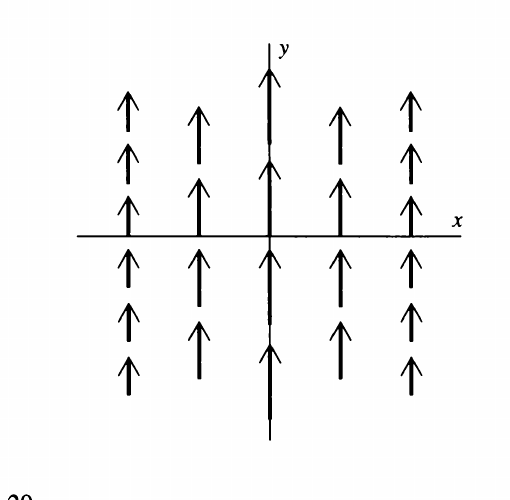

*Figure III-20*

Description: A family of vertical arrows all pointing upward is shown with their lengths varying from left to right with $x$, illustrating shear without obvious circular streamlines.

$$
\int_{\text{bottom}} \mathbf{v}\cdot\hat{\mathbf{t}} \, ds = \int_{\text{top}} \mathbf{v}\cdot\hat{\mathbf{t}} \, ds = 0,
$$

the contributions from the other two sides are

$$
\int_{\text{right}} \mathbf{v}\cdot\hat{\mathbf{t}} \, ds \approx v_y(x+\Delta x)\Delta y
$$

and

$$
\int_{\text{left}} \mathbf{v}\cdot\hat{\mathbf{t}} \, ds \approx -v_y(x)\Delta y.
$$

These do not cancel because $v_y(x) \ne v_y(x+\Delta x)$. Incidentally, you should try to explain to your own satisfaction why in this example $\nabla\times\mathbf{v}$ is in the negative (positive) $z$-direction when $x$ is positive (negative) and why $\nabla\times\mathbf{v}=0$ at $x=0$.

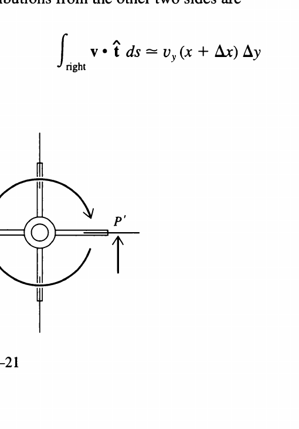

*Figure III-21*

Description: A paddle wheel in a nonuniform upward flow is shown, with the two opposite paddles $P$ and $P'$ receiving different fluid speeds and therefore a net torque.

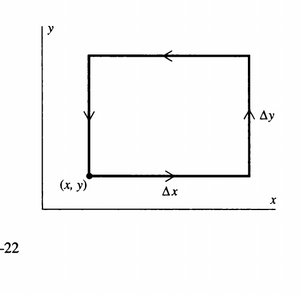

*Figure III-22*

Description: A small rectangular contour in the plane is shown with the circulation direction indicated, illustrating the unequal left and right contributions in the shear-flow example.

## Differential Form of the Circulation Law

The curl is defined to be the limit of circulation to area. Thus,

$$
\hat{\mathbf{n}}\cdot\nabla \times \mathbf{E} = \lim_{\Delta S \to 0} \frac{1}{\Delta S} \oint_C \mathbf{E}\cdot\hat{\mathbf{t}} \, ds,
$$

where $\hat{\mathbf{n}}$ is a unit vector normal to the surface enclosed by $C$ at the point about which the curve shrinks to zero. But if $\mathbf{E}$ is an electrostatic field, then

$$
\oint_C \mathbf{E}\cdot\hat{\mathbf{t}} \, ds = 0
$$

for any path $C$. It follows that

$$
\hat{\mathbf{n}}\cdot\nabla \times \mathbf{E} = 0.
$$

Since the curve $C$ is arbitrary, we can arrange matters so that $\hat{\mathbf{n}}$ is a unit vector pointing in any direction we choose. Thus,

$$
	ext{taking } \hat{\mathbf{n}}=\mathbf{i}, \text{ we have } (\nabla\times\mathbf{E})_x = 0;
$$

$$
	ext{taking } \hat{\mathbf{n}}=\mathbf{j}, \text{ we have } (\nabla\times\mathbf{E})_y = 0;
$$

$$
	ext{taking } \hat{\mathbf{n}}=\mathbf{k}, \text{ we have } (\nabla\times\mathbf{E})_z = 0.
$$

Thus, all three Cartesian components of $\nabla\times\mathbf{E}$ vanish, and we can conclude that for an electrostatic field,

$$
\nabla \times \mathbf{E} = 0.
$$

This is the long-sought-after differential form of the circulation law. We are now in a position to give an alternative and much more tractable answer to the question "Can a given vector function $\mathbf{F}(x, y, z)$ be an electrostatic field?" The answer is

$$
	ext{If } \nabla \times \mathbf{F} = 0, \text{ then } \mathbf{F} \text{ can be an electrostatic field, and}
$$

$$
	ext{if } \nabla \times \mathbf{F} \ne 0, \text{ then } \mathbf{F} \text{ cannot be an electrostatic field.}
$$

This is clearly a much more convenient criterion to apply than our earlier one (page 77), which required us to determine the line integral of $\mathbf{F}$ over all closed paths. To see how it works, let us do several examples.

Example 1. Could $\mathbf{F}=K(\mathbf{i}y+\mathbf{j}x)$ be an electrostatic field? ($K$ is a constant.) Here we have

$$
\frac{1}{K}\nabla \times \mathbf{F}
$$

$$
= \mathbf{i}\left(\frac{\partial}{\partial y}0 - \frac{\partial x}{\partial z}\right) + \mathbf{j}\left(\frac{\partial y}{\partial z} - \frac{\partial}{\partial x}0\right) + \mathbf{k}\left(\frac{\partial x}{\partial x} - \frac{\partial y}{\partial y}\right)
$$

$$
= 0 \Rightarrow \nabla \times \mathbf{F}=0.
$$

Answer: Yes.

Example 2. Could $\mathbf{F}=K(\mathbf{i}y-\mathbf{j}x)$ be an electrostatic field? In this case

$$
\frac{1}{K}\nabla \times \mathbf{F} = \mathbf{k}\left(-\frac{\partial x}{\partial x} - \frac{\partial y}{\partial y}\right) = -2\mathbf{k} \Rightarrow \nabla \times \mathbf{F} = -2\mathbf{k}K.
$$

Answer: No.

## Stokes' Theorem

For the remainder of this chapter we digress from our presentation to discuss another famous theorem, one strongly reminiscent of the divergence theorem and yet, as we'll see, quite different from it. This theorem, named for the mathematician Stokes, relates a line integral around a closed path to a surface integral over what is called a capping surface of the path.

Suppose we have a closed curve $C$, as shown in Figure III-23(a), and imagine that it is made of wire.

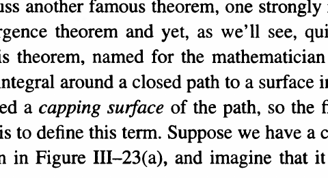

*Figure III-23(a)*

Description: A smooth closed wire loop with an irregular rounded shape is shown by itself in space, representing the boundary curve $C$ before any spanning surface is attached.

Now let us suppose we attach an elastic membrane to the wire as indicated in Figure III-23(b). This membrane is a capping surface of the curve $C$. Any other surface which can be formed by stretching the membrane is also a capping surface; an example is shown in Figure III-23(c).

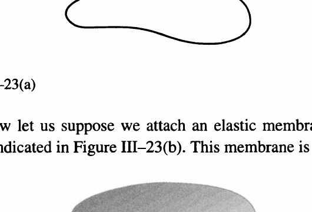

*Figure III-23(b)*

Description: The same irregular boundary curve is shown spanned by a relatively flat membrane, illustrating one possible capping surface attached to the loop.

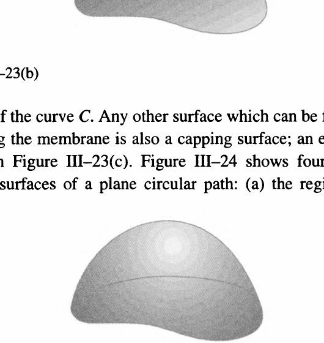

*Figure III-23(c)*

Description: The same closed boundary is shown supporting a bulging stretched membrane, emphasizing that different surfaces can cap the same curve $C$.

Figure III-24 shows four different capping surfaces of a plane circular path: (a) the region of the plane enclosed by the circle, (b) a hemisphere with the circle as its rim, (c) the curved surface of a dunce cap (a right circular cone), and (d) the upper and lateral surfaces of a tuna fish can.

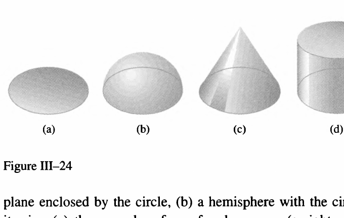

*Figure III-24*

Description: Four distinct surfaces sharing the same circular rim are displayed side by side: a flat disk, a hemisphere, a cone, and the top-plus-side surface of a cylinder.

With these preliminary remarks in mind, we begin this discussion of Stokes' theorem by considering some closed curve $C$ and a capping surface $S$ [Figure III-25(a)]. As we have done before, we approximate this capping surface by a polyhedron of $N$ faces, each of which is tangent to $S$ at some point [Figure III-25(b)]. Note that this will automatically create a polygon [marked $P$ in Figure III-25(b)] that is an approximation to the curve $C$.

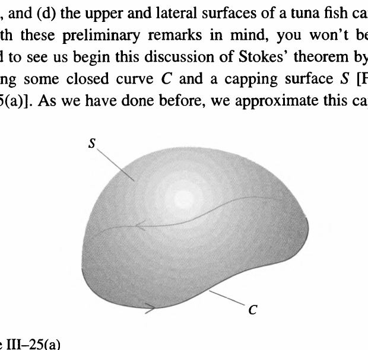

*Figure III-25(a)*

Description: A smooth curved capping surface $S$ spans a closed irregular boundary curve $C$, with both the surface label and boundary label marked directly on the drawing.

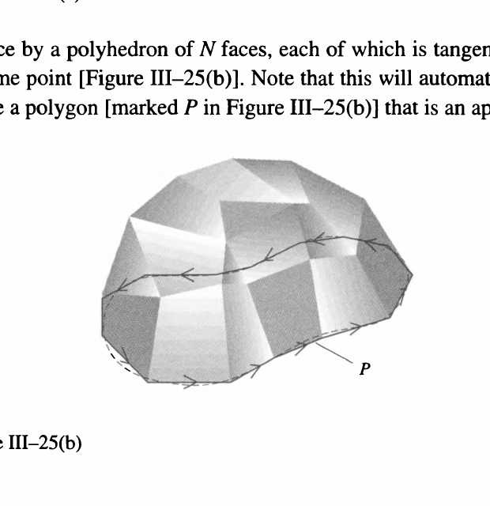

*Figure III-25(b)*

Description: The smooth surface has been replaced by a many-sided faceted polyhedron whose outer boundary is a polygon $P$ approximating the original curve $C$.

Let $\mathbf{F}(x,y,z)$ be a well-behaved vector function defined throughout the region of space occupied by the curve $C$ and its capping surface $S$. Let us form the circulation of $\mathbf{F}$ around $C_l$, the boundary of the $l$th face of the polyhedron:

$$
\oint_{C_l} \mathbf{F}\cdot\hat{\mathbf{t}}\,ds.
$$

If we do this for each of the faces of the polyhedron and then add together all the circulations, this sum is equal to the circulation of $\mathbf{F}$ around the polygon $P$:

$$
\sum_{l=1}^N \oint_{C_l} \mathbf{F}\cdot\hat{\mathbf{t}}\,ds = \oint_P \mathbf{F}\cdot\hat{\mathbf{t}}\,ds.
$$

This is easy to prove. Consider two adjacent faces as shown in Figure III-26. The circulation about the face on the left [Figure III-26(a)] includes a term from the segment $AB$, which is $\int_A^B \mathbf{F}\cdot\hat{\mathbf{t}}\,ds$. But the segment $AB$ is common to both faces, and its contribution to the circulation around the right-hand face [Figure III-26(b)] is

$$
\int_B^A \mathbf{F}\cdot\hat{\mathbf{t}}\,ds = -\int_A^B \mathbf{F}\cdot\hat{\mathbf{t}}\,ds.
$$

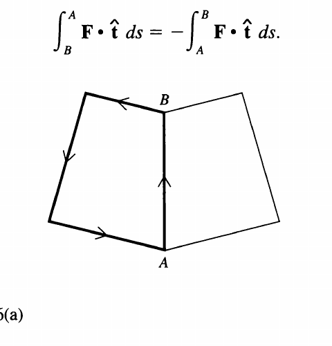

*Figure III-26(a)*

Description: Two adjacent polygonal faces share the edge $AB$; the left face is oriented so its boundary arrows traverse the common edge upward from $A$ to $B$.

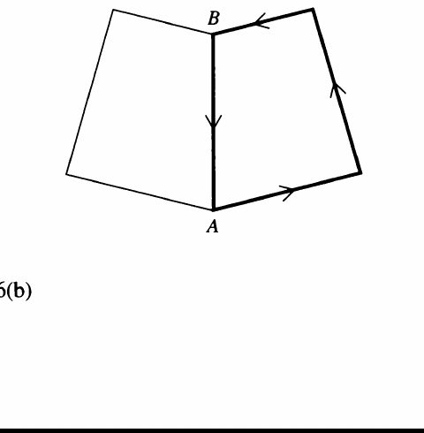

*Figure III-26(b)*

Description: The adjacent right-hand polygonal face is oriented so its boundary arrows traverse the same common edge downward from $B$ to $A$, showing why the shared contribution cancels.

We see that we traverse the common segment $AB$ one way as part of the boundary of the left-hand face, and the other way as part of the boundary of the right-hand face. Thus, when we add the circulations of $\mathbf{F}$ over the two faces, the segment $AB$ contributes

$$
\int_A^B \mathbf{F}\cdot\hat{\mathbf{t}}\,ds + \int_B^A \mathbf{F}\cdot\hat{\mathbf{t}}\,ds = 0.
$$

It is clear that any segment common to two adjacent faces contributes nothing to the sum because such segments always give rise to pairs of canceling terms. But all segments are common to pairs of adjacent faces except those that, taken together, constitute the polygon $P$.

Now we go through an analysis very similar to that which yielded the divergence theorem. We write

$$
\oint_P \mathbf{F}\cdot\hat{\mathbf{t}}\,ds = \sum_{l=1}^N \oint_{C_l} \mathbf{F}\cdot\hat{\mathbf{t}}\,ds = \sum_{l=1}^N \left[\frac{1}{\Delta S_l}\oint_{C_l} \mathbf{F}\cdot\hat{\mathbf{t}}\,ds\right] \Delta S_l,
$$

where $\Delta S_l$ is the area of the $l$th face. The quantity in square brackets is, approximately, equal to $\hat{\mathbf{n}}_l\cdot(\nabla\times\mathbf{F})_l$, where $\hat{\mathbf{n}}_l$ is the unit positive normal on the $l$th face and $(\nabla\times\mathbf{F})_l$ is the curl of the vector function $\mathbf{F}$ evaluated at the point on the $l$th face at which it is tangent to $S$. Ignoring the lack of rigor, we write

$$
\lim_{N\to\infty\atop \text{each }\Delta S_l\to 0} \sum_{l=1}^N \left[\frac{1}{\Delta S_l}\oint_{C_l} \mathbf{F}\cdot\hat{\mathbf{t}}\,ds\right]\Delta S_l
= \lim_{N\to\infty\atop \text{each }\Delta S_l\to 0} \sum_{l=1}^N \hat{\mathbf{n}}_l\cdot(\nabla\times\mathbf{F})_l\,\Delta S_l
= \iint_S \hat{\mathbf{n}}\cdot\nabla\times\mathbf{F}\,dS.
$$

Since the curve $C$ is the limiting shape of the polygon $P$, we also have

$$
\lim_{N\to\infty\atop \text{each }\Delta S_l\to 0} \oint_P \mathbf{F}\cdot\hat{\mathbf{t}}\,ds = \oint_C \mathbf{F}\cdot\hat{\mathbf{t}}\,ds.
$$

Combining these results, we arrive, finally, at Stokes' theorem:

$$
\oint_C \mathbf{F}\cdot\hat{\mathbf{t}}\,ds = \iint_S \hat{\mathbf{n}}\cdot\nabla\times\mathbf{F}\,dS,
$$

where $S$ is any surface capping the curve $C$. Thus, in words, Stokes' theorem says that the line integral of the tangential component of a vector function over some closed path equals the surface integral of the normal component of the curl of that function integrated over any capping surface of the path.

Let us work an example. Take $\mathbf{F}(x,y,z)=\mathbf{i}z+\mathbf{j}x-\mathbf{k}x$, with $C$ the circle of radius $1$ centered at the origin and lying in the $xy$-plane, and $S$ the part of the $xy$-plane enclosed by the circle [see Figure III-27(a)]. Now

$$
\mathbf{F}\cdot\hat{\mathbf{t}}\,ds = z\,dx + x\,dy - x\,dz.
$$

Since $z=0$ and $dz=0$ on $C$, we have

$$
\oint_C \mathbf{F}\cdot\hat{\mathbf{t}}\,ds = \oint x\,dy.
$$

Parametrizing the curve by the angle $\theta$ shown in Figure III-27(b), with $x=\cos\theta$ and $y=\sin\theta$, we get

$$
\oint x\,dy = \int_0^{2\pi} \cos^2\theta\,d\theta = \pi.
$$

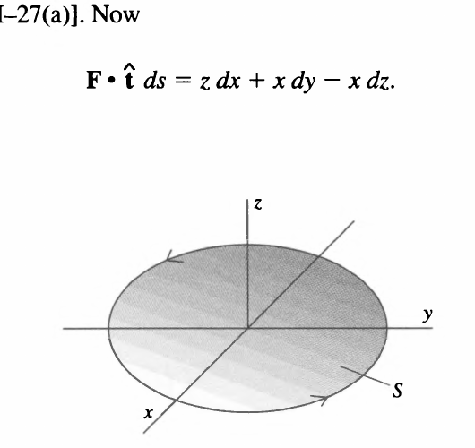

*Figure III-27(a)*

Description: A unit disk in the $xy$-plane is shaded and oriented by arrows around its circular boundary, with the capping surface labeled $S$.

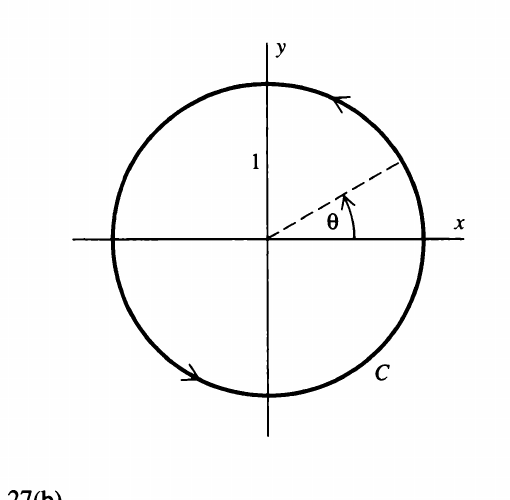

*Figure III-27(b)*

Description: The same unit circle is shown in the plane with coordinate axes, direction arrows on $C$, and the angular parameter $\theta$ measured from the positive $x$-axis.

Next we calculate

$$
\nabla\times\mathbf{F} = \begin{vmatrix}
\mathbf{i} & \mathbf{j} & \mathbf{k} \\
\partial/\partial x & \partial/\partial y & \partial/\partial z \\
z & x & -x
\end{vmatrix} = 2\mathbf{j}+\mathbf{k}.
$$

The capping surface here is a portion of the $xy$-plane, so the unit normal in the positive direction is $\hat{\mathbf{n}}=\mathbf{k}$. Thus,

$$
\hat{\mathbf{n}}\cdot\nabla\times\mathbf{F} = \mathbf{k}\cdot(2\mathbf{j}+\mathbf{k}) = 1,
$$

and

$$
\iint_S \hat{\mathbf{n}}\cdot\nabla\times\mathbf{F}\,dS = \iint_S dS = \pi,
$$

where the last equality follows from the fact that the surface integral in this case is merely the area of the unit circle.

Let us redo this calculation, this time choosing the hemisphere shown in Figure III-27(c) as our capping surface $S$. Using the same theorem, we get

$$
\iint_S \hat{\mathbf{n}}\cdot\nabla\times\mathbf{F}\,dS
= \iint_R \left[-2\left(-\frac{y}{z}\right)+1\right] dx\,dy
= 2\iint_R \frac{y}{z}\,dx\,dy + \iint_R dx\,dy,
$$

where $R$ is the unit circle in the $xy$-plane shown in Figure III-27(a). The second integral is just the area of that circle, and so its value is $\pi$. The first integral can be handled by introducing polar coordinates:

$$
2\iint_R \frac{y}{z}\,dx\,dy
= 2\int_0^{2\pi}\int_0^1 \frac{r\sin\theta}{\sqrt{1-r^2}} \, r\,dr\,d\theta.
$$

It is easy to show that the integral over $\theta$ is zero. Hence

$$
\iint_S \hat{\mathbf{n}}\cdot\nabla\times\mathbf{F}\,dS = \pi,
$$

consistent with our earlier result.

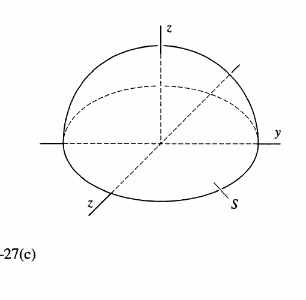

*Figure III-27(c)*

Description: A hemispherical capping surface over the unit circle is shown in perspective, demonstrating a second surface spanning the same boundary curve as in Figure III-27(a).

## An Application of Stokes' Theorem

An important application of Stokes' theorem is provided by Ampere's circuital law. Consider any closed loop $C$ enclosing a current $I$ as in Figure III-28. Note that the direction of $C$ and that of $I$ correspond to the same right-hand rule that relates the directions of $C$ and the positive normal to a surface capping $C$. Ampere's circuital law says that the line integral of the magnetic field $\mathbf{B}$ is related to the current thus:

$$
\oint_C \mathbf{B}\cdot\hat{\mathbf{t}}\,ds = \mu_0 I,
$$

where the constant $\mu_0$, called the permeability of free space, has the value $1.257\times 10^{-6}$ newtons per ampere$^2$.

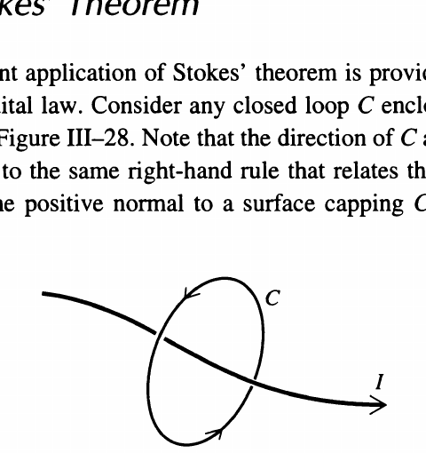

*Figure III-28*

Description: A closed loop $C$ encircles a straight current $I$, with both directions drawn so they satisfy the same right-hand rule relating current direction and boundary orientation.

To express the law in differential form, we first introduce the current density $\mathbf{J}$. Thus, if current is flowing through an area $\Delta S$ with normal $\hat{\mathbf{n}}$ (Figure III-29), the current density $\mathbf{J}$ is such that

$$
\Delta I = \mathbf{J}\cdot\hat{\mathbf{n}}\,\Delta S,
$$

where $\Delta I$ is the total current. That is, current density is a vector function whose magnitude is the current per unit area and whose direction is that of the current flow. If $\mathbf{J}(x,y,z)$ is the current density, then the total current flowing through a surface $S$ is

$$
\iint_S \mathbf{J}\cdot\hat{\mathbf{n}}\,dS.
$$

Thus, Ampere's law can be written

$$
\oint_C \mathbf{B}\cdot\hat{\mathbf{t}}\,ds = \mu_0 \iint_S \mathbf{J}\cdot\hat{\mathbf{n}}\,dS.
$$

$S$ can be any surface capping the curve $C$. If, as is usually the case, the current flows through a wire the cross section of which does not include the entire capping surface, it does not matter; we can integrate over more than the wire cross section if we remember that $\mathbf{J}\ne 0$ for that part of the surface $S$ cut by the wire and $\mathbf{J}=0$ for the rest (Figure III-30). Thus,

$$
\iint_{\text{cross section of wire}} \mathbf{J}\cdot\hat{\mathbf{n}}\,dS = \iint_{\text{entire capping surface }S} \mathbf{J}\cdot\hat{\mathbf{n}}\,dS.
$$

Now using Stokes' theorem, we have

$$
\oint_C \mathbf{B}\cdot\hat{\mathbf{t}}\,ds = \iint_S \hat{\mathbf{n}}\cdot\nabla\times\mathbf{B}\,dS = \mu_0 \iint_S \hat{\mathbf{n}}\cdot\mathbf{J}\,dS.
$$

Since $C$ and $S$ are arbitrary, we conclude that

$$
\nabla\times\mathbf{B} = \mu_0\mathbf{J}.
$$

This is the differential form of Ampere's law. It is also a special case of one of Maxwell's equations, valid when the fields do not vary with time.

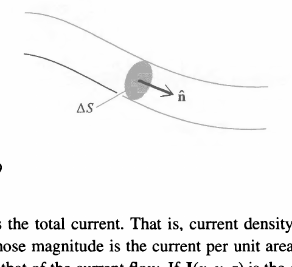

*Figure III-29*

Description: A thin current-carrying tube is cut by a small transverse area element $\Delta S$ whose normal $\hat{\mathbf{n}}$ is drawn, illustrating the local definition of current density.

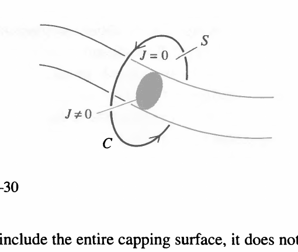

*Figure III-30*

Description: A current-carrying wire pierces a larger capping surface $S$ bounded by a loop $C$; the figure marks the portion where $\mathbf{J}\ne 0$ and the rest where $\mathbf{J}=0$.

## Stokes' Theorem and Simply Connected Regions

For many purposes, including some important applications, we must be able to assert that Stokes' theorem holds throughout some region $D$ in three-dimensional space. By this we mean that we want the theorem to hold for any closed curve $C$ lying entirely in $D$ and any capping surface of $C$ also lying entirely in $D$. This, of course, means the function $\mathbf{F}$ must be continuous and differentiable and have continuous first derivatives in $D$. But in addition we must impose a restriction on the region $D$ itself.

Suppose first that $D$ is the interior of a sphere. If $\mathbf{F}$ is smooth[^9] everywhere in $D$, then Stokes' theorem holds for any closed curve $C$ lying entirely in $D$, and any capping surface of $C$ also lying entirely in $D$. The same line of reasoning applies to the region between two concentric spheres, provided $\mathbf{F}$ is smooth in that region. But for certain kinds of regions, troubles can arise. As an example, suppose $D$ is the interior of a torus (roughly like a bagel or an inflated inner tube; see Figure III-31). The problem in this case is that it's possible to construct a closed curve in $D$ like the one shown in the figure with the property that none of its capping surfaces lies entirely in $D$.

Although we insist that $\mathbf{F}$ be smooth in $D$, no conditions are imposed upon it elsewhere, so that outside the region it may not fulfill the requirements of smoothness that ensure the validity of Stokes' theorem. The relation between the line integral over $C$ and the surface integral over $S$ asserted by the theorem can, and in many cases does, break down if $\mathbf{F}$ is not smooth on $S$.

Mathematicians refer to regions such as the interior of a sphere or the space between two concentric spheres as simply connected, whereas the interior of a torus is not simply connected. By definition, a region $D$ is simply connected if any closed curve lying entirely in $D$ can shrink down to a point without leaving $D$.

With the concept of simple connectedness available to us, we can easily specify the conditions under which Stokes' theorem holds throughout a region: the vector function $\mathbf{F}$ must be smooth everywhere in a simply connected region $D$. Then Stokes' theorem is valid for any closed curve $C$ and any capping surface $S$ of $C$, both of which lie entirely in $D$.

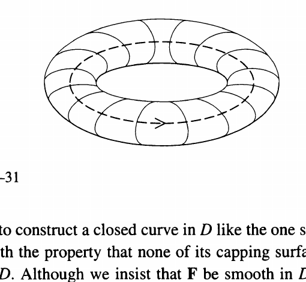

*Figure III-31*

Description: A torus is drawn with a closed dashed path running through its interior hole, illustrating a loop that lies in the region but cannot be capped by a surface remaining entirely inside the torus.

## Path Independence and the Curl

In our discussion of the differential form of the circulation law, we showed that because the line integral of an electrostatic field $\mathbf{E}$ is zero over any closed path, the curl of $\mathbf{E}$ is zero. The same is true of any vector function $\mathbf{F}$; that is, if

$$
\oint_C \mathbf{F}\cdot\hat{\mathbf{t}}\,ds = 0
$$

for all closed paths $C$, then

$$
\nabla\times\mathbf{F} = 0.
$$

The proof of this fact is precisely the same as the one given on pages 90-91 with $\mathbf{E}$ replaced everywhere by $\mathbf{F}$.

Is the converse of this statement also true? That is, if $\nabla\times\mathbf{F}=0$, does this imply that the circulation of $\mathbf{F}$ is zero over all closed paths? At first glance it might appear that the answer to this question is yes. All we have to do is use Stokes' theorem and observe that since by assumption $\nabla\times\mathbf{F}=0$,

$$
\oint_C \mathbf{F}\cdot\hat{\mathbf{t}}\,ds = \iint_S \hat{\mathbf{n}}\cdot\nabla\times\mathbf{F}\,dS = 0.
$$

However, there is a flaw in this line of reasoning. Recall that the validity of Stokes' theorem requires that $\mathbf{F}$ be smooth in a simply connected region. If the region is not simply connected, Stokes' theorem may not hold, at least for some closed paths lying in the region, and the fact that $\nabla\times\mathbf{F}=0$ does not guarantee that the circulation of $\mathbf{F}$ is zero over all closed paths. The closest we can come to a converse is to say that if $\nabla\times\mathbf{F}=0$ everywhere in a simply connected region, then the circulation of $\mathbf{F}$ is zero for all closed paths in that region. The two statements "circulation equals zero" and "curl equals zero" are equivalent only in a simply connected region.

There is a slightly different, but often useful, way to state this connection between circulation and curl; namely, if $\int_C \mathbf{F}\cdot\hat{\mathbf{t}}\,ds$ is independent of path, then $\nabla\times\mathbf{F}=0$, and if $\nabla\times\mathbf{F}=0$ in a simply connected region, then $\int_C \mathbf{F}\cdot\hat{\mathbf{t}}\,ds$ is independent of path.

## Problems

### III-1

Use an argument like the one given in the text for the Coulomb force (pages 71-73) to show that $\int_C \mathbf{F}\cdot\hat{\mathbf{t}}\,ds$ is independent of path for any central force $\mathbf{F}$.

### III-2

In the text we obtained the result

$$
(\nabla\times\mathbf{F})_z = \frac{\partial F_y}{\partial x} - \frac{\partial F_x}{\partial y}
$$

by integrating over a small rectangular path. As an example of the fact that this result is independent of the path, rederive it, using the triangular path shown in the figure.

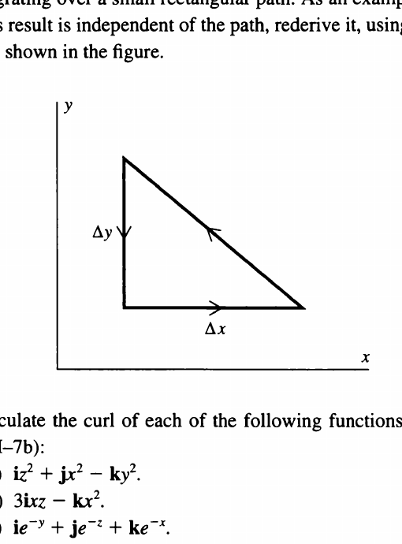

*Problem III-2 Figure*

Description: A right triangle in the $xy$-plane is oriented by arrows along its three sides, with side increments $\Delta x$ and $\Delta y$ marked to support the alternate derivation of $(\nabla\times\mathbf{F})_z$.

### III-3

Calculate the curl of each of the following functions using Equation (III-7b):

1. $\mathbf{i}z^2 + \mathbf{j}x^2 - \mathbf{k}y^2$.
2. $3\mathbf{i}xz - \mathbf{k}x^2$.
3. $\mathbf{i}e^{-y} + \mathbf{j}e^{-z} + \mathbf{k}e^{-x}$.
4. $\mathbf{i}yz + \mathbf{j}xz + \mathbf{k}xy$.
5. $-\mathbf{i}yz + \mathbf{j}xz$.
6. $\mathbf{i}x + \mathbf{j}y + \mathbf{k}(x^2+y^2)$.
7. $\mathbf{i}xy + \mathbf{j}y^2 + \mathbf{k}yz$.
8. $(\mathbf{i}x + \mathbf{j}y + \mathbf{k}z)/(x^2+y^2+z^2)^{3/2}$, $(x,y,z)\ne(0,0,0)$.

### III-4

1. Calculate $\oint \mathbf{F}\cdot\hat{\mathbf{t}}\,ds$ for the function in Problem III-3(a) over a square path of side $s$ centered at $(x_0,y_0,0)$, lying in the $xy$-plane, and oriented so that each side is parallel to the $x$- or $y$-axis.
2. Divide the result of part (a) by the area of the square and take the limit of the quotient as $s\to0$. Compare your result with the $z$-component of the curl found in Problem III-3(a).
3. Repeat parts (a) and (b) for the functions in Problem III-3(b), (c), and (d). (You may find it interesting to try paths of different orientations and/or shapes.)

### III-5

1. Calculate $\oint \mathbf{F}\cdot\hat{\mathbf{t}}\,ds$ where

$$
\mathbf{F}=\mathbf{k}(y+y^2)
$$

over the perimeter of the triangle shown in the figure (integrate in the direction indicated by the arrows).
2. Divide the result of part (a) by the area of the triangle and take the limit as $a\to0$.
3. Show that the result of part (b) is $\hat{\mathbf{n}}\cdot\nabla\times\mathbf{F}$ evaluated at $(0,0,0)$ where $\hat{\mathbf{n}}$ is the unit vector normal to the triangle and directed away from the origin.

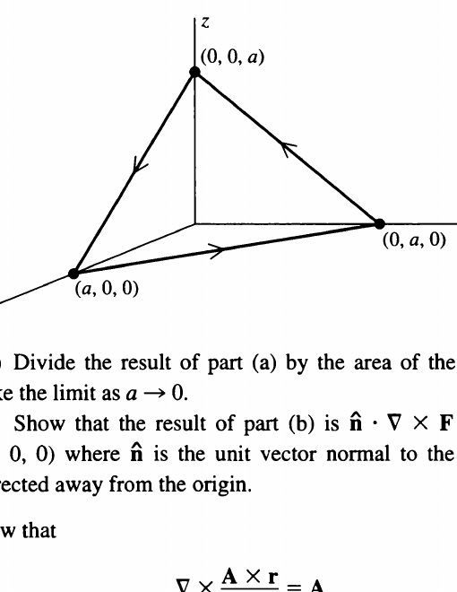

*Problem III-5 Figure*

Description: A triangular loop joining the points $(a,0,0)$, $(0,a,0)$, and $(0,0,a)$ is drawn in three dimensions with directed arrows around its perimeter.

### III-6

Show that

$$
\nabla\times\frac{\mathbf{A}\times\mathbf{r}}{2} = \mathbf{A},
$$

where $\mathbf{r}=\mathbf{i}x+\mathbf{j}y+\mathbf{k}z$ and $\mathbf{A}$ is a constant vector.

### III-7

Show that $\nabla\cdot(\nabla\times\mathbf{F})=0$. (Assume that mixed second partial derivatives are independent of the order of differentiation. For example, $\partial^2 F_z/\partial x\,\partial z = \partial^2 F_z/\partial z\,\partial x$.)

### III-8

In the text (pages 82-86) we obtained the $z$-component of $\nabla\times\mathbf{F}$ in cylindrical coordinates. Proceeding the same way, obtain the $\theta$- and $r$-components given on page 86.

### III-9

Following the procedure suggested in the text (pages 82-86), obtain the expression for $\nabla\times\mathbf{F}$ in spherical coordinates given on page 86. The figures given on page 106 will be helpful.

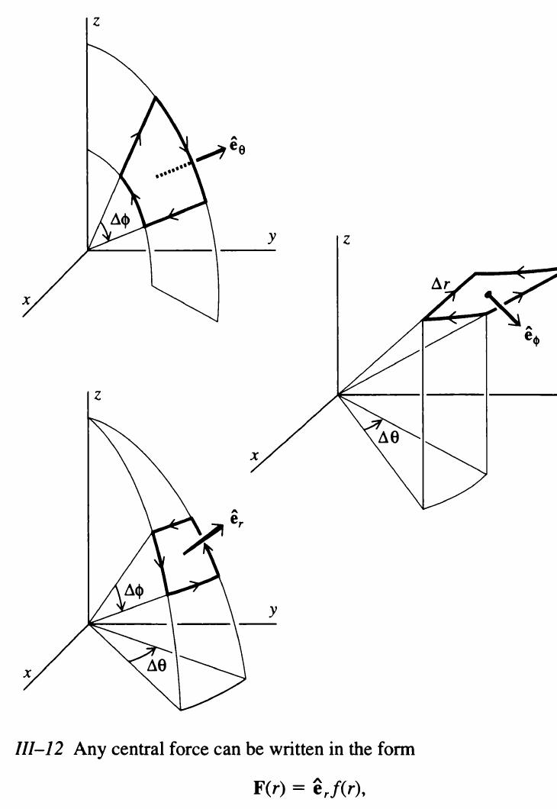

*Problem III-9 Figure*

Description: Three small spherical-coordinate surface elements are shown with the directions of $\hat{\mathbf{e}}_\theta$, $\hat{\mathbf{e}}_\phi$, and $\hat{\mathbf{e}}_r$ indicated, together with the small angle and radial increments used in the derivation of the curl formula.

### III-10

1. Rewrite the function in Problem III-3(e) in cylindrical coordinates and compute its curl using the expression given on page 86. Convert your result back to Cartesian coordinates and compare with the answer obtained in Problem II-16.
2. Repeat the above calculation for the function of Problem III-3(f).

### III-11

1. Rewrite the function in Problem III-3(g) in spherical coordinates and compute its curl using the expression given on page 86. Convert your result back to Cartesian coordinates and compare with the answer obtained in Problem II-17.
2. Repeat the above calculation for the function of Problem III-3(h).

### III-12

Any central force can be written in the form

$$
\mathbf{F}(r)=\hat{\mathbf{e}}_r f(r),
$$

where $\hat{\mathbf{e}}_r$ is a unit vector in the radial direction and $f$ is a scalar function. Show by direct calculation of the curl that this function is irrotational (that is, $\nabla\times\mathbf{F}=0$).

### III-13

Which of the functions in Problem III-3 could be electrostatic fields?

### III-14

Use Stokes' theorem to show that

$$
\oint_C \hat{\mathbf{t}}\,ds = 0,
$$

where $C$ is a closed curve and $\hat{\mathbf{t}}$ is a unit vector tangent to the curve $C$.

### III-15

Verify Stokes' theorem

$$
\oint_C \mathbf{F}\cdot\hat{\mathbf{t}}\,ds = \iint_S \hat{\mathbf{n}}\cdot\nabla\times\mathbf{F}\,dS
$$

in each of the following cases.

1. $\mathbf{F}=\mathbf{i}z^2-\mathbf{j}y^2$.

$C$, the square of side $1$ lying in the $xz$-plane and directed as shown.

$S$, the five squares $S_1$, $S_2$, $S_3$, $S_4$, and $S_5$ as shown in the figure.

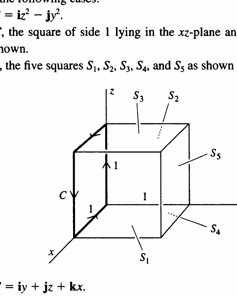

*Problem III-15(a) Figure*

Description: A unit cube missing one face is labeled with five square surfaces $S_1$ through $S_5$, and the oriented boundary curve $C$ runs around the open face in the $xz$-plane.

2. $\mathbf{F}=\mathbf{i}y+\mathbf{j}z+\mathbf{k}x$.

$C$, the three quarter-circle arcs $C_1$, $C_2$, and $C_3$ directed as shown in the figure.

$S$, the octant of the sphere $x^2+y^2+z^2=1$ enclosed by the three arcs.

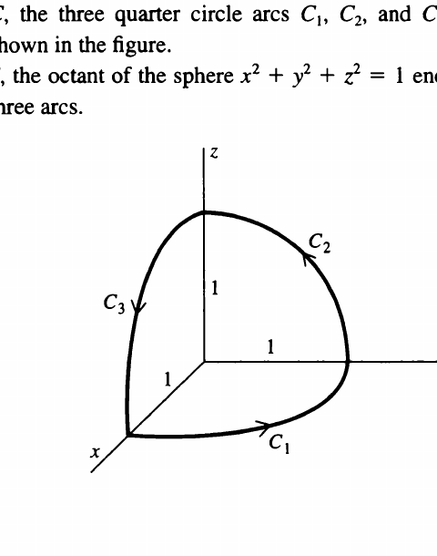

*Problem III-15(b) Figure*

Description: The first-octant spherical triangle bounded by three quarter-circle arcs $C_1$, $C_2$, and $C_3$ is drawn on the unit sphere with the coordinate axes shown.

3. $\mathbf{F}=\mathbf{i}y-\mathbf{j}x+\mathbf{k}z$.

$C$, the circle of radius $R$ lying in the $xy$-plane, centered at $(0,0,0)$ and directed as shown in the figure.

$S$, the curved and upper surfaces of the cylinder of radius $R$ and height $h$.

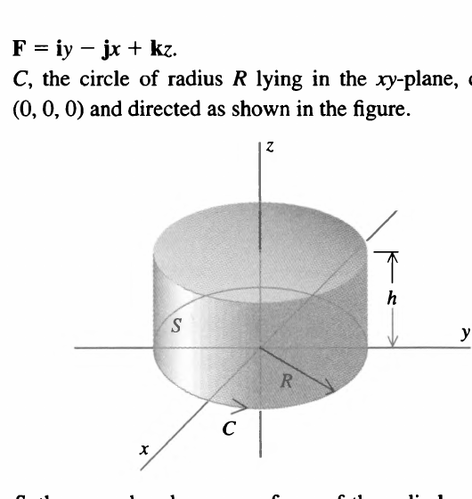

*Problem III-15(c) Figure*

Description: A vertical cylinder of radius $R$ and height $h$ is shown with its circular lower boundary labeled $C$ and the curved-plus-top surface labeled $S$.

### III-16

1. Consider a vector function with the property $\nabla\times\mathbf{F}=0$ everywhere on two closed curves $C_1$ and $C_2$ and on any capping surface $S$ of the region enclosed by them (see the figure). Show that the circulation of $\mathbf{F}$ around $C_1$ equals the circulation of $\mathbf{F}$ around $C_2$. In calculating the circulations direct the curves as indicated by the arrows in the figure.

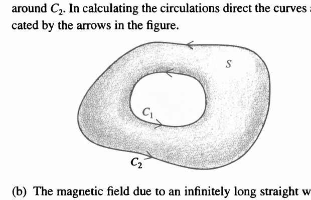

*Problem III-16(a) Figure*

Description: Two nested closed curves $C_1$ and $C_2$ bound an annular-like spanning surface $S$, with arrows indicating the related orientations of the inner and outer boundaries.

2. The magnetic field due to an infinitely long straight wire carrying a uniform current $I$ is $\mathbf{B}=(\mu_0 I/2\pi r)\hat{\mathbf{e}}_\theta$. Show that $\nabla\times\mathbf{B}=0$ everywhere except at $r=0$.

3. Prove Ampere's circuital law for the field of the wire given in part (b). [Hint: Use the result of (b) to find the circulation of $\mathbf{B}$ around a circle with the wire passing through its center and normal to its plane. Then use the result of part (a) to relate this circulation to the circulation around an arbitrary curve enclosing the current.]

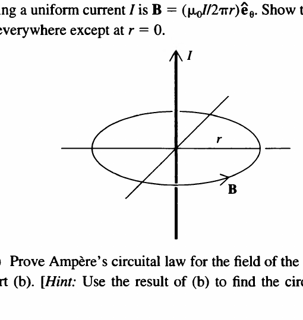

*Problem III-16(b) Figure*

Description: A straight current-carrying wire pierces the center of a horizontal circular loop, with the azimuthal magnetic field direction shown tangent to the loop.

### III-17

1. Consider the function given in cylindrical coordinates by

$$
\mathbf{F}(r,\theta,z)=\frac{\hat{\mathbf{e}}_\theta}{r}.
$$

Show that Stokes' theorem does not hold for this function if $C$ is the circle of radius $R$ in the $xy$-plane centered at the origin, and $S$ is the portion of the $xy$-plane enclosed by $C$. Why does the theorem fail in this case?

2. Consider the region $D$ that consists of all of three-dimensional space with the $z$-axis removed. Is the function $\mathbf{F}$ defined in (a) smooth in $D$? Does Stokes' theorem hold in $D$? Is $D$ a simply connected region?

### III-18

The electromotive force $\mathcal{E}$ in a circuit $C$ is equal to the circulation of the electric field $\mathbf{E}$ around the circuit:

$$
\mathcal{E}=\oint_C \mathbf{E}\cdot\hat{\mathbf{t}}\,ds.
$$

Faraday discovered that in a stationary circuit an electromotive force is induced by a changing magnetic flux. That is,

$$
\mathcal{E}=-\frac{d\Phi}{dt},
$$

where

$$
\Phi=\iint_S \mathbf{B}\cdot\hat{\mathbf{n}}\,dS,
$$

$t$ is time (don't confuse it with the tangent vector $\hat{\mathbf{t}}$), and $S$ is any capping surface of $C$. Use this information and Stokes' theorem to derive the equation

$$
\nabla\times\mathbf{E}=-\frac{\partial\mathbf{B}}{\partial t},
$$

which is one of Maxwell's equations.

### III-19

Determine the value of the line integral $\int_C \mathbf{F}\cdot\hat{\mathbf{t}}\,ds$, where

$$
\mathbf{F}=(e^{-y}-ze^{-x})\mathbf{i} + (e^{-z}-xe^{-y})\mathbf{j} + (e^{-x}-ye^{-z})\mathbf{k}
$$

and $C$ is the path

$$
x = \frac{1}{\ln 2}\ln(1+p), \qquad y = \sin\frac{\pi p}{2}, \qquad z = \frac{1-e^p}{1-e}, \qquad 0\le p\le 1
$$

from $(0,0,0)$ to $(1,1,1)$. [Suggestion: Think before you write!]

### III-20

Maxwell's equations are

$$
\nabla\cdot\mathbf{E}=\rho/\epsilon_0, \qquad \nabla\cdot\mathbf{B}=0,
$$

$$
\nabla\times\mathbf{E}=-\frac{\partial\mathbf{B}}{\partial t}, \qquad \nabla\times\mathbf{B}=\epsilon_0\mu_0\frac{\partial\mathbf{E}}{\partial t}+\mu_0\mathbf{J},
$$

where $\mathbf{E}$ is the electric field, $\mathbf{B}$ the magnetic field, $\rho$ the charge density, and $\mathbf{J}$ the current density. Use Maxwell's equations to derive the continuity equation

$$
\nabla\cdot\mathbf{J}+\frac{\partial\rho}{\partial t}=0.
$$

Interpret this equation.

### III-21

The electromagnetic field stores energy, and it is possible to show that in a volume $V$ the amount of electromagnetic energy is

$$
\iiint_V \rho_E\,dV,
$$

where the energy density

$$
\rho_E = \frac{1}{2}(\epsilon_0\mathbf{E}\cdot\mathbf{E}+\mathbf{B}\cdot\mathbf{B}/\mu_0)=\frac{1}{2}(\epsilon_0 E^2+B^2/\mu_0).
$$

Use Maxwell's equations (see Problem III-20) to show that

$$
\frac{\partial\rho_E}{\partial t}+\nabla\cdot\left(\frac{\mathbf{E}\times\mathbf{B}}{\mu_0}\right)=-\mathbf{J}\cdot\mathbf{E}.
$$

Interpret this equation.

### III-22

1. Apply the divergence theorem to the function

$$
\mathbf{G}(x,y)=\mathbf{i}G_x(x,y)+\mathbf{j}G_y(x,y),
$$

using for $V$ and $S$ the volume and surface shown in the diagram; its bottom is a region $R$ of the $xy$-plane, its top has the same shape as, and is parallel to, the bottom, and its side is parallel to the $z$-axis. In this way obtain the relation

$$
\oint_C G_x\,dy-G_y\,dx = \iint_R \left(\frac{\partial G_x}{\partial x}+\frac{\partial G_y}{\partial y}\right)dx\,dy,
$$

which is the divergence theorem in two dimensions.

2. Apply Stokes' theorem to the function

$$
\mathbf{F}(x,y)=\mathbf{i}F_x(x,y)+\mathbf{j}F_y(x,y)
$$

using for $C$ a closed curve lying entirely in the $xy$-plane and for $S$ the region $R$ of the $xy$-plane enclosed by $C$. In this way obtain the relation

$$
\oint_C F_x\,dx+F_y\,dy = \iint_R \left(\frac{\partial F_y}{\partial x}-\frac{\partial F_x}{\partial y}\right)dx\,dy,
$$

which is Stokes' theorem in two dimensions.

3. Show that in two dimensions the divergence theorem and Stokes' theorem are identical.

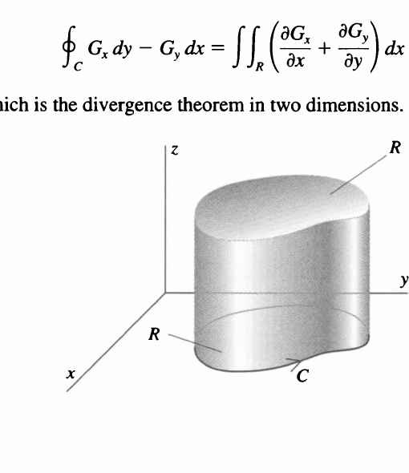

*Problem III-22 Figure*

Description: A vertical prismatic volume with an irregular planar base $R$ and matching top is shown, with the boundary curve $C$ marked along the base to illustrate the two-dimensional divergence theorem construction.

### III-23

1. Let $C$ be a closed curve lying in the $xy$-plane. What condition must the function $\mathbf{F}$ satisfy in order that

$$
\oint_C \mathbf{F}\cdot\hat{\mathbf{t}}\,ds = A,
$$

where $A$ is the area enclosed by $C$? [Hint: See Problem III-22.]
2. Give some examples of functions $\mathbf{F}$ having the property described in (a).
3. Use line integrals to find formulas for the area of:

	- a rectangle.
	- a right triangle.
	- a circle.

4. Show that the area enclosed by the plane curve $C$ is the magnitude of

$$
\frac{1}{2}\oint_C \mathbf{r}\times\hat{\mathbf{t}}\,ds,
$$

where $\mathbf{r}=\mathbf{i}x+\mathbf{j}y$.

### III-24

1. There is an important theorem in vector calculus that says $\nabla\cdot\mathbf{G}=0$ (where $\mathbf{G}$ is some differentiable vector function) implies and is implied by $\mathbf{G}=\nabla\times\mathbf{H}$ (where $\mathbf{H}$ is another differentiable function). To prove this we note first of all that $\mathbf{G}=\nabla\times\mathbf{H}$ implies that $\nabla\cdot\mathbf{G}=0$ (see Problem III-7). To show that $\nabla\cdot\mathbf{G}=0$ implies that we can write $\mathbf{G}=\nabla\times\mathbf{H}$, the simplest procedure is to give $\mathbf{H}$:

$$
H_x = 0,
$$

$$
H_y = \int_{x_0}^{x} G_z(x',y,z)\,dx',
$$

$$
H_z = -\int_{x_0}^{x} G_y(x',y,z)\,dx' + \int_{y_0}^{y} G_x(x_0,y',z)\,dy',
$$

where $x_0$ and $y_0$ are arbitrary constants. Show by direct calculation that if $\nabla\cdot\mathbf{G}=0$, then $\mathbf{G}=\nabla\times\mathbf{H}$.

2. Is the vector function $\mathbf{H}$ specified in (a) unique? That is, can we alter it in any way without invalidating the relation $\mathbf{G}=\nabla\times\mathbf{H}$?

### III-25

Determine in which of the following cases it is possible to write $\mathbf{G}=\nabla\times\mathbf{H}$. In the cases where it is possible, find $\mathbf{H}$ (see Problem III-24).

1. $\mathbf{G}=\mathbf{i}y+\mathbf{j}z+\mathbf{k}x$.
2. $\mathbf{G}=B_0\mathbf{k}$, $B_0$ a constant.
3. $\mathbf{G}=\mathbf{i}x^2-\mathbf{k}y^2$.
4. $\mathbf{G}=2\mathbf{i}x-\mathbf{j}y-\mathbf{k}z$.
5. $\mathbf{G}=2\mathbf{i}x-\mathbf{j}y+\mathbf{k}z$.

### III-26

Since the divergence of any magnetic field $\mathbf{B}$ is zero, we can write $\mathbf{B}=\nabla\times\mathbf{A}$ (see Problem III-24). Prove that the circulation of $\mathbf{A}$ around an arbitrary closed path $C$ is equal to the flux of $\mathbf{B}$ through any surface $S$ capping $C$.

### III-27

Prove the statement made in Problem III-24(a) by applying Stokes' theorem and the divergence theorem. [Hint: See the diagram below.]

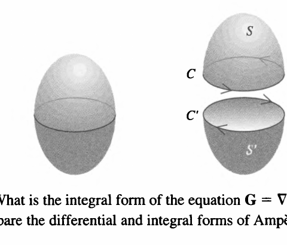

*Problem III-27 Figure*

Description: Two complementary capping surfaces sharing the same rim are shown separately, with curves labeled $C$ and $C'$ to support the proof connecting curl and divergence.

### III-28

1. What is the integral form of the equation $\mathbf{G}=\nabla\times\mathbf{H}$? [Hint: Compare the differential and integral forms of Ampere's circuital law.]
2. Verify your result in part (a) using for $\mathbf{G}$ and $\mathbf{H}$ functions selected from Problem III-25, and paths and surfaces of integration of your own choice.

### III-29

In the text we defined the curl as the limit of a certain ratio. An alternative definition is provided by the equation

$$
\nabla\times\mathbf{F} = \lim_{\Delta V\to 0} \frac{1}{\Delta V}\iint_S \hat{\mathbf{n}}\times\mathbf{F}\,dS,
$$

where $\mathbf{F}$ is a vector function of position, the integration is carried out over a closed surface $S$ which encloses the volume $\Delta V$, and $\hat{\mathbf{n}}$ is the unit vector normal to $S$ pointing outward from the enclosed volume. (This definition does not display the geometric significance of the curl as well as the one given in the text. Nonetheless, in one respect at least it may be preferable: it gives the $\nabla\times\mathbf{F}$ rather than just a component of it.)

1. Following a procedure similar to the one used in the text in treating the divergence, integrate over a "cuboid" and show that the definition given above yields Equation (III-7b).
2. Arguing as we did in the text in establishing the divergence theorem, use the above expression for the curl to derive the equation

$$
\iint_S \hat{\mathbf{n}}\times\mathbf{F}\,dS = \iiint_V \nabla\times\mathbf{F}\,dV,
$$

where $V$ is the volume enclosed by $S$.
3. Derive the equation of part (b) directly from the divergence theorem. [Hint: In the divergence theorem [Equation (II-30)] replace $\mathbf{F}$ by $\mathbf{e}\times\mathbf{F}$, where $\mathbf{e}$ is an arbitrary constant vector.]
4. Verify the equation of part (b) for $\mathbf{F}=\mathbf{i}y-\mathbf{j}z+\mathbf{k}x$ and $V$ the unit cube shown in the figure.

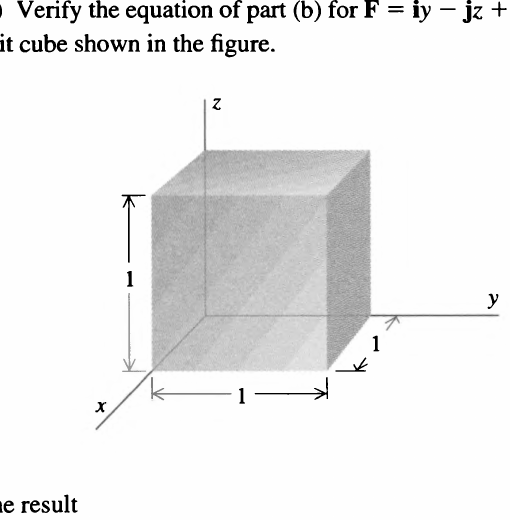

*Problem III-29 Figure*

Description: A unit cube aligned with the coordinate axes is shown with unit side lengths marked, serving as the volume $V$ for the verification of the vector surface integral identity.

### III-30

The result

$$
(\nabla\times\mathbf{F})_z = \frac{\partial F_y}{\partial x} - \frac{\partial F_x}{\partial y}
$$

has been established by calculating the circulation of $\mathbf{F}$ around a rectangle (see the text, pages 75 ff.) and around a right triangle (see Problem III-2). In this problem you will show that the result holds when the circulation is calculated around any closed curve lying in the $xy$-plane.

1. Approximate an arbitrary closed curve $C$ in the $xy$-plane by a polygon $P$ as shown in the figure. Subdivide the area enclosed by $P$ into $N$ patches of which the $l$th has area $\Delta S_l$. Convince yourself by means of a sketch that this subdivision can be made with only two kinds of patches: rectangles and right triangles.
2. Letting $C(x,y)=\partial F_y/\partial x-\partial F_x/\partial y$, use Taylor series to show that for $N$ large and each $\Delta S_l$ small,

$$
\oint_P \mathbf{F}\cdot\hat{\mathbf{t}}\,ds = \sum_{l=1}^N \oint_{C_l} \mathbf{F}\cdot\hat{\mathbf{t}}\,ds
\approx C(x_0,y_0)\,\Delta A + \left(\frac{\partial C}{\partial x}\right)_{x_0,y_0}\sum_{l=1}^N (x_l-x_0)\Delta S_l + \left(\frac{\partial C}{\partial y}\right)_{x_0,y_0}\sum_{l=1}^N (y_l-y_0)\Delta S_l + \cdots,
$$

where $C_l$ is the perimeter of the $l$th patch, $(x_0,y_0)$ is some point in the region enclosed by $P$, and $\Delta A$ is the area enclosed by $P$.
3. Show that

$$
\lim_{N\to\infty\atop \text{each }\Delta S_l\to 0} \oint_P \mathbf{F}\cdot\hat{\mathbf{t}}\,ds = \oint_C \mathbf{F}\cdot\hat{\mathbf{t}}\,ds
= \left[C(x_0,y_0)+(\bar{x}-x_0)\left(\frac{\partial C}{\partial x}\right)_{x_0,y_0} + (\bar{y}-y_0)\left(\frac{\partial C}{\partial y}\right)_{x_0,y_0}+\cdots\right]\Delta S,
$$

where $\Delta S$ is the area of the region $R$ enclosed by $C$ and $(\bar{x},\bar{y})$ are the coordinates of the centroid of the region $R$; that is,

$$
\bar{x}=\frac{1}{\Delta S}\iint_R x\,dx\,dy, \qquad \bar{y}=\frac{1}{\Delta S}\iint_R y\,dx\,dy.
$$

4. Finally, calculate

$$
(\nabla\times\mathbf{F})_z = \lim_{\Delta S\to 0} \frac{1}{\Delta S}\oint_C \mathbf{F}\cdot\hat{\mathbf{t}}\,ds
$$

about $(x_0,y_0)$.

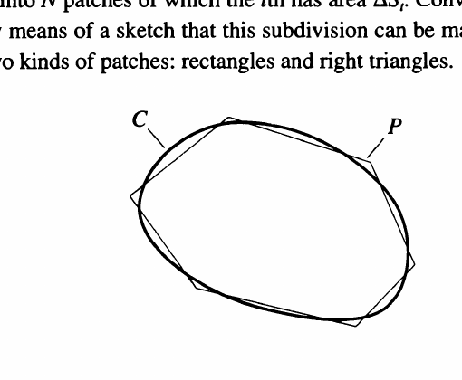

*Problem III-30 Figure*

Description: A smooth closed plane curve $C$ is approximated by an inscribed polygon $P$, illustrating the limiting argument that generalizes the rectangular and triangular circulation calculations.

[^1]: $\hat{\mathbf{t}}$ is a function of $x$, $y$, and $z$ and should really be written $\hat{\mathbf{t}}(x,y,z)$. We write simply $\hat{\mathbf{t}}$ to avoid complicating the notation.
[^2]: Our having illustrated path independence with a central force may give the erroneous impression that only central forces have path-independent line integrals. That is certainly not true; many functions which are not central forces have path-independent line integrals. Later we'll develop a simple criterion for identifying such functions.
[^3]: Reread footnote 9 of Chapter II and then give an argument in support of this approximation.
[^4]: The word rotation (abbreviated rot) was once used for what we now call the curl. Though the term has long since dropped out of use, a related one survives: If $\operatorname{curl}\mathbf{F}=0$, the function $\mathbf{F}$ is said to be irrotational.
[^5]: A mathematician would object to this since, strictly speaking, a determinant cannot contain either vectors or operators. We aren't doing any serious damage, however, because our "determinant" is merely a memory aid.
[^6]: In deriving the Cartesian form of $\nabla\times\mathbf{F}$, each segment of each path of integration (see Figures III-11 and III-12) was of the form $x=\text{constant}$, $y=\text{constant}$, or $z=\text{constant}$. Similarly, in deriving the cylindrical form, each segment of each path is of the form $r=\text{constant}$, $\theta=\text{constant}$, or $z=\text{constant}$.
[^7]: This is not a realistic description of water draining from a tub since rotating water shears tangentially and its angular velocity will therefore vary with $r$. The crude description we use is adequate for our purposes and has the virtue of being simple.
[^8]: If $\nabla\times\mathbf{v}=0$, the flow is said to be irrotational. Compare with footnote 4.
[^9]: Hereafter when we say that a function is "smooth," we'll mean that it is continuous, differentiable, and has continuous first derivatives.
