# Chapter 4

## Line Integrals and the Gradient

> For mostly they goes up and down . . .  
> P. R. Chalmers

We have now investigated the relationship between the following two statements:

1. $\oint_C \mathbf{F}\cdot\hat{\mathbf{t}}\,ds = 0$ for any closed curve $C$.
2. $\nabla\times\mathbf{F}=0$.

We saw in the last chapter that the first of these statements implies the second and is equivalent to the assertion that the line integral of $\mathbf{F}\cdot\hat{\mathbf{t}}$ is independent of the path. We also saw that the second statement implies the first if $\mathbf{F}$ is smooth in a simply connected region. You might think that two ways of saying something would be enough, but there is a third way, as we shall now see.

Let us suppose that a given vector function $\mathbf{F}(x,y,z)$ has associated with it a scalar function $\psi(x,y,z)$ and that the two functions are related as follows:

$$
F_x = \frac{\partial \psi}{\partial x}, \qquad F_y = \frac{\partial \psi}{\partial y}, \qquad \text{and} \qquad F_z = \frac{\partial \psi}{\partial z}.
$$

If the preceding relations hold, then the line integral of $\mathbf{F}\cdot\hat{\mathbf{t}}$ is independent of path. To show this, we use the three relations just given and the formula for the unit tangent vector to get

$$
\mathbf{F}\cdot\hat{\mathbf{t}} = \frac{\partial \psi}{\partial x}\frac{dx}{ds} + \frac{\partial \psi}{\partial y}\frac{dy}{ds} + \frac{\partial \psi}{\partial z}\frac{dz}{ds} = \frac{d\psi}{ds},
$$

where the second equality follows from a familiar chain rule of multivariate calculus. Suppose now that the path $C$ joins the two points $(x_0,y_0,z_0)$ and $(x_1,y_1,z_1)$. Then

$$
\int_C \mathbf{F}\cdot\hat{\mathbf{t}}\,ds = \int_C \frac{d\psi}{ds}\,ds = \int_C d\psi = \psi(x_1,y_1,z_1)-\psi(x_0,y_0,z_0).
$$

You can see that this result depends only on the points at which the path $C$ begins and ends. We'd get the same result for any path joining these two points. This proves our assertion: with $\mathbf{F}$ and $\psi$ related as above, the line integral of $\mathbf{F}\cdot\hat{\mathbf{t}}$ is independent of path.

We shall now show that the converse of this statement is also true; that is, if the line integral of $\mathbf{F}\cdot\hat{\mathbf{t}}$ is independent of path, there is a scalar function $\psi(x,y,z)$ related to $\mathbf{F}$ as above. We begin with the observation that, because the line integral $\int_C \mathbf{F}\cdot\hat{\mathbf{t}}\,ds$ is independent of path, if we integrate from some fixed point $P_0(x_0,y_0,z_0)$ to a second point $P(x,y,z)$, the result is a scalar function of the coordinates $(x,y,z)$:

$$
\psi(x,y,z) = \int_{(x_0,y_0,z_0)}^{(x,y,z)} \mathbf{F}\cdot\hat{\mathbf{t}}\,ds.
$$

It is important to understand that this would not be true if the integral depended on path, for then its value would depend not only on the coordinates $(x,y,z)$ of the point $P$ but also on the path joining $P_0$ and $P$, and the integral would not then be a function within the standard definition of the term.

Since the integral we're examining is path independent, we are free to select any curve as the path of integration. We choose the one shown in Figure IV-1. It consists of two parts. The first, $C_0$, connects $P_0$ to an intermediate point $P_1$ whose coordinates are $(a,y,z)$, where $a$ is some constant. Beyond fixing its two end points and requiring it to be reasonably smooth, we do not need to specify anything more about $C_0$. The second part of the curve, $C_1$, is the straight-line segment from $P_1$ to $P$. Thus,

$$
\psi(x,y,z) = \int_{P_0}^{P_1} \mathbf{F}\cdot\hat{\mathbf{t}}\,ds + \int_{P_1}^{P} F_x(x',y,z)\,dx'.
$$

The first term on the right-hand side of this equation is independent of the variable $x$. The second term is effectively nothing more than an ordinary one-dimensional integral, since $y$ and $z$ are constant on $C_1$ and just come along for the ride. That is,

$$
\int_{P_1}^{P} F_x(x',y,z)\,dx' = \int_a^x F_x(x',y=\text{const.},z=\text{const.})\,dx',
$$

and so

$$
\frac{\partial \psi}{\partial x} = \frac{d}{dx}\int_a^x F_x(x',y=\text{const.},z=\text{const.})\,dx' = F_x(x,y,z),
$$

where we use the fact that the derivative of an integral with respect to its upper limit is merely the integrand evaluated at that limit. This establishes one of the three relations we sought. The other two,

$$
F_y = \frac{\partial \psi}{\partial y} \qquad \text{and} \qquad F_z = \frac{\partial \psi}{\partial z},
$$

can be obtained by the same sort of reasoning, and Figures IV-2(a) and IV-2(b) will be helpful.

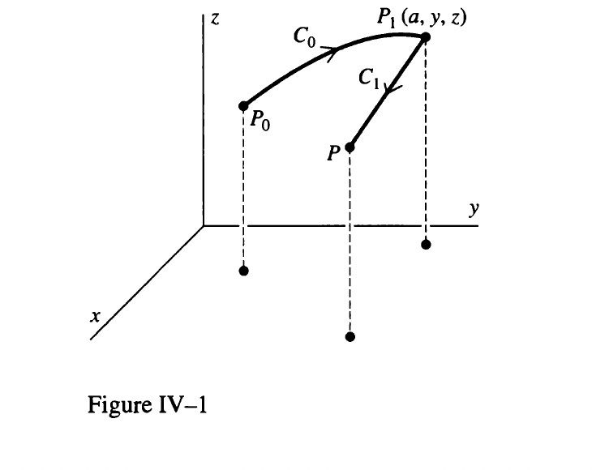

*Figure IV-1*

Description: A three-dimensional coordinate sketch shows a fixed point $P_0$, an intermediate point $P_1(a,y,z)$, and a point $P$, with a curved path $C_0$ from $P_0$ to $P_1$ and a straight segment $C_1$ from $P_1$ to $P$.

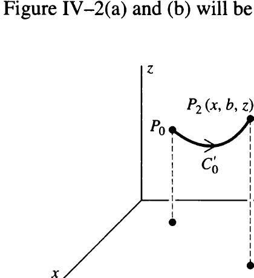

*Figure IV-2(a)*

Description: A three-dimensional sketch shows a path from $P_0$ to $P_2(x,b,z)$ followed by a straight segment $C_2$ to $P$, illustrating differentiation with respect to $y$ while $x$ and $z$ are held fixed on the final segment.

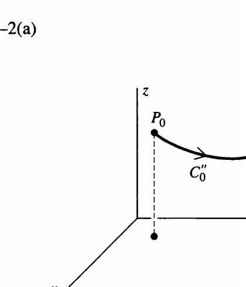

*Figure IV-2(b)*

Description: A three-dimensional sketch shows a path from $P_0$ to $P_3(x,y,c)$ followed by a straight vertical segment $C_3$ to $P$, illustrating differentiation with respect to $z$ while $x$ and $y$ are fixed on the final segment.

You have probably recognized by now that we have here another use for the del notation. That is,

$$
F_x = \frac{\partial \psi}{\partial x}, \qquad F_y = \frac{\partial \psi}{\partial y}, \qquad \text{and} \qquad F_z = \frac{\partial \psi}{\partial z}
$$

can be combined to give

$$
\mathbf{F} = \mathbf{i}\frac{\partial \psi}{\partial x} + \mathbf{j}\frac{\partial \psi}{\partial y} + \mathbf{k}\frac{\partial \psi}{\partial z} = \left(\mathbf{i}\frac{\partial}{\partial x}+\mathbf{j}\frac{\partial}{\partial y}+\mathbf{k}\frac{\partial}{\partial z}\right)\psi = \nabla\psi,
$$

which is read "del psi." This operator is called the gradient and is sometimes written $\operatorname{grad}\psi$. However, we shall always write $\nabla\psi$ in keeping with modern usage. The gradient of $\psi$ is a vector function of position. Its geometric significance will be discussed in detail later.

We have now established the relationship between path independence and the existence of a scalar function $\psi(x,y,z)$ such that $\mathbf{F}=\nabla\psi$. Since there is also a relationship between path independence and the fact that $\nabla\times\mathbf{F}=0$, you may suspect that $\nabla\times\mathbf{F}=0$ and $\mathbf{F}=\nabla\psi$ are also related. Indeed, if $\mathbf{F}=\nabla\psi$, then under suitable conditions $\nabla\times\mathbf{F}=0$. This is easily established. Consider, for example, the $x$-component of $\nabla\times\mathbf{F}$:

$$
(\nabla\times\mathbf{F})_x = \frac{\partial F_z}{\partial y} - \frac{\partial F_y}{\partial z} = \frac{\partial}{\partial y}\left(\frac{\partial \psi}{\partial z}\right) - \frac{\partial}{\partial z}\left(\frac{\partial \psi}{\partial y}\right)
= \frac{\partial^2 \psi}{\partial y\,\partial z} - \frac{\partial^2 \psi}{\partial z\,\partial y} = 0.
$$

This last equality follows if $\psi$ and its first and second derivatives are continuous, for then $\partial^2\psi/\partial y\,\partial z = \partial^2\psi/\partial z\,\partial y$. Obviously, the other two components of $\nabla\times\mathbf{F}$ can be shown to vanish in exactly the same way. Thus,

$$
F_q = \frac{\partial \psi}{\partial q} \qquad (q=x,y,z) \qquad \Rightarrow \qquad \nabla\times\mathbf{F}=0.
$$

The converse of what we have just shown would assert that if $\nabla\times\mathbf{F}=0$, then there exists a scalar function $\psi$ such that $\mathbf{F}=\nabla\psi$, a statement that is true, provided the region of interest is simply connected. To understand this, we can consult Figure IV-3, which shows how path independence of the line integral of $\mathbf{F}\cdot\hat{\mathbf{t}}$, $\nabla\times\mathbf{F}=0$, and $\mathbf{F}=\nabla\psi$ are related. The solid arrows in the diagram represent implications that hold in general, provided $\mathbf{F}$ is smooth. The dashed arrows represent implications requiring not only that $\mathbf{F}$ be smooth, but that the region of interest be simply connected. We have already shown that (1) implies both (2) and (3) and that (3) implies (1) in a simply connected region. Combining these two statements, we see that (3) implies (2) in a simply connected region.

In practice, just as the functions we deal with usually have continuous first derivatives (and are therefore smooth), the regions we work with are simply connected. In such circumstances we can relax a bit and regard the three statements summarized in Figure IV-3 as equivalent: each implies and is implied by each of the others. However, you should be aware of simple connectedness and its implications for the relations among the three statements.

To give a simple example of the ideas we have been discussing, consider the vector function

$$
\mathbf{F}(x,y,z)=\mathbf{i}y+\mathbf{j}x.
$$

This function is smooth everywhere, and we have already noted that its curl is zero. According to what we have just said, this means there must be a scalar function $\psi(x,y,z)$ such that $\mathbf{F}$ is its gradient. Thus, $\psi$ must satisfy

$$
F_x = y = \frac{\partial \psi}{\partial x}, \qquad F_y = x = \frac{\partial \psi}{\partial y}, \qquad F_z = 0 = \frac{\partial \psi}{\partial z}.
$$

Clearly, $\psi(x,y,z)=xy+C$, where $C$ is an arbitrary constant, satisfies these relations. This should be contrasted with the case of the function $\mathbf{F}=\mathbf{i}y-\mathbf{j}x$, the curl of which does not vanish. If this function were the gradient of a scalar function $\psi$, we should have

$$
F_x = y = \frac{\partial \psi}{\partial x}, \qquad F_y = -x = \frac{\partial \psi}{\partial y}, \qquad F_z = 0 = \frac{\partial \psi}{\partial z},
$$

but, as you should be able to convince yourself, there is no function $\psi$ that satisfies these three equations.

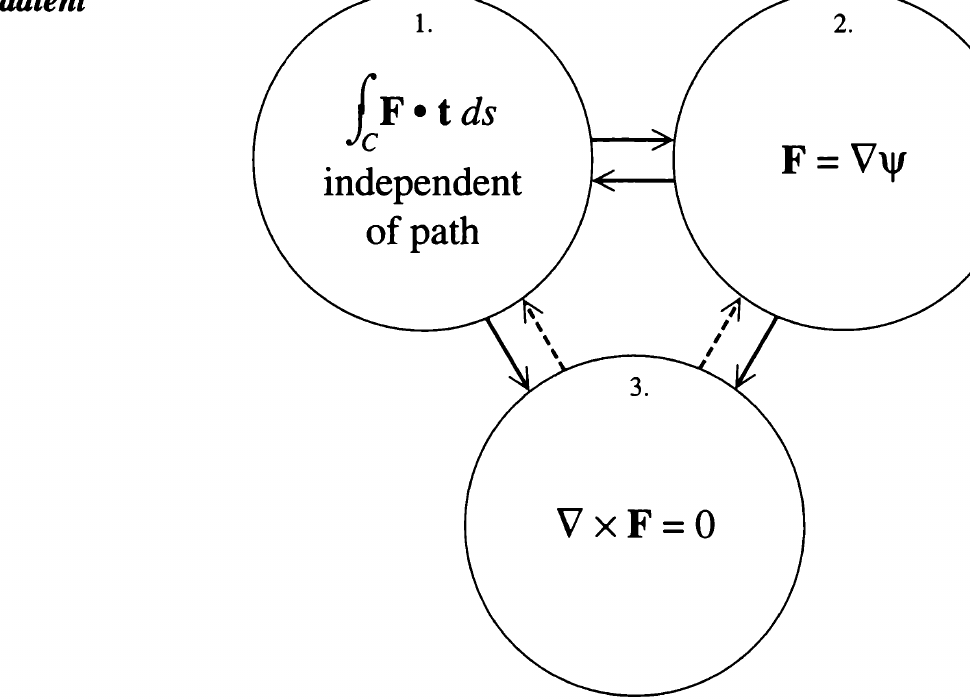

*Figure IV-3*

Description: Three large labeled circles are connected by solid and dashed arrows to summarize the relationships among path independence of $\int_C \mathbf{F}\cdot\hat{\mathbf{t}}\,ds$, the condition $\mathbf{F}=\nabla\psi$, and the condition $\nabla\times\mathbf{F}=0$.

## Finding the Electrostatic Field

The expression we have written for the gradient of a scalar function $\psi(x,y,z)$, namely,

$$
\nabla\psi = \mathbf{i}\frac{\partial \psi}{\partial x} + \mathbf{j}\frac{\partial \psi}{\partial y} + \mathbf{k}\frac{\partial \psi}{\partial z},
$$

is really just the form of this operator in Cartesian coordinates. To find the form of the gradient in other coordinate systems, if you go about it straightforwardly, is a tedious job. For example, to find the gradient in cylindrical coordinates, we would first have to express the Cartesian unit vectors $\mathbf{i}$, $\mathbf{j}$, and $\mathbf{k}$ in terms of the analogous quantities $\hat{\mathbf{e}}_r$, $\hat{\mathbf{e}}_\theta$, and $\hat{\mathbf{e}}_z$ in cylindrical coordinates. Then, using $x=r\cos\theta$, $y=r\sin\theta$, and the chain rule for differentiation, we would have to express derivatives with respect to $x$, $y$, and $z$ in terms of those with respect to $r$, $\theta$, and $z$. We shall not pursue this matter here because later an easier and faster method will be available to us. For the present we merely quote the form of the gradient in cylindrical and in spherical coordinates:

$$
\nabla\psi = \hat{\mathbf{e}}_r\frac{\partial \psi}{\partial r} + \hat{\mathbf{e}}_\theta\frac{1}{r}\frac{\partial \psi}{\partial \theta} + \hat{\mathbf{e}}_z\frac{\partial \psi}{\partial z},
$$

and

$$
\nabla\psi = \hat{\mathbf{e}}_r\frac{\partial \psi}{\partial r} + \hat{\mathbf{e}}_\phi\frac{1}{r}\frac{\partial \psi}{\partial \phi} + \hat{\mathbf{e}}_\theta\frac{1}{r\sin\phi}\frac{\partial \psi}{\partial \theta}.
$$

A coordinate-free definition of the gradient analogous to the ones given for the divergence and the curl is discussed in Problem IV-25.

We began our discussion of vector calculus with a search for some convenient method for finding the electrostatic field. Our investigations led us to the differential form of Gauss' law,

$$
\nabla\cdot\mathbf{E} = \rho/\epsilon_0.
$$

Even this expression is not often useful for finding $\mathbf{E}$ because it is one equation in three unknowns ($E_x$, $E_y$, and $E_z$ in Cartesian coordinates). Now, at last, we are able to complete our discussion and write down the equations that are often the most useful of all known methods for finding the field.

This final step rests on the observation that since

$$
\oint_C \mathbf{E}\cdot\hat{\mathbf{t}}\,ds = 0
$$

for any closed path $C$, the field $\mathbf{E}$ can be written as the gradient of a scalar function. Conventionally, this function, called the electrostatic potential, is designated $\Phi(x,y,z)$, and we write[^1]

$$
\mathbf{E} = -\nabla\Phi.
$$

Combining this equation with the differential form of Gauss' law, we get

$$
\nabla\cdot(-\nabla\Phi)=\rho/\epsilon_0,
$$

or

$$
\nabla\cdot(\nabla\Phi)=-\rho/\epsilon_0.
$$

When we write out the left-hand side of this equation in detail, we find

$$
\nabla\cdot(\nabla\Phi) = \left(\mathbf{i}\frac{\partial}{\partial x}+\mathbf{j}\frac{\partial}{\partial y}+\mathbf{k}\frac{\partial}{\partial z}\right)\cdot\left(\mathbf{i}\frac{\partial\Phi}{\partial x}+\mathbf{j}\frac{\partial\Phi}{\partial y}+\mathbf{k}\frac{\partial\Phi}{\partial z}\right)
= \frac{\partial^2\Phi}{\partial x^2}+\frac{\partial^2\Phi}{\partial y^2}+\frac{\partial^2\Phi}{\partial z^2},
$$

and so

$$
\frac{\partial^2\Phi}{\partial x^2}+\frac{\partial^2\Phi}{\partial y^2}+\frac{\partial^2\Phi}{\partial z^2} = -\rho/\epsilon_0.
$$

Equation (IV-5) can be written more compactly by introducing a new operator, called the Laplacian, which is denoted, for fairly obvious reasons, by the symbol $\nabla^2$ (read "del squared"). That is,

$$
\nabla^2 = \nabla\cdot\nabla = \left(\mathbf{i}\frac{\partial}{\partial x}+\mathbf{j}\frac{\partial}{\partial y}+\mathbf{k}\frac{\partial}{\partial z}\right)\cdot\left(\mathbf{i}\frac{\partial}{\partial x}+\mathbf{j}\frac{\partial}{\partial y}+\mathbf{k}\frac{\partial}{\partial z}\right)
= \frac{\partial^2}{\partial x^2}+\frac{\partial^2}{\partial y^2}+\frac{\partial^2}{\partial z^2}.
$$

In this new notation Equation (IV-5) becomes

$$
\nabla^2\Phi = -\rho/\epsilon_0.
$$

Equation (IV-6) provides the form of the Laplacian in Cartesian coordinates; its forms in cylindrical and spherical coordinates will be given in the next section. The best definition of the Laplacian is probably

$$
\nabla^2 f = \nabla\cdot(\nabla f),
$$

where $f$ is some suitably continuous scalar function of position. This definition has the important advantage of being independent of the coordinate system.

Equation (IV-7) is called Poisson's equation. It is a linear, second-order partial differential equation in one unknown, the scalar function $\Phi(x,y,z)$, and is the culmination of our long search for a method of determining the electrostatic field. A great body of work exists describing the many elegant mathematical schemes that have been devised to solve it, and a few simple examples are given in the next section. In any problem, once we have $\Phi$, the field is trivial to find using $\mathbf{E}=-\nabla\Phi$.

At any point in space where there is no electric charge, the density $\rho$ is zero and Poisson's equation reduces to

$$
\nabla^2\Phi = 0.
$$

This is called Laplace's equation and is more often used than Poisson's equation. The reason for this is that usually charges are distributed over various objects; this gives rise to a field, and we are interested in finding the potential (and from it, the field) in the charge-free space between the objects. In the simplest of situations it is possible to specify boundary conditions; that is, the value of the potential on the surfaces of these objects. We then find that solution of Laplace's equation which takes on the given values on the surfaces. This is illustrated in Figure IV-4.

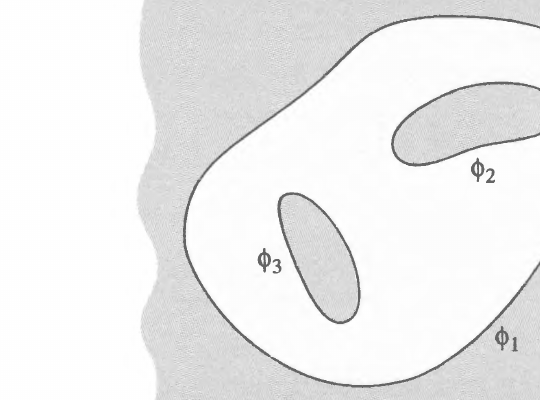

*Figure IV-4*

Description: An irregular two-dimensional region with two internal holes is shown, with the outer boundary labeled $\phi_1$ and the inner boundaries labeled $\phi_2$ and $\phi_3$ to indicate specified boundary values for a Laplace-equation problem.

## Using Laplace's Equation

Whether solving Laplace's equation is or is not a topic in vector calculus is a moot point, but the basis of our entire discussion has been a search for a method to calculate electric fields. Since Laplace's equation is the end product of that search, we can scarcely omit a few examples to show how it works.[^2]

We begin with an especially simple problem. Imagine we have two very large ("infinite") parallel plates separated by a distance $s$ (Figure IV-5). Choosing a coordinate system as shown in the figure, let the plate at $x=0$ be held at zero potential and that at $x=s$ at $V_0$. Our object is to find the potential and the electric field in the space between the two plates. Because the plates are infinitely large, there is nothing to distinguish a point $(x,y,z)$ from any other point $(x,y',z')$ having the same $x$-coordinate. It follows that the potential $\Phi$ depends on $x$ but not on $y$ or $z$. Thus, $\nabla^2\Phi$ reduces in this case simply to $d^2\Phi/dx^2$, and so Laplace's equation and the associated boundary conditions are

$$
\frac{d^2\Phi}{dx^2}=0,
$$

and

$$
\Phi = \begin{cases}
0 & \text{at } x=0,\\
V_0 & \text{at } x=s.
\end{cases}
$$

This is a trivial problem and the solution is

$$
\Phi(x)=\frac{V_0 x}{s}.
$$

The electric field is found using $\mathbf{E}=-\nabla\Phi$, which yields

$$
E_x = -\frac{V_0}{s}, \qquad \text{and} \qquad E_y = E_z = 0.
$$

Thus, the field is a constant vector normal to the plates. This is an excellent approximation to the potential and field between, but far from the edges of, two plates whose linear dimensions are large compared with their separation. You may recognize this arrangement as a parallel plate capacitor.

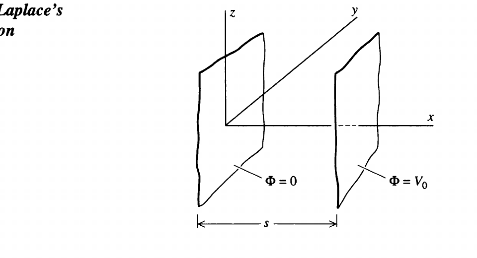

*Figure IV-5*

Description: Two large parallel conducting plates are drawn perpendicular to the $x$-axis, separated by a distance $s$, with the left plate at $\Phi=0$ and the right plate at $\Phi=V_0$.

Our second example is a spherical capacitor, that is, two concentric spheres having radii $R_1$ and $R_2$ with the inner one maintained at a potential $V_0$ and the outer at zero. We are required to find the potential and field everywhere between the spheres. In this situation we would obviously do well to work in spherical coordinates $r$, $\theta$, and $\phi$, in which Laplace's equation between the spheres has the imposing form

$$
\nabla^2\Phi = \frac{1}{r^2}\frac{\partial}{\partial r}\left(r^2\frac{\partial\Phi}{\partial r}\right)
+ \frac{1}{r^2\sin\phi}\frac{\partial}{\partial \phi}\left(\sin\phi\frac{\partial\Phi}{\partial \phi}\right)
+ \frac{1}{r^2\sin^2\phi}\frac{\partial^2\Phi}{\partial \theta^2} = 0.
$$

Fortunately, we need not work with this equation as it stands; a little thought will convince you that $\Phi$ can only be a function of $r$, since there is no way to distinguish a point $(r,\theta,\phi)$ from another $(r,\theta',\phi')$ with the same $r$ but different $\theta$ and $\phi$. Thus,

$$
\frac{\partial \Phi}{\partial \theta} = \frac{\partial \Phi}{\partial \phi} = 0,
$$

and Laplace's equation reduces to

$$
\frac{1}{r^2}\frac{d}{dr}\left(r^2\frac{d\Phi}{dr}\right)=0.
$$

We are interested in the solution of this equation that is valid for $R_1<r<R_2$ and satisfies the boundary conditions

$$
\Phi(r)=\begin{cases}
V_0 & \text{at } r=R_1,\\
0 & \text{at } r=R_2.
\end{cases}
$$

Multiplying Equation (IV-8) by $r^2$ and putting $\psi=d\Phi/dr$, we get

$$
\frac{d}{dr}(r^2\psi)=0,
$$

and so

$$
r^2\psi = c_1,
$$

where $c_1$ is a constant. Hence,

$$
\psi = \frac{d\Phi}{dr} = \frac{c_1}{r^2},
$$

and it follows that

$$
\Phi = -\frac{c_1}{r}+c_2,
$$

where $c_2$ is another constant. Imposing the boundary conditions, we find

$$
-\frac{c_1}{R_1}+c_2 = V_0, \qquad \text{and} \qquad -\frac{c_1}{R_2}+c_2 = 0,
$$

whence

$$
c_1 = \frac{V_0R_1R_2}{R_1-R_2}, \qquad \text{and} \qquad c_2 = \frac{V_0R_1}{R_1-R_2}.
$$

Substituting these in the expression for the potential, we get

$$
\Phi(r) = \frac{V_0R_1}{R_1-R_2}\left(1-\frac{R_2}{r}\right), \qquad R_1<r<R_2.
$$

To get the electric field, we must take the gradient of $\Phi$, and this is clearly most conveniently done in spherical coordinates. However, since in this case $\Phi$ depends only on $r$, we get only a radial component:

$$
E_r = -\frac{d\Phi}{dr} = -\frac{V_0R_1R_2}{R_1-R_2}\frac{1}{r^2},
$$

$$
E_\theta = E_\phi = 0, \qquad (R_1<r<R_2).
$$

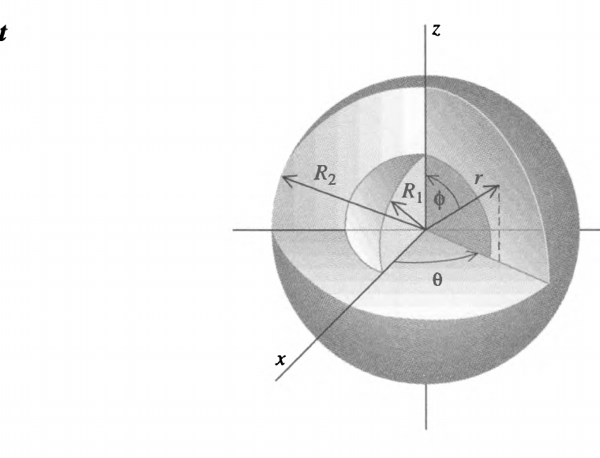

*Figure IV-6*

Description: A cutaway spherical capacitor is shown with concentric inner and outer spherical conductors of radii $R_1$ and $R_2$, together with the spherical coordinates $r$, $\theta$, and $\phi$ drawn from the common center.

Our third and last example is more complicated (and more interesting) than the foregoing. If a potential difference is maintained between two "infinite" parallel plates $P$ and $P'$ (Figure IV-7), then we know from our first example that the field between them is a constant vector normal to the plates. Choosing a coordinate system as shown in the figure (with the $z$-axis out of the plane of the paper), we have $\mathbf{E}=E_0\mathbf{i}$, where $E_0$ is a constant. Let an "infinitely" long cylinder held at zero potential be situated between the plates with its axis along the $z$-axis. Let its radius $R$ be small compared with the plate separation. What are the potential and the electric field outside the cylinder and between the plates? Here, clearly, we should use cylindrical coordinates $(r,\theta,z)$, in which case Laplace's equation reads

$$
\nabla^2\Phi = \frac{1}{r}\frac{\partial}{\partial r}\left(r\frac{\partial\Phi}{\partial r}\right) + \frac{1}{r^2}\frac{\partial^2\Phi}{\partial \theta^2} + \frac{\partial^2\Phi}{\partial z^2} = 0.
$$

You should convince yourself that $\Phi$ in this case must be independent of $z$, so this equation simplifies somewhat to

$$
\frac{1}{r}\frac{\partial}{\partial r}\left(r\frac{\partial\Phi}{\partial r}\right) + \frac{1}{r^2}\frac{\partial^2\Phi}{\partial \theta^2} = 0.
$$

There are two boundary conditions, of which the first is

$$
\Phi(r,\theta)=0 \qquad \text{at } r=R.
$$

The second condition has to do with the fact that at large values of $r$, the influence of the cylinder is negligible and the field must be, to a good approximation, what it would be if the cylinder were not present at all, that is, $E_0\mathbf{i}$. To put this in terms of the potential, we note that

$$
\Phi = -E_0x
$$

will provide just such a field. Since $x=r\cos\theta$, we can write the second boundary condition

$$
\Phi(r,\theta) = -E_0r\cos\theta, \qquad r\gg R.
$$

Let's try to solve Laplace's equation for this problem by assuming we can write

$$
\Phi(r,\theta)=f(r)\cos\theta,
$$

where $f(r)$ is an as yet unknown function. What prompts us to do this is the fact that the second boundary condition has precisely this form, a function of $r$ multiplied by $\cos\theta$. If we substitute this into the simplified Laplace equation, the result is a differential equation for the function $f(r)$:

$$
\frac{d^2f}{dr^2} + \frac{1}{r}\frac{df}{dr} - \frac{1}{r^2}f = 0.
$$

Putting $f(r)=r^\lambda$ where $\lambda$ is a constant leads to

$$
\lambda(\lambda-1)r^{\lambda-2}+\lambda r^{\lambda-2}-r^{\lambda-2}=0,
$$

or

$$
\lambda^2 = 1,
$$

and $\lambda=\pm1$. Hence we get

$$
f(r)=Ar+\frac{B}{r},
$$

where $A$ and $B$ are constants. Thus, our solution is

$$
\Phi(r,\theta) = \left(Ar+\frac{B}{r}\right)\cos\theta.
$$

The first boundary condition requires that

$$
AR+\frac{B}{R}=0,
$$

or

$$
B=-AR^2.
$$

Hence,

$$
\Phi(r,\theta) = Ar\cos\theta - \frac{AR^2}{r}\cos\theta.
$$

To impose the second condition we note that for $r$ large, the second term in this last equation is negligible compared with the first. Thus,

$$
\Phi(r,\theta) \simeq Ar\cos\theta, \qquad r \text{ large}.
$$

We satisfy the second boundary condition by choosing $A=-E_0$. The complete solution is thus

$$
\Phi(r,\theta) = -E_0r\left(1-\frac{R^2}{r^2}\right)\cos\theta.
$$

To find the electric field, we proceed as usual with $\mathbf{E}=-\nabla\Phi$. Using the cylindrical-coordinate form of the gradient, we get

$$
E_r = -\frac{\partial\Phi}{\partial r} = E_0\left[1+\left(\frac{R}{r}\right)^2\right]\cos\theta,
$$

$$
E_\theta = -\frac{1}{r}\frac{\partial\Phi}{\partial \theta} = -E_0\left[1-\left(\frac{R}{r}\right)^2\right]\sin\theta,
$$

$$
E_z = -\frac{\partial\Phi}{\partial z}=0.
$$

You should verify that for large $r$, this field reduces to $E_0\mathbf{i}$ as required.

You may find this last example disquieting, since a certain amount of clever guesswork is used in finding the potential. Actually, there are standard procedures that, in problems of this kind, lead more or less straightforwardly to the solution. A discussion of these procedures, however, would be very lengthy and (in the well-worn phrase) beyond the scope of this text. Before moving on, however, one further point is worth making: A solution of Laplace's equation that satisfies appropriate boundary conditions is unique. That is to say, there is one and only one such solution, so that if we solve a problem by guesswork and skullduggery, and someone else solves it with refined and elegant mathematical techniques, the two solutions, in spite of their disparate pedigrees, must be the same. In Problem IV-24 you will be led through a proof of this remarkable fact.

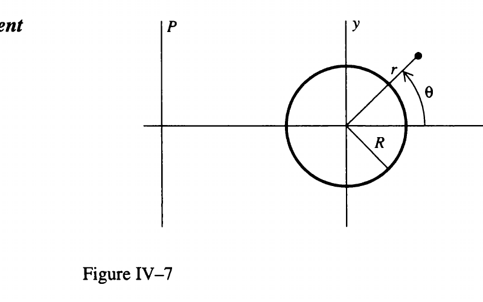

*Figure IV-7*

Description: Two vertical parallel plates labeled $P$ and $P'$ stand on either side of a circular cylinder of radius $R$ centered at the origin, with polar coordinates $r$ and $\theta$ marked for a point outside the cylinder.

## Directional Derivatives and the Gradient

We have introduced the gradient as a sort of mathematical artifice useful in discussing path-independent line integrals. We now turn to a more detailed examination of the gradient in order to describe its geometrical significance.

Before beginning our discussion, we make a few comments on Taylor series, since these are needed in what follows. For a scalar function of one variable that is suitably continuous and differentiable, we have

$$
f(x+\Delta x)=f(x)+\Delta x f'(x)+\frac{1}{2}(\Delta x)^2 f''(x)+\cdots.
$$

This says that the value of the function at some point $x+\Delta x$ can be written as the sum of (usually) infinitely many terms that involve the function and its derivatives at some other point $x$. Among other things, this Taylor series is useful for calculation, for if the two points are close together (that is, if $\Delta x$ is small), then we can truncate the series after a certain number of terms (which we hope is small), since the neglected terms, each proportional to some large power of the small number $\Delta x$, will sum to a value that is negligible.

Taylor series can also be formed for functions of several variables. Thus, for a function of two variables we have

$$
f(x+\Delta x,y+\Delta y)=f(x,y)+\Delta x\frac{\partial f}{\partial x}+\Delta y\frac{\partial f}{\partial y}+\cdots.
$$

We shall never need the explicit form of the remaining terms of this series. We should know, however, that these terms involve higher powers of the "small" numbers $\Delta x$ and $\Delta y$ (for example, $\Delta x^2$, $\Delta y^2$, $\Delta x\Delta y$, $\Delta x^3$, $\Delta y^3$, $\Delta x^2\Delta y$, and so on). With these simple ideas in mind we turn now to our main task.

Consider some function $z=f(x,y)$. Geometrically, this represents a surface as shown in Figure IV-8(a). Let $(x,y)$ be the coordinates of a point $P$ in the $xy$-plane. The height of the surface above this point is represented by the length of the dotted line $PQ$; that is, $PQ=z=f(x,y)$. Suppose now we take a short step in the $xy$-plane to a new point $P'$ with coordinates $(x+\Delta x,y+\Delta y)$. The height of the surface above this point is $P'Q'=f(x+\Delta x,y+\Delta y)$. Let $\Delta s$ be the length of the step ($\Delta s=PP'$).

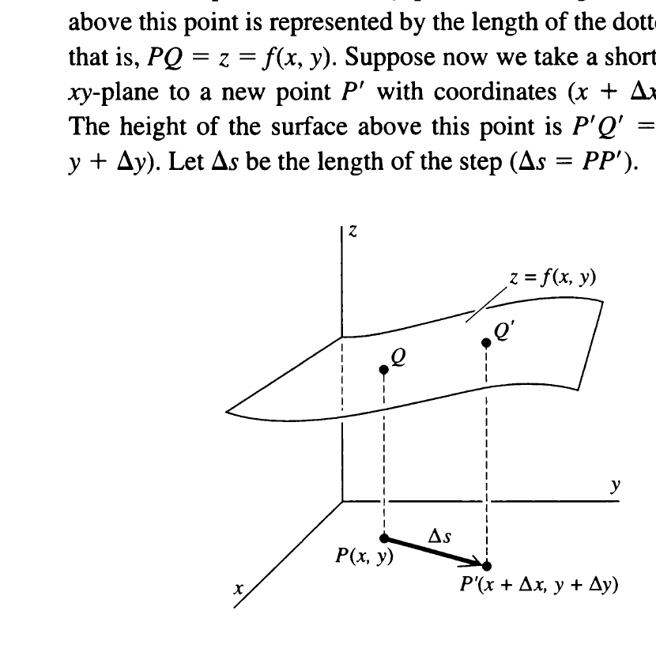

*Figure IV-8(a)*

Description: A curved surface labeled $z=f(x,y)$ stands above the $xy$-plane, with points $P(x,y)$ and $P'(x+\Delta x,y+\Delta y)$ in the plane and corresponding points $Q$ and $Q'$ on the surface joined by dotted vertical segments.

We next ask how much the function $f$ has changed as a result of taking this step. Clearly, this change is the difference in the two heights $PQ$ and $P'Q'$, and

$$
P'Q'-PQ \equiv \Delta f = f(x+\Delta x,y+\Delta y)-f(x,y).
$$

Applying the Taylor series formula stated above, we get

$$
\Delta f = f(x,y)+\Delta x\frac{\partial f}{\partial x}+\Delta y\frac{\partial f}{\partial y}+\cdots-f(x,y)
= \Delta x\frac{\partial f}{\partial x}+\Delta y\frac{\partial f}{\partial y}+\cdots.
$$

We now recast this expression by what at first may seem an unnecessary elaboration of the notation. Let $\Delta\mathbf{s}$ be a vector that has magnitude $\Delta s$ and points from $P$ to $P'$. Clearly,

$$
\Delta\mathbf{s}=\mathbf{i}\,\Delta x+\mathbf{j}\,\Delta y.
$$

But the gradient of $f$ is

$$
\nabla f = \mathbf{i}\frac{\partial f}{\partial x}+\mathbf{j}\frac{\partial f}{\partial y}
$$

(an obvious specialization of the gradient notation to a function of two, rather than three, variables). It follows at once that

$$
\Delta f = (\Delta\mathbf{s})\cdot(\nabla f)+\cdots.
$$

Complicating matters slightly more, let $\hat{\mathbf{u}}$ be a unit vector in the direction of $\Delta\mathbf{s}$. Then

$$
\Delta\mathbf{s}=\hat{\mathbf{u}}\,\Delta s
$$

and

$$
\Delta f=(\hat{\mathbf{u}}\cdot\nabla f)\,\Delta s+\cdots,
$$

so that

$$
\frac{\Delta f}{\Delta s}=\hat{\mathbf{u}}\cdot\nabla f+\cdots.
$$

We now take the limit of this equation to get

$$
\frac{df}{ds}\equiv \lim_{\Delta s\to 0}\frac{\Delta f}{\Delta s}=\hat{\mathbf{u}}\cdot\nabla f.
$$

There is no longer any need for "+\cdots," since the dots represented terms that go to zero as $\Delta s$ goes to zero. This new expression [Equation (IV-14)] has a simple interpretation: it is the rate of change of the function $f(x,y)$ in the direction of $\Delta\mathbf{s}$ (that is, of $\hat{\mathbf{u}}$). Redrawing Figure IV-8(a) and passing a plane through $P$ and $P'$ parallel to the $z$-axis [Figure IV-8(b)], we see that it cuts the surface $z=f(x,y)$ in a curve $C$. The quantity $df/ds$ defined in Equation (IV-14) is the slope of this curve at the point $Q$.

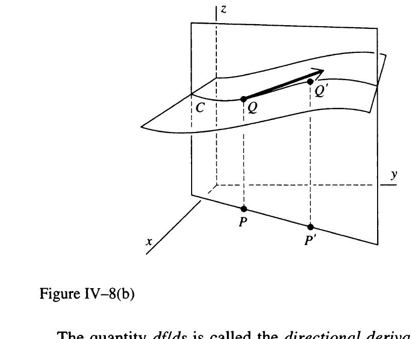

*Figure IV-8(b)*

Description: A vertical plane cuts the surface $z=f(x,y)$ in a curve $C$ through the point $Q$, and the point $Q'$ lies farther along the section curve above the displaced point $P'$ in the base plane.

The quantity $df/ds$ is called the directional derivative of $f$. Although the analysis given earlier that led to this derivative was for functions of two variables, the results all apply to functions of three (or more) variables. Thus,

$$
\frac{d}{ds}F(x,y,z)=\hat{\mathbf{u}}\cdot\nabla F
$$

is the rate of change of the function $F(x,y,z)$ in the direction specified by the unit vector $\hat{\mathbf{u}}$.

An example of the directional derivative may be amusing here. We'll work with a function of two variables so that we can draw pictures. Thus, let's consider

$$
z=f(x,y)=(x^2+y^2)^{1/2},
$$

which is an inverted right circular cone whose axis coincides with the $z$-axis [see Figure IV-9(a)]. We ask for the directional derivative of this function at some point $x=a$ and $y=b$ and in the direction specified by $\hat{\mathbf{u}}=\mathbf{i}\cos\theta+\mathbf{j}\sin\theta$ [see Figure IV-9(b)]. First we need the gradient of $f(x,y)$. But

$$
\frac{\partial f}{\partial x}=\frac{x}{z} \qquad \text{and} \qquad \frac{\partial f}{\partial y}=\frac{y}{z},
$$

as you can easily verify. Thus,

$$
\nabla f = \frac{\mathbf{i}x+\mathbf{j}y}{z}
$$

and

$$
\frac{df}{ds}=\hat{\mathbf{u}}\cdot\nabla f=\frac{x\cos\theta+y\sin\theta}{z} \to \frac{a\cos\theta+b\sin\theta}{\sqrt{a^2+b^2}}.
$$

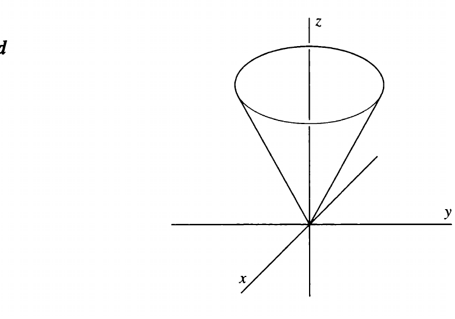

*Figure IV-9(a)*

Description: An inverted right circular cone centered on the $z$-axis is drawn in three dimensions to represent the surface $z=(x^2+y^2)^{1/2}$.

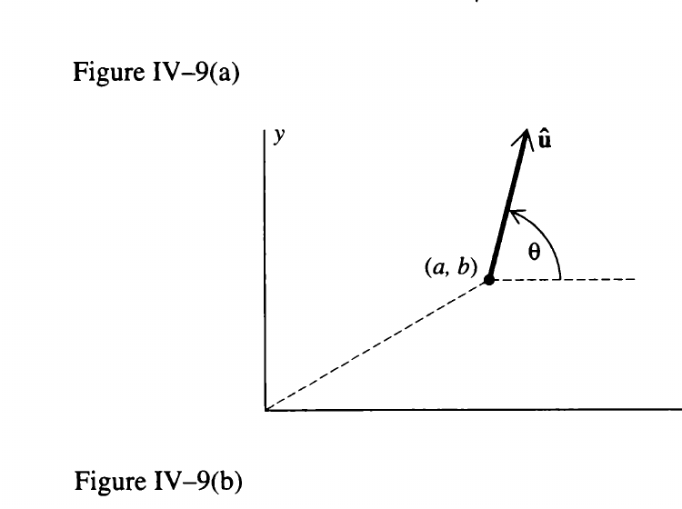

*Figure IV-9(b)*

Description: In the $xy$-plane, a point $(a,b)$ is shown with a unit direction vector $\hat{\mathbf{u}}$ making an angle $\theta$ with the positive $x$-direction.

Suppose $\theta$ is chosen so that $\hat{\mathbf{u}}$ is in the radial direction as indicated in Figure IV-9(c). This means

$$
\cos\theta=\frac{a}{(a^2+b^2)^{1/2}},
$$

$$
\sin\theta=\frac{b}{(a^2+b^2)^{1/2}},
$$

and so

$$
\frac{df}{ds}=\frac{a}{\sqrt{a^2+b^2}}\cdot\frac{a}{\sqrt{a^2+b^2}} + \frac{b}{\sqrt{a^2+b^2}}\cdot\frac{b}{\sqrt{a^2+b^2}} = 1.
$$

The significance of this result is brought out in Figure IV-9(d). A second interesting case is that in which $\hat{\mathbf{u}}$ is chosen perpendicular to the direction of the previous example [see Figure IV-9(e)]. We then have

$$
\cos\theta = -\frac{b}{(a^2+b^2)^{1/2}},
$$

$$
\sin\theta = \frac{a}{(a^2+b^2)^{1/2}},
$$

and so

$$
\frac{df}{ds}=\frac{a}{\sqrt{a^2+b^2}}\left(-\frac{b}{\sqrt{a^2+b^2}}\right) + \frac{b}{\sqrt{a^2+b^2}}\left(\frac{a}{\sqrt{a^2+b^2}}\right)=0.
$$

The meaning of this result is illustrated in Figure IV-9(f).

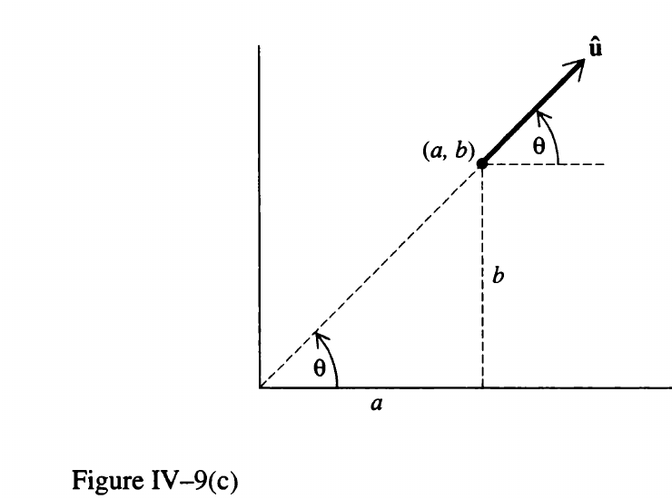

*Figure IV-9(c)*

Description: In the plane, the point $(a,b)$ is connected radially to the origin, and the unit vector $\hat{\mathbf{u}}$ is chosen along this radial direction so that the two marked angles $\theta$ match.

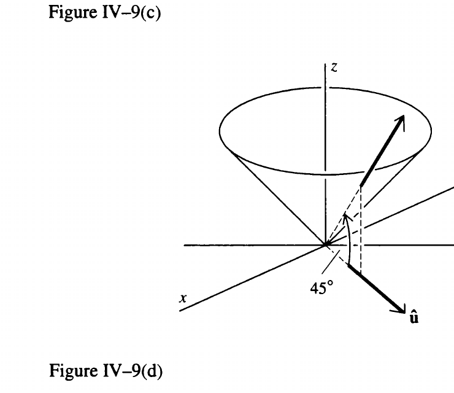

*Figure IV-9(d)*

Description: The cone is shown with a radial direction on its surface and a corresponding planar direction, illustrating motion up the steepest line on the cone.

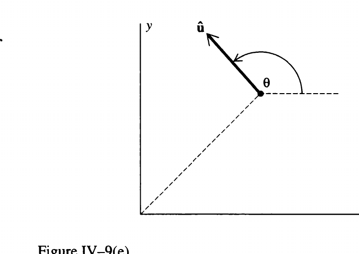

*Figure IV-9(e)*

Description: In the plane, the direction vector $\hat{\mathbf{u}}$ at the point $(a,b)$ is drawn perpendicular to the radial line from the origin.

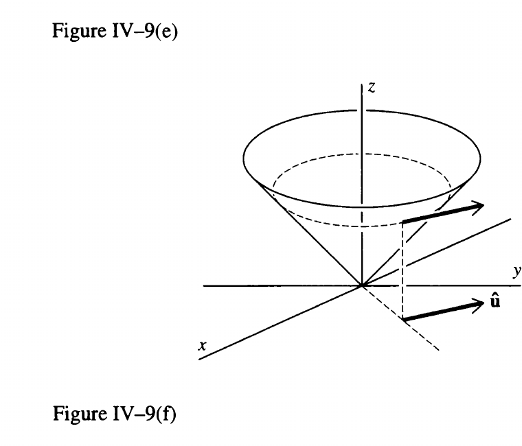

*Figure IV-9(f)*

Description: The cone is shown with a horizontal tangential direction around it, illustrating motion along a constant-height path where the directional derivative vanishes.

## Geometric Significance of the Gradient

With the concept of the directional derivative at our disposal, we are now in a position to give a geometric interpretation of the gradient. At some point $P_0$ with coordinates $(x_0,y_0,z_0)$ we have

$$
\left(\frac{dF}{ds}\right)_0 = \hat{\mathbf{u}}\cdot(\nabla F)_0,
$$

where the subscript 0 means the quantity is to be evaluated at the point $(x_0,y_0,z_0)$. Now $(\nabla F)_0$, the gradient of $F$ evaluated at $P_0$, may be represented by an arrow emanating from that point as shown in Figure IV-10(a). If we ask in what direction we must move to make $(dF/ds)_0$ as large as possible, it is clear that $\hat{\mathbf{u}}$ should be in the same direction as $(\nabla F)_0$. This is because if we let $\alpha$ be the angle between $\hat{\mathbf{u}}$ and $(\nabla F)_0$, then $(dF/ds)_0 = |\nabla F|_0\cos\alpha$, and this is as large as it can be when $\alpha=0$. Thus, the gradient of a scalar function $F(x,y,z)$ is a vector that is in the direction in which $F$ undergoes the greatest rate of increase and that has magnitude equal to the rate of increase in that direction.

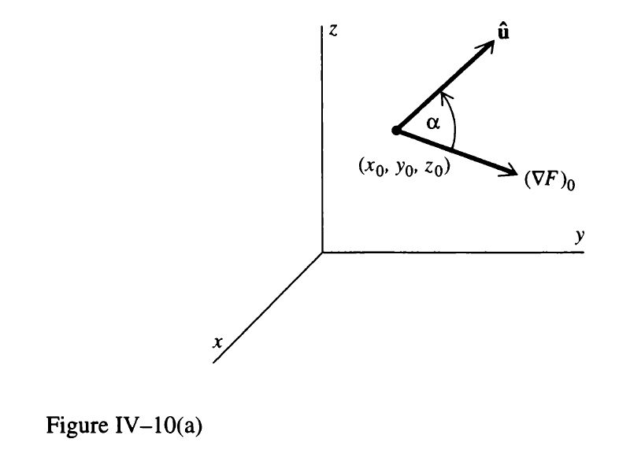

*Figure IV-10(a)*

Description: At the point $(x_0,y_0,z_0)$ in three-dimensional space, the gradient vector $(\nabla F)_0$ and a trial direction vector $\hat{\mathbf{u}}$ are drawn with the angle $\alpha$ between them.

To illustrate this interpretation of the gradient, let us go back to the inverted cone $z=f(x,y)=(x^2+y^2)^{1/2}$ we discussed earlier. We learned that

$$
\nabla f = \frac{\mathbf{i}x+\mathbf{j}y}{z}
$$

and

$$
\frac{df}{ds}=\frac{a\cos\theta+b\sin\theta}{\sqrt{a^2+b^2}} \equiv D(\theta).
$$

To find the direction in which $f(x,y)$ undergoes the greatest rate of change, we set

$$
\frac{dD}{d\theta}=\frac{-a\sin\theta+b\cos\theta}{\sqrt{a^2+b^2}}=0.
$$

This gives $\tan\theta=b/a$, whence $\cos\theta=a/(a^2+b^2)^{1/2}$ and $\sin\theta=b/(a^2+b^2)^{1/2}$. So $(df/ds)_{\max}=1$. On the other hand,

$$
|\nabla f| = \left[\frac{x^2+y^2}{z^2}\right]^{1/2}=1,
$$

since $z^2=x^2+y^2$. Furthermore, $\tan\theta=b/a$ corresponds to the direction $a\mathbf{i}+b\mathbf{j}$, while at the point $(a,b)$,

$$
\nabla f = \frac{a\mathbf{i}+b\mathbf{j}}{(a^2+b^2)^{1/2}},
$$

which is a vector in the same direction. Thus both properties of the gradient are illustrated; it's in the direction of maximum rate of increase, and its magnitude is equal to the rate of increase in that direction.

As a second example of the interpretation of the gradient, we consider the plane $z=f(x,y)=1-x-y$ shown in Figure IV-10(b). It's easy to see that $\nabla f=-\mathbf{i}-\mathbf{j}$. Using $\hat{\mathbf{u}}=\mathbf{i}\cos\theta+\mathbf{j}\sin\theta$ as before, we find $df/ds=\hat{\mathbf{u}}\cdot\nabla f=-\cos\theta-\sin\theta\equiv D(\theta)$. Thus

$$
\frac{dD}{d\theta}=\sin\theta-\cos\theta=0,
$$

which yields $\theta=\pi/4$ or $5\pi/4$. The second derivative test shows that $\pi/4$ corresponds to a minimum and $5\pi/4$ to a maximum. It can be seen from Figure IV-10(b) that the greatest rate of increase is indeed at an angle of $5\pi/4$. Moreover, the greatest rate of increase is

$$
\left(\frac{df}{ds}\right)_{\max}=D(5\pi/4)=\sqrt{2},
$$

whereas

$$
|\nabla f|=|-\mathbf{i}-\mathbf{j}|=\sqrt{2}.
$$

Again, both properties of the gradient are illustrated by this example.

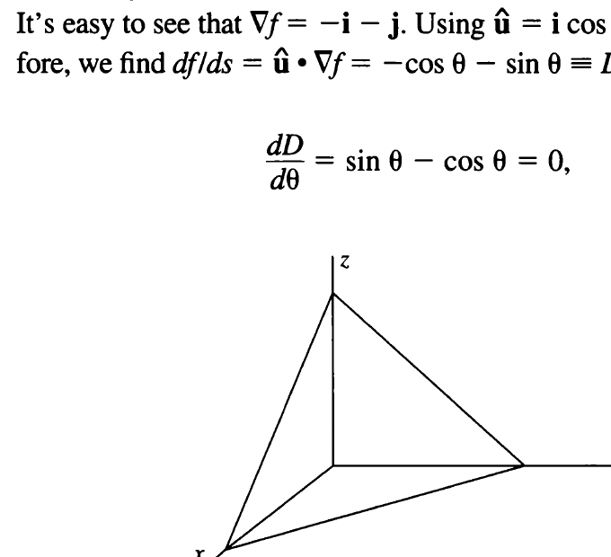

*Figure IV-10(b)*

Description: A triangular plane surface representing $z=1-x-y$ is drawn in three dimensions with intercepts on the coordinate axes.

With this geometric interpretation of the gradient at our disposal, we can now see the reason for the negative sign in the equation $\mathbf{E}=-\nabla\Phi$: Since $\nabla\Phi$ is a vector in the direction of increasing $\Phi$, the force on a positive charge $q$ is $\mathbf{F}=q\mathbf{E}=-q\nabla\Phi$, which is in the direction of decreasing $\Phi$. Thus, the negative sign ensures that a positive charge moves "downhill" from a higher to a lower potential.

There is another property of the gradient useful in understanding its geometric significance. To make this discussion concrete, let $T(x,y,z)$ be a scalar function that gives the temperature at any point $(x,y,z)$. The locus of all points having the same temperature $T_0$ is (in the simplest case) a surface whose equation is $T(x,y,z)=T_0$ (Figure IV-11). This is called an isothermal surface. We now show that $\nabla T$ is a vector normal to the isothermal surface. Let $C$ be any curve lying in the isothermal surface and let $P$ be any point on $C$. Let $\hat{\mathbf{u}}$ be the unit vector tangent to $C$ at $P$ (it doesn't matter which direction along $C$ we take). The directional derivative in the direction $\hat{\mathbf{u}}$ is

$$
\left(\frac{dT}{ds}\right)=\hat{\mathbf{u}}\cdot\nabla T=0
$$

because $T$ does not change as we move along the isothermal surface. If the scalar product of two vectors, neither of them zero, vanishes, the two vectors are perpendicular. Thus $\nabla T$ is perpendicular to $C$ at $P$. By the same argument it is perpendicular to any curve on the surface through $P$ (such as $C'$ in Figure IV-11). But this can be true only if $\nabla T$ is normal to the isothermal surface at $P$. In general then, $\nabla f(x,y,z)$, where $f(x,y,z)$ is a scalar function, is normal to the surface $f(x,y,z)=\text{constant}$.[^3]

A simple example of this property of the gradient is provided by the function $F(x,y,z)=x^2+y^2+z^2$. The surface $F(x,y,z)=\text{constant}$ is, of course, a sphere (assuming the constant is positive). As you should verify for yourself, $\nabla F=2(\mathbf{i}x+\mathbf{j}y+\mathbf{k}z)=2\mathbf{r}$. Thus, we have a familiar result: A vector normal to a spherical surface is in the radial direction. We'll leave it to you to ponder the geometric relation between the electrostatic field $\mathbf{E}$ and its equipotential surfaces $\Phi(x,y,z)=\text{constant}$.

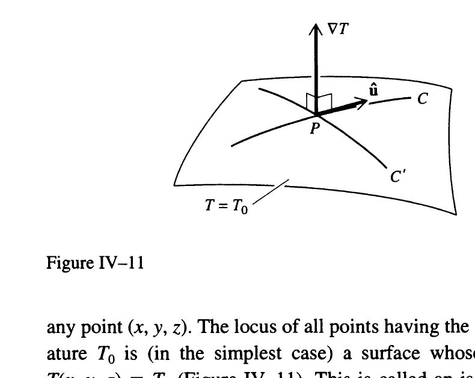

*Figure IV-11*

Description: An isothermal surface labeled $T=T_0$ is shown with a point $P$, two tangent curves $C$ and $C'$, a tangent direction $\hat{\mathbf{u}}$, and the gradient vector $\nabla T$ drawn normal to the surface.

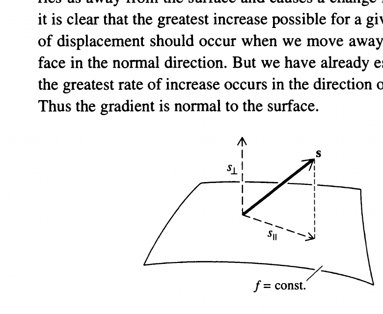

*Figure IV-12*

Description: A displacement vector $\mathbf{s}$ from a surface $f=\text{const.}$ is decomposed into a component $s_\parallel$ along the surface and a component $s_\perp$ normal to it.

## The Gradient in Cylindrical and Spherical Coordinates

A by-product of our discussion of the directional derivative is the "easier and faster" method for calculating the gradient in spherical and cylindrical coordinates mentioned earlier (see page 120). To determine this method, we begin by outlining our derivation of $df/ds$.[^4]

1. Our first step is to consider a scalar function of three Cartesian coordinates $f(x,y,z)$ and use Taylor series to determine the change in $f$ caused by a displacement from the point $(x,y,z)$ to a second point $(x+\Delta x,y+\Delta y,z+\Delta z)$. We find for this change

$$
\Delta f = \frac{\partial f}{\partial x}\Delta x + \frac{\partial f}{\partial y}\Delta y + \frac{\partial f}{\partial z}\Delta z + \cdots.
$$

2. We next write $\Delta f$ in terms of $\Delta\mathbf{s}$, the vector displacement from $(x,y,z)$ to $(x+\Delta x,y+\Delta y,z+\Delta z)$. Clearly (see Figure IV-13),

$$
\Delta\mathbf{s}=\mathbf{i}\,\Delta x+\mathbf{j}\,\Delta y+\mathbf{k}\,\Delta z,
$$

so that

$$
\Delta f = \left(\mathbf{i}\frac{\partial f}{\partial x}+\mathbf{j}\frac{\partial f}{\partial y}+\mathbf{k}\frac{\partial f}{\partial z}\right)\cdot\Delta\mathbf{s}+\cdots.
$$

3. Finally, we write $\Delta\mathbf{s}=\hat{\mathbf{u}}\,\Delta s$, divide by $\Delta s$, and take the limit:

$$
\lim_{\Delta s\to 0}\frac{\Delta f}{\Delta s} \equiv \frac{df}{ds} = \left(\mathbf{i}\frac{\partial f}{\partial x}+\mathbf{j}\frac{\partial f}{\partial y}+\mathbf{k}\frac{\partial f}{\partial z}\right)\cdot\hat{\mathbf{u}}.
$$

The quantity that is dotted into $\hat{\mathbf{u}}$ in this last expression is then recognized as the gradient of $f$ in Cartesian coordinates.

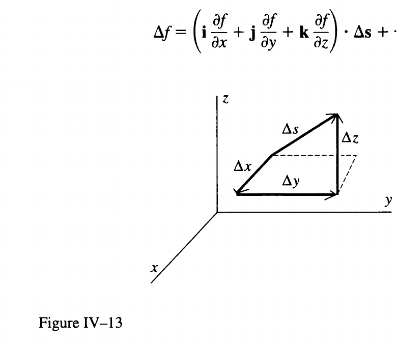

*Figure IV-13*

Description: A three-dimensional displacement is decomposed into Cartesian components $\Delta x$, $\Delta y$, and $\Delta z$, with the resultant vector labeled $\Delta s$.

To obtain the gradient of a scalar function in cylindrical coordinates we proceed in much the same way:

1. We consider a scalar function of three cylindrical coordinates, $f(r,\theta,z)$. Using Taylor series, we find the change in $f$ due to a displacement from the point $(r,\theta,z)$ to a second point $(r+\Delta r,\theta+\Delta\theta,z+\Delta z)$:

$$
\Delta f = \frac{\partial f}{\partial r}\Delta r + \frac{\partial f}{\partial \theta}\Delta\theta + \frac{\partial f}{\partial z}\Delta z + \cdots.
$$

2. Next, we write $\Delta f$ in terms of $\Delta\mathbf{s}$. This is the heart of the calculation. From Figure IV-14 we have

$$
\Delta\mathbf{s}=\hat{\mathbf{e}}_r\,\Delta r + \hat{\mathbf{e}}_\theta\,r\Delta\theta + \hat{\mathbf{e}}_z\,\Delta z.
$$

Two features of this expression require some discussion. First, the displacement in the direction of increasing $\theta$ (of magnitude $r\Delta\theta$) is an arc of a circle rather than a straight line segment. However, since we will eventually pass to the limit as $\Delta s\to 0$, we may regard $\Delta\theta$ (as well as $\Delta r$ and $\Delta z$) as arbitrarily small, in which case the arc is arbitrarily close to its subtending chord. Thus, as indicated in Figure IV-15, $\Delta r$, $r\Delta\theta$, and $\Delta z$ approximate to any desired degree of accuracy three mutually perpendicular displacements, the analogs of the three Cartesian displacements $\Delta x$, $\Delta y$, and $\Delta z$.

The second feature of our expression for $\Delta\mathbf{s}$ that requires comment also has to do with the displacement in the direction of increasing $\theta$. It is this: Since the arc is part of a circle of radius $r+\Delta r$, we should, strictly speaking, write the displacement as $(r+\Delta r)\Delta\theta$, not $r\Delta\theta$. But the additional term $\Delta r\Delta\theta$ is "second order"; that is, it is the product of two small quantities and therefore negligible compared with $r\Delta\theta$.

If we now write our expression for $\Delta f$ in terms of $\Delta\mathbf{s}$, we get

$$
\Delta f = \left(\hat{\mathbf{e}}_r\frac{\partial f}{\partial r} + \hat{\mathbf{e}}_\theta\frac{1}{r}\frac{\partial f}{\partial \theta} + \hat{\mathbf{e}}_z\frac{\partial f}{\partial z}\right)\cdot\Delta\mathbf{s}+\cdots.
$$

Note the factor $1/r$ in the second term to compensate for the factor $r$ in $\hat{\mathbf{e}}_\theta r\Delta\theta$ in $\Delta\mathbf{s}$.

3. Finally, putting $\Delta\mathbf{s}=\hat{\mathbf{u}}\,\Delta s$, we find

$$
\lim_{\Delta s\to 0}\frac{\Delta f}{\Delta s} \equiv \frac{df}{ds} = \left(\hat{\mathbf{e}}_r\frac{\partial f}{\partial r} + \hat{\mathbf{e}}_\theta\frac{1}{r}\frac{\partial f}{\partial \theta} + \hat{\mathbf{e}}_z\frac{\partial f}{\partial z}\right)\cdot\hat{\mathbf{u}}.
$$

The quantity in the preceding expression dotted into $\hat{\mathbf{u}}$ is the gradient of $f$ in cylindrical coordinates.

An analogous procedure can be used to find the gradient in spherical coordinates; this has been left as an exercise (see Problem IV-22).

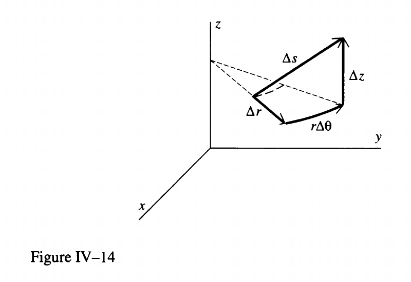

*Figure IV-14*

Description: A cylindrical-coordinate displacement is resolved into components $\Delta r$, $r\Delta\theta$, and $\Delta z$, with the resulting vector labeled $\Delta s$.

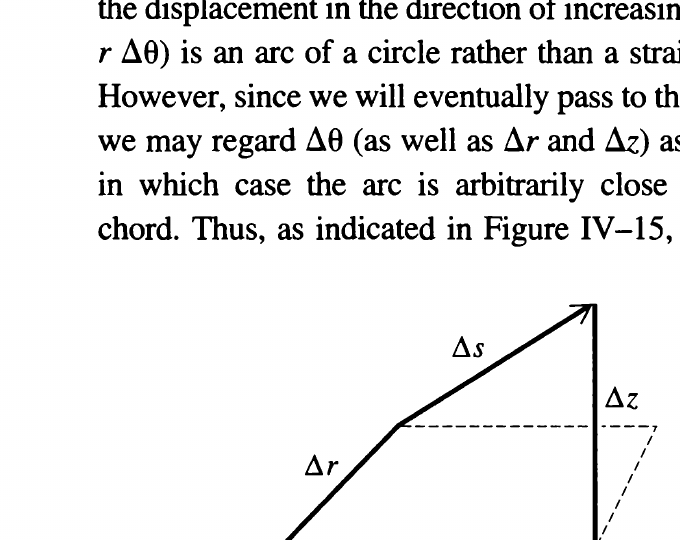

*Figure IV-15*

Description: The small cylindrical-coordinate displacements $\Delta r$, $r\Delta\theta$, and $\Delta z$ are shown as three approximately perpendicular sides used to approximate the total displacement $\Delta s$.

## Problems

**IV-1**

(a) Calculate $\mathbf{F}=\nabla f$ for each of the following scalar functions:

1. $f=xyz$.
2. $f=x^2+y^2+z^2$.
3. $f=xy+yz+xz$.
4. $f=3x^2-4z^2$.
5. $f=e^{-x}\sin y$.

(b) Verify that

$$
\oint_C \mathbf{F}\cdot\hat{\mathbf{t}}\,ds=0
$$

for one or more of the functions $\mathbf{F}$ determined in part (a) choosing for the curve $C$:

1. the square in the $xy$-plane with vertices at $(0,0)$, $(1,0)$, $(1,1)$, and $(0,1)$,
2. the triangle in the $yz$-plane with vertices at $(0,0)$, $(1,0)$, and $(0,1)$,
3. the circle of unit radius centered at the origin and lying in the $xz$-plane.

(c) Verify by direct calculation that $\nabla\times\mathbf{F}=0$ for one or more of the functions $\mathbf{F}$ determined in part (a).

**IV-2** Verify the following identities in which $f$ and $g$ are arbitrary differentiable scalar functions of position, and $\mathbf{F}$ and $\mathbf{G}$ are arbitrary differentiable vector functions of position.

(a) $\nabla(fg)=f\nabla g+g\nabla f$.

(b) $\nabla(\mathbf{F}\cdot\mathbf{G})=(\mathbf{G}\cdot\nabla)\mathbf{F}+(\mathbf{F}\cdot\nabla)\mathbf{G}+\mathbf{F}\times(\nabla\times\mathbf{G})+\mathbf{G}\times(\nabla\times\mathbf{F})$.

(c) $\nabla\cdot(f\mathbf{F})=f\nabla\cdot\mathbf{F}+\mathbf{F}\cdot\nabla f$.

(d) $\nabla\cdot(\mathbf{F}\times\mathbf{G})=\mathbf{G}\cdot(\nabla\times\mathbf{F})-\mathbf{F}\cdot(\nabla\times\mathbf{G})$.

(e) $\nabla\times(f\mathbf{F})=f\nabla\times\mathbf{F}+(\nabla f)\times\mathbf{F}$.

(f) $\nabla\times(\mathbf{F}\times\mathbf{G})=(\mathbf{G}\cdot\nabla)\mathbf{F}-(\mathbf{F}\cdot\nabla)\mathbf{G}+\mathbf{F}(\nabla\cdot\mathbf{G})-\mathbf{G}(\nabla\cdot\mathbf{F})$.

(g) $\nabla\times(\nabla\times\mathbf{F})=\nabla(\nabla\cdot\mathbf{F})-\nabla^2\mathbf{F}$.

**IV-3** Show that $\nabla\times\nabla f=0$ where $f(x,y,z)$ is an arbitrary differentiable scalar function. Assume that mixed second-order partial derivatives are independent of the order of differentiation. For example,

$$
\frac{\partial^2 f}{\partial x\,\partial z}=\frac{\partial^2 f}{\partial z\,\partial x}.
$$

**IV-4**

(a) Each of the following functions is smooth in a simply connected region. Determine which of them may be written as the gradient of a scalar function, and for those that can, use Equation (IV-2) to find that scalar function.

1. $\mathbf{F}=\mathbf{i}y$.
2. $\mathbf{F}=C\mathbf{k}$, $C$ a constant.
3. $\mathbf{F}=\mathbf{i}yz+\mathbf{j}xz+\mathbf{k}xy$.
4. $\mathbf{F}=\mathbf{i}x+\mathbf{j}y+\mathbf{k}z$.
5. $\mathbf{F}=\mathbf{i}e^{-z}\sin y+\mathbf{j}e^{-y}\sin z+\mathbf{k}e^{-x}\sin y$.

(b) Neither of the following functions is smooth everywhere. Nonetheless each can be written as the gradient of a scalar function. Use Equation (IV-2) to find that scalar function.

1. $\mathbf{F}=\mathbf{r}/r^2$, $\mathbf{r}=\mathbf{i}x+\mathbf{j}y$.
2. $\mathbf{F}=\mathbf{r}/r^{1/2}$, $\mathbf{r}=\mathbf{i}x+\mathbf{j}y+\mathbf{k}z$.

**IV-5** The function $\mathbf{F}(r,\theta,z)$ defined in Problem III-17 is smooth and has zero curl in a nonsimply connected region consisting of all of three-dimensional space with the $z$-axis removed. Show that there is no scalar function $\psi$ such that $\mathbf{F}=\nabla\psi$ by evaluating the line integral of $\mathbf{F}\cdot\hat{\mathbf{t}}$ from the point $P_1(0,-1,0)$ to the point $P_2(0,1,0)$ over two different paths: $C_R$, the right-hand side of the circle of radius 1 lying in the $xy$-plane and centered at the origin (see figure), and $C_L$, the left-hand side of the same circle. Orient the paths as shown. Why does the fact that the two paths give different results imply that there is no scalar function $\psi$ such that $\mathbf{F}=\nabla\psi$?

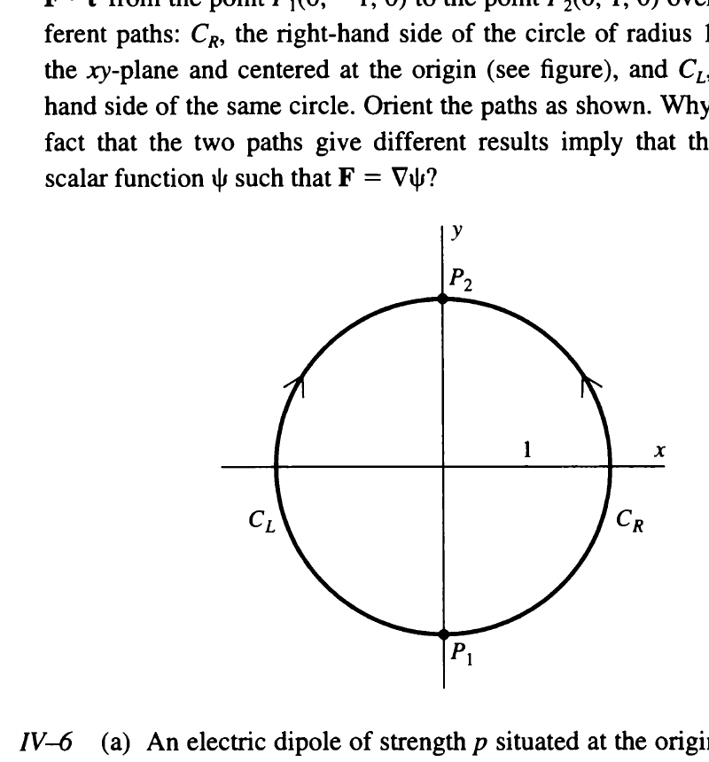

*Problem IV-5 Figure*

Description: A unit circle in the $xy$-plane is centered at the origin, with $P_1$ at the bottom and $P_2$ at the top, and the right-hand and left-hand semicircular paths labeled $C_R$ and $C_L$ with arrows showing the orientation from $P_1$ to $P_2$.

**IV-6**

(a) An electric dipole of strength $p$ situated at the origin and oriented in the positive $z$-direction gives rise to an electrostatic field

$$
\mathbf{E}(r,\theta,\phi)=\frac{1}{4\pi\epsilon_0}\frac{p}{r^3}\left(2\hat{\mathbf{e}}_r\cos\phi+\hat{\mathbf{e}}_\phi\sin\phi\right).
$$

Use Equation (IV-2) to show that the dipole potential is given by

$$
\Phi(r,\theta,\phi)=\frac{1}{4\pi\epsilon_0}\frac{p\cos\phi}{r^2}.
$$

Useful information: In spherical coordinates,

$$
\hat{\mathbf{t}}=\hat{\mathbf{e}}_r\frac{dr}{ds}+\hat{\mathbf{e}}_\phi\,r\frac{d\phi}{ds}+\hat{\mathbf{e}}_\theta\,r\sin\phi\frac{d\theta}{ds}.
$$

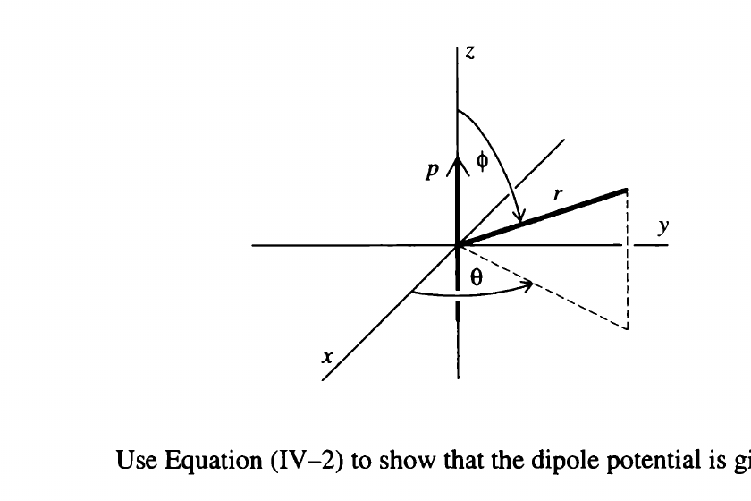

*Problem IV-6 Figure*

Description: A dipole moment vector $p$ points upward along the $z$-axis at the origin, while the spherical coordinates of a point are indicated by the radial vector $r$, the polar angle $\phi$ from the $z$-axis, and the azimuthal angle $\theta$ about the axis.

(b) Calculate the flux of the dipole field through a sphere of radius $R$ centered at the origin.

(c) What is the flux of the dipole field over any closed surface that does not pass through the origin?

**IV-7** Here is a "proof" that there is no such thing as magnetism. One of Maxwell's equations tells us that

$$
\nabla\cdot\mathbf{B}=0,
$$

where $\mathbf{B}$ is any magnetic field. Then using the divergence theorem, we find

$$
\iint_S \mathbf{B}\cdot\hat{\mathbf{n}}\,dS=\iiint_V \nabla\cdot\mathbf{B}\,dV=0.
$$

Because $\mathbf{B}$ has zero divergence, we know (see Problem III-24) there exists a vector function, call it $\mathbf{A}$, such that

$$
\mathbf{B}=\nabla\times\mathbf{A}.
$$

Combining these last two equations, we get

$$
\iint_S \hat{\mathbf{n}}\cdot\nabla\times\mathbf{A}\,dS=0.
$$

Next we apply Stokes' theorem and the preceding result to find

$$
\oint_C \mathbf{A}\cdot\hat{\mathbf{t}}\,ds=\iint_S \hat{\mathbf{n}}\cdot\nabla\times\mathbf{A}\,dS=0.
$$

Thus we have shown that the circulation of $\mathbf{A}$ is path independent. It follows that we can write $\mathbf{A}=\nabla\psi$, where $\psi$ is some scalar function. Since the curl of the gradient of a function is zero, we arrive at the remarkable fact that

$$
\mathbf{B}=\nabla\times\nabla\psi=0;
$$

that is, all magnetic fields are zero! Where did we go wrong? [Taken from G. Arfken, *Amer. J. Phys.*, **27**, 526 (1959).]

**IV-8** Fick's law states that in certain diffusion processes the current density $\mathbf{J}$ is proportional to the negative of the gradient of the density $\rho$; that is,

$$
\mathbf{J}=-k\nabla\rho,
$$

where $k$ is a positive constant. If a substance of density $\rho(x,y,z,t)$ and velocity $\mathbf{v}(x,y,z,t)$ diffuses according to Fick's law, show that the flow is *irrotational* (that is, $\nabla\times\mathbf{v}=0$).

**IV-9**

(a) A substance diffuses according to Fick's law (see Problem IV-8). Assuming the diffusing matter is conserved, derive the diffusion equation

$$
\frac{\partial\rho}{\partial t}=k\nabla^2\rho.
$$

(b) Bacteria of density $\rho$ diffuse in a medium according to Fick's law and reproduce at a rate $\lambda\rho$ per unit volume ($\lambda$ is a positive constant). Show that

$$
\frac{\partial\rho}{\partial t}=k\nabla^2\rho+\lambda\rho.
$$

**IV-10**

(a) A fluid is said to be *incompressible* if its density $\rho$ is a constant (that is, is independent of $x$, $y$, $z$, and $t$). Use the continuity equation to show that the velocity $\mathbf{v}$ of an incompressible fluid satisfies the equation $\nabla\cdot\mathbf{v}=0$.

(b) If $\nabla\times\mathbf{v}=0$, the fluid flow is said to be *irrotational*. Show that for an incompressible fluid undergoing irrotational flow,

$$
\nabla^2\phi=0,
$$

where $\phi$, a scalar function called the *velocity potential*, is so defined that $\mathbf{v}=\nabla\phi$.

**IV-11** The heat $Q$ in a body of volume $V$ is given by

$$
Q=c\iiint_V T\rho\,dV,
$$

where $c$ is a constant called the specific heat of the body, and $T(x,y,z,t)$ and $\rho(x,y,z)$ are, respectively, the temperature and density of the body. (Note that we are assuming the density to be independent of time.) The rate at which heat flows through $S$, the bounding surface of the body, is given by

$$
\frac{dQ}{dt}=k\iint_S \hat{\mathbf{n}}\cdot\nabla T\,dS,
$$

where $k$ (assumed constant) is the thermal conductivity of the body, and the integral is taken over the surface $S$ bounding the body. Use these facts to derive the heat flow equation

$$
\nabla^2 T=\alpha\frac{\partial T}{\partial t},
$$

where $\alpha=c\rho/k$.

**IV-12** In nonrelativistic quantum mechanics a particle of mass $m$ moving in a potential $V(x,y,z)$ is described by the Schrodinger equation

$$
-\frac{\hbar^2}{2m}\nabla^2\psi+V\psi=i\hbar\frac{\partial\psi}{\partial t},
$$

where $\hbar$ is Planck's constant divided by $2\pi$ and $\psi(x,y,z,t)$, which is complex, is called the wave function. The quantity $\rho=\psi^*\psi$ is interpreted as the probability density.

(a) Use the Schrodinger equation to derive an equation of the form

$$
\frac{\partial\rho}{\partial t}+\nabla\cdot\mathbf{J}=0
$$

and obtain thereby an expression for $\mathbf{J}$ in terms of $\psi$, $\psi^*$, $m$, and $\hbar$.

(b) Give an interpretation of $\mathbf{J}$ and of the equation derived in (a).

**IV-13**

(a) Find the charge density $\rho(x,y,z)$ that produces the electric field

$$
\mathbf{E}=g(\mathbf{i}x+\mathbf{j}y+\mathbf{k}z),
$$

where $g$ is a constant.

(b) Find an electrostatic potential $\Phi$ such that $-\nabla\Phi$ is the field $\mathbf{E}$ given in (a).

(c) Verify that $\nabla^2\Phi=-\rho/\epsilon_0$.

**IV-14**

(a) Starting with the divergence theorem, derive the equation

$$
\iint_S \hat{\mathbf{n}}\cdot(u\nabla v)\,dS=\iiint_V [u\nabla^2 v+(\nabla u)\cdot(\nabla v)]\,dV,
$$

where $u$ and $v$ are scalar functions of position and $S$ is a closed surface enclosing the volume $V$. This is sometimes called the first form of Green's theorem.

(b) If $\nabla^2 u=0$ use the first form of Green's theorem to show that

$$
\iint_S \hat{\mathbf{n}}\cdot(u\nabla u)\,dS=\iiint_V |\nabla u|^2\,dV,
$$

where $|\nabla u|^2=(\nabla u)\cdot(\nabla u)$.

(c) Use the first form of Green's theorem to show that

$$
\iint_S \hat{\mathbf{n}}\cdot(u\nabla v-v\nabla u)\,dS=\iiint_V (u\nabla^2 v-v\nabla^2 u)\,dV.
$$

This is the second form of Green's theorem.

**IV-15** An equation of the form

$$
\nabla^2 f=\frac{1}{v^2}\frac{\partial^2 f}{\partial t^2},
$$

where $f$ is a twice-differentiable function of position and time, is called a wave equation. It describes a wave propagating in space with velocity $v$. Use Maxwell's equations (Problem III-20) to show that in the absence of charges and currents (that is, $\rho$ and $\mathbf{J}$ both zero), all three Cartesian components of both $\mathbf{E}$ and $\mathbf{B}$ satisfy a wave equation with $v=c$, where

$$
c=\frac{1}{\sqrt{\epsilon_0\mu_0}}
$$

is the velocity of light. For example,

$$
\nabla^2 E_x=\frac{1}{c^2}\frac{\partial^2 E_x}{\partial t^2}.
$$

Thus, the existence of electromagnetic waves traveling in empty space with the velocity of light is a consequence of Maxwell's equations.

**IV-16**

(a) In the text we found the potential and field for the case of an infinite cylinder between parallel plates with the cylinder held at zero potential. How must the solution be modified if the cylinder is held at a potential $V_0\neq 0$?

(b) Show that there is no net charge on the cylinder.

**IV-17**

(a) A sphere of radius $R$ is situated between two very large parallel plates that are separated by a distance $s$. A potential difference is maintained between the plates and the sphere is held at zero potential. Find the potential and field everywhere outside the sphere and between the plates. Assume that $R\ll s$.

(b) Show that there is no net charge on the sphere.

(c) Repeat part (a) assuming the sphere is held at a potential $V_0\neq 0$.

**IV-18** Let $f(x,y)$ be a differentiable scalar function of $x$ and $y$, and let

$$
\hat{\mathbf{u}}=\mathbf{i}\cos\theta+\mathbf{j}\sin\theta.
$$

Transform to a rotated coordinate system $x'$, $y'$ such that $x'$ is parallel to $\hat{\mathbf{u}}$ (see the figure). Show that the directional derivative in the direction of $\hat{\mathbf{u}}$ is given by

$$
\frac{df}{ds}=\hat{\mathbf{u}}\cdot\nabla f=\frac{\partial f}{\partial x'}.
$$

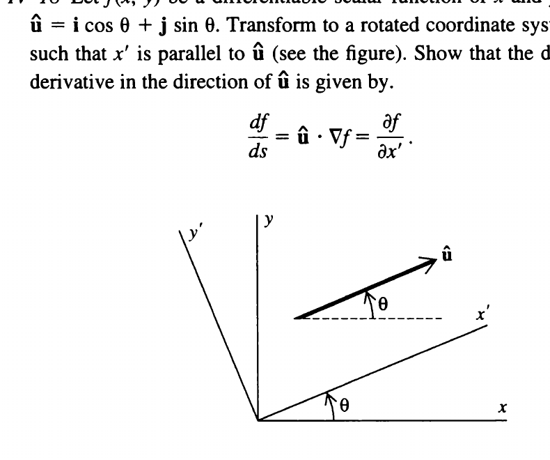

*Problem IV-18 Figure*

Description: The original $x$ and $y$ axes and a rotated $x'$,$y'$ system share the same origin, with the unit vector $\hat{\mathbf{u}}$ drawn along the $x'$ direction and both rotations marked by the angle $\theta$.

**IV-19** You are at a point $(a,b,c)$ on the surface

$$
z=(r^2-x^2-y^2)^{1/2} \qquad (z\geq 0).
$$

Assuming both $a$ and $b$ are positive, in what direction must you move

(a) so that the rate of change of $z$ will be zero?

(b) so that the rate of increase of $z$ will be greatest?

(c) so that the rate of decrease of $z$ will be greatest?

Draw a sketch to show the geometric significance of your answers.

**IV-20** The unit vector normal to the surface $z=f(x,y)$ is given by

$$
\hat{\mathbf{n}}=\frac{-\mathbf{i}\,\partial f/\partial x-\mathbf{j}\,\partial f/\partial y+\mathbf{k}}{\sqrt{1+(\partial f/\partial x)^2+(\partial f/\partial y)^2}}
$$

[see Equation (II-4)]. We have also established that $\nabla F$ is a vector normal to the surface $F(x,y,z)=\text{const.}$ (page 140) so that $\nabla F/|\nabla F|$ is a unit vector normal to the surface $F(x,y,z)=\text{const.}$ Show that these two expressions for the unit normal vector are identical if $F(x,y,z)=\text{const.}$ and $z=f(x,y)$ describe the same surface.

**IV-21** Use the results of Problem II-18 and the expression for the gradient in cylindrical coordinates (see page 144) to obtain the form of the Laplacian in cylindrical coordinates given on page 129.

**IV-22** Using the procedure outlined in the text (pages 141-144) obtain the expression for the gradient of $\psi$ in spherical coordinates:

$$
\nabla\psi=\hat{\mathbf{e}}_r\frac{\partial\psi}{\partial r}+\hat{\mathbf{e}}_\phi\frac{1}{r}\frac{\partial\psi}{\partial\phi}+\hat{\mathbf{e}}_\theta\frac{1}{r\sin\phi}\frac{\partial\psi}{\partial\theta}.
$$

**IV-23** Use the results of Problem II-19 and the expression for the gradient in spherical coordinates derived in Problem IV-22 to obtain the form of the Laplacian in spherical coordinates given on page 126.

**IV-24** Suppose you find a solution of Laplace's equation that satisfies certain boundary conditions. Is this solution unique or are there others? This problem will answer that question in certain simple cases. Consider the region of space completely enclosed by a surface $S_0$ and containing in its interior objects 1, 2, 3, $\ldots$ (two of which are pictured in the diagram). Suppose that $S_0$ is maintained at a constant potential $\Phi_0$, object no. 1 at $\Phi_1$, object no. 2 at $\Phi_2$, and so on. Then in the charge-free region $R$ enclosed by $S_0$ and between the objects, the potential must satisfy Laplace's equation

$$
\nabla^2\Phi=0
$$

and the boundary conditions

$$
\Phi=\begin{cases}
\Phi_0 & \text{on } S_0,\\
\Phi_1 & \text{on } S_1,\\
\Phi_2 & \text{on } S_2,\\
\vdots
\end{cases}
$$

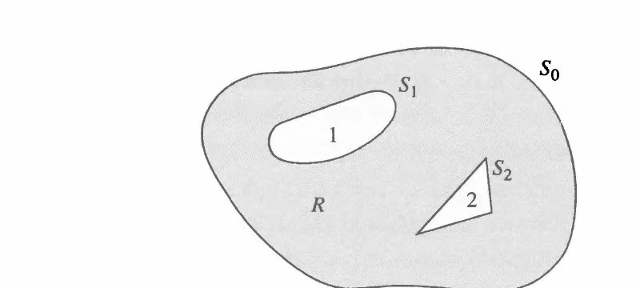

*Problem IV-24 Figure*

Description: A shaded region $R$ bounded externally by $S_0$ contains two internal objects, labeled 1 and 2, bounded by surfaces $S_1$ and $S_2$.

The following steps will guide you through a proof that $\Phi$ is unique.

(a) Assume that there are two potentials $u$ and $v$, both of which satisfy Laplace's equation and the boundary conditions listed earlier. Form their difference $w=u-v$. Show that $\nabla^2 w=0$ in $R$.

(b) What are the boundary conditions satisfied by $w$?

(c) Apply the divergence theorem to

$$
\iint_S \hat{\mathbf{n}}\cdot(w\nabla w)\,dS,
$$

where the integration is carried out over the surface $S_0+S_1+S_2+\cdots$, and show thereby that

$$
\iiint_V |\nabla w|^2\,dV=0,
$$

where $V$ is the volume of the region $R$.

(d) From the result of (c) argue that $\nabla w=0$ and that this, in turn, means $w$ is a constant.

(e) If $w$ is a constant, what is its value? (Use the boundary conditions on $w$ to answer this.) What does this say about $u$ and $v$?

(f) The uniqueness proof outlined in (a) to (e) involves specifying the value of the potential on various surfaces. Might we have specified a different kind of boundary condition and still proved uniqueness? If so, in what way or ways would the proof and the result differ from those given above?

**IV-25** In the text we defined the gradient in terms of certain partial derivatives. It is possible to give an alternative definition similar in form to our definitions of the divergence and the curl. Thus,

$$
\nabla f=\lim_{\Delta V\to 0}\frac{1}{\Delta V}\iint_S \hat{\mathbf{n}}f\,dS.
$$

Here $f$ is a scalar function of position, $S$ a closed surface, and $\Delta V$ the volume it encloses. As usual, $\hat{\mathbf{n}}$ is a unit vector normal to $S$ and pointing out from the enclosed volume.

(a) Following a procedure similar to the one used in the text in treating the divergence, integrate over a "cuboid" and show that the preceding definition yields the expression

$$
\nabla f=\mathbf{i}\frac{\partial f}{\partial x}+\mathbf{j}\frac{\partial f}{\partial y}+\mathbf{k}\frac{\partial f}{\partial z}.
$$

(b) Use the alternative definition of the gradient given above to show that the directional derivative of $f$ in the direction specified by the unit vector $\hat{\mathbf{u}}$ is given by

$$
\frac{df}{ds}=\hat{\mathbf{u}}\cdot\nabla f.
$$

[Hint: Evaluate

$$
\hat{\mathbf{u}}\cdot\iint_S \hat{\mathbf{n}}f\,dS=\iint_S \hat{\mathbf{u}}\cdot\hat{\mathbf{n}}f\,dS
$$

over a small cylinder (length $\Delta s$, cross-sectional area $\Delta A$; see figure) whose axis is in the direction of the constant unit vector $\hat{\mathbf{u}}$. Then divide by the volume of the cylinder ($\Delta s\,\Delta A$) and take the limit as the volume approaches zero.]

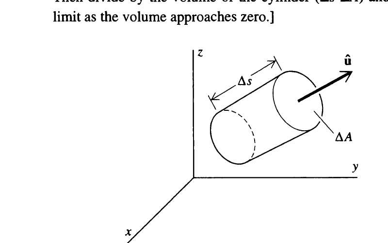

*Problem IV-25(a) Figure*

Description: A small cylinder in three-dimensional space has axis length $\Delta s$, end area $\Delta A$, and axis directed along the unit vector $\hat{\mathbf{u}}$.

(c) Arguing as we did in the text in establishing the divergence theorem, use the alternative definition of the gradient to show that

$$
\iint_S \hat{\mathbf{n}}f\,dS=\iiint_V \nabla f\,dV,
$$

where $S$ is a closed surface enclosing the volume $V$.

(d) Obtain the relation stated in (c) directly from the divergence theorem. [Hint: In $\iint_S \mathbf{F}\cdot\hat{\mathbf{n}}\,dS=\iiint_V \nabla\cdot\mathbf{F}\,dV$ put $\mathbf{F}=\hat{\mathbf{e}}f$ where $\hat{\mathbf{e}}$ is a constant unit vector.]

(e) Verify the relation stated in (c) for the scalar function

$$
f=x^2+y^2+z^2
$$

integrating over the unit cylinder shown in the figure.

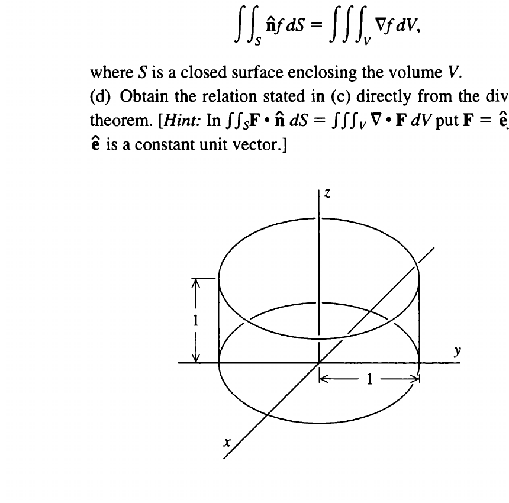

*Problem IV-25(b) Figure*

Description: A unit cylinder is drawn with the $z$-axis through its center, unit height marked vertically, and unit radius marked along the base.

**IV-26**

(a) Consider a surface $z=f(x,y)$. Let $\mathbf{u}$ be a vector of arbitrary length tangent to the surface at a point $P(x,y,z)$ in the direction of the unit vector $\hat{\mathbf{p}}=\mathbf{i}p_x+\mathbf{j}p_y$ as indicated in the figure. Use the directional derivative to show that

$$
\mathbf{u}=\hat{\mathbf{p}}+\mathbf{k}(\hat{\mathbf{p}}\cdot\nabla f),
$$

where $\nabla f$ is evaluated at $(x,y)$. [Note: Since the length of $\mathbf{u}$ is arbitrary, your result may differ from the preceding by some positive multiplicative constant.]

(b) Let $\mathbf{v}$ be a second vector of arbitrary length tangent to the surface at $P$ but in the direction of the unit vector $\hat{\mathbf{q}}=\mathbf{i}q_x+\mathbf{j}q_y$ ($\hat{\mathbf{p}}\neq\hat{\mathbf{q}}$). Then from (a) we have

$$
\mathbf{v}=\hat{\mathbf{q}}+\mathbf{k}(\hat{\mathbf{q}}\cdot\nabla f).
$$

Show that

$$
\mathbf{u}\times\mathbf{v}=[\mathbf{k}\cdot(\hat{\mathbf{p}}\times\hat{\mathbf{q}})](\mathbf{k}-\nabla f)
$$

and use this to rederive Equation (II-4) for the unit vector $\hat{\mathbf{n}}$ normal to the surface $z=f(x,y)$ at $(x,y,z)$. This shows that the result derived in the text for $\hat{\mathbf{n}}$ is unique (apart from sign) even though it was obtained with the special choices $\hat{\mathbf{p}}=\mathbf{i}$ and $\hat{\mathbf{q}}=\mathbf{j}$.

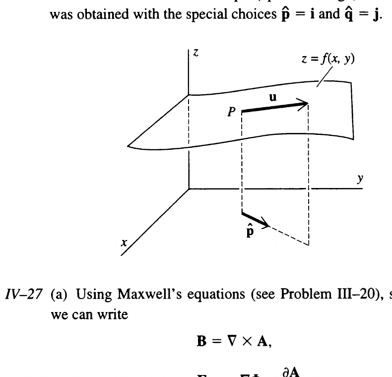

*Problem IV-26 Figure*

Description: A sloping surface $z=f(x,y)$ contains a point $P$ where a tangent vector $\mathbf{u}$ lies on the surface, while the projected direction $\hat{\mathbf{p}}$ is shown in the $xy$-plane below.

**IV-27**

(a) Using Maxwell's equations (see Problem III-20), show that we can write

$$
\mathbf{B}=\nabla\times\mathbf{A},
$$

$$
\mathbf{E}=-\nabla\Phi-\frac{\partial\mathbf{A}}{\partial t},
$$

where $\mathbf{A}$ (called the vector potential) is some vector function of position and time, and $\Phi$ (the scalar potential) is some scalar function of position and time, provided $\mathbf{A}$ and $\Phi$ satisfy the equations

$$
\nabla^2\Phi+\frac{\partial}{\partial t}(\nabla\cdot\mathbf{A})=-\rho/\epsilon_0,
$$

$$
\nabla^2\mathbf{A}-\mu_0\epsilon_0\frac{\partial^2\mathbf{A}}{\partial t^2}=-\mu_0\mathbf{J}+\nabla\left[\nabla\cdot\mathbf{A}+\mu_0\epsilon_0\frac{\partial\Phi}{\partial t}\right].
$$

(b) Show that if we define two new potentials

$$
\mathbf{A}'=\mathbf{A}+\nabla\chi,
$$

$$
\Phi'=\Phi-\frac{\partial\chi}{\partial t},
$$

where $\chi$ is an arbitrary scalar function of position and time, then

$$
\mathbf{B}=\nabla\times\mathbf{A}',
$$

$$
\mathbf{E}=-\nabla\Phi'-\frac{\partial\mathbf{A}'}{\partial t}.
$$

That is, the fields $\mathbf{E}$ and $\mathbf{B}$ are not modified by the change in the potentials $\mathbf{A}$ and $\Phi$. The change from $(\mathbf{A},\Phi)$ to $(\mathbf{A}',\Phi')$ is called a *gauge transformation*.

(c) Show that if we require $\chi$ to satisfy the equation

$$
\nabla^2\chi-\epsilon_0\mu_0\frac{\partial^2\chi}{\partial t^2}=-\left[\nabla\cdot\mathbf{A}+\epsilon_0\mu_0\frac{\partial\Phi}{\partial t}\right],
$$

then

$$
\nabla\cdot\mathbf{A}'+\epsilon_0\mu_0\frac{\partial\Phi'}{\partial t}=0.
$$

(d) If $\chi$ satisfies the equation given in (c), show that $\mathbf{A}'$ and $\Phi'$ satisfy the equations

$$
\nabla^2\Phi'-\epsilon_0\mu_0\frac{\partial^2\Phi'}{\partial t^2}=-\rho/\epsilon_0
$$

and

$$
\nabla^2\mathbf{A}'-\epsilon_0\mu_0\frac{\partial^2\mathbf{A}'}{\partial t^2}=-\mu_0\mathbf{J}.
$$

The point to all of this is that we can make a gauge transformation [as in (b)], impose the condition given in (c), and thereby obtain a scalar and a vector potential that satisfy the equations in part (d), which are wave equations with source terms proportional to $\rho$ and $\mathbf{J}$.

**IV-28** The equation of motion of an ideal fluid can be written

$$
\iiint_V \rho\mathbf{f}_{\text{ext}}\,dV-\iint_S \hat{\mathbf{n}}p\,dS=\iiint_V \rho\left[\frac{\partial\mathbf{v}}{\partial t}+(\mathbf{v}\cdot\nabla)\mathbf{v}\right]dV
$$

where $V$ is the volume of the fluid and $S$ is its surface. Here $\mathbf{f}_{\text{ext}}(x,y,z)$ is the external force per unit mass acting on the fluid, $p(x,y,z)$ is the pressure of the fluid, and $\rho(x,y,z)$ is its density, all at a point $(x,y,z)$ in the fluid, and $\mathbf{v}(x,y,z,t)$ is the velocity of the fluid at the point $(x,y,z)$ and at time $t$.

(a) Use the form of the divergence theorem given in Problem IV-25(c) to rewrite the equation of motion of an ideal fluid in the form

$$
\mathbf{f}_{\text{ext}}-\frac{1}{\rho}\nabla p=\frac{\partial\mathbf{v}}{\partial t}+(\mathbf{v}\cdot\nabla)\mathbf{v}.
$$

(b) Show that in the static case ($\mathbf{v}=0$), the equation of motion becomes

$$
\mathbf{f}_{\text{ext}}=(1/\rho)\nabla p.
$$

(c) Consider a column of incompressible fluid oriented vertically parallel to the $z$-axis as shown in the figure. Assuming that the only external force acting on the fluid is the downward uniform gravitational attraction of the earth, apply the equation for the static case given in (b) to show that

$$
p=p_0-\rho gz
$$

where $g$ is the acceleration due to gravity and $p_0$ is a constant.

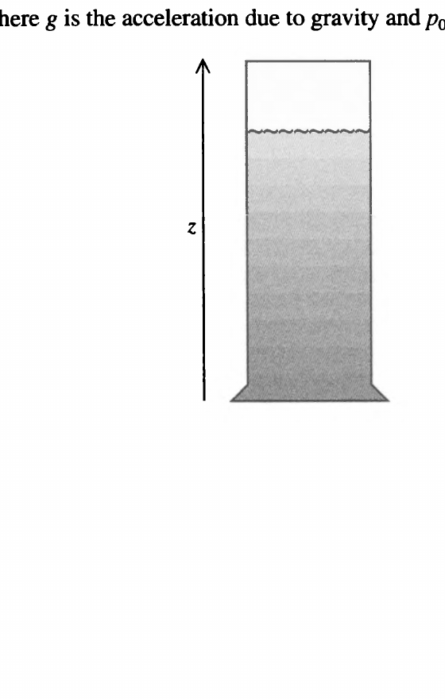

*Problem IV-28 Figure*

Description: A vertical column of fluid is shown with the free surface near the top and the coordinate axis $z$ increasing upward alongside the column.

[^1]: The negative sign in this equation is not put there just to make life more difficult; there is a good reason for it. See the discussion on page 139.
[^2]: This section is not essential to what follows and may be omitted.
[^3]: The connection between this property of the gradient and our earlier expression for the unit vector normal to a surface [Equation (II-4)] is the subject of Problem IV-20.
[^4]: The calculation outlined here pertains to a function of three variables and is a simple generalization of the calculation on pages 130-133, which deals with a function of two variables.
