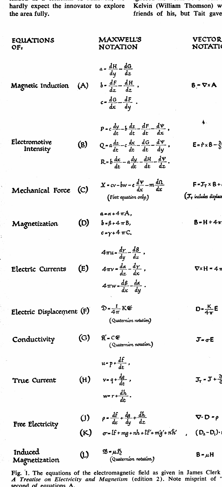
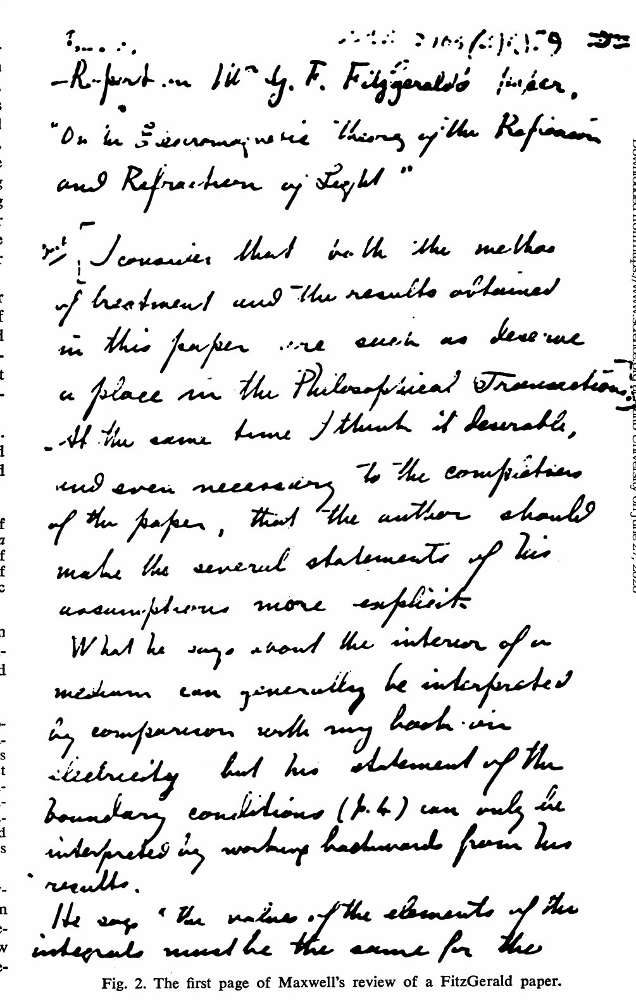
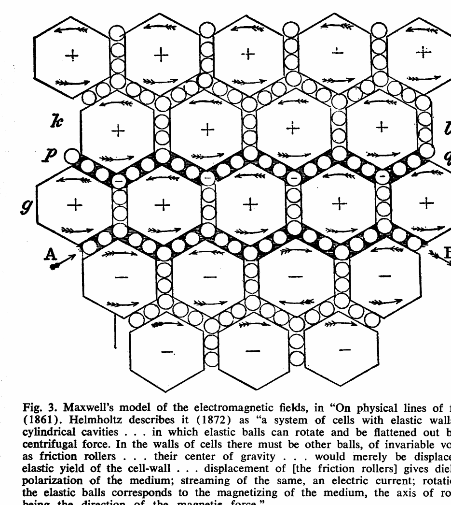
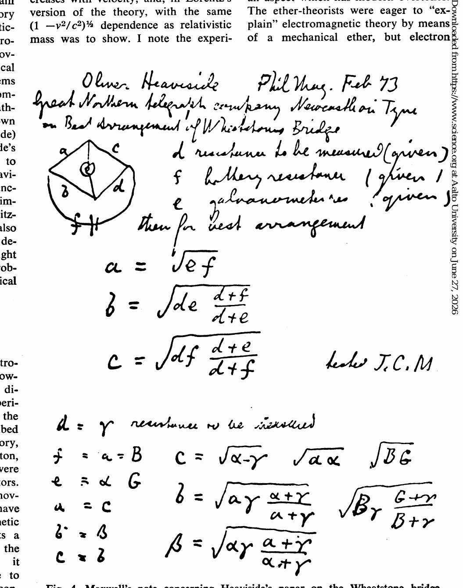
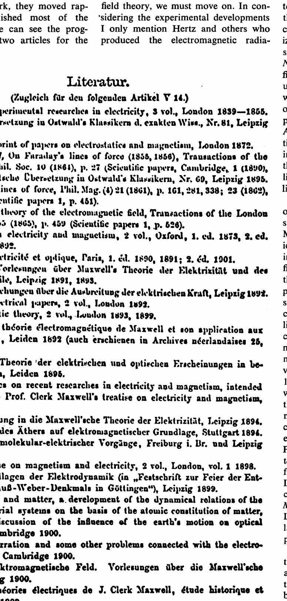

# Physics Just Before Einstein

Alfred M. Bork

Science 152 (3722), 597-603. DOI: 10.1126/science.152.3722.597

The development of electromagnetic theory was a major activity in physics before relativity theory.

Albert Einstein's 1905 paper on relativity has usually (1) been viewed as the epitome of a scientific revolution. Here it is my intention to examine some aspects of physics in the period before the special theory of relativity was proposed. A catalog of occurrences during this period would be uninteresting and misleading, since not all the occurrences are of equal importance. As often happens, however, a particular line of development is dominant, shaping the physics of the time and determining the interesting problems. Much of physics just before Einstein centered upon the development of one major physical theory, the electromagnetic theory. Physicists of the late 19th century were not concerned only with electromagnetic theory, but they centered their interest upon it. The existence of a central theory gives a focus for the discussion, and it gives a beginning point--James Clerk Maxwell's work on electromagnetic theory.

## James Clerk Maxwell

As one can hardly say that Maxwell himself came "just before Einstein," I review his work only briefly. Virtually all of Maxwell's exposition of electromagnetic theory is contained in the three major papers (2) of 1856, 1861-1862, and 1864, the minor paper of 1868, and the Treatise on Electricity and Magnetism (3), first published in 1873. The principal ideas of electromagnetic theory are contained in the second major paper, although a more polished version appears in the third paper and in the Treatise.

Maxwell knew that the Faraday-Maxwell approach to electricity differed from the continental approach in the concept of "field" (a word Maxwell used in the 1865 paper), as opposed to action at a distance; the 1868 paper was written to emphasize this distinction. The "action at a distance" school attempted to discuss only the forces on bodies, as in gravitational theory, while in the field concept the region, or the "field," between the bodies was also considered. Although some scientists have always objected to the field concept, usually on ontological grounds that fields are not "real," Maxwell's success in using this concept still influences the climate of physics today; since the 1930's the "guiding theory" of physics has been quantum field theory, combining field concepts with quantization.

We must be cognizant of the state of electromagnetic theory as Maxwell left it if we are to understand the contributions of the "followers of Maxwell." We should consider the basic equations of the theory as presented by Maxwell, and his applications. As the Treatise was by far the work of his best known to his successors, we consider the equations as formulated there; they are similar to those in the 1864 paper. Maxwell used both a component notation and a quaternion notation (not used before the Treatise). To facilitate comparison, Fig. 1 also displays his equations in a contemporary vector notation. A physicist familiar with the equations that are today called Maxwell's equations will immediately observe some contrasts. In the basic equations Maxwell used not only the electric and magnetic field quantities but also the potentials. He originally developed the concept of the vector potential to provide a mathematical representation of Faraday's electrotonic state (4), commenting (contrary to the contemporary view), that it "may even be called the fundamental quantity in the theory of electromagnetism (3, vol. 2, sect. 540)." The name vector potential appears for the first time in the Treatise. Some of the equations usually seen today, particularly the "div B" and "curl E" equations, are missing, although they follow from those presented. Maxwell was certainly conscious of stating more equations than are necessary (3, vol. 2, sect. 615).

> These may be regarded as the principal relations among the quantities we have been considering. They may be combined so as to eliminate some of these quantities, but our object at present is not to obtain compactness in the mathematical formulae, but to express every relation of which we have any knowledge. To eliminate a quantity which expresses a useful idea would be rather a loss than a gain in this stage of our inquiry.

Almost all Maxwell's development of the theory concerned the electromagnetic theory of light, as summarized in volume 2 of the Treatise, chapters 20 and 21. After deriving the wave equations for the vector potential, he compared the experimental values for the dielectric constants and indices of refraction for various substances. Maxwell stressed considerations of energy only slightly (although he believed firmly in the energy of the field), and he said little about the electromagnetic fields associated with particular sources. These comments are not intended as a criticism of Maxwell; we hardly expect the innovator to explore the area fully.

Fig. 1. The equations of the electromagnetic field as given in James Clerk Maxwell's *A Treatise on Electricity and Magnetism* (edition 2). Note misprint of "Z" in the second of equations A.

Maxwell's contemporaries largely ignored his work. P. G. Tait and Lord Kelvin (William Thomson) were close friends of his, but Tait gave no sign of understanding electromagnetic theory and Kelvin explicitly rejected it, even late in his life, long after Maxwell's death. But it is gratifying to note that Maxwell lived long enough to see others begin to use electromagnetic theory. Figure 2 shows the first page of Maxwell's review (5, p. 40) (the original is in the University Library, Cambridge) of a paper by FitzGerald concerning reflection and refraction of electromagnetic waves, a topic Maxwell mentioned (5, p. 25) in a letter to G. G. Stokes (15 October 1864) but never developed. Maxwell was aware of H. A. Lorentz's work on the subject; Lorentz in his doctoral thesis, completed in 1875, considered reflection and refraction.

## The Modifiers

In surveying work in electromagnetic theory from Maxwell's death in 1879 to the publication of Einstein's 1905 paper on relativity, it is useful to distinguish between those who attempted to modify or extend the theory and those who attempted to develop its consequences. This is not a hard-and-fast dichotomy, but it reflects a division often found in theoretical physics. As seen in retrospect, it seems that in this instance the developers made the major contributions to contemporary physics, but at that time this was not at all obvious, particularly in England. Nor do the developers of a theory always contribute more than the modifiers. We shall look first at the modifiers and extenders and then in more detail at the developers.

Helmholtz and Boltzmann produced their own versions of Maxwellian electrodynamics, and Curry's book (6), based on Boltzmann's lectures, spread these ideas to England. Perhaps we could best regard this work today as a transition on the continent from the "action at a distance" theories of Gauss, Weber, and Neumann to Hertz's work within the Maxwellian tradition.

We see a different trend in the English extenders of Maxwell, principally in Joseph Larmor and also, to a lesser extent, in J. J. Thompson, H. M. Macdonald, and Oliver Lodge. This group's principal concern is the ether (or "aether," as some preferred to spell it), a hypothetical medium in which electromagnetic energy was supposedly stored and in which electromagnetic waves traveled. Perhaps the apex was Larmor's influential book *Aether and Matter*, published in 1900 (7). Larmor expressed early enthusiasm about ether in a letter he wrote to Oliver Heaviside on 12 October 1893 (8):

> I fancy I have got a grip of the aether, as I am full of the matter. I begin by establishing in its entirety MacCulagh's theory of light, then include all electrical phenomena with the usual sort of reservations or assumptions (as regard dissipative actions), and end with Lord Kelvin's vortex theory of matter. Only gravitation stands now outside, and serves as a very useful *deus ex machina* to illuminate one knotty point.

Almost all these men, both the modifiers and the developers, believed in ether. Some stressed this but little, while others considered the properties of the ether to be the major unsolved problem of electromagnetic theory. Maxwell himself had used an elaborate model in his 1861 paper, involving vortices and idle wheels (something like ball bearings) (Fig. 3), but later abandoned it. He never gave up the hope of finding a mechanical basis for electromagnetic theory.

Belief in the existence of an ether did not depend upon acceptance of Maxwell's views on electricity and magnetism. Lord Kelvin is a good example of a non-Maxwellian who spent much of his life attempting unsuccessfully to develop the ether concept.

At the end of the Treatise (3, vol. 2, sects. 865, 866) Maxwell reviewed the "action at a distance" views and commented:

> There appears to be, in the minds of these eminent men, some prejudice, or a priori objection, against the hypothesis of a medium in which the phenomena of radiation of light and heat and the electric actions at a distance take place.

But he went on to argue that even this group, because they usually allowed finite time of propagation, used the ether concept implicitly:

> Hence all these theories lead to conception of a medium in which the propagation take place, and if we admit this medium as an hypothesis, I think it ought to occupy a prominent place in our investigations, and that we ought to endeavour to construct a mental representation of all the details of its action, and this has been my constant aim in this treatise.

The pervasiveness of the ether hypothesis in late 19th-century physics in England has often been noted. It reflects the underlying mechanistic view of reality, a view that had to be preserved at all costs.

## Vectors

It is somewhat difficult to understand today why 20 years elapsed between the original formulation of electromagnetic theory in the period 1861-65 and the early attempts to exploit the consequences of the theory. Textbook descriptions of science often leave the impression that scientists rush immediately to test a new theory, to see if it is to be accepted or rejected, whereas in practice there is often delay. In the case in point, the development of electromagnetic theory was tied both to the invention of new mathematical techniques and to the rise of a new notational device, vectors.

Both Heaviside and Gibbs independently removed the vector aspects from Hamilton's quaternions and developed a pure vector algebra and calculus for the specific purpose of using them in electromagnetic theory; their work differed primarily in notation. Heaviside said in his chapter on vectors in *Electromagnetic Theory* (9, vol. 1):

> My own introduction to quaternionics took place in quite a different manner. Maxwell exhibited his main results in quaternionic form in his treatise. I went to Prof. Tait's treatise to get information, and to learn how to work them. I had the same difficulties as the deceased youth [mentioned in a humorous comment earlier], but by skipping them, was able to see that quaternionics could be employed consistently in vectorial work. But on proceeding to apply quaternionics to the development of electrical theory, I found it very inconvenient. Quaternionics was in its vectorial aspects antiphysical and unnatural, and did not harmonise with common scalar mathematics. So I dropped out the quaternions altogether, and kept to pure scalars and vectors, using a very simple vectorial algebra in my papers from 1883 onward.

The choice of a notation may seem to be a minor consideration, for it affects only the form and not the content of the theory. But the history of science shows other examples where the notation is of considerable importance--for example, the generalization of special relativity to general relativity. Many of the basic quantities of electromagnetic theory are vectors, so it is laborious to work only with components. Maxwell, influenced by his friendship with P. G. Tait, used a quaternion notation in parts of the Treatise, although seldom in derivations. But, as Gibbs and Heaviside realized, he needed only the special case of the vector, as quaternions which were not vectors are almost never seen in the Treatise.

English physicists other than Heaviside refused to use vectors, Kelvin having been violently opposed to them (10). Jeans, in the various editions of his Treatise, held rigidly to a component notation. The Germans did not use vectors at first, although there is a beginning in a Lorentz paper of 1892. But Foppl in his Treatise of 1894 adopted the Heaviside notational system, and Lorentz's articles on electromagnetic theory in *Encyklopadie der Mathematischen Wissenschaften* in 1904 (11) were written entirely in a vector notation only slightly different from the notations of Gibbs and Heaviside. Generally those interested in developing electromagnetic theory were also more interested in vectors; this seems to me to be a clear example of notational assistance in the development of physics.

Fig. 2. The first page of Maxwell's review of a FitzGerald paper.

Fig. 3. Maxwell's model of the electromagnetic fields, in "On physical lines of force" (1861). Helmholtz describes it (1872) as "a system of cells with elastic walls and cylindrical cavities . . . in which elastic balls can rotate and be flattened out by the centrifugal force. In the walls of cells there must be other balls, of invariable volume, as friction rollers . . . their center of gravity . . . would merely be displaced by elastic yield of the cell-wall . . . displacement of [the friction rollers] gives dielectric polarization of the medium; streaming of the same, an electric current; rotation of the elastic balls corresponds to the magnetizing of the medium, the axis of rotation being the direction of the magnetic force."

## Oliver Heaviside

Oliver Heaviside received an honorary degree from Gottingen in 1905, and the citation read, "[he was] of the followers of Maxwell easily the first." I am inclined to agree with this evaluation. However, even historians of science have almost forgotten Heaviside's role today. He is primarily remembered for two minor physical innovations--the use of rationalized units in electromagnetic theory and the concept of the Heaviside layer of charged particles above the earth--and for operational mathematical techniques. But even a perfunctory glance at the *Electrical Papers* (12, 13) and *Electromagnetic Theory* (9) (five volumes) reveals that Heaviside was responsible for developing the consequences of Maxwellian theory in many different directions. Because Heaviside's work is so little known today, I review some of it here.

Heaviside's background was far from conventional. He had no university training and was self-taught. He gained his early position as a telegraphic engineer through the influence of his uncle, Sir Charles Wheatstone. Perhaps because of this, several of his early papers concerned Wheatstone bridges; Heaviside's notebooks show that he sent a copy of one of these to Maxwell, and Maxwell's papers have a note concerning it, shown in Fig. 4. His work on electromagnetic theory dates from the early 1880's and culminates in the major series of papers (1885-1887) on "Electromagnetic induction and its propagation" (14). This series begins with the first statement of "Maxwell's equations" in a form which would be recognizable by contemporary readers. Heaviside appears to have been the first to have considered the curl E equation a basic equation, although a verbal formulation of it in integral form is given in Maxwell's 1868 paper, and to have stressed the symmetry between electric and magnetic fields (his "duplex method"). From energy considerations Heaviside was led to eliminate the potentials from the fundamental equations. Hertz, using component notation, later evolved independently the same equations, and for 20 years they were commonly called "Maxwell's equations in the Hertz-Heaviside form." (Einstein in his 1905 paper on relativity calls them the Maxwell-Hertz equations.) Heaviside was so impressed by the symmetry between electric and magnetic fields that he sometimes added magnetic charges and currents, although he realized that no experimental evidence supported this practice.

Both Heaviside and Poynting independently extended the energy concept to include the "Poynting vector," so that one could talk not only of energy storage in the field (as Maxwell did) but of energy transfer. In modern texts and in Heaviside's 1892 Royal Society paper (15) the energy relation is similarly derived.

When we look through Heaviside's papers we see clearly that his main contribution to electromagnetic theory was development of the theory, particularly with regard to the fields produced by various configurations of moving charge. His powerful mathematical techniques for solving such problems were often little understood (Bromwich seems to have been the first mathematician to appreciate them, as shown by his correspondence with Heaviside) and were one source of Heaviside's publishing problems. In addition to mastering operational methods, Heaviside mastered Bessel and related functions, and he pioneered the use of impulse functions. Others, notably FitzGerald, Wiechert, and Lorentz, also worked at solving many of the detailed problems of radiation. We might regard this solving of particular problems as the first stage in the theoretical development of Maxwell's theory.

Fig. 4. Maxwell's note concerning Heaviside's paper on the Wheatstone bridge.

## Electron Theory

The next development of electromagnetic theory (16, chap. 11), however, went in a somewhat different direction, determined by a new experimental stimulus, the discovery of the electron. The area is often described today as the Lorentz electron theory, but J. J. Thomson, Heaviside, Morton, Searle, Abraham, and Poincare were also among the principal contributors. The idea is well known today. A moving glob of charge, assumed to behave as a unit, produces an electromagnetic field, and this field in turn exerts a force on the glob. At one stage the prospects were very promising; it seemed that it would be possible to eliminate "mass" as a fundamental concept by explaining its origin in the electromagnetic phenomenon of the self-force on the glob. This original promise was not fulfilled, and now Lorentz electron theory is mostly of historical interest, although it does reappear occasionally even today. But classical electron theory is of great interest in that it contains several ideas which later appeared in relativity, although in a modified form.

The electromagnetic field of the glob contains energy and also causes the particle to behave as if it has mass; thus we begin to have an association between mass and energy. Abraham in particular stressed considerations of energy and momentum in his work. But the correspondence is more detailed than this--electromagnetic mass increases with velocity, and, in Lorentz's version of the theory, with the same $(1 - v^2 / c^2)^{-1/2}$ dependence as relativistic mass was to show. I note the experimental aspects of this change in mass when I discuss Kaufmann's experiments.

Another relativistic idea originating partly in classical electron theory is length-foreshortening under velocity; here the stimulus of the Michelson-Morley experiment and of the contraction hypothesis is important. The common assumption for the glob of charge at rest was that it was spherical--either a uniform distribution or a shell. But different assumptions were made for the glob in motion. Lorentz recognized certain advantages of the "Heaviside ellipsoid," which contracted in the Lorentz-FitzGerald manner, later called the relativistic manner. Jammer (16) noted a very interesting, more general aspect of the theory--an aspect which has modern overtones. The ether-theorists were eager to "explain" electromagnetic theory by means of a mechanical ether, but electron theory reversed the situation; a central concept of classical mechanics, mass, was to be "explained" in terms of the fields and charge. So the emphasis continued to shift to the primacy of field over particle.

In 1875 almost nothing had been accomplished toward developing electromagnetic theory beyond Maxwell's original formulations. But once the developers set to work, they moved rapidly and accomplished most of the work by 1900. We can see the progress in Lorentz's two articles for the *Encyklopadie*, written in 1904 (11), the first on electromagnetic theory and the second on electron theory. Modern readers will recognize many of the standard results. From the bibliography which accompanied these two articles (Fig. 5) we can see how few people contributed to the development. Although I have not exhausted the list of developers of electromagnetic field theory, we must move on. In considering the experimental developments I only mention Hertz and others who produced the electromagnetic radiation predicted by Maxwell's theory, as this important work is well known.

Fig. 5. The bibliography for H. A. Lorentz's article on electromagnetic theory.

As a guide to the experimental situation we consider the experiments Lorentz reviewed in his 1904 attempt at a general theory, "Electromagnetic phenomena in a system moving with any velocity less than that of light" (17). First came the best-known experiment, the Michelson-Morley attempt to measure the velocity of the earth through the ether. This experiment occurred earlier than is generally realized; the original Michelson attempt, suggested by a letter of Maxwell's in *Nature*, was in 1881 (18), and the refined experiment, in which Michelson used a large stone floating on mercury, was in 1887 (19). Thus, at the time of Lorentz's review, the problem had puzzled physicists for almost 25 years. Almost none of the prominent scientists before Einstein, however, was willing to abandon the ether concept; even those, like Heaviside, whose work had little to do with ether theory firmly believed in the existence of ether.

The contraction explanation was the only serious attempt made to understand the results of the Michelson-Morley experiment. It assumed a physical contraction of Michelson's stone in the direction of the motion. Lorentz first proposed it in 1892 and developed the idea in subsequent papers; he had previously pointed out errors in Michelson's original analysis. FitzGerald's connection is more dubious. In his published writings he only mentioned the contraction in his two reviews of Larmor's *Aether and Matter*, where he did not claim the idea as his own. He developed some idea concerning it about 1892, mentioning it in a conversation with Oliver Lodge; Lodge referred to this very briefly in several papers, but not in enough detail to justify the conclusion that FitzGerald's view was equivalent to Lorentz's. Subsequently FitzGerald also told Lorentz of his interest in the problem, and Lorentz referred to him in an 1895 paper. Larmor did not mention FitzGerald's contribution when he wrote *Aether and Matter* in 1900, where he quotes only Lorentz, but he mentioned it a year later in FitzGerald's obituary, claiming priority for FitzGerald (20).

Most of the other experiments mentioned by Lorentz in his 1904 paper also concerned the motion of the earth through the ether. He considered briefly the attempt by Rayleigh and Bruce (1902-1904) to see whether motion relative to the ether would cause a body to be doubly refracting. He gave more attention to the experiment of Trouton and Noble. These workers argued that there should be a torque on a condenser, tending to align the condenser with plates parallel to the earth's motion, but they could not detect such a torque, even with a very delicate torsion balance. Lorentz did not mention the aberration experiments of Lodge in this paper.

The experimental evidence of most concern to Lorentz in his 1904 paper was entirely different. He devoted the last few pages to comparing his theoretical results from electron theory with results obtained experimentally by W. Kaufmann (21) in the first few years of the century. These experiments were considered very important at the time but are little known today, except in general terms. They concerned electron theory as discussed above. Kaufmann, using radium chloride obtained from the Curies, studied the deflection by electric and magnetic fields of electrons traveling at velocities close to the velocity of light, obtaining the masses of the electrons. In his earliest work he had compared his results with Searle's calculations and concluded that, as only a small proportion of the mass was velocity-dependent, most of the mass was not electromagnetic in origin. Abraham and Heaviside pointed out theoretical difficulties in the interpretation, and Kaufmann also refined his experimental technique. On the basis of his improved experiments, his conclusions were entirely altered: "The mass of the Becquerel-ray produced electrons depends on the speed; the dependence is exactly accounted for by the Abraham formula." So all mass could apparently be regarded as electromagnetic, and one could consider mass not to be a fundamental quantity. In a letter in *Nature* Heaviside agreed with this. Lorentz showed in his 1904 paper that his own relation for dependence of mass on velocity--what we now call the relativistic relation--was consistent with Kaufmann's experimental results. Thus these experiments briefly supported Lorentz's electron theory.

I conclude with another series of experiments which greatly influenced the development of physics. Electromagnetic theory was the background for the theories developed to explain certain newly discovered phenomena--the various kinds of "rays," such as Becquerel rays, x-rays, and cathode rays. Most of this discovery occurred within a few years, around 1895. Suddenly and dramatically the world was becoming incredibly more complex. We can imagine some of the excitement aroused at the time by looking at some of FitzGerald's letters (22) to Heaviside. Here are some of his comments:

> [8 June 1896] ... Those Rontgen radiations are very puzzling. I have since early in January, stuck out for their being ultra ultra violet vibrations and at the time tried to get Lodge to make experiments on the probably existing intermediate vibrations as I had not the apparatus here that was required to produce them. . . .
>
> [10 July 1896] ... I have not seen that account of the Swedish experiments on Cathode Rays. I have a good deal of skepticism about many of these experiments and about the uniformity of the fields and directions of the fields described . . . it is very remarkable how Hertz and Lenard seem to have been so impressed with the belief that xrays were Cathode rays that they missed discovering them. . . .
>
> [28 September 1896] ... The B. A. meeting was a very nice one. I was stopping with Lodge along with Carey Foster and Glazebrook and J. J. Thomson and Rucker: so that we had quite a committee of section A. I stupidly forgot Lenard too. In consequence of him we carefully called them X rays and avoided Rontgen's name. We had great discussion as to what Cathode rays were, Lenard and Bjerknes sticking to the idea that they are another propagation of some kind independent of matter, while all the Englishmen stuck to the projectile hypothesis. The stumper in the former theory is their being deflected by a magnet and in the latter their being transmitted through thin metals. According to the observations they are transmitted unchanged as far as deflectibility is concerned. This is what would be expected in a wave motion but it requires the blow to be transmitted without loss in order that the deflection may be independent of the kind of gas outside the aluminum window. I invented a mechanical model for this and Lenard acknowledged that there was no mechanical impossibility about this though on the other side, none of the Germans have suggested any ether theory of the magnetic deflection. . . .

This discussion of new phenomena was the principal topic of FitzGerald's letters during this period, and we see the importance of electromagnetic theory in the discussion. The new rays produced a striking and almost unexpected series of discoveries.

We cannot but be impressed with the great activity and restlessness which characterize the period before 1905. On all sides the physicist found his Newtonian universe floundering, not only in its details but even in its underlying mechanistic assumptions. The stage was set for the revolution to come.

The author is associate professor of physics at Reed College, Portland, Oregon. This article is adapted from an address presented 29 December 1964 at the Montreal meeting of the AAAS.

## References and Notes

1. A contrary view is presented by Sir Edward Whittaker, *A History of the Theories of Aether and Electricity: The Modern Theories 1900-1926* (Dover, New York, 1954). Einstein's importance in the development of relativity is defended by G. Holton, "On the origins of the special theory of relativity," *Amer. J. Phys.* 28, 627 (1960).
2. W. D. Niven, Ed., *The Scientific Papers of James Clerk Maxwell* (Cambridge Univ. Press, Cambridge, 1890), vol. 1, pp. 155-229 ("On Faraday's lines of force"); vol. 1, pp. 451-513 ("On physical lines of force"); vol. 1, pp. 526-597 ("A dynamical theory of the electromagnetic field"); vol. 2, pp. 125-143 ("On a method of making a direct comparison of electrostatic with electromagnetic force; with a note on the electromagnetic theory of light").
3. J. C. Maxwell, *A Treatise on Electricity and Magnetism* (Clarendon, Oxford, ed. 2, 1881).
4. L. P. Williams, *Michael Faraday* (Basic Books, New York, 1964).
5. J. Larmor, Ed., *Memoir and Scientific Correspondence of the Late Sir George Gabriel Stokes* (Cambridge Univ. Press, Cambridge, 1907), vol. 2.
6. C. E. Curry, *Theory of Electricity & Magnetism* (Macmillan, London, 1897).
7. J. Larmor, *Aether and Matter* (Cambridge Univ. Press, Cambridge, 1900).
8. This letter is part of the Heaviside Collection at the Institution of Electrical Engineers, London. I am indebted to the Institution for permission to inspect this interesting collection.
9. O. Heaviside, *Electromagnetic Theory* (Electrician Printing and Publishing Company, London, 1893).
10. A violent quarrel took place in the pages of *Nature* in the 1890's concerning the rival notations. See A. M. Bork, "Vectors vs. quaternions--the letters in Nature," *Amer. J. Phys.*, in press.
11. H. A. Lorentz, "Maxwell's Elektromagnetische Theorie. Weiterbildung der Maxwellschen Theorie" and "Electrontheorie," in *Encyklopadie der Mathematischen Wissenschaften* (Teubner, Leipzig, 1904), band V2, V 13 and V 14.
12. A. M. Bork, *Amer. J. Phys.*, in press; see also O. Heaviside, *Electrical Papers* (Macmillan, London, 1892).
13. I am indebted to the papers and private communications of H. J. Josephs for my introduction to Heaviside. An interesting fictional account of a scientist much like Heaviside is N. Wiener's *The Tempter* (Random House, New York, 1959).
14. See O. Heaviside, in *Electrical Papers* (Macmillan, London, 1892) (the papers appeared originally in *The Electrician*, 3 January 1885).
15. O. Heaviside, *Phil. Trans. Roy. Soc. London* A183, 423 (1893).
16. M. Jammer, *Concepts of Mass in Classical and Modern Physics* (Harvard Univ. Press, Cambridge, 1961).
17. Reprinted in A. Einstein, H. A. Lorentz, H. Weyl, H. Minkowski, *The Principle of Relativity* (Dover, New York, 1923).
18. A. A. Michelson, "The relative motion of the earth and the luminiferous ether," *Amer. J. Sci.* 1881, No. 3, 22, 120 (1881).
19. A. A. Michelson and E. W. Morley, "On the relative motion of the earth and the luminiferous aether," *Phil. Mag.* 24, 449 (1887).
20. A. M. Bork, *Isis*, in press.
21. W. Kaufmann, "Die Elektromagnetische Masse des Elektrons," *Physik. Z.* 4, 54 (1903).
22. FitzGerald's letters to Heaviside are also in the Institution of Electrical Engineers, London. This is an extensive correspondence; there are about 60 letters.

## Source Record

Physics Just Before Einstein  
Alfred M. Bork  
*Science* 152 (3722). DOI: 10.1126/science.152.3722.597

View the article online: https://www.science.org/doi/10.1126/science.152.3722.597

Permissions: https://www.science.org/help/reprints-and-permissions
