# 1 Gauss's law for electric fields

In Maxwell's Equations, you'll encounter two kinds of electric field: the *electrostatic* field produced by electric charge and the *induced* electric field produced by a changing magnetic field. Gauss's law for electric fields deals with the electrostatic field, and you'll find this law to be a powerful tool because it relates the spatial behavior of the electrostatic field to the charge distribution that produces it.

## 1.1 The integral form of Gauss's law

There are many ways to express Gauss's law, and although notation differs among textbooks, the integral form is generally written like this:

$$
\oint_S \vec{E} \circ \hat{n}\,da = \frac{q_{\mathrm{enc}}}{\varepsilon_0}
$$

Gauss's law for electric fields (integral form).

The left side of this equation is no more than a mathematical description of the electric flux - the number of electric field lines - passing through a closed surface $S$, whereas the right side is the total amount of charge contained within that surface divided by a constant called the permittivity of free space.

If you're not sure of the exact meaning of "field line" or "electric flux," don't worry - you can read about these concepts in detail later in this chapter. You'll also find several examples showing you how to use Gauss's law to solve problems involving the electrostatic field. For starters, make sure you grasp the main idea of Gauss's law:

> Electric charge produces an electric field, and the flux of that field passing through any closed surface is proportional to the total charge contained within that surface.

In other words, if you have a real or imaginary closed surface of any size and shape and there is no charge inside the surface, the electric flux through the surface must be zero. If you were to place some positive charge anywhere inside the surface, the electric flux through the surface would be positive. If you then added an equal amount of negative charge inside the surface (making the total enclosed charge zero), the flux would again be zero. Remember that it is the *net* charge enclosed by the surface that matters in Gauss's law.

To help you understand the meaning of each symbol in the integral form of Gauss's law for electric fields, here's an expanded view:

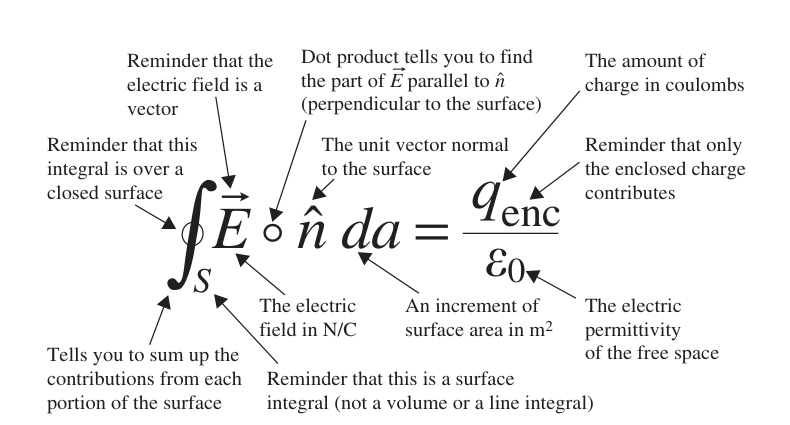

*Expanded view of the symbols in Gauss's law.*

Description: An annotated form of $\oint_S \vec{E} \circ \hat{n}\,da = q_{\mathrm{enc}} / \varepsilon_0$ points to the closed-surface integral, the electric field vector, the unit normal vector, the surface element, the enclosed charge, and the permittivity of free space.

How is Gauss's law useful? There are two basic types of problems that you can solve using this equation:

1. Given information about a distribution of electric charge, you can find the electric flux through a surface enclosing that charge.
2. Given information about the electric flux through a closed surface, you can find the total electric charge enclosed by that surface.

The best thing about Gauss's law is that for certain highly symmetric distributions of charges, you can use it to find the electric field itself, rather than just the electric flux over a surface.

Although the integral form of Gauss's law may look complicated, it is completely understandable if you consider the terms one at a time. That's exactly what you'll find in the following sections, starting with $\vec{E}$, the electric field.

## The electric field

To understand Gauss's law, you first have to understand the concept of the electric field. In some physics and engineering books, no direct definition of the electric field is given; instead you'll find a statement that an electric field is "said to exist" in any region in which electrical forces act. But what exactly *is* an electric field?

This question has deep philosophical significance, but it is not easy to answer. It was Michael Faraday who first referred to an electric "field of force," and James Clerk Maxwell identified that field as the space around an electrified object - a space in which electric forces act.

The common thread running through most attempts to define the electric field is that fields and forces are closely related. So here's a very pragmatic definition: an electric field is the electrical force per unit charge exerted on a charged object. Although philosophers debate the true meaning of the electric field, you can solve many practical problems by thinking of the electric field at any location as the number of newtons of electrical force exerted on each coulomb of charge at that location. Thus, the electric field may be defined by the relation

$$
\vec{E} \equiv \frac{\vec{F}_e}{q_0}, \tag{1.1}
$$

where $\vec{F}_e$ is the electrical force on a small[^1] charge $q_0$. This definition makes clear two important characteristics of the electric field:

1. $\vec{E}$ is a vector quantity with magnitude directly proportional to force and with direction given by the direction of the force on a positive test charge.
2. $\vec{E}$ has units of newtons per coulomb (N/C), which are the same as volts per meter (V/m), since volts = newtons x meters/coulombs.

In applying Gauss's law, it is often helpful to be able to visualize the electric field in the vicinity of a charged object. The most common approaches to constructing a visual representation of an electric field are to use either arrows or "field lines" that point in the direction of the field at each point in space. In the arrow approach, the strength of the field is indicated by the length of the arrow, whereas in the field line approach, it is the spacing of the lines that tells you the field strength (with closer lines signifying a stronger field). When you look at a drawing of electric field lines or arrows, be sure to remember that the field exists between the lines as well.

Examples of several electric fields relevant to the application of Gauss's law are shown in Figure 1.1.

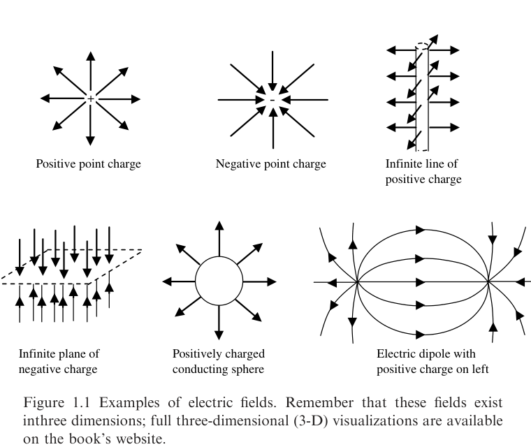

*Figure 1.1 Examples of electric fields. Remember that these fields exist in three dimensions; full three-dimensional (3-D) visualizations are available on the book's website.*

Description: Six sketches show field arrows radiating outward from a positive point charge, inward toward a negative point charge, away from an infinite line of positive charge, toward an infinite plane of negative charge, outward from a positively charged conducting sphere, and between the charges of an electric dipole with the positive charge on the left.

Here are a few rules of thumb that will help you visualize and sketch the electric fields produced by charges[^2]:

- Electric field lines must originate on positive charge and terminate on negative charge.
- The net electric field at any point is the vector sum of all electric fields present at that point.
- Electric field lines can never cross, since that would indicate that the field points in two different directions at the same location (if two or more different sources contribute electric fields pointing in different directions at the same location, the total electric field is the vector sum of the individual fields, and the electric field lines always point in the single direction of the total field).
- Electric field lines are always perpendicular to the surface of a conductor in equilibrium.

Equations for the electric field in the vicinity of some simple objects may be found in Table 1.1.

**Table 1.1. Electric field equations for simple objects**

| Object | Electric field |
| --- | --- |
| Point charge ($\mathrm{charge}=q$) | $\vec{E}=\dfrac{1}{4\pi\varepsilon_0}\dfrac{q}{r^2}\,\hat{r}$ (at distance $r$ from $q$) |
| Conducting sphere ($\mathrm{charge}=Q$) | $\vec{E}=\dfrac{1}{4\pi\varepsilon_0}\dfrac{Q}{r^2}\,\hat{r}$ (outside, distance $r$ from center) $\vec{E}=0$ (inside) |
| Uniformly charged insulating sphere ($\mathrm{charge}=Q$, $\mathrm{radius}=r_0$) | $\vec{E}=\dfrac{1}{4\pi\varepsilon_0}\dfrac{Q}{r^2}\,\hat{r}$ (outside, distance $r$ from center) $\vec{E}=\dfrac{1}{4\pi\varepsilon_0}\dfrac{Qr}{r_0^3}\,\hat{r}$ (inside, distance $r$ from center) |
| Infinite line charge (linear charge density $=\lambda$) | $\vec{E}=\dfrac{1}{2\pi\varepsilon_0}\dfrac{\lambda}{r}\,\hat{r}$ (distance $r$ from line) |
| Infinite flat plane (surface charge density $=\sigma$) | $\vec{E}=\dfrac{\sigma}{2\varepsilon_0}\,\hat{n}$ |

So exactly what does the $\vec{E}$ in Gauss's law represent? It represents the total electric field at each point on the surface under consideration. The surface may be real or imaginary, as you'll see when you read about the meaning of the surface integral in Gauss's law. But first you should consider the dot product and unit normal that appear inside the integral.

## The dot product

When you're dealing with an equation that contains a multiplication symbol (a circle or a cross), it is a good idea to examine the terms on both sides of that symbol. If they're printed in bold font or are wearing vector hats (as are $\vec{E}$ and $\hat{n}$ in Gauss's law), the equation involves vector multiplication, and there are several different ways to multiply vectors (quantities that have both magnitude and direction).

In Gauss's law, the circle between $\vec{E}$ and $\hat{n}$ represents the dot product (or "scalar product") between the electric field vector $\vec{E}$ and the unit normal vector $\hat{n}$ (discussed in the next section). If you know the Cartesian components of each vector, you can compute this as

$$
\vec{A} \circ \vec{B} = A_x B_x + A_y B_y + A_z B_z. \tag{1.2}
$$

Or, if you know the angle $\theta$ between the vectors, you can use

$$
\vec{A} \circ \vec{B} = |\vec{A}|\,|\vec{B}| \cos\,\theta, \tag{1.3}
$$

where $|\vec{A}|$ and $|\vec{B}|$ represent the magnitude (length) of the vectors. Notice that the dot product between two vectors gives a *scalar* result.

To grasp the physical significance of the dot product, consider vectors $\vec{A}$ and $\vec{B}$ that differ in direction by angle $\theta$, as shown in Figure 1.2(a).

For these vectors, the projection of $\vec{A}$ onto $\vec{B}$ is $|\vec{A}|\cos\theta$, as shown in Figure 1.2(b). Multiplying this projection by the length of $\vec{B}$ gives $|\vec{A}|\,|\vec{B}|\cos\theta$. Thus, the dot product $\vec{A} \circ \vec{B}$ represents the projection of $\vec{A}$ onto the direction of $\vec{B}$ multiplied by the length of $\vec{B}$.[^3] The usefulness of this operation in Gauss's law will become clear once you understand the meaning of the vector $\hat{n}$.

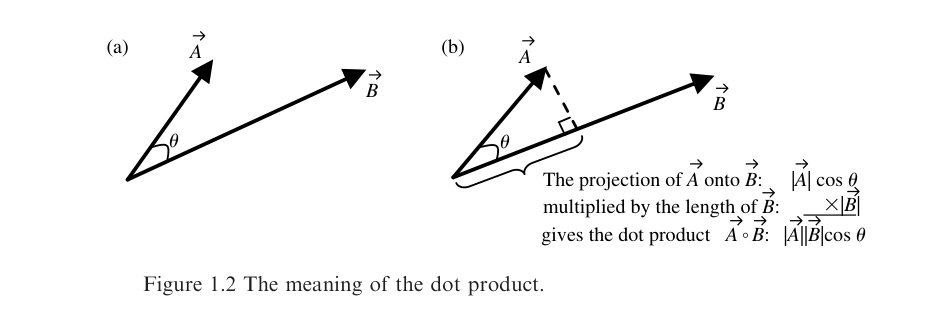

*Figure 1.2 The meaning of the dot product.*

Description: Two panels show vectors $\vec{A}$ and $\vec{B}$ separated by an angle $\theta$, then show the projection of $\vec{A}$ onto $\vec{B}$ together with the relation $\vec{A} \circ \vec{B} = |\vec{A}|\,|\vec{B}|\cos\theta$.

## The unit normal vector

The concept of the unit normal vector is straightforward; at any point on a surface, imagine a vector with length of one pointing in the direction perpendicular to the surface. Such a vector, labeled $\hat{n}$, is called a "unit" vector because its length is unity and "normal" because it is perpendicular to the surface. The unit normal for a planar surface is shown in Figure 1.3(a).

Certainly, you could have chosen the unit vector for the plane in Figure 1.3(a) to point in the opposite direction - there's no fundamental difference between one side of an open surface and the other (recall that an open surface is any surface for which it is possible to get from one side to the other without going *through* the surface).

For a closed surface (defined as a surface that divides space into an "inside" and an "outside"), the ambiguity in the direction of the unit normal has been resolved. By convention, the unit normal vector for a closed surface is taken to point outward - away from the volume enclosed by the surface. Some of the unit vectors for a sphere are shown in Figure 1.3(b); notice that the unit normal vectors at the Earth's North and South Pole would point in opposite directions if the Earth were a perfect sphere.

You should be aware that some authors use the notation $d\vec{a}$ rather than $\hat{n}\,da$. In that notation, the unit normal is incorporated into the vector area element $d\vec{a}$, which has magnitude equal to the area $da$ and direction along the surface normal $\hat{n}$. Thus $d\vec{a}$ and $\hat{n}\,da$ serve the same purpose.

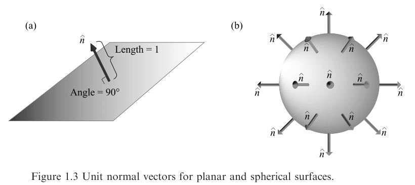

*Figure 1.3 Unit normal vectors for planar and spherical surfaces.*

Description: Panel (a) shows a unit vector of length 1 standing perpendicular to a plane at an angle of $90^\circ$ to the surface, and panel (b) shows outward-pointing unit normal vectors distributed around a sphere.

## The component of $\vec{E}$ normal to a surface

If you understand the dot product and unit normal vector, the meaning of $\vec{E} \circ \hat{n}$ should be clear; this expression represents the component of the electric field vector that is perpendicular to the surface under consideration.

If the reasoning behind this statement isn't apparent to you, recall that the dot product between two vectors such as $\vec{E}$ and $\hat{n}$ is simply the projection of the first onto the second multiplied by the length of the second. Recall also that by definition the length of the unit normal is one ($|\hat{n}| = 1$), so that

$$
\vec{E} \circ \hat{n} = |\vec{E}|\,|\hat{n}| \cos\theta = |\vec{E}| \cos\theta, \tag{1.4}
$$

where $\theta$ is the angle between the unit normal $\hat{n}$ and $\vec{E}$. This is the component of the electric field vector perpendicular to the surface, as illustrated in Figure 1.4.

Thus, if $\theta = 90^\circ$, $\vec{E}$ is perpendicular to $\hat{n}$, which means that the electric field is parallel to the surface, and $\vec{E} \circ \hat{n} = |\vec{E}|\cos(90^\circ) = 0$. So in this case the component of $\vec{E}$ perpendicular to the surface is zero.

Conversely, if $\theta = 0^\circ$, $\vec{E}$ is parallel to $\hat{n}$, meaning the electric field is perpendicular to the surface, and $\vec{E} \circ \hat{n} = |\vec{E}|\cos(0^\circ) = |\vec{E}|$. In this case, the component of $\vec{E}$ perpendicular to the surface is the entire length of $\vec{E}$.

The importance of the electric field component normal to the surface will become clear when you consider electric flux. To do that, you should make sure you understand the meaning of the surface integral in Gauss's law.

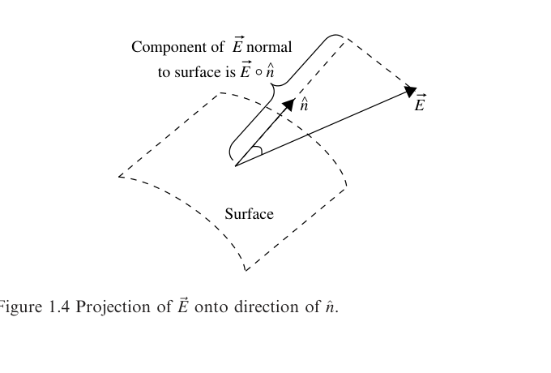

*Figure 1.4 Projection of $\vec{E}$ onto direction of $\hat{n}$.*

Description: A tilted surface patch, an outward unit normal vector, and an electric field vector illustrate that the normal component of the field is the projection of $\vec{E}$ onto $\hat{n}$.

## The surface integral

Many equations in physics and engineering - Gauss's law among them - involve the area integral of a scalar function or vector field over a specified surface (this type of integral is also called the "surface integral"). The time you spend understanding this important mathematical operation will be repaid many times over when you work problems in mechanics, fluid dynamics, and electricity and magnetism (E&M).

The meaning of the surface integral can be understood by considering a thin surface such as that shown in Figure 1.5. Imagine that the area density (the mass per unit area) of this surface varies with $x$ and $y$, and you want to determine the total mass of the surface. You can do this by dividing the surface into two-dimensional segments over each of which the area density is approximately constant.

For individual segments with area density $\sigma_i$ and area $dA_i$, the mass of each segment is $\sigma_i\,dA_i$, and the mass of the entire surface of $N$ segments is given by $\sum_{i=1}^{N} \sigma_i\,dA_i$. As you can imagine, the smaller you make the area segments, the closer this gets to the true mass, since your approximation of constant $\sigma$ is more accurate for smaller segments. If you let the segment area $dA$ approach zero and $N$ approach infinity, the summation becomes integration, and you have

$$
\mathrm{Mass} = \int_S \sigma(x,y)\,dA.
$$

This is the area integral of the scalar function $\sigma(x,y)$ over the surface $S$. It is simply a way of adding up the contributions of little pieces of a function (the density in this case) to find a total quantity. To understand the integral form of Gauss's law, it is necessary to extend the concept of the surface integral to vector fields, and that's the subject of the next section.

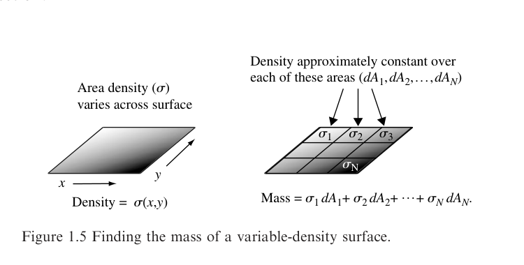

*Figure 1.5 Finding the mass of a variable-density surface.*

Description: Two surface sketches show a sheet whose area density varies continuously as $\sigma(x,y)$ and the same sheet divided into small patches labeled with approximately constant densities $\sigma_1$, $\sigma_2$, $\sigma_3$, and $\sigma_N$ whose contributions add to the total mass.

## The flux of a vector field

In Gauss's law, the surface integral is applied not to a scalar function (such as the density of a surface) but to a vector field. What's a vector field? As the name suggests, a vector field is a distribution of quantities in space - a field - and these quantities have both magnitude and direction, meaning that they are vectors. So whereas the distribution of temperature in a room is an example of a scalar field, the speed and direction of the flow of a fluid at each point in a stream is an example of a vector field.

The analogy of fluid flow is very helpful in understanding the meaning of the "flux" of a vector field, even when the vector field is static and nothing is actually flowing. You can think of the flux of a vector field over a surface as the "amount" of that field that "flows" through that surface, as illustrated in Figure 1.6.

In the simplest case of a uniform vector field $\vec{A}$ and a surface $S$ perpendicular to the direction of the field, the flux $\Phi$ is defined as the product of the field magnitude and the area of the surface:

$$
\Phi = |\vec{A}| \times \text{surface area}. \tag{1.5}
$$

This case is shown in Figure 1.6(a). Note that if $\vec{A}$ is perpendicular to the surface, it is parallel to the unit normal $\hat{n}$.

If the vector field is uniform but is not perpendicular to the surface, as in Figure 1.6(b), the flux may be determined simply by finding the component of $\vec{A}$ perpendicular to the surface and then multiplying that value by the surface area:

$$
\Phi = \vec{A} \circ \hat{n} \times (\text{surface area}). \tag{1.6}
$$

While uniform fields and flat surfaces are helpful in understanding the concept of flux, many E&M problems involve nonuniform fields and curved surfaces. To work those kinds of problems, you'll need to understand how to extend the concept of the surface integral to vector fields.

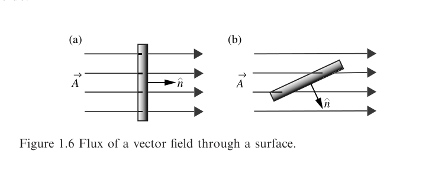

*Figure 1.6 Flux of a vector field through a surface.*

Description: Panel (a) shows a uniform vector field passing perpendicularly through a flat surface with the unit normal parallel to the field, while panel (b) shows the same field intersecting a tilted surface where only the component along the unit normal contributes to the flux.

Consider the curved surface and vector field $\vec{A}$ shown in Figure 1.7(a). Imagine that $\vec{A}$ represents the flow of a real fluid and $S$ a porous membrane; later you'll see how this applies to the flux of an electric field through a surface that may be real or purely imaginary.

Before proceeding, you should think for a moment about how you might go about finding the rate of flow of material through surface $S$. You can define "rate of flow" in a few different ways, but it will help to frame the question as "How many particles pass through the membrane each second?"

To answer this question, define $\vec{A}$ as the number density of the fluid (particles per cubic meter) times the velocity of the flow (meters per second). As the product of the number density (a scalar) and the velocity (a vector), $\vec{A}$ must be a vector in the same direction as the velocity, with units of particles per square meter per second. Since you're trying to find the number of particles per second passing through the surface, dimensional analysis suggests that you multiply $\vec{A}$ by the area of the surface.

But look again at Figure 1.7(a). The different lengths of the arrows are meant to suggest that the flow of material is not spatially uniform, meaning that the speed may be higher or lower at various locations within the flow. This fact alone would mean that material flows through some portions of the surface at a higher rate than other portions, but you must also consider the angle of the surface to the direction of flow. Any portion of the surface lying precisely along the direction of flow will necessarily have zero particles per second passing through it, since the flow lines must penetrate the surface to carry particles from one side to the other. Thus, you must be concerned not only with the speed of flow and the area of each portion of the membrane, but also with the component of the flow perpendicular to the surface.

Of course, you know how to find the component of $\vec{A}$ perpendicular to the surface: simply form the dot product of $\vec{A}$ and $\hat{n}$, the unit normal to the surface. But since the surface is curved, the direction of $\hat{n}$ depends on which part of the surface you're considering. To deal with the different $\hat{n}$ (and $\vec{A}$) at each location, divide the surface into small segments, as shown in Figure 1.7(b). If you make these segments sufficiently small, you can assume that both $\hat{n}$ and $\vec{A}$ are constant over each segment.

Let $\hat{n}_i$ represent the unit normal for the $i$th segment (of area $da_i$); the flow through segment $i$ is $(\vec{A}_i \circ \hat{n}_i)\,da_i$, and the total is

$$
	ext{flow through entire surface} = \sum_i \vec{A}_i \circ \hat{n}_i\,da_i.
$$

It should come as no surprise that if you now let the size of each segment shrink to zero, the summation becomes integration.

$$
	ext{Flow through entire surface} = \int_S \vec{A} \circ \hat{n}\,da. \tag{1.7}
$$

For a closed surface, the integral sign includes a circle:

$$
\oint_S \vec{A} \circ \hat{n}\,da. \tag{1.8}
$$

This flow is the particle flux through a closed surface $S$, and the similarity to the left side of Gauss's law is striking. You have only to replace the vector field $\vec{A}$ with the electric field $\vec{E}$ to make the expressions identical.

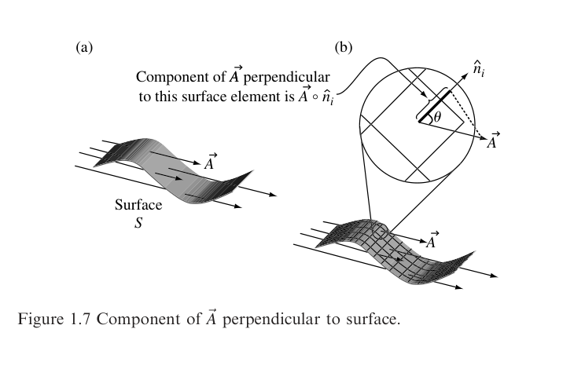

*Figure 1.7 Component of $\vec{A}$ perpendicular to surface.*

Description: Panel (a) shows a nonuniform vector field crossing a curved surface $S$, and panel (b) magnifies a small surface element with local normal $\hat{n}_i$ and angle $\theta$ to show the component of $\vec{A}$ perpendicular to that element.

## The electric flux through a closed surface

On the basis of the results of the previous section, you should understand that the flux $\Phi_E$ of vector field $\vec{E}$ through surface $S$ can be determined using the following equations:

$$
\Phi_E = |\vec{E}| \times (\text{surface area}) \qquad \vec{E} \text{ is uniform and perpendicular to } S, \tag{1.9}
$$

$$
\Phi_E = \vec{E} \circ \hat{n} \times (\text{surface area}) \qquad \vec{E} \text{ is uniform and at an angle to } S, \tag{1.10}
$$

$$
\Phi_E = \int_S \vec{E} \circ \hat{n}\,da \qquad \vec{E} \text{ is non-uniform and at a variable angle to } S. \tag{1.11}
$$

These relations indicate that electric flux is a scalar quantity and has units of electric field times area, or Vm. But does the analogy used in the previous section mean that the electric flux should be thought of as a flow of particles, and that the electric field is the product of a density and a velocity?

The answer to this question is "absolutely not." Remember that when you employ a physical analogy, you're hoping to learn something about the *relationships between quantities*, not about the quantities themselves. So, you can find the electric flux by integrating the normal component of the electric field over a surface, but you should not think of the electric flux as the physical movement of particles.

How should you think of electric flux? One helpful approach follows directly from the use of field lines to represent the electric field. Recall that in such representations the strength of the electric field at any point is indicated by the spacing of the field lines at that location. More specifically, the electric field strength can be considered to be proportional to the density of field lines (the number of field lines per square meter) in a plane perpendicular to the field at the point under consideration. Integrating that density over the entire surface gives the number of field lines penetrating the surface, and that is exactly what the expression for electric flux gives. Thus, another way to define electric flux is

$$
	ext{electric flux } (\Phi_E) \equiv \text{ number of field lines penetrating surface}.
$$

There are two caveats you should keep in mind when you think of electric flux as the number of electric field lines penetrating a surface. The first is that field lines are only a convenient representation of the electric field, which is actually continuous in space. The number of field lines you choose to draw for a given field is up to you, so long as you maintain consistency between fields of different strengths - which means that fields that are twice as strong must be represented by twice as many field lines per unit area.

The second caveat is that surface penetration is a two-way street; once the direction of a surface normal $\hat{n}$ has been established, field line components parallel to that direction give a positive flux, while components in the opposite direction (antiparallel to $\hat{n}$) give a negative flux. Thus, a surface penetrated by five field lines in one direction (say from the top side to the bottom side) and five field lines in the opposite direction (from bottom to top) has zero flux, because the contributions from the two groups of field lines cancel. So, you should think of electric flux as the *net* number of field lines penetrating the surface, with direction of penetration taken into account.

If you give some thought to this last point, you may come to an important conclusion about closed surfaces. Consider the three boxes shown in Figure 1.8. The box in Figure 1.8(a) is penetrated only by electric field lines that originate and terminate outside the box. Thus, every field line that enters must leave, and the flux through the box must be zero.

Remembering that the unit normal for closed surfaces points away from the enclosed volume, you can see that the inward flux (lines entering the box) is negative, since $\vec{E} \circ \hat{n}$ must be negative when the angle between $\vec{E}$ and $\hat{n}$ is greater than $90^\circ$. This is precisely cancelled by the outward flux (lines exiting the box), which is positive, since $\vec{E} \circ \hat{n}$ is positive when the angle between $\vec{E}$ and $\hat{n}$ is less than $90^\circ$.

Now consider the box in Figure 1.8(b). The surfaces of this box are penetrated not only by the field lines originating outside the box, but also by a group of field lines that originate within the box. In this case, the net number of field lines is clearly not zero, since the positive flux of the lines that originate in the box is not compensated by any incoming (negative) flux. Thus, you can say with certainty that if the flux through any closed surface is positive, that surface must contain a *source* of field lines.

Finally, consider the box in Figure 1.8(c). In this case, some of the field lines terminate within the box. These lines provide a negative flux at the surface through which they enter, and since they don't exit the box, their contribution to the net flux is not compensated by any positive flux. Clearly, if the flux through a closed surface is negative, that surface must contain a *sink* of field lines (sometimes referred to as a drain).

Now recall the first rule of thumb for drawing charge-induced electric field lines; they must originate on positive charge and terminate on negative charge. So, the point from which the field lines diverge in Figure 1.8(b) marks the location of some amount of positive charge, and the point to which the field lines converge in Figure 1.8(c) indicates the existence of negative charge at that location.

If the amount of charge at these locations were greater, there would be more field lines beginning or ending on these points, and the flux through the surface would be greater. And if there were equal amounts of positive and negative charge within one of these boxes, the positive (outward) flux produced by the positive charge would exactly cancel the negative (inward) flux produced by the negative charge. So, in this case the flux would be zero, just as the net charge contained within the box would be zero.

You should now see the physical reasoning behind Gauss's law: the electric flux passing through any closed surface - that is, the number of electric field lines penetrating that surface - must be proportional to the total charge contained within that surface. Before putting this concept to use, you should take a look at the right side of Gauss's law.

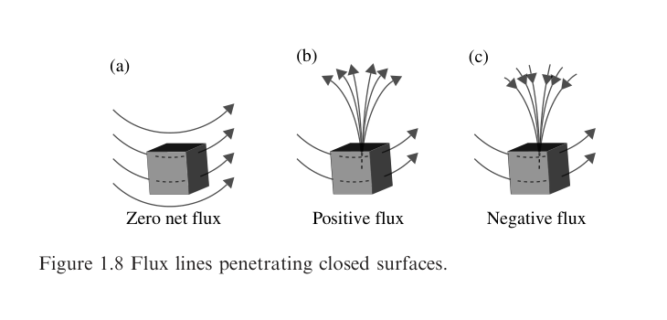

*Figure 1.8 Flux lines penetrating closed surfaces.*

Description: Three box diagrams show zero net flux when lines only pass through the box, positive flux when lines originate inside the box and leave it, and negative flux when lines terminate inside the box after entering it.

## The enclosed charge

If you understand the concept of flux as described in the previous section, it should be clear why the right side of Gauss's law involves only the *enclosed* charge - that is, the charge within the closed surface over which the flux is determined. Simply put, it is because any charge located outside the surface produces an equal amount of inward (negative) flux and outward (positive) flux, so the net contribution to the flux through the surface must be zero.

How can you determine the charge enclosed by a surface? In some problems, you're free to choose a surface that surrounds a known amount of charge, as in the situations shown in Figure 1.9. In each of these cases, the total charge within the selected surface can be easily determined from geometric considerations.

For problems involving groups of discrete charges enclosed by surfaces of any shape, finding the total charge is simply a matter of adding the individual charges.

$$
	ext{Total enclosed charge} = \sum_i q_i.
$$

While small numbers of discrete charges may appear in physics and engineering problems, in the real world you're far more likely to encounter charged objects containing billions of charge carriers lined along a wire, slathered over a surface, or arrayed throughout a volume. In such cases, counting the individual charges is not practical - but you can determine the total charge if you know the charge density. Charge density may be specified in one, two, or three dimensions (1-, 2-, or 3-D).

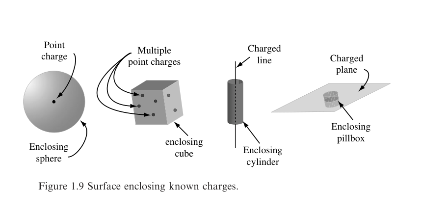

*Figure 1.9 Surface enclosing known charges.*

Description: Four examples show an enclosing sphere around a point charge, an enclosing cube around multiple point charges, an enclosing cylinder around a charged line, and an enclosing pillbox around a charged plane.

| Dimensions | Terminology | Symbol | Units |
| --- | --- | --- | --- |
| 1 | Linear charge density | $\lambda$ | C/m |
| 2 | Area charge density | $\sigma$ | C/m$^2$ |
| 3 | Volume charge density | $\rho$ | C/m$^3$ |

If these quantities are constant over the length, area, or volume under consideration, finding the enclosed charge requires only a single multiplication:

$$
	ext{1-D:} \qquad q_{\mathrm{enc}} = \lambda L \qquad (L = \text{ enclosed length of charged line}), \tag{1.12}
$$

$$
	ext{2-D:} \qquad q_{\mathrm{enc}} = \sigma A \qquad (A = \text{ enclosed area of charged surface}), \tag{1.13}
$$

$$
	ext{3-D:} \qquad q_{\mathrm{enc}} = \rho V \qquad (V = \text{ enclosed portion of charged volume}). \tag{1.14}
$$

You are also likely to encounter situations in which the charge density is not constant over the line, surface, or volume of interest. In such cases, the integration techniques described in the "Surface Integral" section of this chapter must be used. Thus,

$$
	ext{1-D:} \qquad q_{\mathrm{enc}} = \int_L \lambda\,dl \text{ where } \lambda \text{ varies along a line}, \tag{1.15}
$$

$$
	ext{2-D:} \qquad q_{\mathrm{enc}} = \int_S \sigma\,da \text{ where } \sigma \text{ varies over a surface}, \tag{1.16}
$$

$$
	ext{3-D:} \qquad q_{\mathrm{enc}} = \int_V \rho\,dV \text{ where } \rho \text{ varies over a volume}. \tag{1.17}
$$

You should note that the enclosed charge in Gauss's law for electric fields is the *total* charge, including both free and bound charge. You can read about bound charge in the next section, and you'll find a version of Gauss's law that depends only on free charge in the Appendix.

Once you've determined the charge enclosed by a surface of any size and shape, it is very easy to find the flux through that surface; simply divide the enclosed charge by $\varepsilon_0$, the permittivity of free space. The physical meaning of that parameter is described in the next section.

## The permittivity of free space

The constant of proportionality between the electric flux on the left side of Gauss's law and the enclosed charge on the right side is $\varepsilon_0$, the permittivity of free space. The permittivity of a material determines its response to an applied electric field - in nonconducting materials (called "insulators" or "dielectrics"), charges do not move freely, but may be slightly displaced from their equilibrium positions. The relevant permittivity in Gauss's law for electric fields is the permittivity of free space (or "vacuum permittivity"), which is why it carries the subscript zero.

The value of the vacuum permittivity in SI units is approximately $8.85 \times 10^{-12}$ coulombs per volt-meter (C/Vm); you will sometimes see the units of permittivity given as farads per meter (F/m), or, more fundamentally, $(\mathrm{C}^2\mathrm{s}^2/\mathrm{kg}\,\mathrm{m}^3)$. A more precise value for the permittivity of free space is

$$
\varepsilon_0 = 8.8541878176 \times 10^{-12}\ \mathrm{C}/\mathrm{Vm}.
$$

Does the presence of this quantity mean that this form of Gauss's law is only valid in a vacuum? No, Gauss's law as written in this chapter is general, and applies to electric fields within dielectrics as well as those in free space, provided that you account for *all* of the enclosed charge, including charges that are bound to the atoms of the material.

The effect of bound charges can be understood by considering what happens when a dielectric is placed in an external electric field. Inside the dielectric material, the amplitude of the total electric field is generally less than the amplitude of the applied field.

The reason for this is that dielectrics become "polarized" when placed in an electric field, which means that positive and negative charges are displaced from their original positions. And since positive charges are displaced in one direction (parallel to the applied electric field) and negative charges are displaced in the opposite direction (antiparallel to the applied field), these displaced charges give rise to their own electric field that opposes the external field, as shown in Figure 1.10. This makes the net field within the dielectric less than the external field.

It is the ability of dielectric materials to reduce the amplitude of an electric field that leads to their most common application: increasing the capacitance and maximum operating voltage of capacitors. As you may recall, the capacitance (ability to store charge) of a parallel-plate capacitor is

$$
C = \frac{\varepsilon A}{d},
$$

where $A$ is the plate area, $d$ is the plate separation, and $\varepsilon$ is the permittivity of the material between the plates. High-permittivity materials can provide increased capacitance without requiring larger plate area or decreased plate spacing.

The permittivity of a dielectric is often expressed as the relative permittivity, which is the factor by which the material's permittivity exceeds that of free space:

$$
	ext{relative permittivity } \varepsilon_r = \varepsilon / \varepsilon_0.
$$

Some texts refer to relative permittivity as "dielectric constant," although the variation in permittivity with frequency suggests that the word "constant" is better used elsewhere. The relative permittivity of ice, for example, changes from approximately 81 at frequencies below 1 kHz to less than 5 at frequencies above 1 MHz. Most often, it is the low-frequency value of permittivity that is called the dielectric constant.

One more note about permittivity; as you'll see in Chapter 5, the permittivity of a medium is a fundamental parameter in determining the speed with which an electromagnetic wave propagates through that medium.

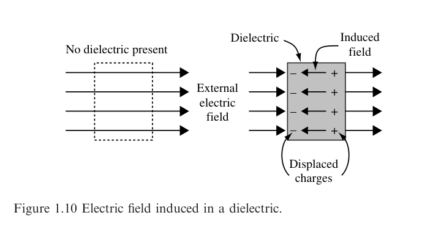

*Figure 1.10 Electric field induced in a dielectric.*

Description: A comparison shows an external electric field passing through empty space and then through a dielectric slab where displaced charges create an induced field opposing the applied field.

## Applying Gauss's law (integral form)

A good test of your understanding of an equation like Gauss's law is whether you're able to solve problems by applying it to relevant situations. At this point, you should be convinced that Gauss's law relates the electric flux through a closed surface to the charge enclosed by that surface. Here are some examples of what can you actually *do* with that information.

### Example 1.1: Given a charge distribution, find the flux through a closed surface surrounding that charge.

*Problem:* Five point charges are enclosed in a cylindrical surface $S$. If the values of the charges are $q_1=+3\,\mathrm{nC}$, $q_2=-2\,\mathrm{nC}$, $q_3=+2\,\mathrm{nC}$, $q_4=+4\,\mathrm{nC}$, and $q_5=-1\,\mathrm{nC}$, find the total flux through $S$.

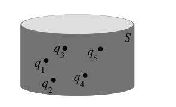

*Example 1.1 diagram.*

Description: A cylindrical closed surface labeled $S$ encloses five point charges labeled $q_1$ through $q_5$.

*Solution:* From Gauss's law,

$$
\Phi_E = \oint_S \vec{E} \circ \hat{n}\,da = \frac{q_{\mathrm{enc}}}{\varepsilon_0}.
$$

For discrete charges, you know that the total charge is just the sum of the individual charges. Thus,

$$
q_{\mathrm{enc}} = \text{Total enclosed charge} = \sum_i q_i
= (3 - 2 + 2 + 4 - 1) \times 10^{-9}\ \mathrm{C}
= 6 \times 10^{-9}\ \mathrm{C}
$$

and

$$
\Phi_E = \frac{q_{\mathrm{enc}}}{\varepsilon_0} = \frac{6 \times 10^{-9}\ \mathrm{C}}{8.85 \times 10^{-12}\ \mathrm{C}/\mathrm{Vm}} = 678\ \mathrm{Vm}.
$$

This is the total flux through *any* closed surface surrounding this group of charges.

### Example 1.2: Given the flux through a closed surface, find the enclosed charge.

*Problem:* A line charge with linear charge density $\lambda=10^{-12}\ \mathrm{C}/\mathrm{m}$ passes through the center of a sphere. If the flux through the surface of the sphere is $1.13 \times 10^{-3}\ \mathrm{Vm}$, what is the radius $R$ of the sphere?

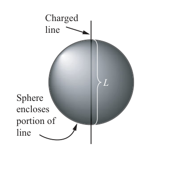

*Example 1.2 diagram.*

Description: A vertical charged line passes through the center of a sphere, and the enclosed portion of the line inside the sphere is labeled $L$.

*Solution:* The charge on a line charge of length $L$ is given by $q=\lambda L$. Thus,

$$
\Phi_E = \frac{q_{\mathrm{enc}}}{\varepsilon_0} = \frac{\lambda L}{\varepsilon_0},
$$

and

$$
L = \frac{\Phi_E \varepsilon_0}{\lambda}.
$$

Since $L$ is twice the radius of the sphere, this means

$$
2R = \frac{\Phi_E \varepsilon_0}{\lambda} \qquad \text{or} \qquad R = \frac{\Phi_E \varepsilon_0}{2\lambda}.
$$

Inserting the values for $\Phi_E$, $\varepsilon_0$ and $\lambda$, you will find that $R = 5 \times 10^{-3}\ \mathrm{m}$.

### Example 1.3: Find the flux through a section of a closed surface.

*Problem:* A point source of charge $q$ is placed at the center of curvature of a spherical section that extends from spherical angle $\theta_1$ to $\theta_2$ and from $\phi_1$ to $\phi_2$. Find the electric flux through the spherical section.

*Solution:* Since the surface of interest in this problem is open, you'll have to find the electric flux by integrating the normal component of the electric field over the surface. You can then check your answer using Gauss's law by allowing the spherical section to form a complete sphere that encloses the point charge.

The electric flux $\Phi_E$ is $\int_S \vec{E} \circ \hat{n}\,da$, where $S$ is the spherical section of interest and $\vec{E}$ is the electric field on the surface due to the point charge at the center of curvature, a distance $r$ from the section of interest. From Table 1.1, you know that the electric field at a distance $r$ from a point charge is

$$
\vec{E} = \frac{1}{4\pi\varepsilon_0}\frac{q}{r^2}\,\hat{r}.
$$

Before you can integrate this over the surface of interest, you have to consider $\vec{E} \circ \hat{n}$ (that is, you must find the component of the electric field perpendicular to the surface). That is trivial in this case, because the unit normal $\hat{n}$ for a spherical section points in the outward radial direction (the $\hat{r}$ direction), as may be seen in Figure 1.11. This means that $\vec{E}$ and $\hat{n}$ are parallel, and the flux is given by

$$
\Phi_E = \int_S \vec{E} \circ \hat{n}\,da = \int_S |\vec{E}|\,|\hat{n}|\,\cos(0^\circ)\,da = \int_S |\vec{E}|\,da = \int_S \frac{1}{4\pi\varepsilon_0}\frac{q}{r^2}\,da.
$$

Since you are integrating over a spherical section in this case, the logical choice for coordinate system is spherical. This makes the area element $r^2 \sin\theta\,d\theta\,d\phi$, and the surface integral becomes

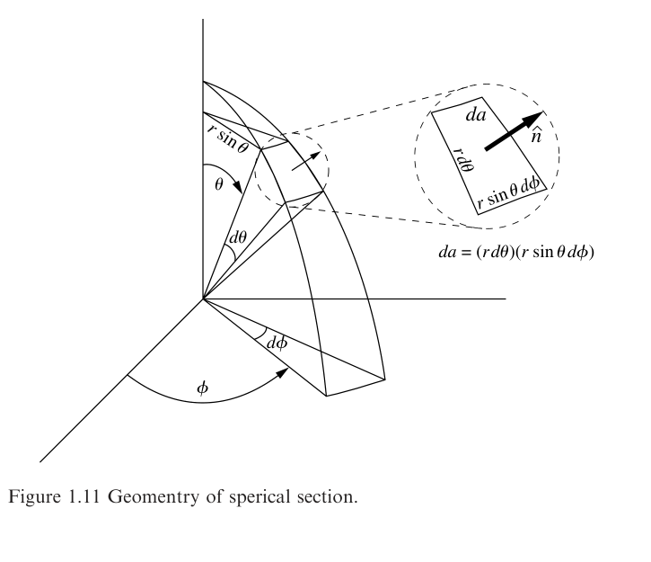

*Figure 1.11 Geometry of spherical section.*

Description: A spherical sector is labeled with angles $\theta$ and $\phi$, and an inset expands a surface element $da=(r\,d\theta)(r\sin\theta\,d\phi)$ with outward unit normal $\hat{n}$.

$$
\Phi_E = \int_{\theta_1}^{\theta_2} \int_{\phi_1}^{\phi_2} \frac{1}{4\pi\varepsilon_0}\frac{q}{r^2} r^2 \sin\theta\,d\theta\,d\phi = \frac{q}{4\pi\varepsilon_0} \int_{\theta_1}^{\theta_2} \sin\theta\,d\theta \int_{\phi_1}^{\phi_2} d\phi,
$$

which is easily integrated to give

$$
\Phi_E = \frac{q}{4\pi\varepsilon_0}(\cos\theta_1 - \cos\theta_2)(\phi_2 - \phi_1).
$$

As a check on this result, take the entire sphere as the section ($\theta_1=0$, $\theta_2=\pi$, $\phi_1=0$, and $\phi_2=2\pi$). This gives

$$
\Phi_E = \frac{q}{4\pi\varepsilon_0}(1 - (-1))(2\pi - 0) = \frac{q}{\varepsilon_0},
$$

exactly as predicted by Gauss's law.

### Example 1.4: Given $\vec{E}$ over a surface, find the flux through the surface and the charge enclosed by the surface.

*Problem:* The electric field at distance $r$ from an infinite line charge with linear charge density $\lambda$ is given in Table 1.1 as

$$
\vec{E} = \frac{1}{2\pi\varepsilon_0}\frac{\lambda}{r}\,\hat{r}.
$$

Use this expression to find the electric flux through a cylinder of radius $r$ and height $h$ surrounding a portion of an infinite line charge, and then use Gauss's law to verify that the enclosed charge is $\lambda h$.

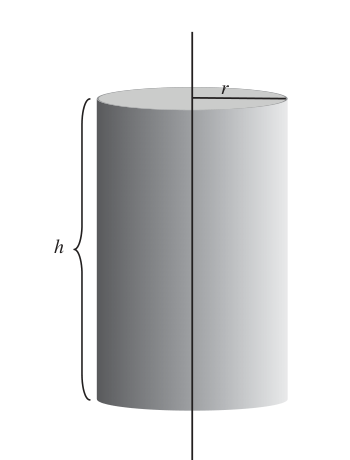

*Example 1.4 cylinder.*

Description: A vertical line charge passes through the axis of a cylindrical Gaussian surface of radius $r$ and height $h$.

*Solution:* Problems like this are best approached by considering the flux through each of three surfaces that comprise the cylinder: the top, bottom, and curved side surfaces. The most general expression for the electric flux through any surface is

$$
\Phi_E = \int_S \vec{E} \circ \hat{n}\,da,
$$

which in this case gives

$$
\Phi_E = \int_S \frac{1}{2\pi\varepsilon_0}\frac{\lambda}{r}\,\hat{r} \circ \hat{n}\,da.
$$

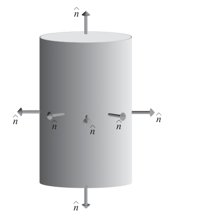

*Example 1.4 normals.*

Description: The cylindrical surface is shown with outward unit normal vectors on the top, bottom, and curved side to indicate which parts are parallel or perpendicular to the radial electric field.

Consider now the unit normal vectors of each of the three surfaces: since the electric field points radially outward from the axis of the cylinder, $\vec{E}$ is perpendicular to the normal vectors of the top and bottom surfaces and parallel to the normal vectors for the curved side of the cylinder. You may therefore write

$$
\Phi_{E,\mathrm{top}} = \int_S \frac{1}{2\pi\varepsilon_0}\frac{\lambda}{r}\,\hat{r} \circ \hat{n}_{\mathrm{top}}\,da = 0,
$$

$$
\Phi_{E,\mathrm{bottom}} = \int_S \frac{1}{2\pi\varepsilon_0}\frac{\lambda}{r}\,\hat{r} \circ \hat{n}_{\mathrm{bottom}}\,da = 0,
$$

$$
\Phi_{E,\mathrm{side}} = \int_S \frac{1}{2\pi\varepsilon_0}\frac{\lambda}{r}\,\hat{r} \circ \hat{n}_{\mathrm{side}}\,da = \frac{1}{2\pi\varepsilon_0}\frac{\lambda}{r} \int_S da,
$$

and, since the area of the curved side of the cylinder is $2\pi rh$, this gives

$$
\Phi_{E,\mathrm{side}} = \frac{1}{2\pi\varepsilon_0}\frac{\lambda}{r}(2\pi rh) = \frac{\lambda h}{\varepsilon_0}.
$$

Gauss's law tells you that this must equal $q_{\mathrm{enc}}/\varepsilon_0$, which verifies that the enclosed charge $q_{\mathrm{enc}} = \lambda h$ in this case.

### Example 1.5: Given a symmetric charge distribution, find $\vec{E}$.

Finding the electric field using Gauss's law may seem to be a hopeless task. After all, while the electric field does appear in the equation, it is only the normal component that emerges from the dot product, and it is only the integral of that normal component over the entire surface that is proportional to the enclosed charge. Do realistic situations exist in which it is possible to dig the electric field out of its interior position in Gauss's law?

Happily, the answer is yes; you may indeed find the electric field using Gauss's law, albeit only in situations characterized by high symmetry. Specifically, you can determine the electric field whenever you're able to design a real or imaginary "special Gaussian surface" that encloses a known amount of charge. A special Gaussian surface is one on which

1. the electric field is either parallel or perpendicular to the surface normal (which allows you to convert the dot product into an algebraic multiplication), and
2. the electric field is constant or zero over sections of the surface (which allows you to remove the electric field from the integral).

Of course, the electric field on any surface that you can imagine around arbitrarily shaped charge distributions will not satisfy either of these requirements. But there are situations in which the distribution of charge is sufficiently symmetric that a special Gaussian surface may be imagined. Specifically, the electric field in the vicinity of spherical charge distributions, infinite lines of charge, and infinite planes of charge may be determined by direct application of the integral form of Gauss's law. Geometries that approximate these ideal conditions, or can be approximated by combinations of them, may also be attacked using Gauss's law.

The following problem shows how to use Gauss's law to find the electric field around a spherical distribution of charge; the other cases are covered in the problem set, for which solutions are available on the website.

*Problem:* Use Gauss's law to find the electric field at a distance $r$ from the center of a sphere with uniform volume charge density $\rho$ and radius $a$.

*Solution:* Consider first the electric field outside the sphere. Since the distribution of charge is spherically symmetric, it is reasonable to expect the electric field to be entirely radial (that is, pointed toward or away from the sphere). If that's not obvious to you, imagine what would happen if the electric field had a nonradial component (say in the $\hat{\theta}$ or $\hat{\phi}$ direction); by rotating the sphere about some arbitrary axis, you'd be able to change the direction of the field. But the charge is uniformly distributed throughout the sphere, so there can be no preferred direction or orientation - rotating the sphere simply replaces one chunk of charge with another, identical chunk - so this can have no effect whatsoever on the electric field. Faced with this conundrum, you are forced to conclude that the electric field of a spherically symmetric charge distribution must be entirely radial.

To find the value of this radial field using Gauss's law, you'll have to imagine a surface that meets the requirements of a special Gaussian surface; $\vec{E}$ must be either parallel or perpendicular to the surface normal at all locations, and $\vec{E}$ must be uniform everywhere on the surface. For a radial electric field, there can be only one choice; your Gaussian surface must be a sphere centered on the charged sphere, as shown in Figure 1.12. Notice that no actual surface need be present, and the special Gaussian surface may be purely imaginary - it is simply a construct that allows you to evaluate the dot product and remove the electric field from the surface integral in Gauss's law.

Since the radial electric field is everywhere parallel to the surface normal, the $\vec{E} \circ \hat{n}$ term in the integral in Gauss's law becomes $|\vec{E}|\,|\hat{n}|\cos(0^\circ)$, and the electric flux over the Gaussian surface $S$ is

$$
\Phi_E = \oint_S \vec{E} \circ \hat{n}\,da = \oint_S E\,da.
$$

Since $\vec{E}$ has no $\theta$ or $\phi$ dependence, it must be constant over $S$, which means it may be removed from the integral:

$$
\Phi_E = \oint_S E\,da = E \oint_S da = E(4\pi r^2),
$$

where $r$ is the radius of the special Gaussian surface. You can now use Gauss's law to find the value of the electric field:

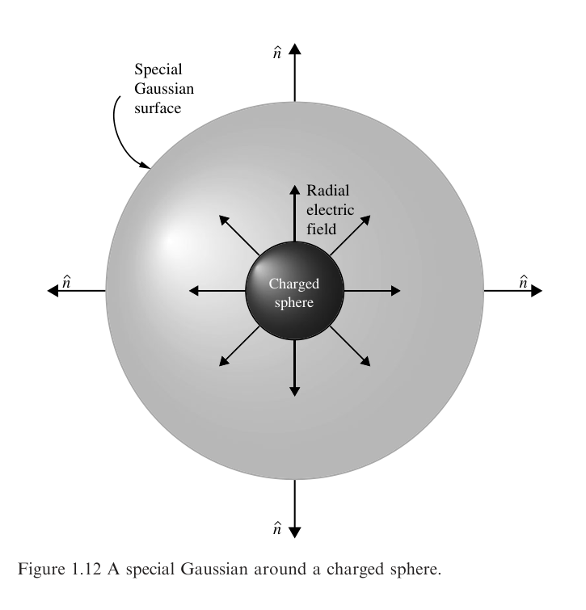

*Figure 1.12 A special Gaussian around a charged sphere.*

Description: A small charged sphere sits at the center of a larger spherical Gaussian surface, with radial electric field arrows pointing outward and outward unit normal vectors shown on the Gaussian surface.

$$
\Phi_E = E(4\pi r^2) = \frac{q_{\mathrm{enc}}}{\varepsilon_0},
$$

or

$$
E = \frac{q_{\mathrm{enc}}}{4\pi\varepsilon_0 r^2},
$$

where $q_{\mathrm{enc}}$ is the charge enclosed by your Gaussian surface. You can use this expression to find the electric field both outside and inside the sphere.

To find the electric field outside the sphere, construct your Gaussian surface with radius $r > a$ so that the entire charged sphere is within the Gaussian surface. This means that the enclosed charge is just the charge density times the entire volume of the charged sphere: $q_{\mathrm{enc}} = (4/3)\pi a^3 \rho$. Thus,

$$
E = \frac{(4/3)\pi a^3 \rho}{4\pi\varepsilon_0 r^2} = \frac{\rho a^3}{3\varepsilon_0 r^2} \qquad (\text{outside sphere}).
$$

To find the electric field within the charged sphere, construct your Gaussian surface with $r < a$. In this case, the enclosed charge is the charge density times the volume of your Gaussian surface: $q_{\mathrm{enc}} = (4/3)\pi r^3 \rho$. Thus,

$$
E = \frac{(4/3)\pi r^3 \rho}{4\pi\varepsilon_0 r^2} = \frac{\rho r}{3\varepsilon_0} \qquad (\text{inside sphere}).
$$

The keys to successfully employing special Gaussian surfaces are to recognize the appropriate shape for the surface and then to adjust its size to ensure that it runs through the point at which you wish to determine the electric field.

## 1.2 The differential form of Gauss's law

The integral form of Gauss's law for electric fields relates the electric flux over a surface to the charge enclosed by that surface - but like all of Maxwell's Equations, Gauss's law may also be cast in *differential* form. The differential form is generally written as

$$
\vec{\nabla} \circ \vec{E} = \frac{\rho}{\varepsilon_0}
$$

Gauss's law for electric fields (differential form).

The left side of this equation is a mathematical description of the divergence of the electric field - the tendency of the field to "flow" away from a specified location - and the right side is the electric charge density divided by the permittivity of free space.

Don't be concerned if the del operator ($\vec{\nabla}$) or the concept of divergence isn't perfectly clear to you - these are discussed in the following sections. For now, make sure you grasp the main idea of Gauss's law in differential form:

> The electric field produced by electric charge diverges from positive charge and converges upon negative charge.

In other words, the only places at which the divergence of the electric field is not zero are those locations at which charge is present. If positive charge is present, the divergence is positive, meaning that the electric field tends to "flow" away from that location. If negative charge is present, the divergence is negative, and the field lines tend to "flow" toward that point.

Note that there's a fundamental difference between the differential and the integral form of Gauss's law; the differential form deals with the divergence of the electric field and the charge density *at individual points* in space, whereas the integral form entails the integral of the normal component of the electric field *over a surface*. Familiarity with both forms will allow you to use whichever is better suited to the problem you're trying to solve.

To help you understand the meaning of each symbol in the differential form of Gauss's law for electric fields, here's an expanded view:

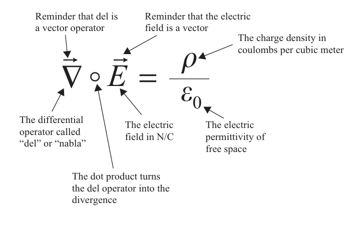

*Expanded view of the symbols in the differential form of Gauss's law.*

Description: An annotated form of $\vec{\nabla} \circ \vec{E} = \rho/\varepsilon_0$ points to the del operator, the dot product turning del into divergence, the vector electric field, the charge density in coulombs per cubic meter, and the permittivity of free space.

How is the differential form of Gauss's law useful? In any problem in which the spatial variation of the vector electric field is known at a specified location, you can find the volume charge density at that location using this form. And if the volume charge density is known, the divergence of the electric field may be determined.

## Nabla - the del operator

An inverted uppercase delta appears in the differential form of all four of Maxwell's Equations. This symbol represents a vector differential operator called "nabla" or "del," and its presence instructs you to take derivatives of the quantity on which the operator is acting. The exact form of those derivatives depends on the symbol following the del operator, with "$\vec{\nabla}\circ$" signifying divergence, "$\vec{\nabla}\times$" indicating curl, and "$\vec{\nabla}$" signifying gradient. Each of these operations is discussed in later sections; for now we'll just consider what an operator is and how the del operator can be written in Cartesian coordinates.

Like all good mathematical operators, del is an action waiting to happen. Just as $\sqrt{\phantom{x}}$ tells you to take the square root of anything that appears under its roof, $\vec{\nabla}$ is an instruction to take derivatives in three directions. Specifically,

$$
\vec{\nabla} \equiv \hat{i}\,\frac{\partial}{\partial x} + \hat{j}\,\frac{\partial}{\partial y} + \hat{k}\,\frac{\partial}{\partial z}, \tag{1.18}
$$

where $\hat{i}$, $\hat{j}$, and $\hat{k}$ are the unit vectors in the direction of the Cartesian coordinates $x$, $y$, and $z$. This expression may appear strange, since in this form it is lacking anything on which it can operate. In Gauss's law for electric fields, the del operator is dotted into the electric field vector, forming the divergence of $\vec{E}$. That operation and its results are described in the next section.

## Del dot - the divergence

The concept of divergence is important in many areas of physics and engineering, especially those concerned with the behavior of vector fields. James Clerk Maxwell coined the term "convergence" to describe the mathematical operation that measures the rate at which electric field lines "flow" toward points of negative electric charge (meaning that positive convergence was associated with negative charge). A few years later, Oliver Heaviside suggested the use of the term "divergence" for the same quantity with the opposite sign. Thus, positive divergence is associated with the "flow" of electric field lines away from positive charge.

Both flux and divergence deal with the "flow" of a vector field, but with an important difference; flux is defined over an area, while divergence applies to individual points. In the case of fluid flow, the divergence at any point is a measure of the tendency of the flow vectors to diverge from that point (that is, to carry more material away from it than is brought toward it). Thus points of positive divergence are *sources* (faucets in situations involving fluid flow, positive electric charge in electrostatics), while points of negative divergence are *sinks* (drains in fluid flow, negative charge in electrostatics).

The mathematical definition of divergence may be understood by considering the flux through an infinitesimal surface surrounding the point of interest. If you were to form the ratio of the flux of a vector field $\vec{A}$ through a surface $S$ to the volume enclosed by that surface as the volume shrinks toward zero, you would have the divergence of $\vec{A}$:

$$
\operatorname{div}(\vec{A}) = \vec{\nabla} \circ \vec{A} \equiv \lim_{\Delta V \to 0} \frac{1}{\Delta V} \oint_S \vec{A} \circ \hat{n}\,da. \tag{1.19}
$$

While this expression states the relationship between divergence and flux, it is not particularly useful for finding the divergence of a given vector field. You'll find a more user-friendly mathematical expression for divergence later in this section, but first you should take a look at the vector fields shown in Figure 1.13.

To find the locations of positive divergence in each of these fields, look for points at which the flow vectors either spread out or are larger pointing away from the location and shorter pointing toward it. Some authors suggest that you imagine sprinkling sawdust on flowing water to assess the divergence; if the sawdust is dispersed, you have selected a point of positive divergence, while if it becomes more concentrated, you've picked a location of negative divergence.

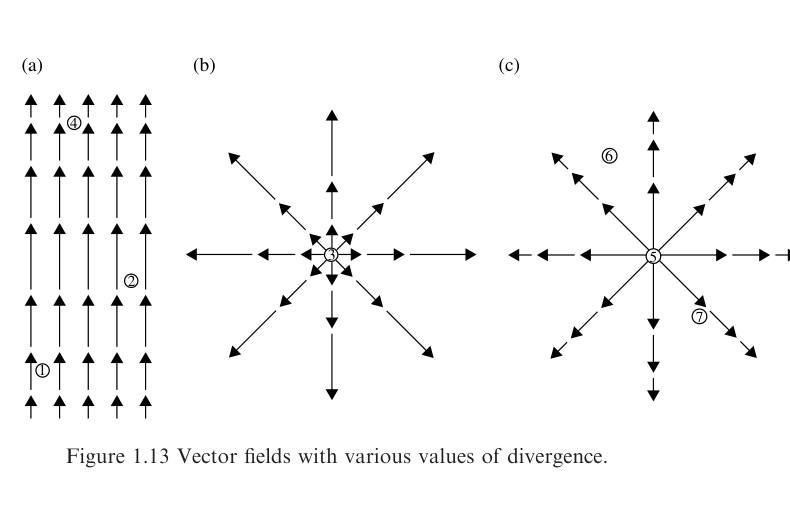

*Figure 1.13 Vector fields with various values of divergence.*

Description: Three panels show a uniform upward field with stronger arrows near some points, a radially outward field that grows with distance, and a radially outward field that weakens with distance, with numbered sample locations indicating different divergence behavior.

Using such tests, it is clear that locations such as 1 and 2 in Figure 1.13(a) and location 3 in Figure 1.13(b) are points of positive divergence, while the divergence is negative at point 4.

The divergence at various points in Figure 1.13(c) is less obvious. Location 5 is obviously a point of positive divergence, but what about locations 6 and 7? The flow lines are clearly spreading out at those locations, but they're also getting shorter at greater distance from the center. Does the spreading out compensate for the slowing down of the flow?

Answering that question requires a useful mathematical form of the divergence as well as a description of how the vector field varies from place to place. The differential form of the mathematical operation of divergence or "del dot" ($\vec{\nabla} \circ$) on a vector $\vec{A}$ in Cartesian coordinates is

$$
\vec{\nabla} \circ \vec{A} = \left(\hat{i}\,\frac{\partial}{\partial x} + \hat{j}\,\frac{\partial}{\partial y} + \hat{k}\,\frac{\partial}{\partial z}\right) \circ (\hat{i}A_x + \hat{j}A_y + \hat{k}A_z),
$$

and, since $\hat{i} \circ \hat{i} = \hat{j} \circ \hat{j} = \hat{k} \circ \hat{k} = 1$, this is

$$
\vec{\nabla} \circ \vec{A} = \left(\frac{\partial A_x}{\partial x} + \frac{\partial A_y}{\partial y} + \frac{\partial A_z}{\partial z}\right). \tag{1.20}
$$

Thus, the divergence of the vector field $\vec{A}$ is simply the change in its $x$-component along the $x$-axis plus the change in its $y$-component along the $y$-axis plus the change in its $z$-component along the $z$-axis. Note that the divergence of a vector field is a scalar quantity; it has magnitude but no direction.

You can now apply this to the vector fields in Figure 1.13. In Figure 1.13(a), assume that the magnitude of the vector field varies sinusoidally along the $x$-axis (which is vertical in this case) as $\vec{A} = \sin(\pi x)\,\hat{i}$ while remaining constant in the $y$- and $z$-directions. Thus,

$$
\vec{\nabla} \circ \vec{A} = \frac{\partial A_x}{\partial x} = \pi \cos(\pi x),
$$

since $A_y$ and $A_z$ are zero. This expression is positive for $0 < x < \frac{1}{2}$, $0$ at $x = \frac{1}{2}$, and negative for $\frac{1}{2} < x < \frac{3}{2}$, just as your visual inspection suggested.

Now consider Figure 1.13(b), which represents a slice through a spherically symmetric vector field with amplitude increasing as the square of the distance from the origin. Thus $\vec{A} = r^2 \hat{r}$. Since $r^2 = (x^2 + y^2 + z^2)$ and

$$
\hat{r} = \frac{x\hat{i} + y\hat{j} + z\hat{k}}{\sqrt{x^2 + y^2 + z^2}},
$$

this means

$$
\vec{A} = r^2\hat{r} = (x^2 + y^2 + z^2)\frac{x\hat{i} + y\hat{j} + z\hat{k}}{\sqrt{x^2 + y^2 + z^2}},
$$

and

$$
\frac{\partial A_x}{\partial x} = (x^2 + y^2 + z^2)^{(1/2)} + x\left(\frac{1}{2}\right)(x^2 + y^2 + z^2)^{(-1/2)}(2x).
$$

Doing likewise for the $y$- and $z$-components and adding yields

$$
\vec{\nabla} \circ \vec{A} = 3(x^2 + y^2 + z^2)^{(1/2)} + \frac{x^2 + y^2 + z^2}{\sqrt{x^2 + y^2 + z^2}} = 4(x^2 + y^2 + z^2)^{1/2} = 4r.
$$

Thus, the divergence in the vector field in Figure 1.13(b) is increasing linearly with distance from the origin.

Finally, consider the vector field in Figure 1.13(c), which is similar to the previous case but with the amplitude of the vector field *decreasing* as the square of the distance from the origin. The flow lines are spreading out as they were in Figure 1.13(b), but in this case you might suspect that the decreasing amplitude of the vector field will affect the value of the divergence. Since $\vec{A} = (1/r^2)\hat{r}$,

$$
\vec{A} = \frac{1}{(x^2 + y^2 + z^2)}\frac{x\hat{i} + y\hat{j} + z\hat{k}}{\sqrt{x^2 + y^2 + z^2}} = \frac{x\hat{i} + y\hat{j} + z\hat{k}}{(x^2 + y^2 + z^2)^{(3/2)}},
$$

and

$$
\frac{\partial A_x}{\partial x} = \frac{1}{(x^2 + y^2 + z^2)^{(3/2)}} - x\left(\frac{3}{2}\right)(x^2 + y^2 + z^2)^{(-5/2)}(2x),
$$

Adding in the $y$- and $z$-derivatives gives

$$
\vec{\nabla} \circ \vec{A} = \frac{3}{(x^2 + y^2 + z^2)^{(3/2)}} - \frac{3(x^2 + y^2 + z^2)}{(x^2 + y^2 + z^2)^{(5/2)}} = 0.
$$

This validates the suspicion that the reduced amplitude of the vector field with distance from the origin may compensate for the spreading out of the flow lines. Note that this is true only for the case in which the amplitude of the vector field falls off as $1/r^2$ (this case is especially relevant for the electric field, which you'll find in the next section).

As you consider the divergence of the electric field, you should remember that some problems may be solved more easily using non-Cartesian coordinate systems. The divergence may be calculated in cylindrical and spherical coordinate systems using

$$
\vec{\nabla} \circ \vec{A} = \frac{1}{r}\frac{\partial}{\partial r}(rA_r) + \frac{1}{r}\frac{\partial A_\phi}{\partial \phi} + \frac{\partial A_z}{\partial z} \qquad (\text{cylindrical}), \tag{1.21}
$$

and

$$
\vec{\nabla} \circ \vec{A} = \frac{1}{r^2}\frac{\partial}{\partial r}(r^2 A_r) + \frac{1}{r\sin\theta}\frac{\partial}{\partial \theta}(A_\theta \sin\theta) + \frac{1}{r\sin\theta}\frac{\partial A_\phi}{\partial \phi} \qquad (\text{spherical}). \tag{1.22}
$$

If you doubt the efficacy of choosing the proper coordinate system, you should rework the last two examples in this section using spherical coordinates.

## The divergence of the electric field

This expression is the entire left side of the differential form of Gauss's law, and it represents the divergence of the electric field. In electrostatics, all electric field lines begin on points of positive charge and terminate on points of negative charge, so it is understandable that this expression is proportional to the electric charge density at the location under consideration.

Consider the electric field of the positive point charge; the electric field lines originate on the positive charge, and you know from Table 1.1 that the electric field is radial and decreases as $1/r^2$:

$$
\vec{E} = \frac{1}{4\pi\varepsilon_0}\frac{q}{r^2}\,\hat{r}.
$$

This is analogous to the vector field shown in Figure 1.13(c), for which the divergence is zero. Thus, the spreading out of the electric field lines is exactly compensated by the $1/r^2$ reduction in field amplitude, and the divergence of the electric field is zero at all points away from the origin.

The reason the origin (where $r = 0$) is not included in the previous analysis is that the expression for the divergence includes terms containing $r$ in the denominator, and those terms become problematic as $r$ approaches zero. To evaluate the divergence at the origin, use the formal definition of divergence:

$$
\vec{\nabla} \circ \vec{E} \equiv \lim_{\Delta V \to 0} \frac{1}{\Delta V} \oint_S \vec{E} \circ \hat{n}\,da.
$$

Considering a special Gaussian surface surrounding the point charge $q$, this is

$$
\vec{\nabla} \circ \vec{E} \equiv \lim_{\Delta V \to 0} \left(\frac{1}{\Delta V}\frac{q}{4\pi\varepsilon_0 r^2} \oint_S da\right) = \lim_{\Delta V \to 0} \left(\frac{1}{\Delta V}\frac{q}{4\pi\varepsilon_0 r^2}(4\pi r^2)\right)
$$

$$
= \lim_{\Delta V \to 0} \left(\frac{1}{\Delta V}\frac{q}{\varepsilon_0}\right).
$$

But $q/\Delta V$ is just the average charge density over the volume $\Delta V$, and as $\Delta V$ shrinks to zero, this becomes equal to $\rho$, the charge density at the origin. Thus, at the origin the divergence is

$$
\vec{\nabla} \circ \vec{E} = \frac{\rho}{\varepsilon_0},
$$

in accordance with Gauss's law.

It is worth your time to make sure you understand the significance of this last point. A casual glance at the electric field lines in the vicinity of a point charge suggests that they "diverge" everywhere (in the sense of getting farther apart). But as you've seen, radial vector fields that decrease in amplitude as $1/r^2$ actually have zero divergence everywhere except at the source. The key factor in determining the divergence at any point is not simply the spacing of the field lines at that point, but whether the flux *out of* an infinitesimally small volume around the point is greater than, equal to, or less than the flux *into* that volume. If the outward flux exceeds the inward flux, the divergence is positive at that point. If the outward flux is less than the inward flux, the divergence is negative, and if the outward and inward fluxes are equal the divergence is zero at that point.

In the case of a point charge at the origin, the flux through an infinitesimally small surface is nonzero only if that surface contains the point charge. Everywhere else, the flux into and out of that tiny surface must be the same (since it contains no charge), and the divergence of the electric field must be zero.

## Applying Gauss's law (differential form)

The problems you're most likely to encounter that can be solved using the differential form of Gauss's law involve calculating the divergence of the electric field and using the result to determine the charge density at a specified location.

The following examples should help you understand how to solve problems of this type.

### Example 1.6: Given an expression for the vector electric field, find the divergence of the field at a specified location.

*Problem:* If the vector field of Figure 1.13(a) were changed to

$$
\vec{A} = \sin\left(\frac{\pi}{2}y\right)\hat{i} - \sin\left(\frac{\pi}{2}x\right)\hat{j},
$$

in the region $-0.5 < x < +0.5$ and $-0.5 < y < +0.5$, how would the field lines be different from those of Figure 1.13(a), and what is the divergence in this case?

*Solution:* When confronted with a problem like this, you may be tempted to dive in and immediately begin taking derivatives to determine the divergence of the field. A better approach is to think about the field for a moment and to attempt to *visualize* the field lines - a task that may be difficult in some cases. Fortunately, there exist a variety of computational tools such as MATLAB and its freeware cousin Octave that are immensely helpful in revealing the details of a vector field. Using the "quiver" command in MATLAB shows that the field looks as shown in Figure 1.14.

If you're surprised by the direction of the field, consider that the $x$-component of the field depends on $y$ (so the field points to the right above the $x$-axis and to the left below the $x$-axis), while the $y$-component of the field depends on the negative of $x$ (so the field points up on the left of the $y$-axis and down on the right of the $y$-axis). Combining these features leads to the field depicted in Figure 1.14.

Examining the field closely reveals that the flow lines neither converge nor diverge, but simply circulate back on themselves. Calculating the divergence confirms this

$$
\vec{\nabla} \circ \vec{A} = \frac{\partial}{\partial x}\left[\sin\left(\frac{\pi}{2}y\right)\right] - \frac{\partial}{\partial y}\left[\sin\left(\frac{\pi}{2}x\right)\right] = 0.
$$

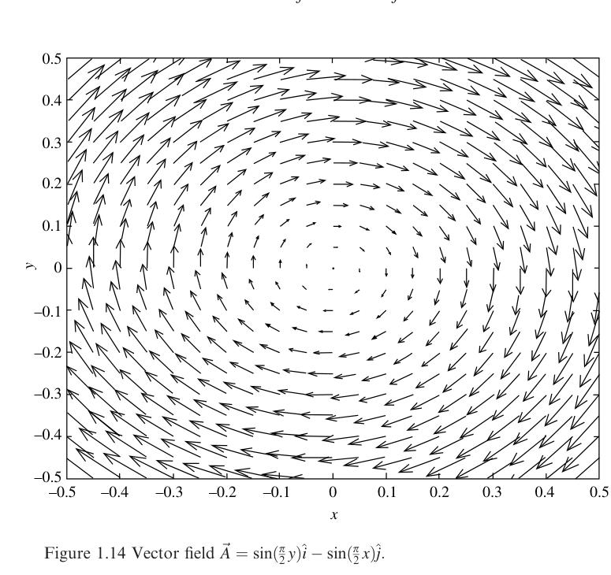

*Figure 1.14 Vector field $\vec{A} = \sin\left(\frac{\pi}{2}y\right)\hat{i} - \sin\left(\frac{\pi}{2}x\right)\hat{j}$.*

Description: A quiver plot over the square $-0.5 \le x \le 0.5$, $-0.5 \le y \le 0.5$ shows arrows circulating around the origin with no net spreading or convergence.

Electric fields that circulate back on themselves are produced not by electric charge, but rather by changing magnetic fields. Such "solenoidal" fields are discussed in Chapter 3.

### Example 1.7: Given the vector electric field in a specified region, find the density of electric charge at a location within that region.

*Problem:* Find the charge density at $x = 2\ \mathrm{m}$ and $x = 5\ \mathrm{m}$ if the electric field in the region is given by

$$
\vec{E} = ax^2\hat{i}\,\frac{\mathrm{V}}{\mathrm{m}} \qquad \text{for } x = 0 \text{ to } 3\ \mathrm{m},
$$

and

$$
\vec{E} = b\hat{i}\,\frac{\mathrm{V}}{\mathrm{m}} \qquad \text{for } x > 3\ \mathrm{m}.
$$

*Solution:* By Gauss's law, in the region $x = 0$ to $3\ \mathrm{m}$,

$$
\vec{\nabla} \circ \vec{E} = \frac{\rho}{\varepsilon_0} = \left(\hat{i}\,\frac{\partial}{\partial x} + \hat{j}\,\frac{\partial}{\partial y} + \hat{k}\,\frac{\partial}{\partial z}\right) \circ (ax^2\hat{i}),
$$

$$
\frac{\rho}{\varepsilon_0} = \frac{\partial (ax^2)}{\partial x} = 2xa,
$$

and

$$
\rho = 2xa\varepsilon_0.
$$

Thus at $x = 2\ \mathrm{m}$, $\rho = 4a\varepsilon_0$.

In the region $x > 3\ \mathrm{m}$,

$$
\vec{\nabla} \circ \vec{E} = \frac{\rho}{\varepsilon_0} = \left(\hat{i}\,\frac{\partial}{\partial x} + \hat{j}\,\frac{\partial}{\partial y} + \hat{k}\,\frac{\partial}{\partial z}\right) \circ (b\hat{i}) = 0,
$$

so $\rho = 0$ at $x = 5\ \mathrm{m}$.

## Problems

The following problems will test your understanding of Gauss's law for electric fields. Full solutions are available on the book's website.

1.1 Find the electric flux through the surface of a sphere containing 15 protons and 10 electrons. Does the size of the sphere matter?
1.2 A cube of side $L$ contains a flat plate with variable surface charge density of $\sigma = -3xy$. If the plate extends from $x = 0$ to $x = L$ and from $y = 0$ to $y = L$, what is the total electric flux through the walls of the cube?

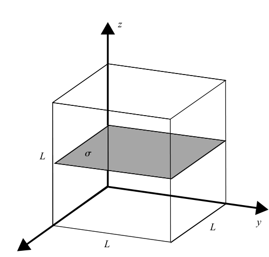

*Problem 1.2 diagram.*

Description: A cube of side length $L$ contains a horizontal rectangular plate labeled $\sigma$, with the $x$, $y$, and $z$ axes drawn from one corner.

1.3 Find the total electric flux through a closed cylinder containing a line charge along its axis with linear charge density $\lambda = \lambda_0(1 - x/h)\ \mathrm{C}/\mathrm{m}$ if the cylinder and the line charge extend from $x = 0$ to $x = h$.
1.4 What is the flux through any closed surface surrounding a charged sphere of radius $a_0$ with volume charge density of $\rho = \rho_0(r/a_0)$, where $r$ is the distance from the center of the sphere?
1.5 A circular disk with surface charge density $2 \times 10^{-10}\ \mathrm{C}/\mathrm{m}^2$ is surrounded by a sphere with radius of $1\ \mathrm{m}$. If the flux through the sphere is $5.2 \times 10^{-2}\ \mathrm{Vm}$, what is the diameter of the disk?
1.6 A $10\ \mathrm{cm} \times 10\ \mathrm{cm}$ flat plate is located $5\ \mathrm{cm}$ from a point charge of $10^{-8}\ \mathrm{C}$. What is the electric flux through the plate due to the point charge?

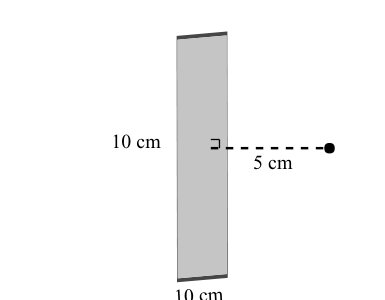

*Problem 1.6 diagram.*

Description: A vertical rectangular plate labeled 10 cm by 10 cm is shown 5 cm from a point charge, with a dashed horizontal separation line between them.

1.7 Find the electric flux through a half-cylinder of height $h$ owing to an infinitely long line charge with charge density $\lambda$ running along the axis of the cylinder.
1.8 A proton rests at the center of the rim of a hemispherical bowl of radius $R$. What is the electric flux through the surface of the bowl?

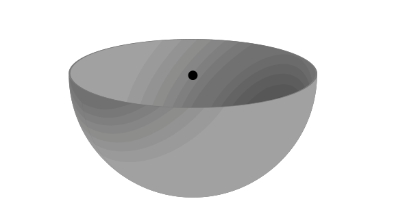

*Problem 1.8 diagram.*

Description: A hemispherical bowl is shown with a dot marking a proton at the center of the circular rim.

1.9 Use a special Gaussian surface around an infinite line charge to find the electric field of the line charge as a function of distance.
1.10 Use a special Gaussian surface to prove that the magnitude of the electric field of an infinite flat plane with surface charge density $\sigma$ is $|\vec{E}| = \sigma/2\varepsilon_0$.
1.11 Find the divergence of the field given by $\vec{A} = (1/r)\hat{r}$ in spherical coordinates.
1.12 Find the divergence of the field given by $\vec{A} = r\hat{r}$ in spherical coordinates.
1.13 Given the vector field

$$
\vec{A} = \cos\left(\pi y - \frac{\pi}{2}\right)\hat{i} + \sin(\pi x)\hat{j},
$$

sketch the field lines and find the divergence of the field.

1.14 Find the charge density in a region for which the electric field in cylindrical coordinates is given by

$$
\vec{E} = \frac{az}{r}\hat{r} + br\hat{\phi} + cr^2 z^2 \hat{z}
$$

1.15 Find the charge density in a region for which the electric field in spherical coordinates is given by

$$
\vec{E} = ar^2\hat{r} + \frac{b\cos(\theta)}{r}\hat{\theta} + c\hat{\phi}.
$$

[^1]: Why do physicists and engineers always talk about small test charges? Because the job of this charge is to *test* the electric field at a location, not to add another electric field into the mix (although you can't stop it from doing so). Making the test charge infinitesimally small minimizes the effect of the test charge's own field.

[^2]: In Chapter 3, you can read about electric fields produced not by charges but by changing magnetic fields. That type of field circulates back on itself and does not obey the same rules as electric fields produced by charge.

[^3]: You could have obtained the same result by finding the projection of $\vec{B}$ onto the direction of $\vec{A}$ and then multiplying by the length of $\vec{A}$.
