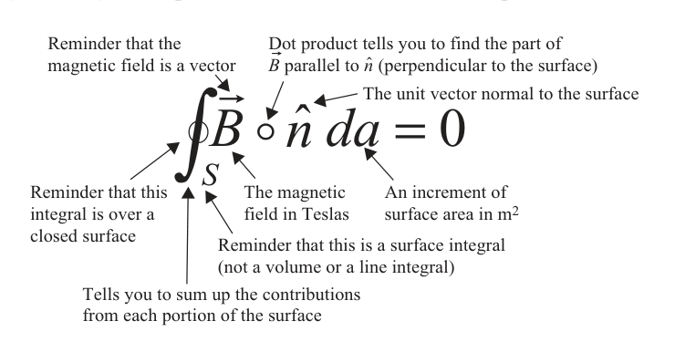
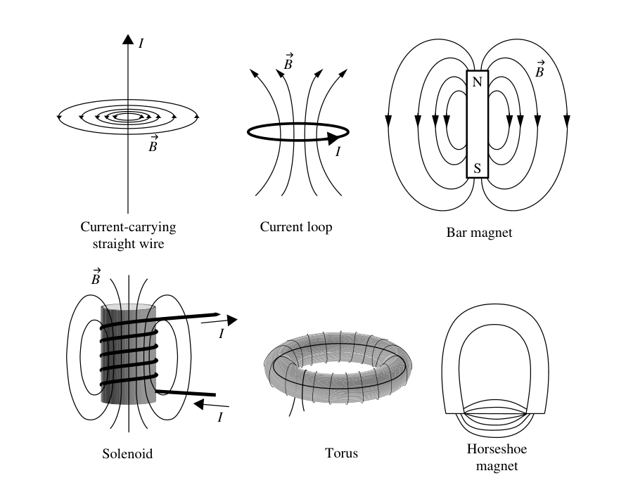
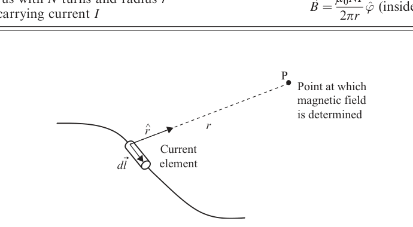
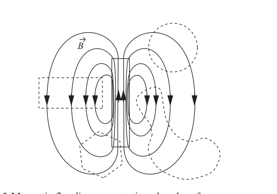
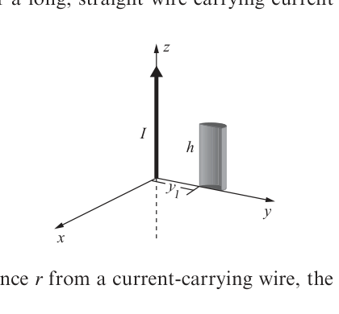
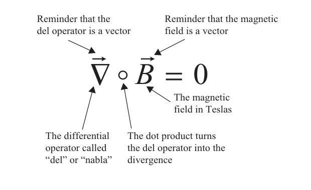
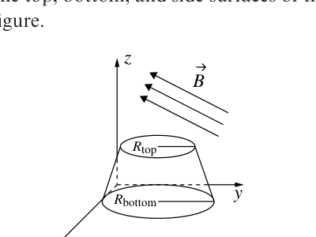
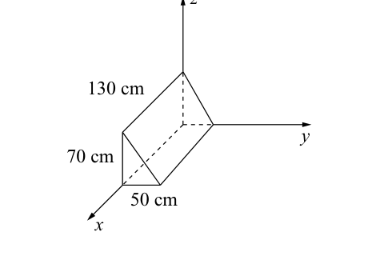

# 2 Gauss's law for magnetic fields

Gauss's law for magnetic fields is similar in form but different in content from Gauss's law for electric fields. For both electric and magnetic fields, the integral form of Gauss's law involves the flux of the field over a closed surface, and the differential form specifies the divergence of the field at a point.

The key difference in the electric field and magnetic field versions of Gauss's law arises because opposite electric charges (called "positive" and "negative") may be isolated from one another, while opposite magnetic poles (called "north" and "south") always occur in pairs. As you might expect, the apparent lack of isolated magnetic poles in nature has a profound impact on the behavior of magnetic flux and on the divergence of the magnetic field.

## 2.1 The integral form of Gauss's law

Notation differs among textbooks, but the integral form of Gauss's law is generally written as follows:

$$
\oint_S \vec{B} \circ \hat{n}\,da = 0
$$

Gauss's law for magnetic fields (integral form).

As described in the previous chapter, the left side of this equation is a mathematical description of the flux of a vector field through a closed surface. In this case, Gauss's law refers to magnetic flux - the number of magnetic field lines - passing through a closed surface $S$. The right side is identically zero.

In this chapter, you will see why this law is different from the electric field case, and you will find some examples of how to use the magnetic version to solve problems - but first you should make sure you understand the main idea of Gauss's law for magnetic fields:

> The total magnetic flux passing through any closed surface is zero.

In other words, if you have a real or imaginary closed surface of any size or shape, the total magnetic flux through that surface must be zero. Note that this does not mean that zero magnetic field lines penetrate the surface - it means that for every magnetic field line that enters the volume enclosed by the surface, there must be a magnetic field line leaving that volume. Thus the inward (negative) magnetic flux must be exactly balanced by the outward (positive) magnetic flux.

Since many of the symbols in Gauss's law for magnetic fields are the same as those covered in the previous chapter, in this chapter you'll find only those symbols peculiar to this law. Here's an expanded view:

*Expanded view of the symbols in the integral form of Gauss's law for magnetic fields.*

Description: An annotated form of $\oint_S \vec{B} \circ \hat{n}\,da = 0$ points to the magnetic field vector, the closed-surface integral, the dot product with the surface normal, and the surface-area element.

Gauss's law for magnetic fields arises directly from the lack of isolated magnetic poles ("magnetic monopoles") in nature. Were such individual poles to exist, they would serve as the sources and sinks of magnetic field lines, just as electric charge does for electric field lines. In that case, enclosing a single magnetic pole within a closed surface would produce nonzero flux through the surface (exactly as you can produce nonzero electric flux by enclosing an electric charge). To date, all efforts to detect magnetic monopoles have failed, and every magnetic north pole is accompanied by a magnetic south pole. Thus the right side of Gauss's law for magnetic fields is identically zero.

Knowing that the total magnetic flux through a closed surface must be zero may allow you to solve problems involving complex surfaces, particularly if the flux through one portion of the surface can be found by integration.

## The magnetic field

Just as the electric field may be defined by considering the electric force on a small test charge, the magnetic field may be defined using the magnetic force experienced by a moving charged particle. As you may recall, charged particles experience magnetic force only if they are in motion with respect to the magnetic field, as shown by the Lorentz equation for magnetic force:

$$
\vec{F}_B = q\,\vec{v} \times \vec{B} \tag{2.1}
$$

where $\vec{F}_B$ is the magnetic force, $q$ is the particle's charge, $\vec{v}$ is the particle's velocity (with respect to $\vec{B}$), and $\vec{B}$ is the magnetic field.

Using the definition of the vector cross-product which says that $\vec{a} \times \vec{b} = |\vec{a}|\,|\vec{b}|\sin(\theta)$, where $\theta$ is the angle between $\vec{a}$ and $\vec{b}$, the magnitude of the magnetic field may be written as

$$
|\vec{B}| = \frac{|\vec{F}_B|}{q|\vec{v}|\sin(\theta)} \tag{2.2}
$$

where $\theta$ is the angle between the velocity vector $\vec{v}$ and the magnetic field $\vec{B}$. The terminology for magnetic quantities is not as standardized as that of electric quantities, so you are likely to find texts that refer to $\vec{B}$ as the "magnetic induction" or the "magnetic flux density." Whatever it is called, $\vec{B}$ has units equivalent to N/(C m/s), which include Vs/m$^2$, N/(Am), kg/(Cs), or most simply, Tesla (T).

Comparing Equation 2.2 to the relevant equation for the electric field, Equation (1.1), several important distinctions between magnetic and electric fields become clear:

- Like the electric field, the magnetic field is directly proportional to the magnetic force. But unlike $\vec{E}$, which is parallel or antiparallel to the electric force, the direction of $\vec{B}$ is perpendicular to the magnetic force.
- Like $\vec{E}$, the magnetic field may be defined through the force experienced by a small test charge, but unlike $\vec{E}$, the speed and direction of the test charge must be taken into consideration when relating magnetic forces and fields.
- Because the magnetic force is perpendicular to the velocity at every instant, the component of the force in the direction of the displacement is zero, and the work done by the magnetic field is therefore always zero.
- Whereas electrostatic fields are produced by electric charges, magnetostatic fields are produced by electric currents.

*Figure 2.1 Examples of magnetic fields.*

Description: Six sketches show magnetic field patterns for a current-carrying straight wire, a current loop, a bar magnet, a solenoid, a torus, and a horseshoe magnet.

Magnetic fields may be represented using field lines whose density in a plane perpendicular to the line direction is proportional to the strength of the field. Examples of several magnetic fields relevant to the application of Gauss's law are shown in Figure 2.1.

Here are a few rules of thumb that will help you visualize and sketch the magnetic fields produced by currents:

- Magnetic field lines do not originate and terminate on charges; they form closed loops.
- The magnetic field lines that appear to originate on the north pole and terminate on the south pole of a magnet are actually continuous loops (within the magnet, the field lines run between the poles).
- The net magnetic field at any point is the vector sum of all magnetic fields present at that point.
- Magnetic field lines can never cross, since that would indicate that the field points in two different directions at the same location - if the fields from two or more sources overlap at the same location, they add (as vectors) to produce a single, total field at that point.

**Table 2.1. Magnetic field equations for simple objects**

| Object | Magnetic field |
| --- | --- |
| Infinite straight wire carrying current $I$ (at distance $r$) | $\vec{B} = \dfrac{\mu_0 I}{2\pi r}\,\hat{\phi}$ |
| Segment of straight wire carrying current $I$ (at distance $r$) | $d\vec{B} = \dfrac{\mu_0 I\,d\vec{l} \times \hat{r}}{4\pi r^2}$ |
| Circular loop of radius $R$ carrying current $I$ (loop in yz plane, at distance $x$ along x-axis) | $\vec{B} = \dfrac{\mu_0 I R^2}{2(x^2 + R^2)^{3/2}}\,\hat{x}$ |
| Solenoid with $N$ turns and length $l$ carrying current $I$ | $\vec{B} = \dfrac{\mu_0 N I}{l}\,\hat{x}$ (inside) |
| Torus with $N$ turns and radius $r$ carrying current $I$ | $\vec{B} = \dfrac{\mu_0 N I}{2\pi r}\,\hat{\phi}$ (inside) |

All static magnetic fields are produced by moving electric charge. The contribution $d\vec{B}$ to the magnetic field at a specified point P from a small element of electric current is given by the Biot-Savart law:

*Figure 2.2 Geometry for Biot-Savart law.*

Description: A current element $d\vec{l}$ lies on a curved wire, a point $P$ marks where the magnetic field is evaluated, and the vector $\hat{r}$ points from the current element toward $P$.

$$
d\vec{B} = \frac{\mu_0}{4\pi}\frac{I\,d\vec{l} \times \hat{r}}{r^2}
$$

In this equation, $\mu_0$ is the permeability of free space, $I$ is the current through the small element, $d\vec{l}$ is a vector with the length of the current element and pointing in the direction of the current, $\hat{r}$ is a unit vector pointing from the current element to the point P at which the field is being calculated, and $r$ is the distance between the current element and P, as shown in Figure 2.2.

Equations for the magnetic field in the vicinity of some simple objects may be found in Table 2.1.

## The magnetic flux through a closed surface

Like the electric flux $\Phi_E$, the magnetic flux $\Phi_B$ through a surface may be thought of as the "amount" of magnetic field "flowing" through the surface. How this quantity is calculated depends on the situation:

$$
\Phi_B = |\vec{B}| \times (\text{surface area}) \qquad \vec{B} \text{ uniform and perpendicular to } S, \tag{2.3}
$$

$$
\Phi_B = \vec{B} \circ \hat{n} \times (\text{surface area}) \qquad \vec{B} \text{ uniform and at an angle to } S, \tag{2.4}
$$

$$
\Phi_B = \int_S \vec{B} \circ \hat{n}\,da \qquad \vec{B} \text{ nonuniform and at variable angle to } S. \tag{2.5}
$$

Magnetic flux, like electric flux, is a scalar quantity, and in the magnetic case, the units of flux have been given the special name "webers" (abbreviated Wb and which, by any of the relations shown above, must be equivalent to Tm$^2$).

As in the case of electric flux, the magnetic flux through a surface may be considered to be the number of magnetic field lines penetrating that surface. When you think about the number of magnetic field lines through a surface, don't forget that magnetic fields, like electric fields, are actually continuous in space, and that "number of field lines" only has meaning once you've established a relationship between the number of lines you draw and the strength of the field.

When considering magnetic flux through a closed surface, it is especially important to remember the caveat that surface penetration is a two-way street, and that outward flux and inward flux have opposite signs. Thus equal amounts of outward (positive) flux and inward (negative) flux will cancel, producing zero net flux.

The reason that the sign of outward and inward flux is so important in the magnetic case may be understood by considering a small closed surface placed in any of the fields shown in Figure 2.1. No matter what shape of surface you choose, and no matter where in the magnetic field you place that surface, you'll find that the number of field lines entering the volume enclosed by the surface is exactly equal to the number of field lines leaving that volume. If this holds true for all magnetic fields, it can only mean that the net magnetic flux through any closed surface must always be zero.

Of course, it does hold true, because the only way to have field lines enter a volume without leaving it is to have them terminate within the volume, and the only way to have field lines leave a volume without entering it is to have them originate within the volume. But unlike electric field lines, magnetic field lines do not originate and terminate on charges - instead, they circulate back on themselves, forming continuous loops. If one portion of a loop passes through a closed surface, another portion of that same loop must pass through the surface in the opposite direction. Thus the outward and inward magnetic flux must be equal and opposite through any closed surface.

*Figure 2.3 Magnetic flux lines penetrating closed surfaces.*

Description: A bar-magnet field is shown together with several dashed closed surfaces, illustrating that field lines entering a closed surface are matched by field lines leaving it.

Consider the closer view of the field produced by a bar magnet shown in Figure 2.3. Irrespective of the shape and location of the closed surfaces placed in the field, all field lines entering the enclosed volume are offset by an equal number of field lines leaving that volume.

The physical reasoning behind Gauss's law should now be clear: the net magnetic flux passing through any closed surface must be zero because magnetic field lines always form complete loops. The next section shows you how to use this principle to solve problems involving closed surfaces and the magnetic field.

## Applying Gauss's law (integral form)

In situations involving complex surfaces and fields, finding the flux by integrating the normal component of the magnetic field over a specified surface can be quite difficult. In such cases, knowing that the total magnetic flux through a closed surface must be zero may allow you to simplify the problem, as demonstrated by the following examples.

### Example 2.1: Given an expression for the magnetic field and a surface geometry, find the flux through a specified portion of that surface.

*Problem:* A closed cylinder of height $h$ and radius $R$ is placed in a magnetic field given by $\vec{B} = B_0(\hat{j} - \hat{k})$. If the axis of the cylinder is aligned along the $z$-axis, find the flux through (a) the top and bottom surfaces of the cylinder and (b) the curved surface of the cylinder.

*Solution:* Gauss's law tells you that the magnetic flux through the entire surface must be zero, so if you're able to figure out the flux through some portions of the surface, you can deduce the flux through the other portions. In this case, the flux through the top and bottom of the cylinder are relatively easy to find; whatever additional amount it takes to make the total flux equal to zero must come from the curved sides of the cylinder. Thus

$$
\Phi_{B,\mathrm{Top}} + \Phi_{B,\mathrm{Bottom}} + \Phi_{B,\mathrm{Sides}} = 0.
$$

The magnetic flux through any surface is

$$
\Phi_B = \int_S \vec{B} \circ \hat{n}\,da.
$$

For the top surface, $\hat{n} = \hat{k}$, so

$$
\vec{B} \circ \hat{n} = (B_0\hat{j} - B_0\hat{k}) \circ \hat{k} = -B_0.
$$

Thus

$$
\Phi_{B,\mathrm{Top}} = \int_S \vec{B} \circ \hat{n}\,da = -B_0 \int_S da = -B_0(\pi R^2).
$$

A similar analysis for the bottom surface (for which $\hat{n} = -\hat{k}$) gives

$$
\Phi_{B,\mathrm{Bottom}} = \int_S \vec{B} \circ \hat{n}\,da = +B_0 \int_S da = +B_0(\pi R^2).
$$

Since $\Phi_{B,\mathrm{Top}} = -\Phi_{B,\mathrm{Bottom}}$, you can conclude that $\Phi_{B,\mathrm{Sides}} = 0$.

### Example 2.2: Given the current in a long wire, find the magnetic flux through nearby surfaces

*Problem:* Find the magnetic flux through the curved surface of a half-cylinder near a long, straight wire carrying current $I$.

*Example 2.2 diagram.*

Description: A vertical long wire carrying current $I$ lies along the $z$-axis next to a half-cylinder of height $h$, with the near edge of the flat face at distance $y_1$ from the wire.

*Solution:* At distance $r$ from a current-carrying wire, the magnetic field is given by

$$
\vec{B} = \frac{\mu_0 I}{2\pi r}\,\hat{\phi},
$$

which means that the magnetic field lines make circles around the wire, entering the half-cylinder through the flat surface and leaving through the curved surface. Gauss's law tells you that the total magnetic flux through all faces of the half-cylinder must be zero, so the amount of (negative) flux through the flat surface must equal the amount of (positive) flux leaving the curved surface. To find the flux through the flat surface, use the expression for flux

$$
\Phi_B = \int_S \vec{B} \circ \hat{n}\,da.
$$

In this case, $\hat{n} = -\hat{\phi}$, so

$$
\vec{B} \circ \hat{n} = \left(\frac{\mu_0 I}{2\pi r}\hat{\phi}\right) \circ (-\hat{\phi}) = -\frac{\mu_0 I}{2\pi r}.
$$

To integrate over the flat face of the half-cylinder, notice that the face lies in the yz plane, and an element of surface area is therefore $da = dy\,dz$. Notice also that on the flat face the distance increment $dr = dy$, so $da = dr\,dz$ and the flux integral is

$$
\Phi_{B,\mathrm{Flat}} = \int_S \vec{B} \circ \hat{n}\,da = -\int_S \frac{\mu_0 I}{2\pi r}\,dr\,dz = -\frac{\mu_0 I}{2\pi}\int_{z=0}^{h}\int_{r=y_1}^{y_1+2R}\frac{dr}{r}\,dz.
$$

Thus

$$
\Phi_{B,\mathrm{Flat}} = -\frac{\mu_0 I}{2\pi}\ln\left(\frac{y_1+2R}{y_1}\right)(h) = -\frac{\mu_0 I h}{2\pi}\ln\left(1 + \frac{2R}{y_1}\right).
$$

Since the total magnetic flux through this closed surface must be zero, this means that the flux through the curved side of the half-cylinder is

$$
\Phi_{B,\mathrm{Curved\ side}} = \frac{\mu_0 I h}{2\pi}\ln\left(1 + \frac{2R}{y_1}\right).
$$

## 2.2 The differential form of Gauss's law

The continuous nature of magnetic field lines makes the differential form of Gauss's law for magnetic fields quite simple. The differential form is written as

$$
\vec{\nabla} \circ \vec{B} = 0
$$

Gauss's law for magnetic fields (differential form).

The left side of this equation is a mathematical description of the divergence of the magnetic field - the tendency of the magnetic field to "flow" more strongly away from a point than toward it - while the right side is simply zero.

The divergence of the magnetic field is discussed in detail in the following section. For now, make sure you grasp the main idea of Gauss's law in differential form:

> The divergence of the magnetic field at any point is zero.

One way to understand why this is true is by analogy with the electric field, for which the divergence at any location is proportional to the electric charge density at that location. Since it is not possible to isolate magnetic poles, you can't have a north pole without a south pole, and the "magnetic charge density" must be zero everywhere. This means that the divergence of the magnetic field must also be zero.

To help you understand the meaning of each symbol in Gauss's law for magnetic fields, here is an expanded view:

*Expanded view of the symbols in the differential form of Gauss's law for magnetic fields.*

Description: An annotated form of $\vec{\nabla} \circ \vec{B} = 0$ points to the del operator, the dot product turning del into divergence, the magnetic field vector, and the zero right-hand side.

## The divergence of the magnetic field

This expression is the entire left side of the differential form of Gauss's law, and it represents the divergence of the magnetic field. Since divergence is by definition the tendency of a field to "flow" away from a point more strongly than toward that point, and since no point sources or sinks of the magnetic field have ever been found, the amount of "incoming" field is exactly the same as the amount of "outgoing" field at every point. So it should not surprise you to find that the divergence of $\vec{B}$ is always zero.

To verify this for the case of the magnetic field around a long, current-carrying wire, take the divergence of the expression for the wire's magnetic field as given in Table 2.1:

$$
\operatorname{div}(\vec{B}) = \vec{\nabla} \circ \vec{B} = \vec{\nabla} \circ \left(\frac{\mu_0 I}{2\pi r}\hat{\phi}\right). \tag{2.6}
$$

This is most easily determined using cylindrical coordinates:

$$
\vec{\nabla} \circ \vec{B} = \frac{1}{r}\frac{\partial}{\partial r}(rB_r) + \frac{1}{r}\frac{\partial B_\phi}{\partial \phi} + \frac{\partial B_z}{\partial z}. \tag{2.7}
$$

which, since $\vec{B}$ has only a $\phi$-component, is

$$
\vec{\nabla} \circ \vec{B} = \frac{1}{r}\frac{\partial (\mu_0 I / 2\pi r)}{\partial \phi} = 0. \tag{2.8}
$$

You can understand this result using the following reasoning: since the magnetic field makes circular loops around the wire, it has no radial or z-dependence. And since the $\phi$-component has no $\phi$-dependence (that is, the magnetic field has constant amplitude around any circular path centered on the wire), the flux away from any point must be the same as the flux toward that point. This means that the divergence of the magnetic field is zero everywhere.

Vector fields with zero divergence are called "solenoidal" fields, and all magnetic fields are solenoidal.

## Applying Gauss's law (differential form)

Knowing that the divergence of the magnetic field must be zero allows you to attack problems involving the spatial change in the components of a magnetic field and to determine whether a specified vector field could be a magnetic field. This section has examples of such problems.

### Example 2.3: Given incomplete information about the components of a magnetic field, use Gauss's law to establish relationships between those components

*Problem:* A magnetic field is given by the expression

$$
\vec{B} = axz\,\hat{i} + byz\,\hat{j} + c\,\hat{k}
$$

What is the relationship between $a$ and $b$?

*Solution:* You know from Gauss's law for magnetic fields that the divergence of the magnetic field must be zero. Thus

$$
\vec{\nabla} \circ \vec{B} = \frac{\partial B_x}{\partial x} + \frac{\partial B_y}{\partial y} + \frac{\partial B_z}{\partial z} = 0.
$$

Thus

$$
\frac{\partial (axz)}{\partial x} + \frac{\partial (byz)}{\partial y} + \frac{\partial c}{\partial z} = 0
$$

and

$$
az + bz + 0 = 0,
$$

which means that $a = -b$.

### Example 2.4: Given an expression for a vector field, determine whether that field could be a magnetic field.

*Problem:* A vector field is given by the expression

$$
\vec{A}(x,y) = a\cos(bx)\hat{i} + aby\sin(bx)\hat{j}.
$$

Could this field be a magnetic field?

*Solution:* Gauss's law tells you that the divergence of all magnetic fields must be zero, and checking the divergence of this vector field gives

$$
\vec{\nabla} \circ \vec{A} = \frac{\partial}{\partial x}[a\cos(bx)] + \frac{\partial}{\partial y}[aby\sin(bx)]
$$

$$
= -ab\sin(bx) + ab\sin(bx) = 0
$$

which indicates that $\vec{A}$ could represent a magnetic field.

## Problems

The following problems will check your understanding of Gauss's law for magnetic fields. Full solutions are available on the book's website.

2.1 Find the magnetic flux produced by the magnetic field $\vec{B} = 5\hat{i} - 3\hat{j} + 4\hat{k}\,\mathrm{nT}$ through the top, bottom, and side surfaces of the flared cylinder shown in the figure.

*Problem 2.1 diagram.*

Description: A flared cylinder with top radius $R_{\mathrm{top}}$ and bottom radius $R_{\mathrm{bottom}}$ is shown in Cartesian axes, with a uniform magnetic field vector drawn diagonally past it.

2.2 What is the change in magnetic flux through a 10 cm by 10 cm square lying 20 cm from a long wire carrying a current that increases from 5 to 15 mA? Assume that the wire is in the plane of the square and parallel to the closest side of the square.

2.3 Find the magnetic flux through all five surfaces of the wedge shown in the figure if the magnetic field in the region is given by

$$
\vec{B} = 0.002\hat{i} + 0.003\hat{j}\,\mathrm{T},
$$

and show that the total flux through the wedge is zero.

*Problem 2.3 diagram.*

Description: A wedge-shaped solid is drawn on x, y, z axes with labeled dimensions 50 cm, 70 cm, and 130 cm.

2.4 Find the flux of the Earth's magnetic field through each face of a cube with 1-m sides, and show that the total flux through the cube is zero. Assume that at the location of the cube the Earth's magnetic field has amplitude of $4 \times 10^{-5}\ \mathrm{T}$ and points upward at an angle of $30^\circ$ with respect to the horizontal. You may orient the cube in any way you choose.

2.5 A cylinder of radius $r_0$ and height $h$ is placed inside an ideal solenoid with the cylinder's axis parallel to the axis of the solenoid. Find the flux through the top, bottom, and curved surfaces of the cylinder and show that the total flux through the cylinder is zero.

2.6 Determine whether the vector fields given by the following expressions in cylindrical coordinates could be magnetic fields:

$$
(a) \qquad \vec{A}(r,\phi,z) = \frac{a}{r}\cos^2(\phi)\hat{r},
$$

$$
(b) \qquad \vec{A}(r,\phi,z) = \frac{a}{r^2}\cos^2(\phi)\hat{r}.
$$
