# 3 Faraday's law

In a series of epoch-making experiments in 1831, Michael Faraday demonstrated that an electric current may be induced in a circuit by changing the magnetic flux enclosed by the circuit. That discovery is made even more useful when extended to the general statement that a changing magnetic field produces an electric field. Such "induced" electric fields are very different from the fields produced by electric charge, and Faraday's law of induction is the key to understanding their behavior.

## 3.1 The integral form of Faraday's law

In many texts, the integral form of Faraday's law is written as

$$
\oint_C \vec{E} \circ d\vec{l} = -\frac{d}{dt}\int_S \vec{B} \circ \hat{n}\,da
$$

Faraday's law (integral form).

Some authors feel that this form is misleading because it confounds two distinct phenomena: magnetic induction (involving a changing magnetic field) and motional electromotive force (emf) (involving movement of a charged particle through a magnetic field). In both cases, an emf is produced, but only magnetic induction leads to a circulating electric field in the rest frame of the laboratory. This means that this common version of Faraday's law is rigorously correct only with the caveat that $\vec{E}$ represents the electric field in the rest frame of each segment $d\vec{l}$ of the path of integration.

A version of Faraday's law that separates the two effects and makes clear the connection between electric field circulation and a changing magnetic field is

$$
\mathrm{emf} = -\frac{d}{dt}\int_S \vec{B} \circ \hat{n}\,da
$$

Flux rule,

$$
\oint_C \vec{E} \circ d\vec{l} = -\int_S \frac{\partial \vec{B}}{\partial t} \circ \hat{n}\,da
$$

Faraday's law (alternate form).

Note that in this version of Faraday's law the time derivative operates only on the magnetic field rather than on the magnetic flux, and both $\vec{E}$ and $\vec{B}$ are measured in the laboratory reference frame.

Don't worry if you're uncertain of exactly what emf is or how it is related to the electric field; that's all explained in this chapter. There are also examples of how to use the flux rule and Faraday's law to solve problems involving induction - but first you should make sure you understand the main idea of Faraday's law:

> Changing magnetic flux through a surface induces an emf in any boundary path of that surface, and a changing magnetic field induces a circulating electric field.

In other words, if the magnetic flux through a surface changes, an electric field is induced along the boundary of that surface. If a conducting material is present along that boundary, the induced electric field provides an emf that drives a current through the material. Thus quickly poking a bar magnet through a loop of wire generates an electric field within that wire, but holding the magnet in a fixed position with respect to the loop induces no electric field.

And what does the negative sign in Faraday's law tell you? Simply that the induced emf opposes the change in flux - that is, it tends to maintain the existing flux. This is called Lenz's law and is discussed later in this chapter.

Here's an expanded view of the standard form of Faraday's law:

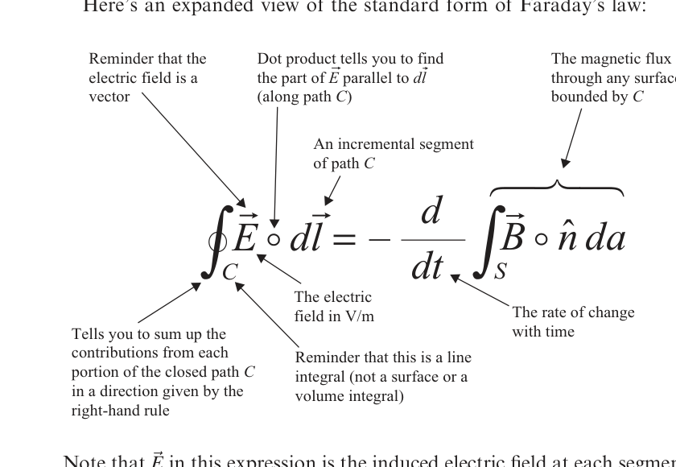

*Expanded view of the standard integral form of Faraday's law.*

Description: An annotated form of $\oint_C \vec{E} \circ d\vec{l} = -\dfrac{d}{dt}\int_S \vec{B} \circ \hat{n}\,da$ identifies the line integral, electric field, path element, magnetic flux term, and time derivative.

And here is an expanded view of the alternative form of Faraday's law:

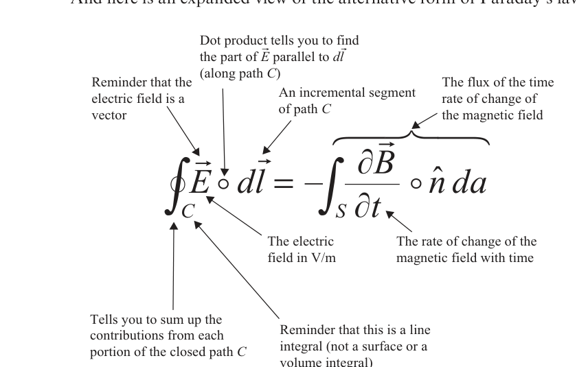

*Expanded view of the alternate integral form of Faraday's law.*

Description: An annotated form of $\oint_C \vec{E} \circ d\vec{l} = -\int_S \dfrac{\partial \vec{B}}{\partial t} \circ \hat{n}\,da$ highlights the path circulation of the electric field and the flux of the time rate of change of the magnetic field.

Faraday's law and the flux rule can be used to solve a variety of problems involving changing magnetic flux and induced electric fields, in particular problems of two types:

1. Given information about the changing magnetic flux, find the induced emf.
2. Given the induced emf on a specified path, determine the rate of change of the magnetic field magnitude or direction or the area bounded by the path.

In situations of high symmetry, in addition to finding the induced emf, it is also possible to find the induced electric field when the rate of change of the magnetic field is known.

## The induced electric field

The electric field in Faraday's law is similar to the electrostatic field in its effect on electric charges, but quite different in its structure. Both types of electric field accelerate electric charges, both have units of N/C or V/m, and both can be represented by field lines. But charge-based electric fields have field lines that originate on positive charge and terminate on negative charge (and thus have non-zero divergence at those points), while induced electric fields produced by changing magnetic fields have field lines that loop back on themselves, with no points of origination or termination (and thus have zero divergence).

It is important to understand that the electric field that appears in the common form of Faraday's law (the one with the full derivative of the magnetic flux on the right side) is the electric field measured in the reference frame of each segment $d\vec{l}$ of the path over which the circulation is calculated. The reason for making this distinction is that it is only in this frame that the electric field lines actually circulate back on themselves.

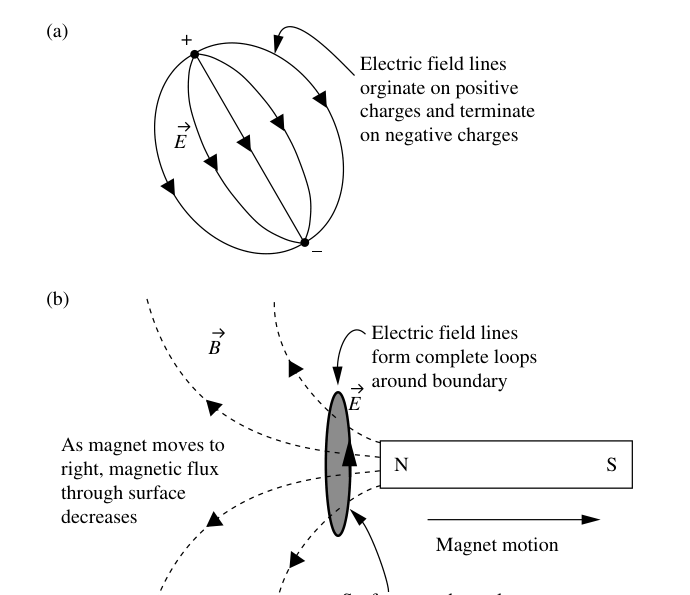

*Figure 3.1 Charge-based and induced electric fields.*

Description: Part (a) shows electric field lines running from a positive charge to a negative charge. Part (b) shows dashed magnetic-field lines, a moving bar magnet, a shaded surface, and a looping induced electric field around the boundary.

Examples of a charge-based and an induced electric field are shown in Figure 3.1.

Note that the induced electric field in Figure 3.1(b) is directed so as to drive an electric current that produces magnetic flux that opposes the change in flux due to the changing magnetic field. In this case, the motion of the magnet to the right means that the leftward magnetic flux is decreasing, so the induced current produces additional leftward magnetic flux.

Here are a few rules of thumb that will help you visualize and sketch the electric fields produced by changing magnetic fields:

- Induced electric field lines produced by changing magnetic fields must form complete loops.
- The net electric field at any point is the vector sum of all electric fields present at that point.
- Electric field lines can never cross, since that would indicate that the field points in two different directions at the same location.

In summary, the $\vec{E}$ in Faraday's law represents the induced electric field at each point along path $C$, a boundary of the surface through which the magnetic flux is changing over time. The path may be through empty space or through a physical material - the induced electric field exists in either case.

## The line integral

To understand Faraday's law, it is essential that you comprehend the meaning of the line integral. This type of integral is common in physics and engineering, and you have probably come across it before, perhaps when confronted with a problem such as this: find the total mass of a wire for which the density varies along its length. This problem serves as a good review of line integrals.

Consider the variable-density wire shown in Figure 3.2(a). To determine the total mass of the wire, imagine dividing the wire into a series of short segments over each of which the linear density $\lambda$ (mass per unit length) is approximately constant, as shown in Figure 3.2(b). The mass of each segment is the product of the linear density of that segment times the segment length $dx_i$, and the mass of the entire wire is the sum of the segment masses.

For $N$ segments, this is

$$
\mathrm{Mass} = \sum_{i=1}^{N} \lambda_i\,dx_i. \tag{3.1}
$$

Allowing the segment length to approach zero turns the summation of the segment masses into a line integral:

$$
\mathrm{Mass} = \int_0^L \lambda(x)\,dx. \tag{3.2}
$$

This is the line integral of the scalar function $\lambda(x)$. To fully comprehend the left side of Faraday's law, you'll have to understand how to extend this concept to the path integral of a vector field, which you can read about in the next section.

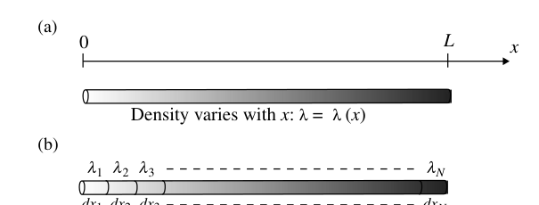

*Figure 3.2 Line integral for a scalar function.*

Description: Part (a) shows a wire from $0$ to $L$ along the $x$-axis with density varying as $\lambda(x)$. Part (b) divides the wire into short labeled segments with approximate densities $\lambda_1, \lambda_2, \lambda_3, \ldots, \lambda_N$ and lengths $dx_1, dx_2, dx_3, \ldots, dx_N$.

## The path integral of a vector field

The line integral of a vector field around a closed path is called the "circulation" of the field. A good way to understand the meaning of this operation is to consider the work done by a force as it moves an object along a path.

As you may recall, work is done when an object is displaced under the influence of a force. If the force ($\vec{F}$) is constant and in the same direction as the displacement ($d\vec{l}$), the amount of work ($W$) done by the force is simply the product of the magnitudes of the force and the displacement:

$$
W = |\vec{F}|\,|d\vec{l}|. \tag{3.3}
$$

This situation is illustrated in Figure 3.3(a). In many cases, the displacement is not in the same direction as the force, and it then becomes necessary to determine the component of the force in the direction of the displacement, as shown in Figure 3.3(b).

In this case, the amount of work done by the force is equal to the component of the force in the direction of the displacement multiplied by the amount of displacement. This is most easily signified using the dot product notation described in Chapter 1:

$$
W = \vec{F} \circ d\vec{l} = |\vec{F}|\,|d\vec{l}|\cos(\theta), \tag{3.4}
$$

where $\theta$ is the angle between the force and the displacement.

In the most general case, the force $\vec{F}$ and the angle between the force and the displacement may not be constant, which means that the projection of the force on each segment may be different (it is also possible that the magnitude of the force may change along the path). The general case is illustrated in Figure 3.4. Note that as the path meanders from the starting point to the end, the component of the force in the direction of the displacement varies considerably.

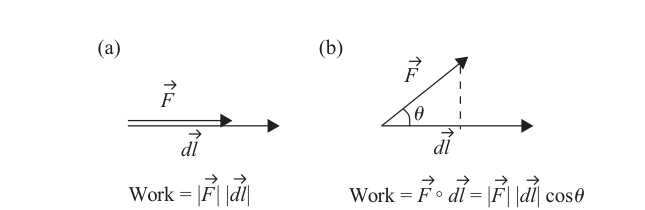

*Figure 3.3 Object moving under the influence of a force.*

Description: Part (a) shows force and displacement in the same direction, while part (b) shows a force at angle $\theta$ to the displacement and the corresponding dot-product work relation.

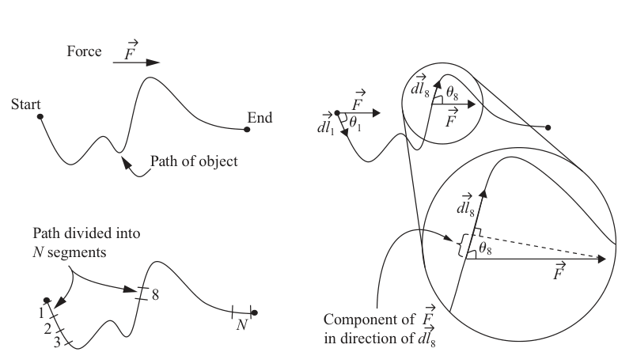

*Figure 3.4 Component of force along object path.*

Description: A wavy path is divided into many short segments, and enlarged sketches show the local displacement direction, the applied force, the angle between them, and the component of force along the path.

To find the work in this case, the path may be thought of as a series of short segments over each of which the component of the force is constant. The incremental work ($dW_i$) done over each segment is simply the component of the force along the path at that segment times the segment length ($dl_i$) - and that's exactly what the dot product does. Thus,

$$
dW_i = \vec{F} \circ d\vec{l}_i, \tag{3.5}
$$

and the work done along the entire path is then just the summation of the incremental work done at each segment, which is

$$
W = \sum_{i=1}^{N} dW_i = \sum_{i=1}^{N} \vec{F} \circ d\vec{l}_i. \tag{3.6}
$$

As you've probably guessed, you can now allow the segment length to shrink toward zero, converting the sum to an integral over the path:

$$
W = \int_P \vec{F} \circ d\vec{l}. \tag{3.7}
$$

Thus, the work in this case is the path integral of the vector $\vec{F}$ over path $P$. This integral is similar to the line integral you used to find the mass of a variable-density wire, but in this case the integrand is the dot product between two vectors rather than the scalar function $\lambda$.

Although the force in this example is uniform, the same analysis pertains to a vector field of force that varies in magnitude and direction along the path. The integral on the right side of Equation 3.7 may be defined for any vector field $\vec{A}$ and any path $C$. If the path is closed, this integral represents the circulation of the vector field around that path:

$$
\mathrm{Circulation} \equiv \oint_C \vec{A} \circ d\vec{l}. \tag{3.8}
$$

The circulation of the electric field is an important part of Faraday's law, as described in the next section.

## The electric field circulation

Since the field lines of induced electric fields form closed loops, these fields are capable of driving charged particles around continuous circuits. Charge moving through a circuit is the very definition of electric current, so the induced electric field may act as a generator of electric current. It is therefore understandable that the circulation of the electric field around a circuit has come to be known as an "electromotive force":

$$
\mathrm{electromotive\ force\ (emf)} = \oint_C \vec{E} \circ d\vec{l}. \tag{3.9}
$$

Of course, the path integral of an electric field is not a force (which must have SI units of newtons), but rather a force per unit charge integrated over a distance (with units of newtons per coulomb times meters, which are the same as volts). Nonetheless, the terminology is now standard, and "source of emf" is often applied to induced electric fields as well as to batteries and other sources of electrical energy.

So, exactly what is the circulation of the induced electric field around a path? It is just the work done by the electric field in moving a unit charge around that path, as you can see by substituting $\vec{F}/q$ for $\vec{E}$ in the circulation integral:

$$
\oint_C \vec{E} \circ d\vec{l} = \oint_C \frac{\vec{F}}{q} \circ d\vec{l} = \frac{\oint_C \vec{F} \circ d\vec{l}}{q} = \frac{W}{q}. \tag{3.10}
$$

Thus, the circulation of the induced electric field is the energy given to each coulomb of charge as it moves around the circuit.

## The rate of change of flux

The right side of the common form of Faraday's law may look intimidating at first glance, but a careful inspection of the terms reveals that the largest portion of this expression is simply the magnetic flux ($\Phi_B$):

$$
\Phi_B = \int_S \vec{B} \circ \hat{n}\,da.
$$

If you're tempted to think that this quantity must be zero according to Gauss's law for magnetic fields, look more carefully. The integral in this expression is over any surface $S$, whereas the integral in Gauss's law is specifically over a closed surface. The magnetic flux (proportional to the number of magnetic field lines) through an open surface may indeed be nonzero - it is only when the surface is closed that the number of magnetic field lines passing through the surface in one direction must equal the number passing through in the other direction.

So the right side of this form of Faraday's law involves the magnetic flux through any surface $S$ - more specifically, the rate of change with time ($d/dt$) of that flux. If you're wondering how the magnetic flux through a surface might change, just look at the equation and ask yourself what might vary with time in this expression. Here are three possibilities, each of which is illustrated in Figure 3.5:

- The magnitude of $\vec{B}$ might change: the strength of the magnetic field may be increasing or decreasing, causing the number of field lines penetrating the surface to change.
- The angle between $\vec{B}$ and the surface normal might change: varying the direction of either $\vec{B}$ or the surface normal causes $\vec{B} \circ \hat{n}$ to change.
- The area of the surface might change: even if the magnitude of $\vec{B}$ and the direction of both $\vec{B}$ and $\hat{n}$ remain the same, varying the area of surface $S$ will change the value of the flux through the surface.

Each of these changes, or a combination of them, causes the right side of Faraday's law to become nonzero. And since the left side of Faraday's law is the induced emf, you should now understand the relationship between induced emf and changing magnetic flux.

To connect the mathematical statement of Faraday's law to physical effects, consider the magnetic fields and conducting loops shown in Figure 3.5. As Faraday discovered, the mere presence of magnetic flux through a circuit does not produce an electric current within that circuit. Thus, holding a stationary magnet near a stationary conducting loop induces no current (in this case, the magnetic flux is not a function of time, so its time derivative is zero and the induced emf must also be zero).

Of course, Faraday's law tells you that changing the magnetic flux through a surface does induce an emf in any circuit that is a boundary to that surface. So, moving a magnet toward or away from the loop, as in Figure 3.5(a), causes the magnetic flux through the surface bounded by the loop to change, resulting in an induced emf around the circuit.[^4]

In Figure 3.5(b), the change in magnetic flux is produced not by moving the magnet, but by rotating the loop. This changes the angle between the magnetic field and the surface normal, which changes $\vec{B} \circ \hat{n}$. In Figure 3.5(c), the area enclosed by the loop is changing over time, which changes the flux through the surface. In each of these cases, you should note that the magnitude of the induced emf does not depend on the total amount of magnetic flux through the loop - it depends only on how fast the flux changes.

Before looking at some examples of how to use Faraday's law to solve problems, you should consider the direction of the induced electric field, which is provided by Lenz's law.

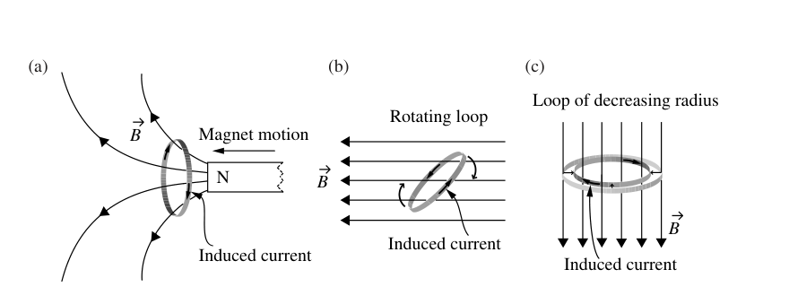

*Figure 3.5 Magnetic flux and induced current.*

Description: Three sketches show induced current caused by a moving magnet, a rotating loop in a uniform field, and a loop of shrinking radius in a uniform field.

## Lenz's law

There's a great deal of physics wrapped up in the minus sign on the right side of Faraday's law, so it is fitting that it has a name: Lenz's law. The name comes from Heinrich Lenz, a German physicist who had an important insight concerning the direction of the current induced by changing magnetic flux.

Lenz's insight was this: currents induced by changing magnetic flux always flow in the direction so as to oppose the change in flux. That is, if the magnetic flux through the circuit is increasing, the induced current produces its own magnetic flux in the opposite direction to offset the increase. This situation is shown in Figure 3.6(a), in which the magnet is moving toward the loop. As the leftward flux due to the magnet increases, the induced current flows in the direction shown, which produces rightward magnetic flux that opposes the increased flux from the magnet.

The alternative situation is shown in Figure 3.6(b), in which the magnet is moving away from the loop and the leftward flux through the circuit is decreasing. In this case, the induced current flows in the opposite direction, contributing leftward flux to make up for the decreasing flux from the magnet.

It is important for you to understand that changing magnetic flux induces an electric field whether or not a conducting path exists in which a current may flow. Thus, Lenz's law tells you the direction of the circulation of the induced electric field around a specified path even if no conduction current actually flows along that path.

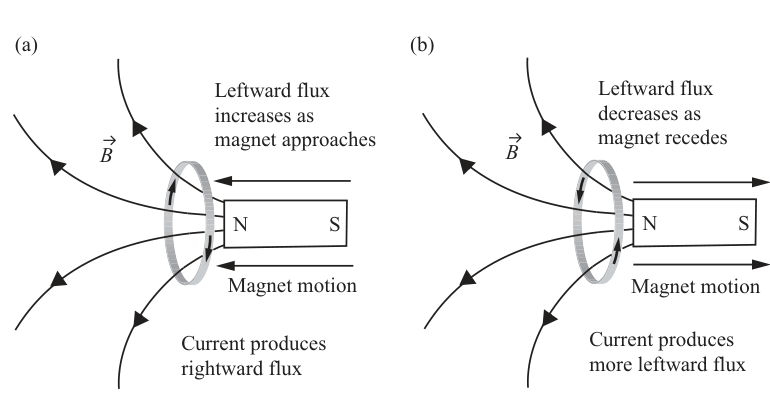

*Figure 3.6 Direction of induced current.*

Description: Two sketches compare a magnet approaching and receding from a loop, with magnetic field direction and induced-current direction chosen to oppose the corresponding flux change.

## Applying Faraday's law (integral form)

The following examples show you how to use Faraday's law to solve problems involving changing magnetic flux and induced emf.

### Example 3.1: Given an expression for the magnetic field as a function of time, determine the emf induced in a loop of specified size.

*Problem:* For a magnetic field given by

$$
\vec{B}(y,t) = B_0\left(\frac{t}{t_0}\right)\frac{y}{y_0}\,\hat{z}.
$$

Find the emf induced in a square loop of side $L$ lying in the $xy$-plane with one corner at the origin. Also, find the direction of current flow in the loop.

*Solution:* Using Faraday's flux rule,

$$
\mathrm{emf} = -\frac{d}{dt}\int_S \vec{B} \circ \hat{n}\,da.
$$

For a loop in the $xy$-plane, $\hat{n} = \hat{z}$ and $da = dx\,dy$, so

$$
\mathrm{emf} = -\frac{d}{dt}\int_{y=0}^{L}\int_{x=0}^{L} B_0\left(\frac{t}{t_0}\right)\frac{y}{y_0}\,\hat{z} \circ \hat{z}\,dx\,dy,
$$

and

$$
\mathrm{emf} = -\frac{d}{dt}\left[L\int_{y=0}^{L} B_0\left(\frac{t}{t_0}\right)\frac{y}{y_0}\,dy\right] = -\frac{d}{dt}\left[B_0\left(\frac{t}{t_0}\right)\frac{L^3}{2y_0}\right].
$$

Taking the time derivative gives

$$
\mathrm{emf} = -B_0\frac{L^3}{2t_0y_0}.
$$

Since upward magnetic flux is increasing with time, the current will flow in a direction that produces flux in the downward ($-\hat{z}$) direction. This means the current will flow in the clockwise direction as seen from above.

### Example 3.2: Given an expression for the change in orientation of a conducting loop in a fixed magnetic field, find the emf induced in the loop.

*Problem:* A circular loop of radius $r_0$ rotates with angular speed $\omega$ in a fixed magnetic field as shown in the figure.

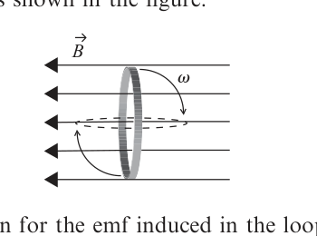

*Example 3.2 diagram.*

Description: A circular loop rotates in a uniform magnetic field whose lines point left, and the angle of the loop changes with angular speed $\omega$.

1. Find an expression for the emf induced in the loop.
2. If the magnitude of the magnetic field is $25\ \mu\mathrm{T}$, the radius of the loop is $1\ \mathrm{cm}$, the resistance of the loop is $25\ \Omega$, and the rotation rate $\omega$ is $3\ \mathrm{rad/s}$, what is the maximum current in the loop?

*Solution:* By Faraday's flux rule, the emf is

$$
\mathrm{emf} = -\frac{d}{dt}\int_S \vec{B} \circ \hat{n}\,da.
$$

Since the magnetic field and the area of the loop are constant, this becomes

$$
\mathrm{emf} = -\int_S \frac{d}{dt}(\vec{B} \circ \hat{n})\,da = -\int_S |\vec{B}|\,\frac{d}{dt}(\cos\theta)\,da.
$$

Using $\theta = \omega t$, this is

$$
\mathrm{emf} = -\int_S |\vec{B}|\,\frac{d}{dt}(\cos \omega t)\,da = -|\vec{B}|\,\frac{d}{dt}(\cos \omega t)\int_S da.
$$

Taking the time derivative and performing the integration gives

$$
\mathrm{emf} = |\vec{B}|\,\omega (\sin \omega t)(\pi r_0^2).
$$

By Ohm's law, the current is the emf divided by the resistance of the circuit, which is

$$
I = \frac{\mathrm{emf}}{R} = \frac{|\vec{B}|\,\omega (\sin \omega t)(\pi r_0^2)}{R}.
$$

For maximum current, $\sin(\omega t)=1$, so the current is

$$
I = \frac{(25 \times 10^{-6})(3)[\pi(0.01)^2]}{25} = 9.4 \times 10^{-10}\ \mathrm{A}.
$$

### Example 3.3: Given an expression for the change in size of a conducting loop in a fixed magnetic field, find the emf induced in the loop.

*Problem:* A circular loop lying perpendicular to a fixed magnetic field decreases in size over time. If the radius of the loop is given by $r(t)=r_0(1-t/t_0)$, find the emf induced in the loop.

*Solution:* Since the loop is perpendicular to the magnetic field, the loop normal is parallel to $\vec{B}$, and Faraday's flux rule is

$$
\mathrm{emf} = -\frac{d}{dt}\int_S \vec{B} \circ \hat{n}\,da = -|\vec{B}|\,\frac{d}{dt}\int_S da = -|\vec{B}|\,\frac{d}{dt}(\pi r^2).
$$

Inserting $r(t)$ and taking the time derivative gives

$$
\mathrm{emf} = -|\vec{B}|\,\frac{d}{dt}\left[\pi r_0^2\left(1-\frac{t}{t_0}\right)^2\right] = -|\vec{B}|\left[\pi r_0^2(2)\left(1-\frac{t}{t_0}\right)\left(-\frac{1}{t_0}\right)\right],
$$

or

$$
\mathrm{emf} = \frac{2|\vec{B}|\pi r_0^2}{t_0}\left(1-\frac{t}{t_0}\right).
$$

[^4]: For simplicity, you can imagine a planar surface stretched across the loop, but Faraday's law holds for any surface bounded by the loop.

## 3.2 The differential form of Faraday's law

The differential form of Faraday's law is generally written as

$$
\vec{\nabla} \times \vec{E} = -\frac{\partial \vec{B}}{\partial t}
$$

Faraday's law.

The left side of this equation is a mathematical description of the curl of the electric field - the tendency of the field lines to circulate around a point. The right side represents the rate of change of the magnetic field over time.

The curl of the electric field is discussed in detail in the following section. For now, make sure you grasp the main idea of Faraday's law in differential form:

> A circulating electric field is produced by a magnetic field that changes with time.

To help you understand the meaning of each symbol in the differential form of Faraday's law, here's an expanded view:

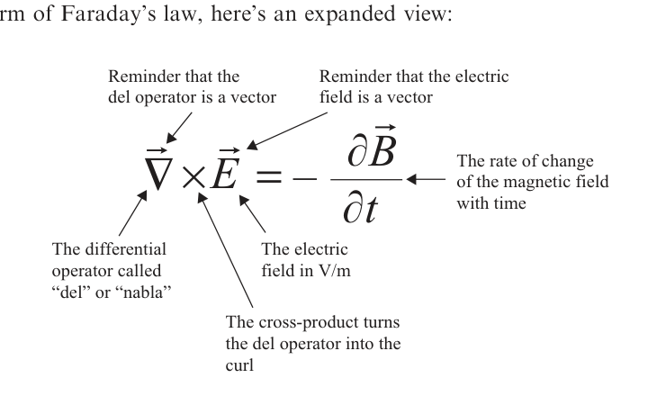

*Expanded view of the differential form of Faraday's law.*

Description: An annotated form of $\vec{\nabla} \times \vec{E} = -\dfrac{\partial \vec{B}}{\partial t}$ points to the del operator, the curl, the electric field, and the time rate of change of the magnetic field.

## Del cross - the curl

The curl of a vector field is a measure of the field's tendency to circulate about a point - much like the divergence is a measure of the tendency of the field to flow away from a point. Once again we have Maxwell to thank for the terminology; he settled on "curl" after considering several alternatives, including "turn" and "twirl" (which he thought was somewhat racy).

Just as the divergence is found by considering the flux through an infinitesimal surface surrounding the point of interest, the curl at a specified point may be found by considering the circulation per unit area over an infinitesimal path around that point. The mathematical definition of the curl of a vector field $\vec{A}$ is

$$
\operatorname{curl}(\vec{A}) = \vec{\nabla} \times \vec{A} \equiv \lim_{\Delta S \to 0} \frac{1}{\Delta S}\oint_C \vec{A} \circ d\vec{l}, \tag{3.11}
$$

where $C$ is a path around the point of interest and $\Delta S$ is the surface area enclosed by that path. In this definition, the direction of the curl is the normal direction of the surface for which the circulation is a maximum.

This expression is useful in defining the curl, but it doesn't offer much help in actually calculating the curl of a specified field. You'll find an alternative expression for curl later in this section, but first you should consider the vector fields shown in Figure 3.7.

To find the locations of large curl in each of these fields, imagine that the field lines represent the flow lines of a fluid. Then look for points at which the flow vectors on one side of the point are significantly different (in magnitude, direction, or both) from the flow vectors on the opposite side of the point.

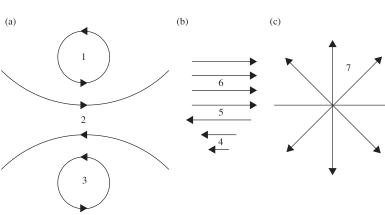

*Figure 3.7 Vector fields with various values of curl.*

Description: Three sketches label points in rotational, shearing, and purely diverging vector fields to illustrate where a tiny paddlewheel would and would not rotate.

To aid this thought experiment, imagine holding a tiny paddlewheel at each point in the flow. If the flow would cause the paddlewheel to rotate, the center of the wheel marks a point of nonzero curl. The direction of the curl is along the axis of the paddlewheel (as a vector, curl must have both magnitude and direction). By convention, the positive-curl direction is determined by the right-hand rule: if you curl the fingers of your right hand along the circulation, your thumb points in the direction of positive curl.

Using the paddlewheel test, you can see that points 1, 2, and 3 in Figure 3.7(a) and points 4 and 5 in Figure 3.7(b) are high-curl locations. The uniform flow around point 6 in Figure 3.7(b) and the diverging flow lines around point 7 in Figure 3.7(c) would not cause a tiny paddlewheel to rotate, meaning that these are points of low or zero curl.

To make this quantitative, you can use the differential form of the curl or "del cross" ($\vec{\nabla} \times$) operator in Cartesian coordinates:

$$
\vec{\nabla} \times \vec{A} = \left(\hat{i}\frac{\partial}{\partial x} + \hat{j}\frac{\partial}{\partial y} + \hat{k}\frac{\partial}{\partial z}\right) \times (\hat{i}A_x + \hat{j}A_y + \hat{k}A_z). \tag{3.12}
$$

The vector cross-product may be written as a determinant:

$$
\vec{\nabla} \times \vec{A} =
\begin{vmatrix}
\hat{i} & \hat{j} & \hat{k} \\
\dfrac{\partial}{\partial x} & \dfrac{\partial}{\partial y} & \dfrac{\partial}{\partial z} \\
A_x & A_y & A_z
\end{vmatrix}, \tag{3.13}
$$

which expands to

$$
\vec{\nabla} \times \vec{A} = \left(\frac{\partial A_z}{\partial y} - \frac{\partial A_y}{\partial z}\right)\hat{i} + \left(\frac{\partial A_x}{\partial z} - \frac{\partial A_z}{\partial x}\right)\hat{j} + \left(\frac{\partial A_y}{\partial x} - \frac{\partial A_x}{\partial y}\right)\hat{k}. \tag{3.14}
$$

Note that each component of the curl of $\vec{A}$ indicates the tendency of the field to rotate in one of the coordinate planes. If the curl of the field at a point has a large x-component, it means that the field has significant circulation about that point in the $y$-$z$ plane. The overall direction of the curl represents the axis about which the rotation is greatest, with the sense of the rotation given by the right-hand rule.

If you're wondering how the terms in this equation measure rotation, consider the vector fields shown in Figure 3.8. Look first at the field in Figure 3.8(a) and the x-component of the curl in the equation: this term involves the change in $A_z$ with $y$ and the change in $A_y$ with $z$. Proceeding along the $y$-axis from the left side of the point of interest to the right, $A_z$ is clearly increasing (it is negative on the left side of the point of interest and positive on the right side), so the term $\partial A_z/\partial y$ must be positive. Looking now at $A_y$, you can see that it is positive below the point of interest and negative above, so it is decreasing along the $z$ axis. Thus, $\partial A_y/\partial z$ is negative, which means that it increases the value of the curl when it is subtracted from $\partial A_z/\partial y$. Thus the curl has a large value at the point of interest, as expected in light of the circulation of $\vec{A}$ about this point.

The situation in Figure 3.8(b) is quite different. In this case, both $\partial A_y/\partial z$ and $\partial A_z/\partial y$ are positive, and subtracting $\partial A_y/\partial z$ from $\partial A_z/\partial y$ gives a small result. The value of the x-component of the curl is therefore small in this case. Vector fields with zero curl at all points are called "irrotational."

Here are expressions for the curl in cylindrical and spherical coordinates:

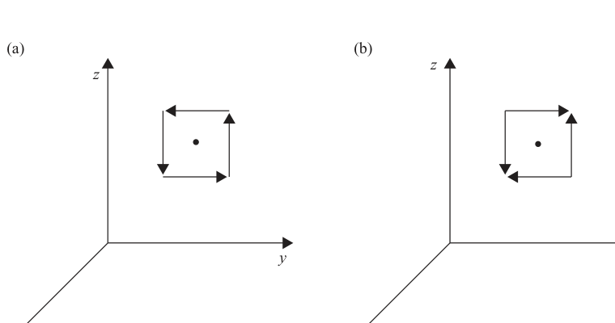

*Figure 3.8 Effect of $\partial A_y/\partial z$ and $\partial A_z/\partial y$ on value of curl.*

Description: Two coordinate sketches compare a strongly circulating field and a weakly circulating field around a point in the $y$-$z$ plane.

$$
\vec{\nabla} \times \vec{A} \equiv \left(\frac{1}{r}\frac{\partial A_z}{\partial \phi} - \frac{\partial A_\phi}{\partial z}\right)\hat{r} + \left(\frac{\partial A_r}{\partial z} - \frac{\partial A_z}{\partial r}\right)\hat{\phi} + \frac{1}{r}\left(\frac{\partial (rA_\phi)}{\partial r} - \frac{\partial A_r}{\partial \phi}\right)\hat{z}\quad \text{(cylindrical)}, \tag{3.15}
$$

$$
\vec{\nabla} \times \vec{A} \equiv \left(\frac{1}{r\sin\theta}\frac{\partial (A_\phi\sin\theta)}{\partial \theta} - \frac{1}{r\sin\theta}\frac{\partial A_\theta}{\partial \phi}\right)\hat{r} + \frac{1}{r}\left(\frac{1}{\sin\theta}\frac{\partial A_r}{\partial \phi} - \frac{\partial (rA_\phi)}{\partial r}\right)\hat{\theta} + \frac{1}{r}\left(\frac{\partial (rA_\theta)}{\partial r} - \frac{\partial A_r}{\partial \theta}\right)\hat{\phi}\quad \text{(spherical)}. \tag{3.16}
$$

## The curl of the electric field

Since charge-based electric fields diverge away from points of positive charge and converge toward points of negative charge, such fields cannot circulate back on themselves. You can understand that by looking at the field lines for the electric dipole shown in Figure 3.9(a). Imagine moving along a closed path that follows one of the electric field lines diverging from the positive charge, such as the dashed line shown in the figure. To close the loop and return to the positive charge, you'll have to move "upstream" against the electric field for a portion of the path. For that segment, $\vec{E} \circ d\vec{l}$ is negative, and the contribution from this part of the path subtracts from the positive value of $\vec{E} \circ d\vec{l}$ for the portion of the path in which $\vec{E}$ and $d\vec{l}$ are in the same direction. Once you've gone all the way around the loop, the integration of $\vec{E} \circ d\vec{l}$ yields exactly zero.

Thus, the field of the electric dipole, like all electrostatic fields, has no curl.

Electric fields induced by changing magnetic fields are very different, as you can see in Figure 3.9(b). Wherever a changing magnetic field exists, a circulating electric field is induced. Unlike charge-based electric fields, induced fields have no origination or termination points - they are continuous and circulate back on themselves. Integrating $\vec{E} \circ d\vec{l}$ around any boundary path for the surface through which $\vec{B}$ is changing produces a nonzero result, which means that induced electric fields have curl. The faster $\vec{B}$ changes, the larger the magnitude of the curl of the induced electric field.

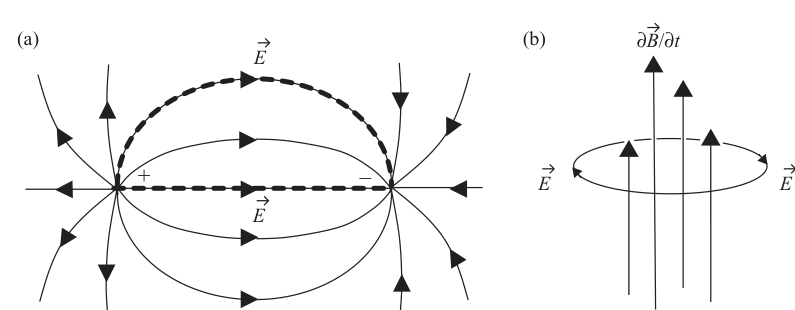

*Figure 3.9 Closed paths in charge-based and induced electric fields.*

Description: Part (a) shows electric-dipole field lines and a dashed closed path, while part (b) shows circular induced electric-field lines surrounding a region where $\partial \vec{B}/\partial t$ points upward.

## Applying Faraday's law (differential form)

The differential form of Faraday's law is very useful in deriving the electromagnetic wave equation, which you can read about in Chapter 5. You may also encounter two types of problems that can be solved using this equation. In one type, you're provided with an expression for the magnetic field as a function of time and asked to find the curl of the induced electric field. In the other type, you're given an expression for the induced vector electric field and asked to determine the time rate of change of the magnetic field. Here are two examples of such problems.

### Example 3.4: Given an expression for the magnetic field as a function of time, find the curl of the electric field.

*Problem:* The magnetic field in a certain region is given by the expression

$$
\vec{B}(t) = B_0\cos(kz - \omega t)\,\hat{j}.
$$

1. Find the curl of the induced electric field at that location.
2. If the $E_z$ is known to be zero, find $E_x$.

*Solution:* (a) By Faraday's law, the curl of the electric field is the negative of the derivative of the vector magnetic field with respect to time. Thus,

$$
\vec{\nabla} \times \vec{E} = -\frac{\partial \vec{B}}{\partial t} = -\frac{\partial [B_0\cos(kz - \omega t)\hat{j}]}{\partial t},
$$

or

$$
\vec{\nabla} \times \vec{E} = -\omega B_0\sin(kz - \omega t)\hat{j}.
$$

(b) Writing out the components of the curl gives

$$
\left(\frac{\partial E_z}{\partial y} - \frac{\partial E_y}{\partial z}\right)\hat{i} + \left(\frac{\partial E_x}{\partial z} - \frac{\partial E_z}{\partial x}\right)\hat{j} + \left(\frac{\partial E_y}{\partial x} - \frac{\partial E_x}{\partial y}\right)\hat{k} = -\omega B_0\sin(kz - \omega t)\hat{j}.
$$

Equating the $\hat{j}$ components and setting $E_z$ to zero gives

$$
\left(\frac{\partial E_x}{\partial z}\right) = -\omega B_0\sin(kz - \omega t).
$$

Integrating over $z$ gives

$$
E_x = \int -\omega B_0\sin(kz - \omega t)\,dz = \frac{\omega}{k} B_0\cos(kz - \omega t),
$$

to within a constant of integration.

### Example 3.5: Given an expression for the induced electric field, find the time rate of change of the magnetic field.

*Problem:* Find the rate of change with time of the magnetic field at a location at which the induced electric field is given by

$$
\vec{E}(x,y,z) = E_0\left[\left(\frac{z}{z_0}\right)^2\hat{i} + \left(\frac{x}{x_0}\right)^2\hat{j} + \left(\frac{y}{y_0}\right)^2\hat{k}\right].
$$

*Solution:* Faraday's law tells you that the curl of the induced electric field is equal to the negative of the time rate of change of the magnetic field. Thus

$$
\frac{\partial \vec{B}}{\partial t} = -\vec{\nabla} \times \vec{E},
$$

which in this case gives

$$
\frac{\partial \vec{B}}{\partial t} = -\left(\frac{\partial E_z}{\partial y} - \frac{\partial E_y}{\partial z}\right)\hat{i} - \left(\frac{\partial E_x}{\partial z} - \frac{\partial E_z}{\partial x}\right)\hat{j} - \left(\frac{\partial E_y}{\partial x} - \frac{\partial E_x}{\partial y}\right)\hat{k},
$$

$$
\frac{\partial \vec{B}}{\partial t} = -E_0\left[\left(\frac{2y}{y_0^2}\right)\hat{i} + \left(\frac{2z}{z_0^2}\right)\hat{j} + \left(\frac{2x}{x_0^2}\right)\hat{k}\right].
$$

## Problems

You can exercise your understanding of Faraday's law on the following problems. Full solutions are available on the book's website.

3.1 Find the emf induced in a square loop with sides of length $a$ lying in the $yz$-plane in a region in which the magnetic field changes over time as $\vec{B}(t)=B_0 e^{-5t/t_0}\hat{i}$.

3.2 A square conducting loop with sides of length $L$ rotates so that the angle between the normal to the plane of the loop and a fixed magnetic field $\vec{B}$ varies as $\theta(t)=\theta_0(t/t_0)$; find the emf induced in the loop.

3.3 A conducting bar descends with speed $v$ down conducting rails in the presence of a constant, uniform magnetic field pointing into the page, as shown in the figure.

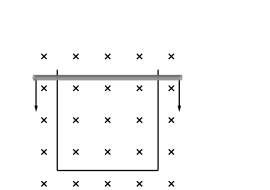

*Problem 3.3 diagram.*

Description: A horizontal conducting bar slides downward between two vertical rails in a region filled with magnetic-field symbols pointing into the page.

1. Write an expression for the emf induced in the loop.
2. Determine the direction of current flow in the loop.

3.4 A square loop of side $a$ moves with speed $v$ into a region in which a magnetic field of magnitude $B_0$ exists perpendicular to the plane of the loop, as shown in the figure. Make a plot of the emf induced in the loop as it enters, moves through, and exits the region of the magnetic field.

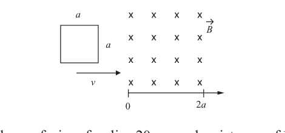

*Problem 3.4 diagram.*

Description: A square loop moves rightward toward and through a finite strip of region marked with crosses for a magnetic field into the page.

3.5 A circular loop of wire of radius $20\ \mathrm{cm}$ and resistance of $12\ \Omega$ surrounds a 5-turn solenoid of length $38\ \mathrm{cm}$ and radius $10\ \mathrm{cm}$, as shown in the figure. If the current in the solenoid increases linearly from 80 to 300 mA in 2 s, what is the maximum current induced in the loop?

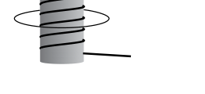

*Problem 3.5 diagram.*

Description: A circular wire loop surrounds a short vertical solenoid whose helical turns are visible in side view.

3.6 A 125-turn rectangular coil of wire with sides of 25 and 40 cm rotates about a horizontal axis in a vertical magnetic field of 3.5 mT. How fast must this coil rotate for the induced emf to reach 5 V?

3.7 The current in a long solenoid varies as $I(t)=I_0\sin(\omega t)$. Use Faraday's law to find the induced electric field as a function of $r$ both inside and outside the solenoid, where $r$ is the distance from the axis of the solenoid.

3.8 The current in a long, straight wire decreases as $I(t)=I_0 e^{-t/\tau}$. Find the induced emf in a square loop of wire of side $s$ lying in the plane of the current-carrying wire at a distance $d$, as shown in the figure.

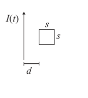

*Problem 3.8 diagram.*

Description: A square loop sits to the right of a long straight wire carrying current $I(t)$ upward, with the loop offset by distance $d$ and side length $s$.
