# 4 The Ampere-Maxwell law

For thousands of years, the only known sources of magnetic fields were certain iron ores and other materials that had been accidentally or deliberately magnetized. Then in 1820, French physicist Andre-Marie Ampere heard that in Denmark Hans Christian Oersted had deflected a compass needle by passing an electric current nearby, and within one week Ampere had begun quantifying the relationship between electric currents and magnetic fields.

"Ampere's law" relating a steady electric current to a circulating magnetic field was well known by the time James Clerk Maxwell began his work in the field in the 1850s. However, Ampere's law was known to apply only to static situations involving steady currents. It was Maxwell's addition of another source term - a changing electric flux - that extended the applicability of Ampere's law to time-dependent conditions. More importantly, it was the presence of this term in the equation now called the Ampere-Maxwell law that allowed Maxwell to discern the electromagnetic nature of light and to develop a comprehensive theory of electromagnetism.

## 4.1 The integral form of the Ampere-Maxwell law

The integral form of the Ampere-Maxwell law is generally written as

$$
\oint_C \vec{B} \circ d\vec{l} = \mu_0\left(I_{\mathrm{enc}} + \varepsilon_0\frac{d}{dt}\int_S \vec{E} \circ \hat{n}\,da\right)
$$

The Ampere-Maxwell law.

The left side of this equation is a mathematical description of the circulation of the magnetic field around a closed path $C$. The right side includes two sources for the magnetic field; a steady conduction current and a changing electric flux through any surface $S$ bounded by path $C$.

In this chapter, you'll find a discussion of the circulation of the magnetic field, a description of how to determine which current to include in calculating $\vec{B}$, and an explanation of why the changing electric flux is called the "displacement current." There are also examples of how to use the Ampere-Maxwell law to solve problems involving currents and magnetic fields. As always, you should begin by reviewing the main idea of the Ampere-Maxwell law:

> An electric current or a changing electric flux through a surface produces a circulating magnetic field around any path that bounds that surface.

In other words, a magnetic field is produced along a path if any current is enclosed by the path or if the electric flux through any surface bounded by the path changes over time.

It is important that you understand that the path may be real or purely imaginary - the magnetic field is produced whether the path exists or not. Here's an expanded view of the Ampere-Maxwell law:

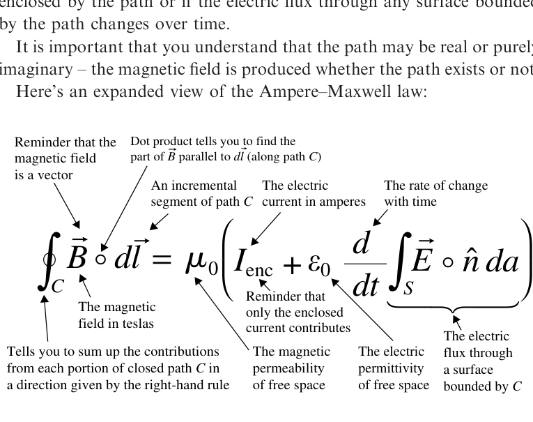

*Expanded view of the Ampere-Maxwell law.*

Description: An annotated form of $\oint_C \vec{B} \circ d\vec{l} = \mu_0\left(I_{\mathrm{enc}} + \varepsilon_0 \dfrac{d}{dt}\int_S \vec{E} \circ \hat{n}\,da\right)$ labels the magnetic-field circulation, path element, enclosed current, permittivity, and electric-flux term.

Of what use is the Ampere-Maxwell law? You can use it to determine the circulation of the magnetic field if you're given information about the enclosed current or the change in electric flux. Furthermore, in highly symmetric situations, you may be able to extract $\vec{B}$ from the dot product and the integral and determine the magnitude of the magnetic field.

## The magnetic field circulation

Spend a few minutes moving a magnetic compass around a long, straight wire carrying a steady current, and here's what you're likely to find: the current in the wire produces a magnetic field that circles around the wire and gets weaker as you get farther from the wire.

With slightly more sophisticated equipment and an infinitely long wire, you'd find that the magnetic field strength decreases precisely as $1/r$, where $r$ is the distance from the wire. So if you moved your measuring device in a way that kept the distance to the wire constant, say by circling around the wire as shown in Figure 4.1, the strength of the magnetic field wouldn't change. If you kept track of the direction of the magnetic field as you circled around the wire, you'd find that it always pointed along your path, perpendicular to an imaginary line from the wire to your location.

If you followed a random path around the wire getting closer and farther from the wire as you went around, you'd find the magnetic field getting stronger and weaker, and no longer pointing along your path.

Now imagine keeping track of the magnitude and direction of the magnetic field as you move around the wire in tiny increments. If, at each incremental step, you found the component of the magnetic field $\vec{B}$ along that portion of your path $d\vec{l}$, you'd be able to find $\vec{B} \circ d\vec{l}$. Keeping track of each value of $\vec{B} \circ d\vec{l}$ and then summing the results over your entire path, you'd have a discrete version of the left side of the Ampere-Maxwell law. Making this process continuous by letting the path increment shrink toward zero would then give you the circulation of the magnetic field:

$$
	ext{Magnetic field circulation} = \oint_C \vec{B} \circ d\vec{l}. \tag{4.1}
$$

The Ampere-Maxwell law tells you that this quantity is proportional to the enclosed current and rate of change of electric flux through any surface bounded by your path of integration ($C$). But if you hope to use this law to determine the value of the magnetic field, you'll need to dig $\vec{B}$ out of the dot product and out of the integral. That means you'll have to choose your path around the wire very carefully - just as you had to choose a "special Gaussian surface" to extract the electric field from Gauss's law, you'll need a "special Amperian loop" to determine the magnetic field.

You'll find examples of how to do that after the next three sections, which discuss the terms on the right side of the Ampere-Maxwell law.

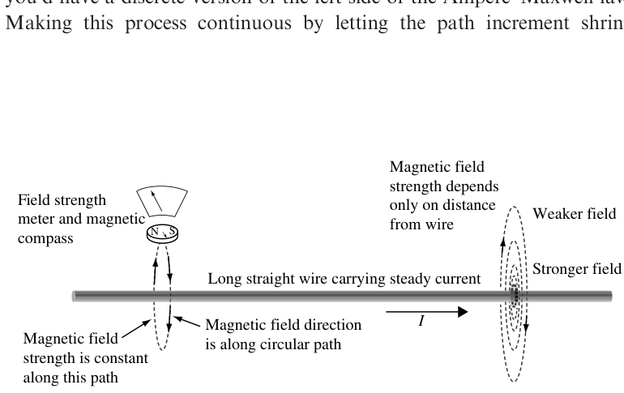

*Figure 4.1 Exploring the magnetic field around a current-carrying wire.*

Description: A long straight wire carries current to the right, with circular magnetic-field paths around the wire, a compass or field meter near one loop, and labels showing weaker field farther away and constant field strength along a circular path.

## The permeability of free space

The constant of proportionality between the magnetic circulation on the left side of the Ampere-Maxwell law and the enclosed current and rate of flux change on the right side is $\mu_0$, the permeability of free space. Just as the electric permittivity characterizes the response of a dielectric to an applied electric field, the magnetic permeability determines a material's response to an applied magnetic field. The permeability in the Ampere-Maxwell law is that of free space (or "vacuum permeability"), which is why it carries the subscript zero.

The value of the vacuum permeability in SI units is exactly $4\pi \times 10^{-7}$ volt-seconds per ampere-meter (Vs/Am); the units are sometimes given as newtons per square ampere (N/A$^2$) or the fundamental units of $(\mathrm{m\ kg/C^2})$. Therefore, when you use the Ampere-Maxwell law, remember to multiply both terms on the right side by

$$
\mu_0 = 4\pi \times 10^{-7}\ \mathrm{Vs/Am}.
$$

As in the case of electric permittivity in Gauss's law for electric fields, the presence of this quantity does not mean that the Ampere-Maxwell law applies only to sources and fields in a vacuum. This form of the Ampere-Maxwell law is general, so long as you consider all currents (bound as well as free). In the Appendix, you'll find a version of this law that's more useful when dealing with currents and fields in magnetic materials.

One interesting difference between the effect of dielectrics on electric fields and the effect of magnetic substances on magnetic fields is that the magnetic field is actually stronger than the applied field within many magnetic materials. The reason for this is that these materials become magnetized when exposed to an external magnetic field, and the induced magnetic field is in the same direction as the applied field, as shown in Figure 4.2.

The permeability of a magnetic material is often expressed as the relative permeability, which is the factor by which the material's permeability exceeds that of free space:

$$
	ext{Relative permeability}\ \mu_r = \mu/\mu_0. \tag{4.2}
$$

Materials are classified as diamagnetic, paramagnetic, or ferromagnetic on the basis of relative permeability. Diamagnetic materials have $\mu_r$ slightly less than $1.0$ because the induced field weakly opposes the applied field. Examples of diamagnetic materials include gold and silver, which have $\mu_r$ of approximately $0.99997$. The induced field within paramagnetic materials weakly reinforces the applied field, so these materials have $\mu_r$ slightly greater than $1.0$. One example of a paramagnetic material is aluminum with $\mu_r$ of $1.00002$.

The situation is more complex for ferromagnetic materials, for which the permeability depends on the applied magnetic field. Typical maximum values of permeability range from several hundred for nickel and cobalt to over $5000$ for reasonably pure iron.

As you may recall, the inductance of a long solenoid is given by the expression

$$
L = \frac{\mu N^2 A}{\ell}, \tag{4.3}
$$

where $\mu$ is the magnetic permeability of the material within the solenoid, $N$ is the number of turns, $A$ is the cross-sectional area, and $\ell$ is the length of the coil. As this expression makes clear, adding an iron core to a solenoid may increase the inductance by a factor of $5000$ or more.

Like electrical permittivity, the magnetic permeability of any medium is a fundamental parameter in the determination of the speed with which an electromagnetic wave propagates through that medium. This makes it possible to determine the speed of light in a vacuum simply by measuring $\mu_0$ and $\varepsilon_0$ using an inductor and a capacitor; an experiment for which, to paraphrase Maxwell, the only use of light is to see the instruments.

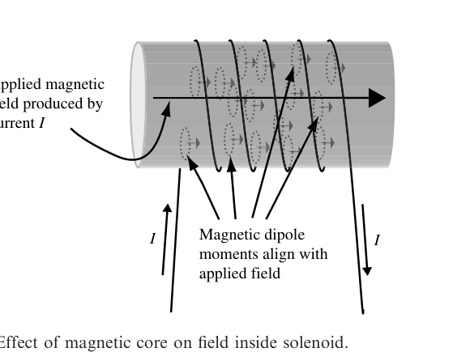

*Figure 4.2 Effect of magnetic core on field inside solenoid.*

Description: A solenoid carrying current surrounds a cylindrical magnetic core, with arrows showing the applied magnetic field along the core and many internal magnetic dipole moments aligned with that field.

## The enclosed electric current

Although the concept of "enclosed current" sounds simple, the question of exactly which current to include on the right side of the Ampere-Maxwell law requires careful consideration.

It should be clear from the first section of this chapter that the "enclosing" is done by the path $C$ around which the magnetic field is integrated (if you're having trouble imagining a path enclosing anything, perhaps "encircling" is a better word). However, consider for a moment the paths and currents shown in Figure 4.3; which of the currents are enclosed by paths $C_1$, $C_2$, and $C_3$, and which are not?

The easiest way to answer that question is to imagine a membrane stretched across the path, as shown in Figure 4.4. The enclosed current is then just the net current that penetrates the membrane.

The reason for saying "net" current is that the direction of the current relative to the direction of integration must be considered. By convention, the right-hand rule determines whether a current is counted as positive or negative: if you wrap the fingers of your right hand around the path in the direction of integration, your thumb points in the direction of positive current. Thus, the enclosed current in Figure 4.4(a) is $+I_1$ if the integration around path $C_1$ is performed in the direction indicated; it would be $-I_1$ if the integration were performed in the opposite direction.

Using the membrane approach and right-hand rule, you should be able to see that the enclosed current is zero in both Figure 4.4(b) and 4.4(c). No net current is enclosed in Figure 4.4(b), since the sum of the currents is $I_2 + -I_2 = 0$, and no current penetrates the membrane in either direction in Figure 4.4(c).

An important concept for you to understand is that the enclosed current is exactly the same irrespective of the shape of the surface you choose, provided that the path of integration is a boundary (edge) of that surface. The surfaces shown in Figure 4.4 are the simplest, but you could equally well have chosen the surfaces shown in Figure 4.5, and the enclosed currents would be exactly the same.

Notice that in Figure 4.5(a) current $I_1$ penetrates the surface at only one point, so the enclosed current is $+I_1$, just as it was for the flat membrane of Figure 4.4(a). In Figure 4.5(b), current $I_2$ does not penetrate the "stocking cap" surface anywhere, so the enclosed current is zero, as it was for the flat membrane of Figure 4.4(b). The surface in Figure 4.5(c) is penetrated twice by current $I_3$, once in the positive direction and once in the negative direction, so the net current penetrating the surface remains zero, as it was in Figure 4.4(c) (for which the current missed the membrane entirely).

Selection of alternate surfaces and determining the enclosed current is more than just an intellectual diversion. The need for the changing-flux term that Maxwell added to Ampere's law can be made clear through just such an exercise, as you can see in the next section.

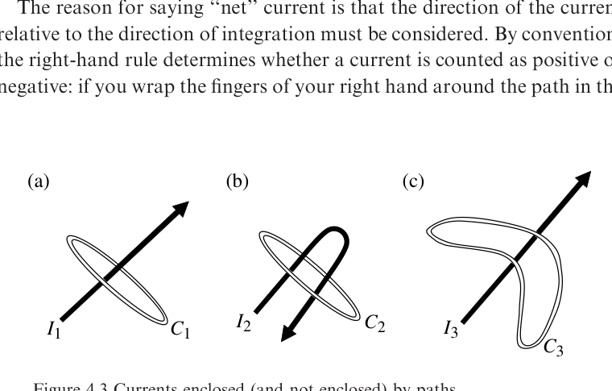

*Figure 4.3 Currents enclosed (and not enclosed) by paths.*

Description: Three separate sketches show currents $I_1$, $I_2$, and $I_3$ passing relative to closed paths $C_1$, $C_2$, and $C_3$, with one path encircling a current, one enclosing equal positive and negative penetrations, and one missing the current.

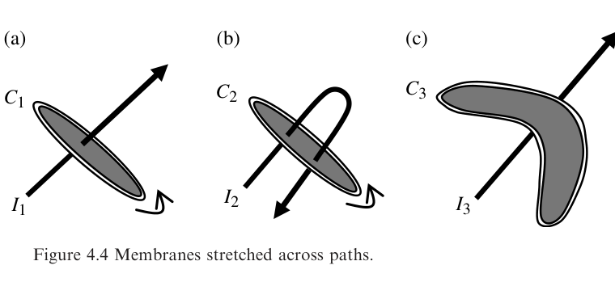

*Figure 4.4 Membranes stretched across paths.*

Description: Three shaded membrane surfaces span the boundaries $C_1$, $C_2$, and $C_3$, making visible whether each current pierces the chosen surface and in which sense relative to the right-hand rule.

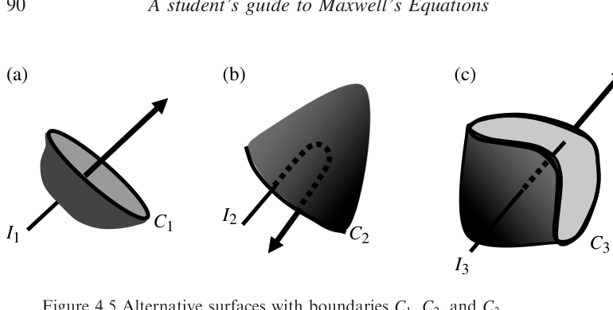

*Figure 4.5 Alternative surfaces with boundaries $C_1$, $C_2$, and $C_3$.*

Description: Three nonflat surfaces share the same boundary curves $C_1$, $C_2$, and $C_3$ as before, illustrating that the net enclosed current is unchanged even when the spanning surface is warped.

## The rate of change of flux

This term is the electric flux analog of the changing magnetic flux term in Faraday's law, which you can read about in Chapter 3. In that case, a changing magnetic flux through any surface was found to induce a circulating electric field along a boundary path for that surface.

Purely by symmetry, you might suspect that a changing electric flux through a surface will induce a circulating magnetic field around a boundary of that surface. After all, magnetic fields are known to circulate - Ampere's law says that any electric current produces just such a circulating magnetic field. So how is it that several decades went by before anyone saw fit to write an "electric induction" law to go along with Faraday's law of magnetic induction?

For one thing, the magnetic fields induced by changing electric flux are extremely weak and are therefore very difficult to measure, so in the nineteenth century there was no experimental evidence on which to base such a law. In addition, symmetry is not always a reliable predictor between electricity and magnetism; the universe is rife with individual electric charges, but apparently devoid of the magnetic equivalent.

Maxwell and his contemporaries did realize that Ampere's law as originally conceived applies only to steady electric currents, since it is consistent with the principle of conservation of charge only under static conditions. To better understand the relationship between magnetic fields and electric currents, Maxwell worked out an elaborate conceptual model in which magnetic fields were represented by mechanical vortices and electric currents by the motion of small particles pushed along by the whirling vortices. When he added elasticity to his model and allowed the magnetic vortices to deform under stress, Maxwell came to understand the need for an additional term in his mechanical version of Ampere's law. With that understanding, Maxwell was able to discard his mechanical model and rewrite Ampere's law with an additional source for magnetic fields. That source is the changing electric flux in the Ampere-Maxwell law.

Most texts use one of three approaches to demonstrating the need for the changing-flux term in the Ampere-Maxwell law: conservation of charge, special relativity, or an inconsistency in Ampere's law when applied to a charging capacitor. This last approach is the most common, and is the one explained in this section.

Consider the circuit shown in Figure 4.6. When the switch is closed, a current $I$ flows as the battery charges the capacitor. This current produces a magnetic field around the wires, and the circulation of that field is given by Ampere's law

$$
\oint_C \vec{B} \circ d\vec{l} = \mu_0(I_{\mathrm{enc}}).
$$

A serious problem arises in determining the enclosed current. According to Ampere's law, the enclosed current includes all currents that penetrate any surface for which path $C$ is a boundary. However, you'll get very different answers for the enclosed current if you choose a flat membrane as your surface, as shown in Figure 4.7(a), or a "stocking cap" surface as shown in Figure 4.7(b).

Although current $I$ penetrates the flat membrane as the capacitor charges, no current penetrates the "stocking cap" surface (since the charge accumulates at the capacitor plate). Yet the Amperian loop is a boundary to both surfaces, and the integral of the magnetic field around that loop must be the same no matter which surface you choose.

You should note that this inconsistency occurs only while the capacitor is charging. No current flows before the switch is thrown, and after the capacitor is fully charged the current returns to zero. In both of these circumstances, the enclosed current is zero through any surface you can imagine. Therefore, any revision to Ampere's law must retain its correct behavior in static situations while extending its utility to charging capacitors and other time-dependent situations.

With more than a little hindsight, we might phrase our question this way: since no conduction current flows between the capacitor plates, what else might be going on in that region that would serve as the source of a magnetic field?

Since charge is accumulating on the plates as the capacitor charges up, you know that the electric field between the plates must be changing with time. This means that the electric flux through the portion of your "stocking cap" surface between the plates must also be changing, and you can use Gauss's law for electric fields to determine the change in flux.

By shaping your surface carefully, as in Figure 4.8, you can make it into a "special Gaussian surface", which is everywhere perpendicular to the electric field and over which the electric field is either uniform or zero. Neglecting edge effects, the electric field between two charged conducting plates is $\vec{E} = (\sigma/\varepsilon_0)\,\hat{n}$, where $\sigma$ is the charge density on the plates ($Q/A$), making the electric flux through the surface

$$
\Phi_E = \int_S \vec{E} \circ \hat{n}\,da = \int_S \frac{\sigma}{\varepsilon_0}\,da = \frac{Q}{A\varepsilon_0}\int_S da = \frac{Q}{\varepsilon_0}. \tag{4.4}
$$

The change in electric flux over time is therefore,

$$
\frac{d}{dt}\left(\int_S \vec{E} \circ \hat{n}\,da\right) = \frac{d}{dt}\left(\frac{Q}{\varepsilon_0}\right) = \frac{1}{\varepsilon_0}\frac{dQ}{dt}. \tag{4.5}
$$

Multiplying by the vacuum permittivity makes this

$$
\varepsilon_0\frac{d}{dt}\left(\int_S \vec{E} \circ \hat{n}\,da\right) = \frac{dQ}{dt}. \tag{4.6}
$$

Thus, the change in electric flux with time multiplied by permittivity has units of charge divided by time (coulombs per second or amperes in SI units), which are of course the units of current. Moreover a current-like quantity is exactly what you might expect to be the additional source of the magnetic field around your surface boundary. For historical reasons, the product of the permittivity and the change of electric flux through a surface is called the "displacement current" even though no charge actually flows across the surface. The displacement current is defined by the relation

$$
I_d \equiv \varepsilon_0\frac{d}{dt}\left(\int_S \vec{E} \circ \hat{n}\,da\right). \tag{4.7}
$$

Whatever you choose to call it, Maxwell's addition of this term to Ampere's law demonstrated his deep physical insight and set the stage for his subsequent discovery of the electromagnetic nature of light.

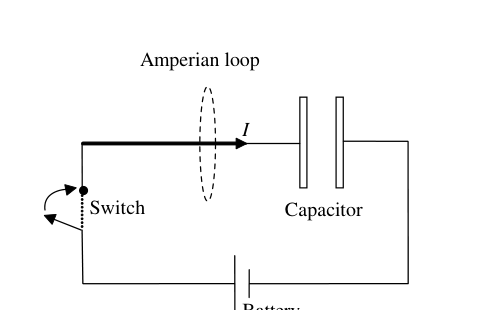

*Figure 4.6 Charging capacitor.*

Description: A battery, switch, wire loop, capacitor, and dashed Amperian loop show current flowing in the external circuit while the capacitor charges.

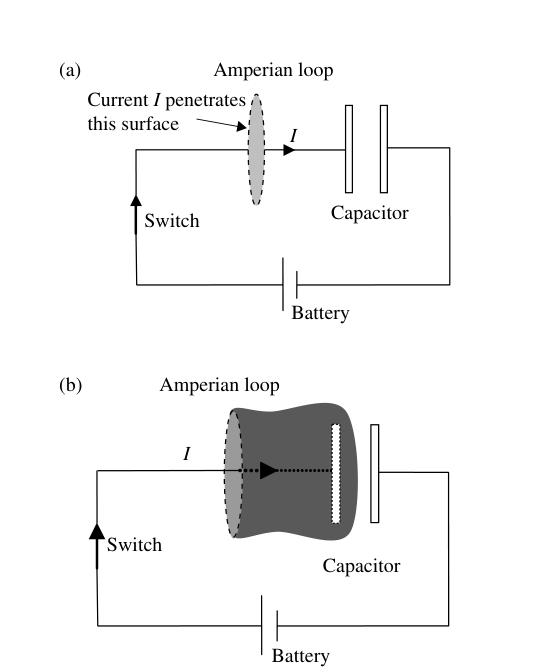

*Figure 4.7 Alternative surfaces for determining enclosed current.*

Description: Two surfaces bounded by the same Amperian loop are shown for a charging-capacitor circuit: a flat surface pierced by conduction current and a shaded stocking-cap surface extending between the capacitor plates.

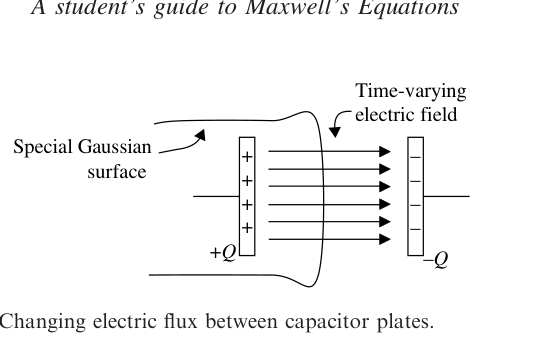

*Figure 4.8 Changing electric flux between capacitor plates.*

Description: A specially shaped Gaussian surface sits between capacitor plates labeled $+Q$ and $-Q$, with a time-varying electric field directed from the positive to the negative plate.

## Applying the Ampere-Maxwell law (integral form)

Like the electric field in Gauss's law, the magnetic field in the Ampere-Maxwell law is buried within an integral and coupled to another vector quantity by the dot product. As you might expect, it is only in highly symmetric situations that you'll be able to determine the magnetic field using this law. Fortunately, several interesting and realistic geometries possess the requisite symmetry, including long current-carrying wires and parallel-plate capacitors.

For such problems, the challenge is to find an Amperian loop over which you expect $\vec{B}$ to be uniform and at a constant angle to the loop. However, how do you know what to expect for $\vec{B}$ before you solve the problem?

In many cases, you'll already have some idea of the behavior of the magnetic field on the basis of your past experience or from experimental evidence. What if that's not the case - how are you supposed to figure out how to draw your Amperian loop?

There's no single answer to that question, but the best approach is to use logic to try to reason your way to a useful result. Even for complex geometries, you may be able to use the Biot-Savart law to discern the field direction by eliminating some of the components through symmetry considerations. Alternatively, you can imagine various behaviors for $\vec{B}$ and then see if they lead to sensible consequences.

For example, in a problem involving a long, straight wire, you might reason as follows: the magnitude of $\vec{B}$ must get smaller as you move away from the wire; otherwise Oersted's demonstration in Denmark would have deflected compass needles everywhere in the world, which it clearly did not. Furthermore, since the wire is round, there's no reason to expect that the magnetic field on one side of the wire is any different from the field on the other side. So if $\vec{B}$ decreases with distance from the wire and is the same all around the wire, you can safely conclude that one path of constant $\vec{B}$ would be a circle centered on the wire and perpendicular to the direction of current flow.

However, to deal with the dot product of $\vec{B}$ and $d\vec{l}$ in Ampere's law, you also need to make sure that your path maintains a constant angle (preferably $0^\circ$) to the magnetic field. If $\vec{B}$ were to have both radial and transverse components that vary with distance, the angle between your path and the magnetic field might depend on distance from the wire.

If you understand the cross-product between $d\vec{l}$ and $\hat{r}$ in the Biot-Savart law, you probably suspect that this is not the case. To verify that, imagine that $\vec{B}$ has a component pointing directly toward the wire. If you were to look along the wire in the direction of the current, you'd see the current running away from you and the magnetic field pointing at the wire. Moreover, if you had a friend looking in the opposite direction at the same time, she'd see the current coming toward her, and of course she would also see $\vec{B}$ pointing toward the wire.

Now ask yourself, what would happen if you reversed the direction of the current flow. Since the magnetic field is linearly proportional to the current ($\vec{B} \propto \vec{I}$) according to the Biot-Savart law, reversing the current must also reverse the magnetic field, and $\vec{B}$ would then point away from the wire. Now looking in your original direction, you'd see a current coming toward you (since it was going away from you before it was reversed), but now you'd see the magnetic field pointing away from the wire. Moreover, your friend, still looking in her original direction, would see the current running away from her, but with the magnetic field pointing away from the wire.

Comparing notes with your friend, you'd find a logical inconsistency. You'd say, "currents traveling away from me produce a magnetic field pointing toward the wire, and currents coming toward me produce a magnetic field pointing away from the wire." Your friend, of course, would report exactly the opposite behavior. In addition, if you switched positions and repeated the experiment, you'd each find that your original conclusions were no longer true.

This inconsistency is resolved if the magnetic field circles around the wire, having no radial component at all. With $\vec{B}$ having only a $\varphi$-component,[^5] all observers agree that currents traveling away from an observer produce clockwise magnetic fields as seen by that observer, whereas currents approaching an observer produce counterclockwise magnetic fields for that observer.

In the absence of external evidence, this kind of logical reasoning is your best guide to designing useful Amperian loops. Therefore, for problems involving a straight wire, the logical choice for your loop is a circle centered on the wire. How big should you make your loop? Remember why you're making an Amperian loop in the first place - to find the value of the magnetic field at some location. So make your Amperian loop go through that location. In other words, the loop radius should be equal to the distance from the wire at which you intend to find the value of the magnetic field. The following example shows how this works.

**Example 4.1: Given the current in a wire, find the magnetic field within and outside the wire.**

*Problem:* A long, straight wire of radius $r_0$ carries a steady current $I$ uniformly distributed throughout its cross-sectional area. Find the magnitude of the magnetic field as a function of $r$, where $r$ is the distance from the center of the wire, for both $r > r_0$ and $r < r_0$.

*Solution:* Since the current is steady, you can use Ampere's law in its original form

$$
\oint_C \vec{B} \circ d\vec{l} = \mu_0(I_{\mathrm{enc}}).
$$

To find $\vec{B}$ at exterior points ($r > r_0$), use the logic described above and draw your loop outside the wire, as shown by Amperian loop #1 in Figure 4.9. Since both $\vec{B}$ and $d\vec{l}$ have only $\varphi$-components and point in the same direction if you obey the right-hand rule in determining your direction of integration, the dot product $\vec{B} \circ d\vec{l}$ becomes $|\vec{B}|\,|d\vec{l}|\cos(0^\circ)$. Furthermore, since $|\vec{B}|$ is constant around your loop, it comes out of the integral:

$$
\oint_C \vec{B} \circ d\vec{l} = \oint_C |\vec{B}|\,|d\vec{l}| = B\oint_C dl = B(2\pi r),
$$

where $r$ is the radius of your Amperian loop.[^6] Ampere's law tells you that the integral of $\vec{B}$ around your loop is equal to the enclosed current times the permeability of free space, and the enclosed current in this case is all of $I$, so

$$
B(2\pi r) = \mu_0 I_{\mathrm{enc}} = \mu_0 I
$$

and, since $\vec{B}$ is in the $\varphi$-direction,

$$
\vec{B} = \frac{\mu_0 I}{2\pi r}\,\hat{\varphi},
$$

as given in Table 2.1. Note that this means that at points outside the wire the magnetic field decreases as $1/r$ and behaves as if all the current were at the center of the wire.

To find the magnetic field within the wire, you can apply the same logic and use a smaller loop, as shown by Amperian loop #2 in Figure 4.9. The only difference in this case is that not all the current is enclosed by the loop; since the current is distributed uniformly throughout the wire's cross section, the current density[^7] is $I/(\pi r_0^2)$, and the current passing through the loop is simply that density times the area of the loop. Thus,

$$
	ext{Enclosed current} = \text{current density} \times \text{loop area}
$$

or

$$
I_{\mathrm{enc}} = \frac{I}{\pi r_0^2}\,\pi r^2 = I\frac{r^2}{r_0^2}.
$$

Inserting this into Ampere's law gives

$$
\oint_C \vec{B} \circ d\vec{l} = B(2\pi r) = \mu_0 I_{\mathrm{enc}} = \mu_0 I\frac{r^2}{r_0^2},
$$

or

$$
B = \frac{\mu_0 I r}{2\pi r_0^2}.
$$

Thus, inside the wire the magnetic field increases linearly with distance from the center of the wire, reaching a maximum at the surface of the wire.

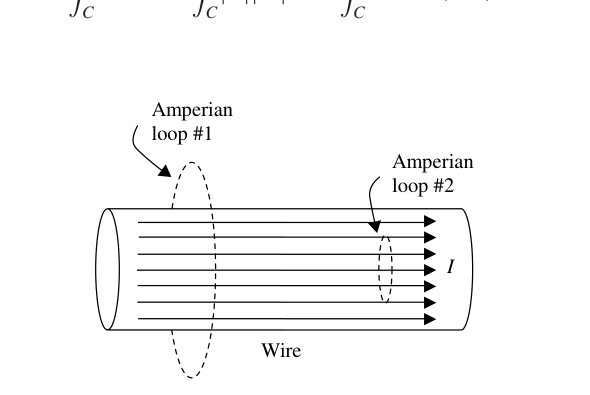

*Figure 4.9 Amperian loops for current-carrying wire of radius $r_0$.*

Description: A cylindrical wire carrying uniform current contains two dashed circular Amperian loops, one outside the wire and one inside it, labeled to show the paths used for finding the field in the two regions.

**Example 4.2: Given the time-dependent charge on a capacitor, find the rate of change of the electric flux between the plates and the magnitude of the resulting magnetic field at a specified location.**

*Problem:* A battery with potential difference $\Delta V$ charges a circular parallel-plate capacitor of capacitance $C$ and plate radius $r_0$ through a wire with resistance $R$. Find the rate of change of the electric flux between the plates as a function of time and the magnetic field at a distance $r$ from the center of the plates.

*Solution:* From Equation 4.5, the rate of change of electric flux between the plates is

$$
\frac{d\Phi_E}{dt} = \frac{d}{dt}\left(\int_S \vec{E} \circ \hat{n}\,da\right) = \frac{1}{\varepsilon_0}\frac{dQ}{dt},
$$

where $Q$ is the total charge on each plate. So you should begin by determining how the charge on a capacitor plate changes with time as the capacitor is charged. If you've studied series $RC$ circuits, you may recall that the relevant expression is

$$
Q(t) = C\Delta V\left(1 - e^{-t/RC}\right),
$$

where $\Delta V$, $R$, and $C$ represent the potential difference, the series resistance, and the capacitance, respectively. Thus,

$$
\frac{d\Phi_E}{dt} = \frac{1}{\varepsilon_0}\frac{d}{dt}\left[C\Delta V\left(1 - e^{-t/RC}\right)\right] = \frac{1}{\varepsilon_0}\left(C\Delta V\frac{1}{RC}e^{-t/RC}\right) = \frac{\Delta V}{\varepsilon_0 R}e^{-t/RC}.
$$

This is the rate of change of the total electric flux between the plates. To find the magnetic field at a distance $r$ from the center of the plates, you're going to have to construct a special Amperian loop to help you extract the magnetic field from the integral in the Ampere-Maxwell law:

$$
\oint_C \vec{B} \circ d\vec{l} = \mu_0\left(I_{\mathrm{enc}} + \frac{d}{dt}\int_S \vec{E} \circ \hat{n}\,da\right).
$$

Since no charge flows between the capacitor plates, $I_{\mathrm{enc}} = 0$, and

$$
\oint_C \vec{B} \circ d\vec{l} = \mu_0\left(\varepsilon_0\frac{d}{dt}\int_S \vec{E} \circ \hat{n}\,da\right).
$$

As in the previous example, you're faced with the challenge of designing a special Amperian loop around which the magnetic field is constant in amplitude and parallel to the path of integration around the loop. If you use similar logic to that for the straight wire, you'll see that the best choice is to make a loop parallel to the plates, as shown in Figure 4.10.

The radius of this loop is $r$, the distance from the center of the plates at which you are trying to find the magnetic field. Of course, not all of the flux between the plates passes through this loop, so you will have to modify your expression for the flux change accordingly. The fraction of the total flux that passes through a loop of radius $r$ is simply the ratio of the loop area to the capacitor plate area, which is $\pi r^2/\pi r_0^2$, so the rate of change of flux through the loop is

$$
\left(\frac{d\Phi_E}{dt}\right)_{\text{Loop}} = \frac{\Delta V}{\varepsilon_0 R}e^{-t/RC}\left(\frac{r^2}{r_0^2}\right).
$$

Inserting this into the Ampere-Maxwell law gives

$$
\oint_C \vec{B} \circ d\vec{l} = \mu_0\left[\varepsilon_0\frac{\Delta V}{\varepsilon_0 R}e^{-t/RC}\left(\frac{r^2}{r_0^2}\right)\right] = \frac{\mu_0\Delta V}{R}e^{-t/RC}\left(\frac{r^2}{r_0^2}\right).
$$

Moreover, since you've chosen your Amperian loop so as to allow $\vec{B}$ to come out of the dot product and the integral using the same symmetry arguments as in Example 4.1,

$$
\oint_C \vec{B} \circ d\vec{l} = B(2\pi r) = \frac{\mu_0\Delta V}{R}e^{-t/RC}\left(\frac{r^2}{r_0^2}\right),
$$

which gives

$$
B = \frac{\mu_0\Delta V}{2\pi rR}e^{-t/RC}\left(\frac{r^2}{r_0^2}\right) = \frac{\mu_0\Delta V}{2\pi R}e^{-t/RC}\left(\frac{r}{r_0^2}\right),
$$

meaning that the magnetic field increases linearly with distance from the center of the capacitor plates and decreases exponentially with time, reaching $1/e$ of its original value at time $t = RC$.

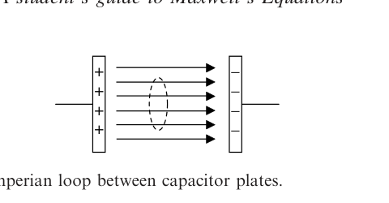

*Figure 4.10 Amperian loop between capacitor plates.*

Description: Two capacitor plates face each other with electric-field arrows between them, and a dashed circular Amperian loop lies between the plates, centered on the field region.

## 4.2 The differential form of the Ampere-Maxwell law

The differential form of the Ampere-Maxwell law is generally written as

$$
\vec{\nabla} \times \vec{B} = \mu_0\left(\vec{J} + \varepsilon_0\frac{\partial \vec{E}}{\partial t}\right)
$$

The Ampere-Maxwell law.

The left side of this equation is a mathematical description of the curl of the magnetic field - the tendency of the field lines to circulate around a point. The two terms on the right side represent the electric current density and the time rate of change of the electric field.

These terms are discussed in detail in the following sections. For now, make sure you grasp the main idea of the differential form of the Ampere-Maxwell law:

> A circulating magnetic field is produced by an electric current and by an electric field that changes with time.

To help you understand the meaning of each symbol in the differential form of the Ampere-Maxwell law, here's an expanded view:

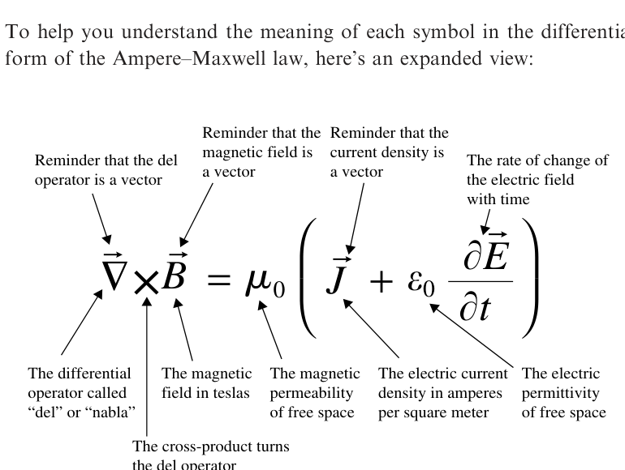

*Expanded view of the Ampere-Maxwell law in differential form.*

Description: An annotated form of $\vec{\nabla} \times \vec{B} = \mu_0\left(\vec{J} + \varepsilon_0 \dfrac{\partial \vec{E}}{\partial t}\right)$ labels the del operator, curl, magnetic field, current density, permittivity, and time derivative of the electric field.

## The curl of the magnetic field

The left side of the differential form of the Ampere-Maxwell law represents the curl of the magnetic field. All magnetic fields, whether produced by electrical currents or by changing electric fields, circulate back upon themselves and form continuous loops. In addition all fields that circulate back on themselves must include at least one location about which the path integral of the field is nonzero. For the magnetic field, locations of nonzero curl are locations at which current is flowing or an electric field is changing.

It is important that you understand that just because magnetic fields circulate, you should not conclude that the curl is nonzero everywhere in the field. A common misconception is that the curl of a vector field is nonzero wherever the field appears to curve.

To understand why that is not correct, consider the magnetic field of the infinite line current shown in Figure 2.1. The magnetic field lines circulate around the current, and you know from Table 2.1 that the magnetic field points in the $\hat{\varphi}$ direction and decreases as $1/r$

$$
\vec{B} = \frac{\mu_0 I}{2\pi r}\,\hat{\varphi}.
$$

Finding the curl of this field is particularly straightforward in cylindrical coordinates

$$
\vec{\nabla} \times \vec{B} = \left(\frac{1}{r}\frac{\partial B_z}{\partial \varphi} - \frac{\partial B_\varphi}{\partial z}\right)\hat{r} + \left(\frac{\partial B_r}{\partial z} - \frac{\partial B_z}{\partial r}\right)\hat{\varphi} + \frac{1}{r}\left(\frac{\partial (rB_\varphi)}{\partial r} - \frac{\partial B_r}{\partial \varphi}\right)\hat{z}.
$$

Since $B_r$ and $B_z$ are both zero, this is

$$
\vec{\nabla} \times \vec{B} = \left(-\frac{\partial B_\varphi}{\partial z}\right)\hat{r} + \frac{1}{r}\left(\frac{\partial (rB_\varphi)}{\partial r}\right)\hat{z} = -\frac{\partial (\mu_0 I/2\pi r)}{\partial z}\hat{r} + \frac{1}{r}\frac{\partial (r\mu_0 I/2\pi r)}{\partial r}\hat{z} = 0.
$$

However, doesn't the differential form of the Ampere-Maxwell law tell us that the curl of the magnetic field is nonzero in the vicinity of electric currents and changing electric fields?

No, it doesn't. It tells us that the curl of $\vec{B}$ is nonzero exactly at the location through which an electric current is flowing, or at which an electric field is changing. Away from that location, the field definitely does curve, but the curl at any given point is precisely zero, as you just found from the equation for the magnetic field of an infinite line current.

How can a curving field have zero curl? The answer lies in the amplitude as well as the direction of the magnetic field, as you can see in Figure 4.11.

Using the fluid-flow and small paddlewheel analogy, imagine the forces on the paddlewheel placed in the field shown in Figure 4.11(a). The center of curvature is well below the bottom of the figure, and the spacing of the arrows indicates that the field is getting weaker with distance from the center. At first glance, it may seem that this paddlewheel would rotate clockwise owing to the curvature of the field, since the flow lines are pointing slightly upward at the left paddle and slightly downward at the right. However, consider the effect of the weakening of the field above the axis of the paddlewheel: the top paddle receives a weaker push from the field than the bottom paddle, as shown in Figure 4.11(b). The stronger force on the bottom paddle will attempt to cause the paddlewheel to rotate counterclockwise. Thus, the downward curvature of the field is offset by the weakening of the field with distance from the center of curvature. And if the field diminishes as $1/r$, the upward-downward push on the left and right paddles is exactly compensated by the weaker-stronger push on the top and bottom paddles. The clockwise and counter-clockwise forces balance, and the paddlewheel does not turn - the curl at this location is zero, even though the field lines are curved.

The key concept in this explanation is that the magnetic field may be curved at many different locations, but only at points at which current is flowing (or the electric flux is changing) is the curl of $\vec{B}$ nonzero. This is analogous to the $1/r^2$ reduction in electric field amplitude with distance from a point charge, which keeps the divergence of the electric field as zero at all points away from the location of the charge.

As in the electric field case, the reason the origin (where $r = 0$) is not included in our previous analysis is that our expression for the curl includes terms containing $r$ in the denominator, and those terms become infinite at the origin. To evaluate the curl at the origin, use the formal definition of curl as described in Chapter 3:

$$
\vec{\nabla} \times \vec{B} \equiv \lim_{\Delta S \to 0}\frac{1}{\Delta S}\oint_C \vec{B} \circ d\vec{l}
$$

Considering a special Amperian loop surrounding the current, this is

$$
\vec{\nabla} \times \vec{B} \equiv \lim_{\Delta S \to 0}\frac{1}{\Delta S}\oint_C \vec{B} \circ d\vec{l} = \lim_{\Delta S \to 0}\left(\frac{1}{\Delta S}\frac{\mu_0\vec{I}}{2\pi r}(2\pi r)\right) = \lim_{\Delta S \to 0}\left(\frac{1}{\Delta S}\mu_0\vec{I}\right).
$$

However, $\vec{I}/\Delta S$ is just the average current density over the surface $\Delta S$, and as $\Delta S$ shrinks to zero, this becomes equal to $\vec{J}$, the current density at the origin. Thus, at the origin

$$
\vec{\nabla} \times \vec{B} = \mu_0\vec{J}
$$

in accordance with Ampere's law.

So just as you might be fooled into thinking that charge-based electric field vectors "diverge" everywhere because they get farther apart, you might also think that magnetic field vectors have curl everywhere because they curve around a central point. But the key factor in determining the curl at any point is not simply the curvature of the field lines at that point, but how the change in the field from one side of the point to the other (say from left to right) compares to the change in the field in the orthogonal direction (below to above). If those spatial derivatives are precisely equal, then the curl is zero at that point.

In the case of a current-carrying wire, the reduction in the amplitude of the magnetic field away from the wire exactly compensates for the curvature of the field lines. Thus, the curl of the magnetic field is zero everywhere except at the wire itself, where electric current is flowing.

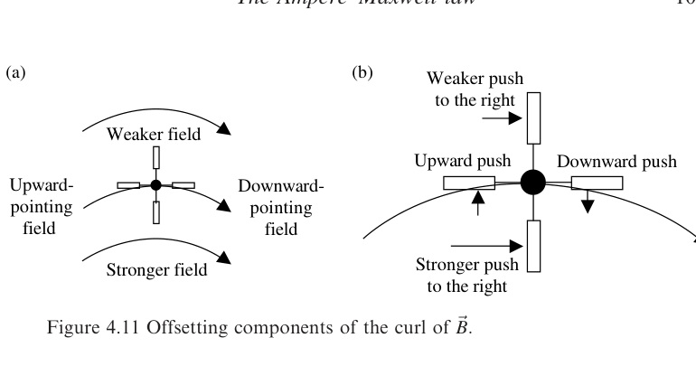

*Figure 4.11 Offsetting components of the curl of $\vec{B}$.*

Description: Part (a) shows curved magnetic-field lines that are stronger below and weaker above a paddlewheel. Part (b) resolves the resulting pushes on the paddles to show how curvature and field-strength variation cancel.

## The electric current density

The right side of the differential form of the Ampere-Maxwell law contains two source terms for the circulating magnetic field; the first involves the vector electric current density. This is sometimes called the "volume current density," which can be a source of confusion if you're accustomed to "volume density" meaning the amount of something per unit volume, such as kg/m$^3$ for mass density or C/m$^3$ for charge density.

This is not the case for current density, which is defined as the vector current flowing through a unit cross-sectional area perpendicular to the direction of the current. Thus, the units of current density are not amperes per cubic meter, but rather amperes per square meter (A/m$^2$).

To understand the concept of current density, recall that in the discussion of flux in Chapter 1, the quantity $\vec{A}$ is defined as the number density of the fluid (particles per cubic meter) times the velocity of the flow (meters per second). As the product of the number density (a scalar) and the velocity (a vector), $\vec{A}$ is a vector in the same direction as the velocity, with units of particles per square meter per second. To find the number of particles per second passing through a surface in the simplest case ($\vec{A}$ uniform and perpendicular to the surface), you simply multiply $\vec{A}$ by the area of the surface.

These same concepts are relevant for current density, provided we consider the amount of charge passing through the surface rather than the number of atoms. If the number density of charge carriers is $n$ and the charge per carrier is $q$, then the amount of charge passing through a unit area perpendicular to the flow per second is

$$
\vec{J} = nq\vec{v}_d \qquad (\mathrm{C/m^2\ s\ or\ A/m^2}), \tag{4.8}
$$

where $\vec{v}_d$ is the average drift velocity of charge carriers. Thus, the direction of the current density is the direction of current flow, and the magnitude is the current per unit area, as shown in Figure 4.12.

The complexity of the relationship between the total current $I$ through a surface and the current density $\vec{J}$ depends on the geometry of the situation. If the current density $\vec{J}$ is uniform over a surface $S$ and is everywhere perpendicular to the surface, the relationship is

$$
I = |\vec{J}| \times (\text{surface area}) \qquad \vec{J}\ \text{uniform and perpendicular to}\ S. \tag{4.9}
$$

If $\vec{J}$ is uniform over a surface $S$ but is not necessarily perpendicular to the surface, to find the total current $I$ through $S$ you'll have to determine the component of the current density perpendicular to the surface. This makes the relationship between $I$ and $\vec{J}$:

$$
I = \vec{J} \circ \hat{n} \times (\text{surface area}) \qquad \vec{J}\ \text{uniform and at an angle to}\ S. \tag{4.10}
$$

And, if $\vec{J}$ is nonuniform and not perpendicular to the surface, then

$$
I = \int_S \vec{J} \circ \hat{n}\,da \qquad \vec{J}\ \text{nonuniform and at a variable angle to}\ S. \tag{4.11}
$$

This expression explains why some texts refer to electric current as "the flux of the current density."

The electric current density in the Ampere-Maxwell law includes all currents, including the bound current density in magnetic materials. You can read more about Maxwell's Equations inside matter in the Appendix.

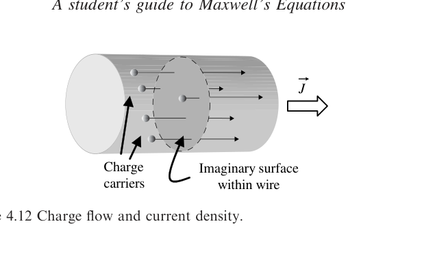

*Figure 4.12 Charge flow and current density.*

Description: A cylindrical wire contains moving charge carriers crossing an internal imaginary surface, while arrows indicate the current-density vector $\vec{J}$ pointing along the wire.

## The displacement current density

The second source term for the magnetic field in the Ampere-Maxwell law involves the rate of change of the electric field with time. When multiplied by the electrical permittivity of free space, this term has SI units of amperes per square meter. These units are identical to those of $\vec{J}$, the conduction current density that also appears on the right side of the differential form of the Ampere-Maxwell law. Maxwell originally attributed this term to the physical displacement of electrical particles caused by elastic deformation of magnetic vortices, and others coined the term "displacement current" to describe the effect.

However, does the displacement current density represent an actual current? Certainly not in the conventional sense of the word, since electric current is defined as the physical movement of charge. But it is easy to understand why a term that has units of amperes per square meter and acts as a source of the magnetic field has retained that name over the years. Furthermore, the displacement current density is a vector quantity that has the same relationship to the magnetic field as does $\vec{J}$, the conduction current density.

The key concept here is that a changing electric field produces a changing magnetic field even when no charges are present and no physical current flows. Through this mechanism, electromagnetic waves may propagate through even a perfect vacuum, as changing magnetic fields induce electric fields, and changing electric fields induce magnetic fields.

The importance of the displacement current term, which arose initially from Maxwell's mechanical model, is difficult to overstate. Adding a changing electric field as a source of the magnetic field certainly extended the scope of Ampere's law to time-dependent fields by eliminating the inconsistency with the principle of conservation of charge. Far more importantly, it allowed James Clerk Maxwell to establish a comprehensive theory of electromagnetism, the first true field theory and the foundation for much of twentieth century physics.

## Applying the Ampere-Maxwell law (differential form)

The most common applications of the differential form of the Ampere-Maxwell law are problems in which you're provided with an expression for the vector magnetic field and you're asked to determine the electric current density or the displacement current. Here are two examples of this kind of problem.

**Example 4.3: Given the magnetic field, find the current density at a specified location.**

*Problem:* Use the expressions for the magnetic field in Table 2.1 to find the current density both inside and outside a long, straight wire of radius $r_0$ carrying current $I$ uniformly throughout its volume in the positive $z$-direction.

*Solution:* From Table 2.1 and Example 4.1, the magnetic field inside a long, straight wire is

$$
\vec{B} = \frac{\mu_0 I r}{2\pi r_0^2}\,\hat{\varphi},
$$

where $I$ is the current in the wire and $r_0$ is the wire's radius. In cylindrical coordinates, the curl of $\vec{B}$ is

$$
\vec{\nabla} \times \vec{B} \equiv \left(\frac{1}{r}\frac{\partial B_z}{\partial \varphi} - \frac{\partial B_\varphi}{\partial z}\right)\hat{r} + \left(\frac{\partial B_r}{\partial z} - \frac{\partial B_z}{\partial r}\right)\hat{\varphi} + \frac{1}{r}\left(\frac{\partial (rB_\varphi)}{\partial r} - \frac{\partial B_r}{\partial \varphi}\right)\hat{z}.
$$

And, since $\vec{B}$ has only a $\hat{\varphi}$-component in this case,

$$
\vec{\nabla} \times \vec{B} = \left(-\frac{\partial B_\varphi}{\partial z}\right)\hat{r} + \frac{1}{r}\left(\frac{\partial (rB_\varphi)}{\partial r}\right)\hat{z} = \frac{1}{r}\left(\frac{\partial (r(\mu_0 Ir/2\pi r_0^2))}{\partial r}\right)\hat{z}
$$

$$
= \frac{1}{r}\left(2r\frac{\mu_0 I}{2\pi r_0^2}\right)\hat{z} = \left(\frac{\mu_0 I}{\pi r_0^2}\right)\hat{z}.
$$

Using the static version of the Ampere-Maxwell law (since the current is steady), you can find $\vec{J}$ from the curl of $\vec{B}$:

$$
\vec{\nabla} \times \vec{B} = \mu_0(\vec{J}).
$$

Thus,

$$
\vec{J} = \frac{1}{\mu_0}\left(\frac{\mu_0 I}{\pi r_0^2}\right)\hat{z} = \frac{I}{\pi r_0^2}\hat{z},
$$

which is the current density within the wire. Taking the curl of the expression for $\vec{B}$ outside the wire, you'll find that $\vec{J} = 0$, as expected.

**Example 4.4: Given the magnetic field, find the displacement current density.**

*Problem:* The expression for the magnetic field of a circular parallel-plate capacitor found in Example 4.2 is

$$
\vec{B} = \frac{\mu_0\Delta V}{2\pi R}e^{-t/RC}\left(\frac{r}{r_0^2}\right)\hat{\varphi}.
$$

Use this result to find the displacement current density between the plates.

*Solution:* Once again you can use the curl of $\vec{B}$ in cylindrical coordinates:

$$
\vec{\nabla} \times \vec{B} = \left(\frac{1}{r}\frac{\partial B_z}{\partial \varphi} - \frac{\partial B_\varphi}{\partial z}\right)\hat{r} + \left(\frac{\partial B_r}{\partial z} - \frac{\partial B_z}{\partial r}\right)\hat{\varphi} + \frac{1}{r}\left(\frac{\partial (rB_\varphi)}{\partial r} - \frac{\partial B_r}{\partial \varphi}\right)\hat{z}.
$$

And, once again $\vec{B}$ has only a $\hat{\varphi}$-component:

$$
\vec{\nabla} \times \vec{B} = \left(-\frac{\partial B_\varphi}{\partial z}\right)\hat{r} + \frac{1}{r}\left(\frac{\partial (rB_\varphi)}{\partial r}\right)\hat{z} = \frac{1}{r}\left[\frac{\partial}{\partial r}\left(r\frac{\mu_0\Delta V}{2\pi R}e^{-t/RC}\left(\frac{r}{r_0^2}\right)\right)\right]\hat{z}
$$

$$
= \frac{1}{r}\left[2r\frac{\mu_0\Delta V}{2\pi R}e^{-t/RC}\left(\frac{1}{r_0^2}\right)\right]\hat{z} = \left[\frac{\mu_0\Delta V}{\pi R}e^{-t/RC}\left(\frac{1}{r_0^2}\right)\right]\hat{z}.
$$

Since there is no conduction current between the plates, $\vec{J} = 0$ in this case and the Ampere-Maxwell law is

$$
\vec{\nabla} \times \vec{B} = \mu_0\left(\varepsilon_0\frac{\partial \vec{E}}{\partial t}\right),
$$

from which you can find the displacement current density,

$$
\varepsilon_0\frac{\partial \vec{E}}{\partial t} = \frac{\vec{\nabla} \times \vec{B}}{\mu_0} = \frac{1}{\mu_0}\left[\frac{\mu_0\Delta V}{\pi R}e^{-t/RC}\left(\frac{1}{r_0^2}\right)\right]\hat{z} = \left[\frac{\Delta V}{R}e^{-t/RC}\frac{1}{\pi r_0^2}\right]\hat{z}.
$$

## Problems

The following problems will test your understanding of the Ampere-Maxwell law. Full solutions are available on the book's website.

1. Two parallel wires carry currents $I_1$ and $2I_1$ in opposite directions. Use Ampere's law to find the magnetic field at a point midway between the wires.
2. Find the magnetic field inside a solenoid (Hint: use the Amperian loop shown in the figure, and use the fact that the field is parallel to the axis of the solenoid and negligible outside).

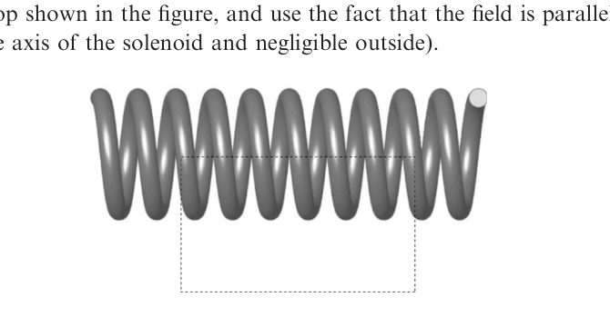

*Problem 4.2 figure.*

Description: A solenoid is shown with a rectangular dashed Amperian loop passing partly through its interior and partly outside, indicating the standard loop used to derive the interior field.

3. Use the Amperian loop shown in the figure to find the magnetic field within a torus.

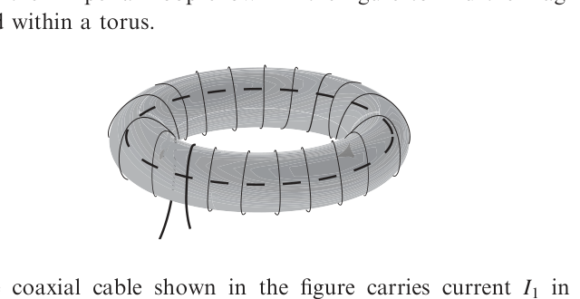

*Problem 4.3 figure.*

Description: A toroidal coil is shown with magnetic-field circulation indicated around the ring and a circular dashed Amperian loop drawn inside the torus.

4. The coaxial cable shown in the figure carries current $I_1$ in the direction shown on the inner conductor and current $I_2$ in the opposite direction on the outer conductor. Find the magnetic field in the space between the conductors as well as outside the cable if the magnitudes of $I_1$ and $I_2$ are equal.

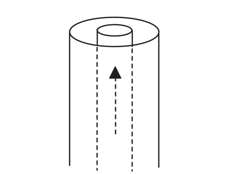

*Problem 4.4 figure.*

Description: A coaxial cable cross-sectional sketch shows a central conductor, outer cylindrical conductor, and an upward current arrow on the inner conductor.

5. Find the displacement current produced between the plates of a discharging capacitor for which the charge varies as

$$
Q(t) = Q_0 e^{-t/RC},
$$

where $Q_0$ is the initial charge, $C$ is the capacitance of the capacitor, and $R$ is the resistance of the circuit through which the capacitor is discharging.

6. A magnetic field of $\vec{B} = a\,\sin(by)e^{bx}\hat{z}$ is produced by an electric current. What is the density of that current?

7. Find the electric current density that produces a magnetic field given by $\vec{B} = B_0(e^{-2r}\sin\varphi)\hat{z}$ in cylindrical coordinates.

8. What density of current would produce a magnetic field given by $\vec{B} = (a/r + b/re^{-r} + ce^{-r})\hat{\varphi}$ in cylindrical coordinates?

9. In this chapter, you learned that the magnetic field of a long, straight wire, given by

$$
\vec{B} = \frac{\mu_0 I}{2\pi r}\,\hat{\varphi},
$$

has zero curl everywhere except at the wire itself. Prove that this would not be true for a field that decreases as $1/r^2$ with distance.

10. To directly measure the displacement current, researchers use a time-varying voltage to charge and discharge a circular parallel-plate capacitor. Find the displacement current density and electric field as a function of time that would produce a magnetic field given by

$$
\vec{B} = \frac{r\omega\,\Delta V\cos(\omega t)}{2d(c^2)}\,\hat{\varphi},
$$

where $r$ is the distance from the center of the capacitor, $\omega$ is the angular frequency of the applied voltage $\Delta V$, $d$ is the plate spacing, and $c$ is the speed of light.

[^5]: Remember that there's a review of cylindrical and spherical coordinates on the book's website.
[^6]: Another way to understand this is to write $\vec{B}$ as $B_\varphi\hat{\varphi}$ and $d\vec{l}$ as $(rd\varphi)\,\hat{\varphi}$, so $\vec{B} \circ d\vec{l} = B_\varphi\,r\,d\varphi$ and $\int_0^{2\pi} B_\varphi\,r\,d\varphi = B_\varphi(2\pi r)$.
[^7]: If you need a review of current density, you'll find a section covering this topic later in this chapter.
